## 量子力学史话

[苏] В.И.瑞德尼克 著

黄宏荃 彭灏 译

科学出版社

1979

---

## 内容简介

本书以史话的形式，通俗、生动的语言叙述了量子力学的起源和发展。它阐述了许多重要概念，如波粒二象性，测不准原理，爱因斯坦的时空观念，宇称守恒等。还阐明了这个新理论是怎样揭露原子、分子、晶体以及原子核的构造秘密的。

本书是根据英译本翻译的，可供青年学生、教师及科技人员参考。

В. И. РЫДНИК

ЧТО ТАКОЕ КВАНТОВАЯ МЕХАНИКА

Советская Россия, Москва

量子力学史话

[苏] B. H. 瑞德尼克 著 黄宏荃 彭灏 译

科学出版社出版

北京朝阳门内大街137号

中国科学院印刷厂印刷

新华书店北京发行所发行 各地新华书店经售

1979年9月第一版 开本：787×1092 1/32

1979年9月第一次印刷 印张：9 3/4

印数：0001—100,900 字数：187,000

统一书号：13031·1064

本社书号：1495·13—3

定价：0.78元

---

## 译者的话

为了在本世纪内实现毛主席、周总理为我国四个现代化制定的宏伟目标，以华国锋同志为首的党中央号召：要在广大干部、群众和青少年中形成爱科学、学科学、用科学的社会风气。在这一号召的鼓舞下，译者把《量子力学史话》译成中文，希望它能对我国科学的普及起到一些作用。

这本书，着重讲述了量子力学的起源和发展，以及量子力学的基本概念。为使读者易于掌握这一理论的发展过程，现扼要地叙述一下各章的要点。

十九世纪末，建立在牛顿三大定律之上的经典物理学在热辐射、以太、光电效应、放射现象等问题上遇到了严重困难。第一个打破僵局的是普朗克。1900年他在自己提出的热辐射公式中，假定能量是一份份地辐射出来的，每一份叫做一个能量量子。1905年爱因斯坦提出了光电效应理论：作为电磁波的光同时也是微粒，这微粒就叫光量子或光子，光子也有动量和质量，这样便确立了光的波粒二象性。1924年德布罗意从光波具有微粒特性出发，推广到实物粒子，如电子，也应具有波特性。德布罗意根据物质世界的统一性提出的这个大胆假说，四年以后便被戴维孙等人的电子衍射实验所证实，但德布罗意用“波包”来说明粒子的存在却归于失败。1927年

---

德国物理学家薛定谔和海森堡提出了物质波就是“几率波”的概念，自此以后量子力学便在他们的引导下迅速地发展起来。

本书第一、二、三章详细地叙述了这个发展过程。

从第四到第六章转入量子力学在微观世界——原子、分子、晶体、核、基本粒子——中的运用。

第六章除了量子力学在基本粒子中的运用外，又回到理论上的发展：1929年英国科学家狄拉克将相对论结合薛定谔方程得出“相对论性不变”原理，并据此预见反粒子的存在。

第七章以较大篇幅从哲学上来讨论量子力学的现状：在解决基本粒子的本质及相互转化等问题上，它已显得软弱无力；在阵疼中诞生的量子力学又陷入了新的阵疼中，后者预示着一个与传统时空观念彻底决裂的物理理论大革命。

这本书以史话的形式，通俗的语言，生动、形象的比喻阐述了许多重要的概念，如波粒二象性、测不准原理、爱因斯坦的时空观念、宇称守恒等等。看来作者似乎是以大自然为主人公来写一本小说。由于自然界蕴藏着无穷无尽的奥秘与力量，因此它的传记也就必然十分丰富、真实、生动。

这本书的主要对象是青年学生、教师及科技人员。这本书会帮助他们培养对自然科学的热爱，鼓舞他们探索自然的信心和勇气。对于进一步深造的青年来说，这本书也会充当一名入门向导。不仅如此，译者认为对哲学工作者来说，本书也为学习和研究自然辩证法提供了丰富多采的现代科学参考资料。

$$
 译者写于一九七八年三月十六日 , 北京
$$ 

---

## 《量子力学史话》英译本简介

二十世纪初，物理学家开始探索原子、原子核以及基本粒子这个无声无形的世界。继实验之后就出现了这一新王国的理论——量子力学。六十多年来这一理论一直是物理学的忠实向导。

在这光怪陆离的世界里，习惯定律经常失效。粒子失去了体积而获得了波特性；反过来波又象粒子那样活动着。电子以及构成物质世界的其他砖石能够穿越不可克服的位垒，或者顿然消失，让光子取代它们的地位。

这些奇妙事件得到了量子力学的解释。本书叙述了量子力学的起源和发展。它描述了量子力学的基本概念，并阐明了这个新理论是怎样揭露原子、分子、晶体以及原子核的构造秘密的，以及这个新的科学工具是怎样用来解决物质的最根本性质——如粒子之间的相互作用、实物和场的相互关系——这样的问题的。

---

---

## 目 录

第一章 从经典力学到量子力学 …… 1  

§ 1 代导言 …… 1  
§ 2 新世界的轮廓 …… 2  
§ 3 经典力学的宗庙 …… 5  
§ 4 宗庙倒坍了 …… 7  
§ 5 新理论的名称是怎样取得的 …… 8  
§ 6 物理学家建立了模型 …… 10  
§ 7 不是每件事物都能用模型说明 …… 13  
§ 8 看不见、摸不着的世界 …… 15  
§ 9 困难而有趣味 …… 16  

第二章 量子力学的初级阶段 …… 19  

§ 10 热和光 …… 19  
§ 11 比黑还要黑 …… 21  
§ 12 要准确的定律，不要草率的近似 …… 23  
§ 13 紫外灾 …… 24  
§ 14 经典物理学处于困境 …… 25  
§ 15 出路 …… 26  
§ 16 能量子 …… 28  
§ 17 行踪飘忽的量子 …… 31
§ 18 一个无法解释的现象……33    
§ 19 光子……35    
§ 20 光是什么……36    
§ 21 原子的名片……38    
§ 22 为什么物体会发光……40    
§ 23 玻尔写下的原子传记……43    
§ 24 能量从何处来……47    
§ 25 激动的原子……49    
§ 26 玻尔理论的最初挫折……51    
  
第三章 从玻尔理论到量子力学……55    

§ 27 一个重要文献……55    
§ 28 谈谈通常的波……56    
§ 29 让我们认识一下物质波……57    
§ 30 我们为什么看不见德布罗意波……58    
§ 31 物质波被发现了……61    
§ 32 具有双重属性的粒子……64    
§ 33 导波……65    
§ 34 衍射——是群体还是个体的现象……68    
§ 35 访问靶场……70    
§ 36 几率波……72    
§ 37 几率进入物理学……74    
§ 38 谨慎的预言……76    
§ 39 粒子波和波粒子……79    
§ 40 探讨波定律……81
§ 41 轮到测量仪器了……84  
§ 42 测不准原理……87  
§ 43 过错在仪器还在电子……90  
§ 44 旧观念被引进新世界中……93  
§ 45 另一个奇迹……95  
§ 46 再看看测不准原理……98  
§ 47 再谈谈物质波……100  
§ 48 波函数……102  
§ 49 波和量子结合起来了……104  

第四章 原子、分子、晶体……108  

§ 50 云代替了轨道……108  
§ 51 单调寓于多样性之中……112  
§ 52 另一个奇迹——但尚未得到解释……113  
§ 53 原子建筑师在工作……115  
§ 54 发了疯的原子……117  
§ 55 原子及化学……120  
§ 56 光谱的诞生……124  
§ 57 宽线和双线……127  
§ 58 原子结婚了……129  
§ 59 固体真坚固……133  
§ 60 晶体的骨架和多层结构……136  
§ 61 绝缘体也能导电……141  
§ 62 电是怎样在金属内流动的……144  
§ 63 奇妙的半导体……148
§ 64 有用的“灰尘”……150  
§ 65 又慷慨又贪婪的原子……151 

第五章 原子核的内部……156  

§ 66 开场白……156  
§ 67 第一步……158  
§ 68 第二步……161  
§ 69 寻找这个神秘的介子……164  
§ 70 最强大的力……165  
§ 71 再谈核的稳定性……169  
§ 72 核内的隧道……171  
§ 73 核是否也有壳层……174  
§ 74 γ射线从何而来……177  
§ 75 核象液滴吗……179  
§ 76 液滴状的核分裂了……181  
§ 77 核裂变的秘密……183  
§ 78 原子核究竟能有多少个……185  
§ 79 核是壳层和液滴的结合……187  
§ 80 核内飞出它所没有的粒子……189  
§ 81 电子有个同伙……191  
§ 82 电子诞生于核内……194  
§ 83 饕餮的核……197  

第六章 从原子核到基本粒子……201 

§ 84 一个新世界的发现……201  
§ 85 看不见的分界线……203
§ 86 再谈一点相对论 …… 206  
§ 87 最早的困难 …… 208  
§ 88 一个意料之外的发现 …… 210  
§ 89 一个更惊人的发现 …… 213  
§ 90 “空穴”的诞生 …… 217  
§ 91 漫谈真空 …… 219  
§ 92 再谈真空 …… 222  
§ 93 空间依赖于物体 …… 224  
§ 94 实物和场 …… 226  
§ 95 没有真空 …… 228  
§ 96 鲸鱼歇在什么上 …… 230  
§ 97 粒子更换装束 …… 232  
§ 98 两面派的π介子 …… 235  
§ 99 揭露介子交换之谜 …… 237  
§ 100 相互作用的秘密 …… 240  
§ 101 虚效应王国 …… 245  
§ 102 虚的变成真的 …… 246  
§ 103 寻找新的粒子 …… 249  
§ 104 清点胜利果实 …… 252  
§ 105 反粒子开始活动了 …… 254  
§ 106 粒子的蜕变 …… 256  
§ 107 物理学家将相互作用分类 …… 258  
§ 108 K介子的秘密 …… 260  
§ 109 左和右有什么两样吗 …… 262
§110 道路终于被发现 ……266  
§111 世界和反世界 ……269  
§112 粒子内部在发生着什么 ……270  
§113 旧观念使人裹足不前 ……273  
§114 修改时空观念 ……274  
§115 时空量子 ……277  
  
第七章 从量子力学到何处去 ……279  
  
§116 难以定义的定义 ……279  
§117 量子力学小传 ……285  
§118 量子力学正在重整旗鼓 ……288  
  
附录  
  
Ⅰ 本书论及的若干重要公式 ……292  
  
Ⅱ 本书中出现的主要量子物理学家简介 ……295  
  
Ⅲ 量子力学发展大事记 ……297

---

# 第一章.从经典力学到量子力学

## § 1 代 导 言

原子能、放射性同位素、半导体、基本粒子、脉泽、激光——这些都是熟悉的术语了，然而它们之中年龄最大的也还不到二十五岁。它们都是二十世纪物理学的产儿。

在我们这个时代里，知识以一种神奇的速度向前发展着，它每迈出新的一步都开辟了一个新的前景。古老的科学正焕发着第二个青春。物理学迈步在其他学科的前列，领先进入未知世界。当前沿阵地逐渐展开时，进攻的速度会缓慢下来，为新的挺进积蓄力量。

为了探索自然界的秘密,物理学必须拥有高效率的仪器,以便进行精确而有说服力的实验。物理学总部里聚集着成千上万名理论家,他们不断在作向科学进军的布署,研究从实验中缴获的战利品。战斗并不是在黑暗中进行的。强大的物理学理论光芒照亮了整个战场。现代物理学的强大探照灯就是相对论和量子力学。

量子力学是与二十世纪一起来到人间的。它的生辰是：1900年12月17日。就在这一天，德国物理学家普朗克在柏林科学院物理学会的一次会议上，作了有关尝试克服热辐射

---

理论中的困难的报告。

困难是科学中惯见的事。科学家每天都会遇到一些困难。可是普朗克与困难的遭遇战却具有一种非常特殊的意义。因为它预示着物理学在今后许多年里的发展。

一株硕大的新知识之树在普朗克表述的一些基本概念中成长起来了。这些基本概念超出了最狂妄的科学小说家的幻想，但却成了许多令人惊异的发现的起点。从普朗克的概念中生长出量子力学；后者更开拓了一个崭新的世界——这就是原子、原子核和基本粒子的微观世界。

## § 2 新世界的轮廓

在二十世纪以前人们对于原子难道就一无所知吗？从某种意义上来说，他们是知道一些的，也就是说，他们猜想并推测到了一些。

人类喜爱思索的头脑早已推测到这些东西，早已想象出那些只是在几世纪以后才变为现实的东西。

在远古的年代里，当人类的足迹还远远没有踏上发明之路以前，人们就已经猜出，在他们居住的狭小天地以外，还会有别的土地、动物和人。

同样地，人们还感觉到有个微观世界存在着，虽然它的实际发现还是很久以后的事。人们用不着长途跋涉去寻找这个新世界，因为它就在眼前，就在环绕着他们的一切物体中。

在往昔，思想家冥思苦想自然界是怎样从混沌之中创造

---

出我们周围的这个世界的。这个世界为什么会存在着形形色色的东西？他们问道：“自然界是否就像一个建筑师那样，用小石块来建造大房屋？那么这些小石块又是些什么东西呢？”

高山峻岭被水、风和火山的神秘力量剥蚀净尽。岩石一块块地松脱下来，随着时间的流逝逐步崩裂成碎片。千万年过去了，这些碎石又风化成尘埃。

物质的这种不断分解有没有止境呢？有没有那样小的微粒，甚至自然界都不能把它们再分割了呢？回答是有的。古代许多哲学家如伊壁鸠鲁，德谟克利特就是这样说的。这些微粒被取名为“原子”。它们的主要特点是不能再进一步分割。在希腊文里“原子”的意思就是不可分的。

那么原子又是什么样的呢？在古代，这个问题一直是得不到回答的。原子可能是一个坚实的不可穿透的球体，但也可能不是这样的。另一个问题是：原子又有多少不同的品种？或许有一千种，或许只有一种。某些哲学家(例如希腊的亚里士多德便是其中之一)认为很可能有四种。他们认为整个世界是由四种元素——水、空气、土和火——构成的。而这些元素本身又被认为是由原子构成的。

人们现在或许会这样想：仅仅有这点微不足道的知识，那里还谈得上什么进步。确实是这样。可是科学迈出的最初步伐往往有广度而没有深度。多少事物环绕着人类！第一件事是找出它们之间的相互关系，往后，也只是往后，才能去认识它们的构造。

---

当科学还在襁褓之中的时候，原子的概念是一个天才的猜想。但它仅仅是一个猜想。它既非来自某种观察，又没有任何实验的依据。就这样，原子很快就被人们遗忘得一干二净了。

直到十九世纪初，人们才又重新想起了原子，最好是说又重新创造了原子。创造它们的不是物理学家，而是化学家。

十九世纪初期，不论对社会史学家来说，还是对科学史学家来说，都是一个有趣的时代：拿破仑正在重新划分欧洲国家的疆域；另一方面，在当时屈指可数的几个宁静的实验室中，人们在对事物的本性进行着重大的重新估计。看来似乎是相当牢靠的概念又被人们重新考虑。

英国的杨氏和法国的夫累涅尔奠定了光的波动学说的基础。挪威的阿贝耳和法国的伽洛瓦为现代数学大厦奠定了基石。法国人拉瓦锡和英国人道尔顿以事实证明化学能够创造奇迹。那个时期的化学家、物理学家和数学家作出了一系列的杰出发现，为十九世纪后半期精密科学的繁荣开辟了道路。

1815年，一个不知名的英国学者普劳特发表了这样一种观点：有一种微小的粒子，它参与多种多样的化学反应，而其自身不被破坏或重建。这种粒子显然就是原子。

就在那些年代里，著名的法国科学家拉格兰日为经典力学创立了完整而优美的形式，可是后来人们发现，在这种完美的形式中原子却没有栖身之地。

---

## § 3 经典力学的宗庙

科学中没有无源之流。

量子力学可以公正地被称作牛顿开创的经典力学的智慧之子。

当然把经典力学的开创归功于牛顿一人是不十分正确的。文艺复兴时期许多伟大的思想家如列奥纳多·达·芬奇、伽利略，荷兰数学家西门·斯蒂文以及法国人布莱斯·巴斯噶都曾钻研过尔后形成经典力学基础的问题。从物体运动的所有这些分散的研究中，牛顿创立了一个统一而和谐的理论。

我们知道经典力学的确切生年：1687年。就在那年里，牛顿的著作《自然哲学的数学原理》在伦敦出现。在那些年代里，自然科学还得借用哲学这个名称与世见面。

在他的著作中，牛顿首次制定了经典力学的三个基本原则。这些原则后来被称作牛顿三定律，也就是每一个小学生都要学习的物理定律。

牛顿着手建造的力学大厦远远超过了这三条定律，而且这大厦也早就竣工。站在现代科学所处的优越地位来考察，经典力学的状况确是这样。

在辽阔的虚空中存在着数不清的各种各样的物体，大至巨星，小至尘埃。在遥远的过去曾经有过一个时刻，整个宇宙都不在运动，都处于一种绝对静止的状态之中。

---

陶醉于自己的创造成就的上帝终于给了它第一个刺激，从此便使它获得了生气。上帝的任务就这样完成了。从此以后，宇宙中所有的物体都按照确定的规律运动着并相互作用着。这种规律为数甚多，但是说到底可以归结为几个基本规律，其中包括牛顿三定律。

从这一刹那起，绝对不再有任何偶然的事物了。每一事件都是预先决定了的。任何随心所欲的事都不再是可能的了。从那时起宇宙的交响乐一直在奏着最美好的和声。

继牛顿之后的一个多世纪里，建立在牛顿力学基础上的这种绝对严谨的宇宙秩序，使所有的物理学家感到十分满意。每当发现宇宙中的某件新事物丝毫不爽地符合这一理论时，他们都感到无比的慰借。在很长的一段时间里，自然界是允许人们这样看待它的。

但是好景不长。科学家很快就认识到再没有比僵死的教条更不稳定的东西了。一些简直不能纳入旧框框的事实开始显露出来。

十九世纪末，牛顿力学处于危机之中。人们逐渐清楚地看到：这个危机意味着普遍决定论*——科学上被称为机械决定论——的崩溃。宇宙毕竟不那么简单，不能上满一次发条便永远走动。

量子力学不仅带来了新的知识。它对世界上的现象作出

---

了根本不同的解释。科学首次对偶然性给予了充分的肯定。

也许不应责备物理学家们的大惊小怪。虽然垮台了的仅仅是他们杜撰的那种永恒决定论，可是物理学家却认为合理的决定论也站不住脚了，宇宙是由绝对的无政府状态统治着的，而事物也就不再服从确定的规律了。

过了相当长的一段时间以后，物理学家才从这一深刻的危机中找到了出路。

## § 4 宗庙倒坍了

好奇心要了猫的命。这一谚语对理论来说也可能适用，尽管某个理论今天看来已经没有问题，而且能够解释所有的事实。

当科学对广大范围的现象作了研究并发展到某个阶段时，一种理论便会出现。这个理论的目的是想从某个观点解释现象。

但当新的事实被发现不能纳入这理论的狭小框框之内时，这同一个理论又被证明是不完善的，甚至是错误的。

只要物理学被局限于力学范围内，经典力学是令人十分满意的。但在十九世纪，物理学扩大了研究范围：对热过程的研究产生了热力学；对光的研究产生了光学；对电和磁现象的研究则成为电动力学的起点。当此之际，物理学是颇感怡然自得的。所有的新发现都能很好地套进现成的模子中。

然而正当经典力学大厦逐渐升高的时候，它的庞大的正

---

面出现了疲劳痕迹和危险的裂缝，最后在新事实的轰击下，整个建筑物便倒坍了。

这些最重要的事实之一就是光的不寻常的恒定速度。最仔细、最客观的实验表明：光的行为根本不同于其他所有已知领域内观察到的任何现象。

为了使光的行为符合经典物理学的框框，科学家不得不设计出一种叫以太的媒质。这种媒质——以太，按照经典物理学的规律，应当具有十分奇妙的特性。下面我们还要回到以太这个题目上来，并对它进行更仔细的考查。但现在需要说明的是：新的以太也挽救不了古老的物理学。

经典物理学的另一绊脚石是加热物体的热辐射。

最后还有放射现象的发现。在经典物理学占有绝对统治地位的最后几年里，放射现象给它以毁灭性的打击，这是因为放射现象的神秘过程不仅破坏了原子核，而且摧毁了物理学的基础——那些从常识的观点看去显得十分明白的原则。就从经典力学建筑物的这些裂缝中，生长出相对论和量子理论。

## § 5 新理论的名称是怎样取得的

量子力学诞生于本世纪初。但它为什么取了这个名称？事实上，这个名称只是无力地反映着新物理学所涉及的那些事物的内容。

大概物理学的任何一个部门都不能逃避术语上的某种含

---

糊不清。理由是很多的，但这些理由主要应追溯到它们的历史根源。

首先，新理论为什么叫力学？新理论中不存在什么机械的*东西，而且以后我们还会看到也根本不可能有什么机械的东西。“力学”这个名词只有在普遍意义下使用时才是合理的，正象我们谈到“钟表力学”时，指的是它的运转原理。将量子力学的概念范围与物理学本身的广阔定义等量齐观，则更恰当些。

其次，为什么叫量子？在拉丁文里，量子的意思是“分立的部分”或“数量”。往后我们将看到：新物理学事实上所讨论的就是外围世界的诸种特性中的“分立性”。这是它的基本原则之一。另一方面，我们将要看到：这种分立性绝对不是普遍的，也不是任何时候、任何地方都可以被找到的。

不仅如此，上面所说的只是奖章的一面而已。另一个同样特殊的方面是事物的二重性。事物的双重性质寓于下面这一事实：同一实体(物体)将粒子特性和波特性结合在一起。

新科学就其最根本的内容取名波动力学。但这里我们也只谈了一半，因为量子这个概念还没有提到。

我们的结论是：新物理学理论的所有名称没有一个是令人满意的。难道真不能想出一个与主题的实际内容更加一致的名称？

将新术语引进科学是一件吃力不讨好的工作。新术语的

---

引进是缓慢的，而它们的变动则更为缓慢。物理学家懂得这些新术语所包含的意思，因此我们只好将它们学会。

## § 6 物理学家建立了模型

设想系在绳子端部的一个球在你的头的上方旋转着。这显然是十分简单的，因为这一切你都可以亲眼看到。经典物理学恰好就是这样发展起来的：它是从对我们周围的物体和现象的观察中发展起来的。

试在一个光滑的水平的桌面上滚动一个球，在手的动作停止后，即力已停止作用于球后，球仍继续运动。这一观察以及其他类似的观察，导至牛顿阐明的惯性定律：力学的第一条基本定律。

一个球在没有被手推动,或被另一个球撞击之前,是不会自己运动的。一个在光滑的桌子上运动的球,与一个静止的球,有一共同点:它们都不受任何外力的作用。

当然，绳端上的球时刻受到一个力的作用，这个力使球偏离于自由运动所固有的直线轨道。静止在桌子上的那个球，在手施给它的力的作用下，将开始运动并将获得速度（力越大，速度越高）。这一观察产生了牛顿第二定律。

观察家——还是牛顿——撇开了日常现象，转向星空去寻找曾使古代哲学家瞠目的“天体合谐”的线索。什么力量使行星以这种方式，而不以其他方式，围绕太阳旋转？

“合谐”这个词表示一个有秩序的系统，表示支配天体运

---

动的某种规律在起作用。当然问题不只是“天体”中的某一个。一定会有这样一条定律，它支配着环绕太阳的行星和我们的地球的运动，以及环绕行星的卫星的运动。

我们可以回顾一下系在绳端的球的运动。环绕太阳的行星运动的确很象球的均匀的圆周运动，虽然前者转得较慢而且没有绳子系着它。简言之，如果在一种情况下力在起作用，则可以合理地设想，在另一种情况下力也在起作用。

当然没有办法直接察觉到支配行星的力的作用。但是力是存在着的。牛顿发现了这个力。我们知道这就是物体相互间的吸引力。牛顿的天才在于：他察觉到了什么是球的运动与行星轨道运动之间的共同的东西。

当然对我们来说重要的只是：系在绳端的球可能是最早的物理模型之一。从对规模小得多的事物的研究中，人们认识了象行星运动那样壮观的自然现象，根据当然是这样的假设：二者都是由相似的定律支配着的。但随着产生了下面这一问题：这种类比的作法是否在任何地方、任何时候都合理？换句话说，把一种现象的定律，扩大应用于另一种大得多或小得多的现象，是否正确？

在牛顿的时代，答案是简单的：既然观察确证了某种以小型现象为基础计算出来的大型现象的发展，或与此相反，任何一个定律都应当是不受限制地正确的。

大致相同的答案今天还可以听到。当然，提出这个问题的角度是有些两样了。首先，牛顿相信，宇宙是统一的；其次，宇宙的生命，不论在人类的规模上，还是在行星和恒星的规模

---

上,都是由相同的规律支配着的。

从现代科学的有利地位出发,我们完全同意第一个论点。至于第二个论点,我们当然不能得出这样的结论:一种现象的内部活动是以它的外部运动为绳墨的。

鹦鹉学人说话，但如果认为它学舌的时候也在思考，则是一种天真的想法*。

认识的复杂性在于：在微观、宏观和宇观的**物质世界**等级中，绝对不同的定律在起作用；把一般事物的规律扩大应用到其他世界等级上去是会遇到严格限制的。

由于物理学家不能正确理解上述重要结论，因此当他们遇到微观世界中那些不恪守规矩的实体时，就必然感到十分懊恼。这些物理学家一旦认识到微观粒子不能被纳入普通概念的框框之中时，他们就开始谈论什么混沌状态，谈论什么没有规律的自然界。但下面我们就要谈到，事情绝非如此。

模型的表象在自然科学的发展中曾起到，并继续起着重要的作用。一些伟大的发明曾借助于双手建造的模型，或者借助只存在于头脑里的模型；后一种情况更常见一些，因为有些模型是制造不出来的。

用绳子系着的球是一个简单的模型。随着时间的推移，更复杂的模型被发展出来了。它们越来越复杂，越来越光怪陆离。虽然这些模型可能变得很奇特，但它们有一个共同之

---

处。它们都是用我们日常生活在其中的这个世界，即我们能够看见并感觉到的这个世界的原材料制造出来的。

这是人类头脑的一个特点。玄而又玄的抽象概念和一般概念总是来自现实的。

## § 7 不是每件事物都能用模型说明

从上世纪末以来，用人们熟悉的模型方法去研究自然界中的新事物并不总是成功的。以太模型就是一例。它的创造者把它奉为经典物理学的救星，可是它却不能说明光速的显著的恒定性。

让我们想象一下这个以太。它是某种绝对坚硬和绝对透明的东西。是不可击碎的玻璃吗？尽管以太是坚硬的，它必须允许所有不同的物体在其中自由运动。不仅如此，这些物体还应该能够牵引以太，产生一种象风的东西，一种真正的虚无缥缈的以太风*。

许多年来物理学家曾尝试掌握以太的这些奇妙特性。但他们却失败了。以太被证明是一种没有事实根据的臆造。

然而以太概念还不是唯一的没有根据的实体。没有一个经典物理学家的原子模型能够说明铀、镭和其他化学元素神秘地释放能量这一现象：千百万年以来，在没有外部来源的情况下，这种能量的放射从来没有间断过。

---

爱因斯坦的光子假设又给予古老的模型以打击。光作为电磁波从光源向各方向传播这一概念虽然有些复杂，但还是能够被纳入经典模型之中的。

我们已习惯于认为波总是物质媒质的运动：海波是水这个媒质的运动，声波是空气这个媒质的运动。可是电磁波却能够在绝对的真空中传播。

在这意义上，象牛顿那样把光想象成一股又小又轻的粒子流，倒比较容易些。这些粒子被炽热的物体发射出来，向各个方向飞去；而当它们进入眼睛时，便会刺激视神经，使之产生光的感觉。现在来想象这些粒子如何在虚空中运动，便没有什么困难了。

但象爱因斯坦那样,想象光同时具有波和微粒特性,对我们来说却简直是无法办到的。

从玻尔和卢瑟福建立的原子模型中，我们获得了一个可以想象的图画：微小的粒子——电子——在确定的轨道中绕着一个细小的核转动。这些轨道的尺寸要比电子和核大几万倍。

如果我们的想象力稍许再多一点，我们就可以为原子勾划出一种“空的”结构，因为我们自己就生活在一个行星系统中，而在这个系统里，“电子”(或行星)的尺寸，要比环绕“核”(或太阳)的轨道小几千倍。

然而仅仅几年以后，德布罗意把上述图象完全搅乱了。

他说：电子、核以及一般说来我们世界上所有的物质的“建筑砖石”都具有爱因斯坦为光子引入的那种二重性：它们

---

同时具有波特性和微粒（粒子）特性。其结果，物质微粒包括原子，就象早些时候的光微粒一样，不再是可以想象的了。

## § 8 看不见、摸不着的世界

物理学家的日子不好过了。在往日，每当开辟了伸进新世界的道路的时候，他们总是确信：有出入的只可能是细节，不是本质。

可是现在，他们的处境就和古代的探险家一样：任何东西都可能被碰上，比如怪物或半人半兽。对于一个昏热的头脑来说，幻想是没有边际的。

物理学家的处境比那些探险家还要尴尬。探险家遇到正常的生物和位置虽然两样，但本质却相同的土地、山脉和海洋时，虽然感到失望，但心情还是愉快的。可是在新世界里，科学家看到了如此离奇的东西，甚至任何名称都不足使人会意。连幻想都难以把这个新的、不寻常的原子世界描绘出来。

但建立某种概念是发展科学的要求，不管这些概念是多么地异乎寻常。建立量子力学是困难的，但又是必须的。

根据周围世界提供的可以想象的模型来建立学说当然要容易一些。可是如果微观世界是异样地建造起来的，则又如何呢？如果没有那种能用的模型又怎么办呢？

当然, 如果不可能设计出一些可以想见的模型的话, 我们就只好用那些完全不可想象的模型来进行研究了。

年复一年地过去了——虽然时间也不太长——这些模型

---

变得那样地不可想象，但它们对物理学家却依旧十分珍贵，以致没有人想放弃它们。上述情况是很糟糕的，这是因为迟早有一天——请允许我们扯得稍远一点——这些模型终究会被抛弃，并让一些更不寻常、更难捉摸的模型取而代之。这就是科学发展的过程。

本世纪物理学家的伟大就在于：他们能够穿越用许多远离日常生活的抽象概念和模型筑成的迷宫，达到他们的目的，并成功地建立起关于微观新世界的意义深远的理论。不仅如此，在这个基础上，物理学家取得了一些整个文明史中最伟大的成就。他们发现了核能的秘密——那个亘古以来被囚禁在瓶子里的神怪*。如果没有量子力学，就不会有今天的原子能工业和电子学。

## § 9 困难而有趣味

量子力学概念的不寻常的性质，以及这些概念不能被恰当地想象出来这一事实，使这个学科难以掌握。当然，有的缺点是量子力学本身固有的。可是这门学科之所以难于掌握，不仅因为它的范围在不断扩大，方法在不断改进：我们知道，描述某种处于不断变化和发展——尤其是迅速的发展——状态中的事物，要比描述那些已被确认的理论困难得多。不仅因为如此，而且因为物理学家至今还在对量子力学的意义，以

---

及量子力学所描绘的微观世界的特殊方面，争论不休。

我们现在已经进入了空间时代，这个时代又召唤物理学家走在前面开辟道路。宇宙空间物理学根本不同于地球物理学，这在于：对前者而言，微观世界是头等重要的。

小大相成的古老观念在星际空间中被印证。巨星与微小的原子不仅融合，而且作为一个整体存在着*。

要想不借助某种可想象的表象来通俗地讲述科学几乎是不可能的。因此在讲述量子力学时，我们将尽量引用自然界中的模型或类比，如果前者找不到的话。当然这些类比不会是精确的或深刻的。它们只帮助我们获得对某些事物梗概的了解。

例如，正象我们将要谈到的那样，“电子围绕原子核旋转”这句话讲给我们听，并不比“雪是白的，很象盐，并且是从天上落下来的”这样一句话讲给热带居民听，意义更多一些。原子中的电子的运动，以及这样运动着的电子的本质，要较我们今天对它们的认识和描述复杂得无可比拟。不仅今天如此，明天也是如此，一千年以后也是如此。

真的，量子力学的发展进一步证实了电子特性的无限多样性和不可穷尽性**。不仅对电子来说是这样，其他任何事物

---

也是这样。

今天，我们对周围世界仍然只具有一些相当支离破碎的知识。我们也才刚刚开始进入地球的外壳，进入海洋和大气层的深处。我们也才刚刚开始认识田野、森林、河流和沙漠的生活规律。

如果是这样，我们如何能够指望对那些难以观察的原子世界、原子核和基本粒子知道得更多些呢？对这门科学的探索还要进行几百年、几千年。直到现在我们也还没有离开这条巨大的知识河流的发源地。

尽管如此，呈现在新世界探索者面前的是一些多么令人惊异的事物啊！这门新科学为技术、工业、农业和医学开辟了一个多么令人鼓舞、多么灿烂辉煌的前景啊！核电力站、放射性同位素、太阳能电池——这些只是无数实际应用中的几个例子而已。我们已经开始掌握受控热核反应，并正在深入探索星际空间。所有这些出现在光辉的现在和灿烂的未来的伟大成就，都是在本世纪里从一粒微小的种子中滋生出来的。六十年前，普朗克在科学知识的肥沃土壤上播下了这粒种子，此后又有许多杰出的科学家对它进行精心的培育。

---

# 第二章 量子力学的初级阶段 $ ^{*} $

## § 10 热 和 光

严冬的夜晚，坐在暖烘烘的火炉的近旁，闲听炉里劈劈拍拍的响声，沐浴着炉火的温暖，该是多么美好啊！可是我们为什么会感到温暖呢？为什么火炉近旁就温暖呢？离火炉一定远的距离内，人们就会感到它的热，虽然炉里的火连看也看不见。

炉子发射着某种看不见的、给人以热的感觉的射线。这种射线就叫热射线，或红外线。

略微仔细的观察会向我们说明：热辐射在自然界中是一件很平常的事。一支蜡烛，一团烈火，以及我们的硕大的太阳，都既发射着热，也发射着光。甚至那些远得出奇的星星，也将热射线送到地球上来。

如果一个加热的物体在发光，它肯定也在发出热射线。光和热的发射实际上是同一个过程。这就是为什么科学家把看来是加热过程引起的物体的全部发射——光的发射和严格意义上的热辐射——都叫作热辐射。

---

在上个世纪，物理学家发现了热辐射的基本定律。这些定律现在已为我们大家所熟悉。让我们在这里回顾一下两个定律。

第一，物体越加热，它就越亮地发光。每秒的辐射量随温度的改变而急剧地变化。如果温度增加到原来的三倍，则辐射增加将近一百倍。

第二,发射的颜色随着温度的增加而改变。观察一下放置在喷灯火焰里的一根铁管吧。开始的时候铁管可以说是黑的,后来就带一点暗红色,然后变得鲜红,以后又变成橙色,黄色。最后炽热的金属开始发射白光。

一个有经验的炼钢工人能够根据发光颜色，十分准确地估计炽热金属管的温度。他会说：暗红色意味着约500℃的温度，黄色约800℃，明亮的白色则达到1,000℃以上。

可是物理学家是不会满足于这种粗略的定性分析的：他们要求精确的数字。对物理学家来说，“天很冷”这句话并不比“他有张大脸”更有意义。需要的是他的特征：鼻子、嘴唇、前额长得怎样。

物理学家碰到过形形色色的物体，以及各种各样的热辐射条件。但热辐射的多样性使他们很不满意。他们需要拿某种标准物体作衡量的尺度，以便在这个基础上建立起加热物体的辐射定律。这样其他物体的光发射就可视为对此标准的偏离。想像一下这样的描述：这人的鼻子比标准的鼻子长一些，额头窄一些，下巴稍稍向前突出一些，眼睛比一般的略微绿一些，小一些。说也奇怪，这幅图画倒使物理学家高兴了。

---

下面我们就谈谈为什么会是这样。

## § 11 比黑还要黑

取若干颜色好象是一样的物体，仔细地观察它们，以便发现它们在颜色上究竟有何差别。

仔细地检查表明它们的颜色是有差别的，这个颜色淡一些，那个颜色深一些，浓一些。这一差别是由于：落在物体上的光线一部分被吸收了，另一部分被反射掉。很自然，这两个分量之间的关系可以在极广的范围内变动。以两个极端情况为例，一个是发亮的金属表面，另一个是一块黑色的天鹅绒。金属几乎将落在它上面的光线全部反射掉，而天鹅绒却吸收了绝大部分的光线，也就是说，几乎没有反射任何光线。

魔术师可真会利用天鹅绒的这个特性，因为一个不怎样反射光线的物体实际上是看不见的。在舞台上的黑色背景前面，一口覆以黑色天鹅绒的箱子是几乎不会被察觉的，这样魔术师就可以用手绢、鸽子、甚至他自身来变各种各样的戏法，让它们忽隐忽现。

物理学家也同样发现了黑色物体的这一十分可贵的特性。在寻找标准物体的过程中，他们决定采用黑色物体。一个黑色物体吸收的辐射最多，因而这一辐射能将黑色物体加热到较其他所有物体都要高的温度。

相反地，当一个黑色物体被加热到高温并成了一个光源时，它的辐射强度较在同一温度下的任何其他物体都要大。

---

因此黑色物体是一个可以用来建立热辐射定量定律的非常方便的辐射体。

当然，人们发现：不同的黑色物体是以不同的方式辐射的。例如黑烟灰就可能比黑天鹅绒更黑一些，但也可能没有后者那样黑，这全看它来自什么样的燃料。黑天鹅绒的黑度也不一样。这些差异不大，但对于标准黑色物体来说，仍以去掉这些差异为好。

于是物理学家想出了一种最黑的黑色物体——一口箱子。它是用来吸收热辐射的一种非常特殊的箱子。箱子的内壁装有若干肋状墙 $ ^{*} $，整个箱子内部覆以黑烟灰。光线从一个小孔进去后便再也出不来了：它一旦被捕便永无自由了。物理学家说：这口箱子把进来的辐射能量全都吸收了。

现在让我们把这口箱子当作一个光源：这实际上也正是制造这口箱子的真正目的。箱壁充分加热后就会变成白炽的，并开始发射可见光线。正如已经说过的那样，对于一定温度而言，这种箱子的热与光的辐射将大于任何其他物体，因而后者就被叫作灰色的，以示区别。

所有热辐射定律都是以这种最最黑的箱子为标准而建立起来的，因而这种箱子就获得了一个通称：“黑体”。只须作少许变化，这些定律也可应用于灰体。

---

## § 12 要准确的定律, 不要草率的近似

让我们用物理学的语言更精确地描述我们的定律。

第一个定律说：黑体的辐射能力，即它每秒以光和热的形式发射的能量，正比于它的绝对温度*的四次方。这个定律是两个德国科学家斯蒂芬和玻耳兹曼在上个世纪末发现的。

第二个定律说：随着黑体温度的升高，对应着它所发射的光线的最大亮度的波长将要变短，并向光谱的紫色区移动。这就是以奥地利物理学家维恩命名的维恩位移定律。

物理学家现在掌握了两个无例外地适用于任何物体的热辐射的普遍定律。第一定律正确地描述了物体被加热而发光时亮度的增高。可能乍看起来维恩的定律与观察的事实不甚符合，因为随着温度的增高，物体发射越来越多的白光。白的，而非紫的。

但是让我们更仔细地考察一下。维恩定律只说了对应于光辐射的最大亮度的颜色，此外则什么也没说。不言而喻，除了这一辐射而外，仍有较长的波长(即不同颜色)的辐射，而后者在较低温度时就早已发生。当物体继续被加热的时候，它的辐射使光谱范围变宽，也就是说它开辟了许多新的光谱区域。结果是，当温度升到足够高的时候，我们就获得了一个完整的可见光光谱。

---

也可以将上述情况和一个乐队的演奏作比较。在这个乐队里越来越多的乐器参加进来，奏出越来越高的音阶。这样，整个乐队就会发出一个强有力的、越来越高的合声。这个合音从许多大喇叭的深红的低音开始，然后上升到许多短笛的最高的尖紫音。白光是光谱的总体效果。维恩定律是有效的。但大自然却从另一个角度打击了热辐射的研究者。

## § 13 紫 外 灾

物理学家都有一个寻求普遍定律的癖好。他们一旦发现同一现象可以用几个定律在不同方面进行描述，便立即尝试将这些定律结合成单一的普遍定律，使之能同时概括所有的方面。

英国物理学家瑞利和金斯就作了结合热辐射定律的尝试。他们所获得的统一定律表明：热物体辐射强度正比于它的绝对温度，而反比于所发射光线波长的平方。

这个定律看来与实验结果很好地吻合。可是后来忽然发现：只是在可见光谱的长波部分，即绿、黄、红部分内，这个定律才能很好地与实验一致。当接近于蓝、紫、紫外光线时，这个定律便告失效。

从瑞利-金斯定律得出：波长越短，热辐射强度就应越大。但这点不能为实验所证实。不仅如此，一件很不愉快的事情是：随着波长的缩短，辐射强度应无止境地增大。

这种现象当然不可能出现。波强度的无限增长是绝对不

---

可能的事。 $ \underline{\text{如果某个物理定律引导到无限性，则它注定要失败。自然界有许多大的东西，很大的、甚至大到难以想像的东西，可是，除自然界本身而外，还没有任何无限的东西。}} $

辐射理论中出现的这个荒唐局面就被称为“紫外灾”。这是上世纪末发生的事。那时候任何人也没有想到，这不仅仅是某一个颇为特殊的定律的灾难。它是摧毁这定律全部理论基础——经典物理学——的灾难。

## § 14 经典物理学处于困境

在那些日子里，有的物理学家并不认为经典物理学道路上的这个辐射理论障碍有什么要紧。但任何障碍都是一件严重的事，因为理论中所有方面都是相互关联着的。如果某一点是错误的，我们便不能信赖这个理论对其他现象的描述。如果这个理论连这样一点小障碍都不能克服，还能希望它去克服什么大障碍吗？

为克服辐射理论的困难，物理学家曾作过一些勇敢的尝试。今天，这些尝试看来在逻辑上是不一致的。但人们还能期待些什么呢？当理论处于危机之中的时候，它就像在一座着了火的住宅里的猫一样，只有一条出路——跳进河里去。可是这只猫却在房子里横冲直闯，连想也没有想到该跳进河里去，因为那样做是违反猫的全部本能的。

类似的事情现在却临到科学家的头上了：他们被困在着了火的房屋里，而这所房子对他们是多么宝贵啊！他们毕生

---

在里面工作着，他们已经非常习惯于居住在这所房子里。他们竭力想扑灭这场火灾，可是却不愿意扔下这所住宅逃命。

当然那些更锐敏的科学家清楚地意识到：经典物理学已经进入绝境。热辐射理论并不是唯一的死胡同。那些年代还目睹了以太学说的崩溃。

崩溃来得这样迅猛，以致许多科学家都处于束手无策的境地。还有什么事可于呢？

如果实事不符合理论，那是事实有毛病。大自然不想遵循任何规律了。大自然是不可知的！这就是那些神经衰弱的人作出的反应。

唯物地思维着的科学家对此作出的反应则不一样。如果事实不能被理论说明，那是理论不中用。理论必须在新的基础上重建，并立即重建。

历史再次证明，伟大的需要产生伟大的人物。普朗克和爱因斯坦终于从具有万古不变的教条的经典物理学所处的困境中找到了一条出路。1900年普朗克引进了量子概念。1905年爱因斯坦提出了相对论。

## § 15 出 路

什么是普朗克的发现？

乍一看来，很难说它是一个发现。这里有两个关于发热物体的热辐射定律。分别说来，两个定律都有效，但当两个定律捏成一个时，它便面临着紫外灾。有点象两个思想方法差

---

不多的人遇到一起了；交谈一会儿后，两个人都成了真正的疯子。

此时，普朗克已年逾四十。多年以来，他一直在对热辐射进行研究。在他眼前，热辐射理论已经陷入绝境。和他的同事一样，他在寻找一条出路。他检查了推理的所有环节，最后确信推理上没有任何错误。普朗克继续深入研究，可是他走的道路却指着另一个方向。

后来他追述道：在十九和二十世纪交替的年代里，他以从未有过的青春活力和激情工作着。最最不可能的事在他看来成为十分可能的了，而普朗克就象个狂热分子一样，以无比的毅力建立了、又推翻了一个又一个的理论模式。

起初引导他的是一个十分简单的想法。瑞利和金斯将两个热辐射定律结合成一个，因而在短波长范围内引出了荒谬的结果。如果通过另一途径将斯蒂芬-玻耳兹曼定律和维恩定律结合起来，也许有可能获得某些合理的东西。

为了便于整理自己的实验资料，普朗克尝试找出一个不与资料相矛盾的普遍公式。经过一番探讨以后，他找到了那样一个公式。这个公式相当复杂。它所包含的表述式没有明显的物理意义，——它纯粹是一些不相关联的量的偶然结合。可是非常奇怪，这个杜撰的公式却与实验极好的吻合。

不仅如此，普朗克能从自己的公式中推导出斯蒂芬-玻耳兹曼定律和维恩定律。总地来说，这个公式不具有任何无限大值。物理学家将会称它为一个正确的公式。

这是个胜利吗？是一条出路吗？不尽然如此。作为一个

---

真正的科学家，普朗克是倾向于怀疑的。

胡乱地敲击钢琴的琴键二十次也许能敲出个调子，但怎样能够证明这样做会奏出一个旋律呢？这个公式必须能从某些理论中推导出来。任何法则的赢得者，在他的法则被科学承认之前，都不得不受到批判。法则的赢得者必须能将他同自然界决赛的每一步骤都加以证明，否则他的胜利是不会被记录下来的。

可是这里普朗克却失败了。这个公式不能从经典定律中推导出来。可是它又奇迹般地吻合着实验数据。

这就是普朗克所处的富有戏剧性的境遇。他将接受经典理论的观点来反对事实呢？还是站在事实一边去和旧理论作战呢？普朗克决定站在事实一边。

## § 16 能 量 子

在经典物理学中，究竟是什么东西使普朗克公式不可能被推导出来呢？那无非就是经典物理学的最基本的前提之一：能量是连续的。对当时的物理学家来说，这一陈述是十分普遍而且不可移易的。

乍看起来，上面这一陈述似乎与经典物理学的精神相违背，因为从一开始，它就把不连续性看成是隐藏在事物深处的原则。道理似乎是一目了然的。如果承认世界上存在着空无一物的空间的话，那么所有的物体都是孤立着的，都具有各自的边界。一个物体不能以连续的形式进入另一个物体之内。

---

每一物体都终止于某个点上。

可能事物内部的状况不一样。否。事物内部看来也没有任何连续性。十九世纪末，经典物理学迫不得已承认了分子的存在，以及分子间的虚空的存在。分子也具有明显的边界，只有它们之间的虚空才是连续的。

顺便提一下，分子能够以某种方式通过这种虚空相互作用。从法拉第那时起，经典物理学就已尝试以某种中间媒质的存在来说明这种相互作用：分子相互作用的效应是通过中间媒质传递的。

那么能量又如何呢？人们确信当分子彼此碰撞时，能量能以每一可以想象的数量进行交换。这个交换严格遵循弹子球的规律。一个运动着的分子撞击一个静止的分子，失掉自己的一部分动能，然后两个球沿着不同的方向飞开。在正面撞碰的情况下，主击分子甚至能停下来，而被击分子将以主击分子原有的速度飞开。分子在不断地交换着能量。

另外一种形式的能量也被发现。它与分子运动没有明显的联系，它是波动能量。由于麦克斯威证明光是一种电磁波，因此光辐射(热辐射的一种)的能量必须遵从所有的波所遵从的定律。

不仅如此，这种能量是连续的。这种能量随着流水似的运动着的波一同传播。一定数量的能量连续地被消耗掉，就像水源源不断地注入一个容器一样。

当我们切下一片黄油的时候，我们并不去考虑这小片东西的连续性。我们总以为愿意切多小，就能切多小。当分子的

---

概念被引进科学以后，人们清楚地认识到：比黄油的分子还要小的一块黄油是不存在的。

至于能量，则根本不存在分立性那样的概念。看来物质的原子结构并不要求能量也是由许多“小块”构成的。

只须环顾一下周围，就可以相信事情确是这样的。蜡烛的光将房间充满了均匀的辐射能流，正象太阳永远保持着它的永不间断的光线长河一样。我们同样还看到下山的火车、正在坠落的石头是怎样平滑地增加着它们的速度的（与之俱增的也就是能量）。

不妨想象一下能量也能一小部分、一小部分地被获得或被丢掉。回想一下早年的跳动的电影吧：蜡烛的火焰忽地腾起，忽地低落；太阳就像在放连珠炮似地把自己的光能以乍隐乍显的闪光形式倾泻出来。下坡的火车颠簸而行；石头在空中跳动，直至坠落于地。

“胡说八道！”这极可能就是普朗克最初的建议所遭到的评价。他的建议是：辐射能量(正象物质本身一样)也是由一个个能量原子构成的，能量的释放和获得不是连续的，而是一小份，一小份的。普朗克把每一小份能量叫做一个量子。这个字是从拉丁文 quantum 而来的，它的意思就是数量。要是普朗克知道这个数量将产生什么样的质量，他该怎么想啊！

在普朗克公式中，量子是个极其重要的角色。如果没有量子的话，他的公式将要遭到惨败，最后与许多缺乏实证的公式一齐被送进尘封了的科学档案堆。

这些能量子成了普朗克公式的坚实基础。可是这个基础

---

本身几乎无处栖息，因为它在经典物理学中是没有任何地位的。这的确使谨慎的普朗克感到困惑。要摆脱一辈子的习惯可不是一件容易的事。

## § 17 行踪飘忽的量子

光量子是一份极小的能量。最小的尘粒也有几十亿个原子。一个小小的萤火虫释放的能量也包含几十亿个量子。

现在让我们看看每份能量究竟有多大。对于不同型式的辐射来说，每份能量的大小也不一样，这是普朗克所做的极为重要的发现。光的波长越短，也就是说它的频率越高(换句话说，光线越紫)，则每份能量也就越大。

如果用数学形式表示出来，那就是著名的频率与量子能量的普朗克关系：

$$
E=h\nu
$$ 

这里 E 是这量子的能量：ν 是量子的频率；h 是一个比例常数。对于已知的所有形式的能量而言，这个常数都是一个定值。它就叫作普朗克常数或作用量子。它的数值是  $ 6 \times 10^{-27} $ 尔格·秒。这个数值尽管这样小，可是对物理学家来说，它的价值却非常地大。

正是因为量子的数值是这样地微乎其微，因而在我们看来蜡烛或太阳总是发出稳定的光芒。为了说明问题，让我们计算一下25瓦电灯泡每秒发射的量子数。假设发出的光是黄色的，根据普朗克关系，我们得出量子数为 $ 6 \times 10^{19} $，也就

---

是每秒发出六千亿亿份能量。这么多份能量就是一个小小的25瓦灯泡在一秒钟内发射出来的!

很显然，对那样大小的能量来说，人的眼睛看来是不够灵敏的。可是事实却不是这样。眼睛是一个极其灵敏的仪器。苏联物理学家瓦维洛夫的实验令人信服地证实了这一点。一个观察者在黑暗中先呆上一段时间（以增加视觉的灵敏度），然后接通一个特别微弱的、每秒钟只发射很少的量子的光源。眼睛几乎能将光量子一个个分别地记录下来。

问题不在于量子的能量的大小，而在于它们是极快地接踵而来的。我们已经说过，甚至一个小小的灯泡每秒钟也能发射几千亿个光子。而人类的眼睛就象任何其他仪器一样，是以某种时滞工作着的。它不能从某种快速接续的事件系列中将各个事件分别地记录下来。正是眼睛的这种视觉保留特性使电影成为可能。这样我们就把银幕上的景物看成是一个连续的事件系列，虽然我们知道整个电影是由一帧帧不连续的画面构成的。

光源发射的能量子快得多地接踵而至，因此人的眼睛就把光线看成是一个连续的光流。

瓦维洛夫的实验是在三十年代进行的，这时普朗克的量子观点已被普遍承认。可是普朗克本人却没有能够用直接的实验来证明自己的发现。

一个公式能被实验证明,但是又无理论依据,——乍看起来,这样的事情是很难理解的。尤其是导出普朗克公式的推理简直与传统观念格格不入,因而这样的公式就更加难以置

---

信。这就是为什么普朗克在柏林科学院提出他的报告的时候，科学界并没有对此表示出很大的热情。科学家也是人，他们需要时间来消化那些不合常规的事情。

普朗克本人充分意识到他对经典物理学发动的进攻大胆到什么程度，因此他焦急地在为这样的进攻寻找理由。当然，他绝对想象不到仅在几年以后，就要出现使整个物理学革命化的巨大发展。

二十世纪最初的几年——也就是1901、1902、1903、1904这几年悄悄地过去了，人们对量子理论仍未给以任何重视。曾经发表过的有关文章也是屈指可数的。

## § 18 一个无法解释的现象

到了1905年，瑞士专利局的一个默默无闻的职员阿尔贝特·爱因斯坦在德国杂志《物理学观点》上发表了他的有关金属光电效应的理论。

爱因斯坦开始从事这项研究的时候，光电效应已经有了许多年的历史。早在1872年，莫斯科大学教授斯托列托夫就已发现了这个现象。以后德国物理学家赫兹和雷纳德也对此现象进行了研究。

斯托列托夫在一个抽成真空的瓶子里放置了两块金属片，并将它们与蓄电池的电极连上。很自然，没有电流通过这一没有空气的空间。但当水银灯的光线射向其中一块金属板上时，电流立即开始在电路中流动。灯光一关闭，电流便停

---

止。

斯托列托夫得出一个正确的结论：电流的运载者(电子)已在真空瓶内出现，而且只有当金属板被照射时，它们才会出现。

很显然，这些电子从被照射的金属板中抛射出来，很象分子从被加热的液体的表面跳入空气中那样。当然，这里“很象”二字实际意味着“颇不同于”；金属发射电子是一种根本不同的现象，它的性质在当时还没有被认识。

从头说起，光是一种电磁波。很难想象波能将电子从金属中轰击出来。这里并没有致使分子从液体表面轰出的高能分子间的碰撞。

另一有趣的现象也被注意到。对每种用作实验的金属来说，入射光线的波长看来都有某个极限值。一旦波长超过了这个极限值，不管照射的光线有多强，真空瓶里的电子就会顿时消失，电流就会顿时停止。

这是件很奇怪的事。很显然，电子从金属射出是因为光线以某种方式将能量传递给它们了。照射的光线越亮，电流的强度也越大。金属接受的能量越多，被轰击出来的电子也越多。

但不管光线的波长如何，金属如要发射一定数量、一定速度的电子，则应当接受完全一样的能量。当然，随着波长的增加，能量将要下降，因而从金属中被轰出的电子数也将减少，但仍应有一点电流在流动。可是实验证明电流已经完全截止。这样人们自然会想到电子已经停止接受辐射能。

---

但电子为什么对给与它们的能量食粮这样挑剔呢？人们很难想象出来，而对物理学家来说，这事也是很难捉摸的。

## § 19 光 子

爱因斯坦从一个不同角度来考查光电效应。他尝试描绘光线将电子从金属中轰出的真实过程。

在正常的条件下并没有电子云缭绕在金属表面的上空。这意味着电子是被某种力量拴在金属之中的。因此要把它们从金属中轰击出来需要一小点能量。在斯托列托夫的实验中，这一能量是由光波给与的。

但光波具有一定的波长，它的数量级为十分之一微米，而其能量则好似集中在一个电子所具有的微小体积之内。这意味着在光电效应中，光波表现出一个微小“粒子”的品性。它轰击电子并使之从金属中释放出来。

这显然就是一个光粒子；用牛顿的话来说就是微粒，因为牛顿不把光当成波而当成粒子流。可是那样一个粒子该有多大的能量呢？计算表明这个能量是很小的。因此，为什么不能假设这个能量恰好等于五年前普朗克想象出来的那个量子的能量呢？

因此爱因斯坦宣称：光无非是一束能量子流，而同一波长的所有量子是完全一样的，也就是说它们携带着相等的一份能量。以后，这些光量子又被取名为光子。

到此解释已经是很圆满的了。携带一小份能量的光子以

---

足够的力量敲击一个电子，并使它从金属中脱出。

另一方面,如果光子能量不足以克服金属对电子的束缚,则电子不会被敲出,因而也就不会出现电流。根据普朗克公式,量子的能量是由它的频率来决定的,而光的波长越长,其频率也就越低。因此显然光电效应具有确定的极限。也就是说,如果光的波长太长,光子就不会具有足够的能量将电子从金属中释放出来。

此外，光线的强弱是没有关系的，也就是说，不管是一个个光子还是两个光子在照射金属并轰击它的电子，后者是不予理睬的。但如果光子具有足够的能量，则情况就要发生变化。在这种情况下，光线越亮，每秒钟进入金属的光子也就越多，因而被抛出的电子数目也就越大，相应而产生的电流也就越强。

这样光电效应终于找到了解释。可是和普朗克的假说一样，它动摇了经典物理学的基础。在经典物理学中，光被认为是一种电磁波，因而在任何场合下它也不可能是这种独出心裁的光子。爱因斯坦的理论又重新掀起了历时两个世纪之久的关于光的本质的争论。

## § 20 光是什么

实际上这一争论从未停止过。当经典物理学还处于萌芽时期，这个问题就已出现，到现在它已阅历了一个暴风雨般的生涯。今天它又处于进退维谷的境地：光是什么？是波还是

---

## 微粒?

物理学中这两种观点几乎是同时出现的。牛顿说：物体发光是因为它射出光粒子(微粒)流。牛顿同时代的荷兰人惠更斯则认为：物体之所以发光，是因为它在脉动并在周围的以太之中形成波。

每一理论都有自己的信奉者，而从一开始他们彼此就冲突起来。一百多年以来，这一斗争在激烈地进行着，此一时这一边居优势，过些时候另一边又占了上风。

最后，在十九世纪初杨氏、夫累涅尔和夫琅和费的实验结果使波动学说获得了一个似乎是决定性的胜利。新发现的光的干涉、衍射和偏振与惠更斯的原理极好地吻合，但从牛顿的观点来看，则是不可理解的。

光学仪器开始发展。杰出的光学理论得到了发展，复杂的光学仪器也被建造出来。最后，马克士威证明了光波的电磁性质，从而使光结构的描述达到完善地步。波动学说至此获得了彻底的、无可争辩的胜利。

将近五十年的光阴过去了，光的微粒说再次复活。波动学说解释不了光电效应——这是一个多么恼人的瑕疵啊，不然光的波动结构将是尽善尽美的了——可是它却被敌对理论以令人惊异的方式阐明了。

百年的争论又重新点燃。但现在的论战却在一个新的基础上进行着。敌对的双方都已厌倦，并准备接受某种妥协。物理学家逐渐恍然大悟：光同时既是波又是微粒，这就是令人吃惊的，但又是不可回避的观点！

---

但光为什么不同时将两重属性一股脑地呈现出来呢？有时候光只作为微粒出现，而另一些时候它又以波的形式呈现出来。这个重要问题我们留在后面讨论。

随着爱因斯坦理论而来的第二个问题也并不简单。在光电效应中，电子不能对赋与它们的任何一份能量作出反应。这份能量必须等于或大于一个非常确切的数量，不然光能将得不到反应。

事实上如果没有任何力量将一个电子与其邻近的诸电子束缚在一起的话，这个电子便不再挑剔能量的大小，而会对各种能包作出反应。但如果这个电子居于金属之中，它的脾气就会变得古怪，它再次要求特定份量的能量来解放它。这一现象大约在二十年后才得到解释。

## § 21 原子的名片

与此同时，一位青年的丹麦物理学家奈尔斯·玻尔尝试将新的量子概念应用于可尊敬的光谱科学。进入二十世纪以后，讨论光谱学的文章已达几百篇。光谱分析以矫健的步伐前进着，很好地服务于化学、天文学、冶金学以及其他科学。

光谱的发现应归功于具有多方面才能的牛顿。但只是一个世纪以前光谱分析才与世见面。1859年著名的德国科学家本生重复了牛顿的实验：在太阳光线经过的地方放置了一块三棱镜，从而将光线分解成光谱。但在本生的实验中，太阳光是由浸以盐液的布条燃烧时发射的光线来代替的。牛顿的

---

发现是：太阳光线被展开成许多颜色的光谱带。但本生在其实验中却看不见光谱带。如果布条蘸以食盐（氯化钠），则光谱将展示出很少的几条窄线，此外便什么也没有。这些线中有一条是明亮的黄线。

本生的实验引起了另一个著名的德国科学家克希霍夫的兴趣。他们两人都正确地得出结论：三棱镜的作用只在于将入射光线根据其波长整理出来。太阳光谱的宽阔的光谱带表明：太阳光包含所有波长的可见光。当光源是一个燃烧着的布条时，光谱中出现的黄线表明：食盐光谱具有一个单一的、特定的波长。

氯化钠的分子式是 NaCl。但这条黄线究竟是属于哪个元素的呢？是属于纳的？还是属于氯的？这点可以很容易地检验出来。钠可以用氢来代替，这样就成了氯化氢。这种化合物溶于水中就是盐酸。把蘸有盐酸的布条放在本生灯火焰中并观察它的光谱。黄线消失得无影无踪了，这就说明它是属于钠的。

这点还可以用另一种方法来证实。钠还保留着，而氯被替换（如苛性钠 NaOH）。那条熟悉的黄线立即在光谱中出现。再没有任何怀疑的余地了。不管钠躲藏在什么化合物中，明亮的黄线便立即指明它的存在。黄色光谱线就是钠的名片。

后来发现钠并非具有特殊光谱线的唯一元素。每一元素都有它自己的独特的光谱。总地说来，其他光谱要比钠光谱复杂得多；它们有时是由为数极多的光谱线构成的。但不管这

---

个元素存在于什么化合物或材料中,它的光谱总是明显的,正如一个人的相片一样。

可以用挨个检查身份证的办法，从人群中寻找某个人，正如化学家用化学分析方法从岩石标本中寻找某个元素一样。但比较容易的办法是掌握它的相片。借助光谱分析来寻找一个元素，就恰恰和对照相片来寻人一样。有时元素存在的地方“验身份证”的方法行不通，——例如，在太阳上，在远星中，在炼铁炉里和在等离子体中。

需要的是全体参与者的相片。今天已发现了一百多种化学元素，几乎所有的元素都已根据它们的特有的光谱进行了分类。

## § 22 为什么物体会发光？

光谱分析的成绩是伟大的，但这里也还存在着一个根本的缺陷。光谱学大厦是建立在热辐射理论基础之上的，因而带着这一理论的根本弱点的全部痕迹。这个根本弱点就寓于它对下述问题的回答中：为什么物体加热后会发光？

光是怎样发射出来的？显然，光是物体的组成部分——原子和分子——发射出来的。温度的上升使分子的运动加快。这样，互相碰撞就越来越猛烈、频繁；这样，分子就会急速地振动起来，直至它们开始发光。这就是旧物理学的观点。可是物体的分子在室温下也在运动，为什么它们不发光呢？这个问题旧物理学却解释不了。

---

1898年，英国科学家汤姆生建立了第一个原子模型，发光的秘密似乎就会被揭示出来。在这个模型中，原子是些带正电的云。在这些云中负电子在浮动着，而负电子的电量恰好和正电荷抵消。电子被带正电的云吸引着，因而它们的运动也就受到阻滞。

根据经典物理学，带电粒子被减速时必然会发射电磁辐射。显然，这种辐射即物体加热时发射的光。乍一看来，这一解释是颇有说服力的。物体越是受热，电子在原子中的运动也就越快，这样，由于正电荷云的吸引，电子所获得的减速度也就越大，其结果辐射也就越强。

如果电子在辐射时不消耗能量，上述说法便可能成立。可是当电子辐射光时，它们就必然极快地减速。在极短的一瞬间，它们就会陷进带正电的云雾中，就好象葡萄干陷入布丁里一样。

肯定哪里有毛病。几年以后，汤姆生原子模型在其他方面的问题也明显地暴露出来了。得不到解答的问题真是太多了。比如说，电子为什么不直接和带正电的云融合在一起，并将它们的电荷中和掉？从这个模型中获得的极少的几个解答，一般说来也都与实验发生尖锐的矛盾。

1911 年，著名英国物理学家卢瑟福提出了一个新的原子模型。卢瑟福用新发现的放射性物质的  $ \alpha $ 射线去轰击各种物质的原子。那时人们已经知道， $ \alpha $ 射线是由带正电的粒子构成的。

卢瑟福研究了原子对  $ \alpha $ 粒子的散射后，不得不作出一个

---

意义深远的结论：α粒子在其散射过程中，好象没有受到汤姆生原子模型中的整个正电云的排斥，而却受到几乎集中于原子中心的一个极小部分的排斥。原子的全部正电荷看来集中于这一极小的中心部分之内。

卢瑟福把原子的这一部分叫做核心(核)。但电子又在哪儿呢？老观点认为电子毫无疑问是被电吸引力束缚于原子的电荷之上的。但由于电子存在于离开核一定距离的地方，因此必须有某种力能够抵消核与电子相互吸引的电力。

很显然，这样的力必须时刻在起作用。原子在足够长的时间内生存着，因此这个起抵消作用的力，显然也必须象电子与核之间的电吸引力一样，恒定不变。

把这个力想象成一个离心力似乎是合理的。看来电子似乎在围绕着原子核旋转。可以计算出来多么大的力才足够使电子不致坠落于核上。计算表明：如果电子以每秒几万公里的速度，在与核相距一亿分之几厘米的地方绕核旋转，便能产生足够大的离心力。

这就是卢瑟福的原子模型。甩动系在绳子末端的球，使它绕着握着绳子另一端的手旋转，间接地给牛顿以行星引力概念的启示。现在这个概念又引导卢瑟福形成一个聪明的、完全正确的、有关原子的行星结构的概念，——这点将被未来的事实证明。

现在我们能够回到物体为什么会发光这一问题上来了：我们将在这新的原子模型中寻找答案。电子围绕核的运动是加速运动（电子沿着密封曲线运动），因此必然辐射电磁波。

---

无论是对汤姆生的原子模型来说，还是对卢瑟福的模型来说，经典定律都同样地适用。但遗憾的是，得到的结果也没有两样。电子由于辐射光，会把它的能量消耗干净。这样，在百万分之几秒的时间里，电子的速度就要缓慢下来，以致最后不可避免地坠落于核上，正如在大气层中减速的卫星必然坠落于地面一样。电子的命运应当与卫星的命运完全相同。在这种情况下，原子将很快地毁灭。

但原子却生存着。电子不应丢掉能量,也不应当发射光。但物体加热后却发光!

## § 23 玻尔写下的原子传记

经典物理学再次陷入绝境。而这一绝境比可以设想的还要坏。经典物理学不能说明加热物体的发光，也不能解释光谱的本质。

你还记得蘸以氯化钠溶液的布条吧。这种盐的光谱只有一条黄线，这就意味着这种盐原子的辐射只有一个波长。

即使假定这条线是一个电子在原子内减速时发射的，我们也会立即面临另一个困难。经典物理学的定律声称：这样的电子应当发射的不是一条光谱线，而是一个由所有不同波长的光线构成的全光谱，同时这种光谱不呈现任何间断性。一个电子所产生的光谱不应区别于太阳的光谱。可是事实上我们面前只有一条黄线！

玻尔认识到肯定某个地方有问题。但什么地方有问题？

---

可能卢瑟福的原子模型有毛病？不可能。拒绝这一模型还为时过早。玻尔的老师卢瑟福也持有同样的见解。人们认为应当这样改进这个模型，从而原子中的电子能围绕核旋转，发射光线，但又不致坠落于核上。

那是在 1912 年。爱因斯坦光子理论在物理学家中引起的轰动记忆犹新。而仅仅在此三年以前，又是爱因斯坦轰动了世界，——他完成了相对论。很自然，所有这些对经典物理学的攻击不能不激励着年轻的物理学家，使他们的思想更加大胆。

玻尔继续在这问题上沉想冥搜，最后终于得到了一个概念。为什么原子内的电子要连续地发射光线？是因为它总是以某个加速度在运动吗？让我们拒绝这种概念，并且宣称：即使原子内的电子在作加速运动，它也不需要发出光线。

但这怎么可能呢？电子必须沿着特定的路径绕核运动，也就是说，电子必须在轨道里运动，而不能任意地运动。如果电子不发射光线，则这个电子会无限期地生存在这个原子中。

但经典物理学却不可能对这种描述表示赞许。不仅如此，这种描述没有其他任何理论依据。玻尔不能对此加以证明，因此他谦虚地称它为假设。附带说明一下，玻尔在他的理论框框内也永远无法证明它。证明来自十年之后，而且来得出乎意料。这点我们将在后面讨论。但一个电子能沿着多少可能的轨道运动而不发射光线呢？玻尔的计算表明：这个数字是巨大的，可能大得没有限制。那么它的突出特征是什么呢？这就是它与核的平均距离：有离核近的轨道，有离核远

---

的轨道。但问题还不在于距离，而在于电子在轨道中所具有的能量。这是可以理解的，因为电子离核越近，它就必须越快地运动，以免于坠落在核上。反过来对较远的电子也是一样：核对它的吸引力不是那么强，因而它能较慢地运动。

因此结论是：对应于电子的不同能量，电子的路径（轨道）也就不同。只要电子继续在它的轨道内运动，它就不会发射光线。

接着玻尔又提出了第二个假设。让我们设想某个轨道中的电子突然跳到另一个能量较小的轨道之中去了。多余的能量往哪儿去了呢？能量是不会化为乌有的。

在原子外部去寻找这个多余的能量吧，玻尔说。

这个能量以量子的形式从原子中抛射出去了。这个量子也就是爱因斯坦称为光子的那个光能量子。

发射了光子的电子进入另一个轨道，并且不再发射光线。这个光子是电子从一个轨道跳到另一个轨道的那一瞬间发出的。

此时这个光子穿越其他的原子，并终于从这物体中逸出。它能进入我们的眼睛。它能透过光谱仪的三棱镜，然后被拍照下来。光子包含的能量转化了多次，最后我们看见了它的现实的形象——照相底片上的一条黑线。

这条线可以说明许多事情。测量它在底片上的位置就可以发现光子的波长和频率。根据光子的能量与频率的普朗克关系就可以决定光子的能量。这个能量正好就是原子中老轨道和新轨道之间的能量差。底片上这条光谱线的浓度表示射

---

到这条线上的光子数目：数目越大,线越黑。光子越多,发射光子的物体也就越亮。

对光谱的这种解释是多么简单而且精彩啊！

对某一种物质来说，所有的原子都是一模一样的。这样，电子完全处于相同的条件之下。因此，当电子跳跃于两个轨道之间时，电子发射出的光子也就完全一样。电子在两个轨道之间进行的全部过渡终于产生出一条独特的光谱线。

我们已经说过，原子中有许多那样的老轨道和新轨道。一个电子能轮流居于其中任何一个轨道之内。

从较高能量轨道向较低能量轨道的每一跳跃都伴随着一个光子的诞生。由于不同轨道之间存在着不同的能量差，因此光子也就具有不同的能量和频率。于是照相底片便展示了一系列的狭窄的光谱线。气态氢的光谱恰好就是这样的。它具有几十条不同波长的光谱线。

总地来说，象钠那样只具有一条光谱线的光谱是罕见的。光谱一般具有几十条线，往往甚至有几千条线。有些化合物的光谱图样是那样地错综复杂，以致看来没有希望出这些光谱线。但也有一些能使这项工作变得容易的规律可以遵循。

在玻尔理论提出以前，物理学家为了剖析某些复杂的光谱绞尽了脑汁。但当玻尔证明光谱是原子——更确切些说，是原子的电子——的传记时，这项工作被大大地简化了。我们只须将原子中的不同的电子轨道结合起来研究，就可获得观察到的光谱线。

---

与此相反，考察一个光谱就能得出有关原子中电子的不同存在条件的结论。实际上，我们关于原子的电子壳层的全部知识，都是通过对光谱的艰苦分析取得的。

## § 24 能量从何处来

玻尔已经解释了原子是怎样发射光线的，现在让我们问一个为什么。为什么只是当物体处于高温时才发光？为什么在室温下它们不发光？

在回答这个问题之前，让我们稍扯远一点。我们刚才描绘的这幅很有说服力的原子图画必须上下颠倒过来。不是这幅图画有什么问题。不是的。只是电子轨道顺序必须颠倒过来。

我们本以为距离核最近的轨道是能量最大的轨道，因而电子从近轨道跳向远轨道时发射光子。实际情况恰恰与此相反。

让我们这样来描绘此事：在地上挖个洞，把一个球放置在洞底，在洞口的地面上再安放另外一个球。这两个球之中哪一个球的能量较大？

一个有知识的人会说：这个问题不清楚。首先，你问的是什么能量？是位能还是动能？其次，从什么高度的平面去考虑这个位能？如果取地平面作起点的话，球在地面上的位能就可以被看作是零，因而洞里的球的位能就要小于零，这就是说，它具有负位能。但如果我们将位能从洞底计算起，则地

---

面的球就要有一个大于零的位能。由于两个球都是静止的，因而在两种情况下它们的动能都等于零。让我们试用第一种参照系*。

现在假设球在运动。这样，除了位能而外，还要加上动能。首先，如果球不从洞里跳出的话，它的两种能量之和，即总能量，显然仍是负的。其次，如果球跳了出来，并沿着地面滚动，它的总能量将成为正的。

这个冗长的解释可能使读者感到厌烦了，但不论现在还是将来，它将有助于弄清许多事情。关键是：从能量的角度来看，原子中的一个电子就好象洞里的一个球。而一个自由的、独立的电子就好象地面上的一个球。物理学家已经同意把一个自由的但是静止的电子的总能量看作是零，用以计算其余电子的能量。

当然，电子和球并没有很多共同之处。可能唯一共同之处是：二者都在自己的运动中受到制约。球不能自动地离开洞，而电子也不能离开原子。这正是为什么原子能够存在的理由。

球越接近洞口，它离洞底就越远，它的总能量就越大(这就是说，它的负能值越低)。对电子来说也是一样，它离核越远，它的总能量就越高；它离核越近，它的总能量就越低(当

---

## 然，它的负能值越大)。

概括起来说，当电子跳至离核较近的轨道时，它的能量就会减少，因此在这样的过渡中，光子就会被发射出来。在另一方面，轨道离核越远，电子就越接近于从原子中“逃逸”出去，此时电子所具有的能量也就越大。现在让我们回到本题上来。

## § 25 激动的原子

我们又要和那个球打交道了。它为什么不会坠落？这是个愚蠢的问题，因为它无处可坠。

对低温下的原子中的电子来说，情况也是类似的。它无处可跳。电子位于离核最近的轨道内；唯一可以坠落的地方就是核，但这是不可能的，正如球不能穿越地壳向下坠落一样。

电子的能量此时最低。它没有任何能量可失了。因此，它不能发射任何光线。

显然，电子必须首先居于离核较远的轨道，这样它就能过渡到离核较近的轨道之中。但问题是：电子怎样才能进入一轨个外道？这和一个球升到梯子的顶端一样，比如，球被我们安放在那里，也就是说给它一些能量。

对电子来说也是如此。为了把它放置在较远的轨道上，我们必须给它一定的能量。说得更明确些，我们必须赋与电子的一份能量，至少相当于两个轨道的能量差。

---

可以通过不同的途径赋与这份能量。一个常见的途径就是原子的热运动。如果一个原子以足够快的速度撞击另一个原子，则它将把要求的那份能量赋与后者。在室温下，撞击虽然是寻常的，但能量都太低。当温度上升到几百、几千度时，撞击的结果引起能量的大量交换，电子跳至新轨道，而当其返回原轨道时，光线被发射出来。

能量是赋与电子了，电子居于一个外轨道之中。于是又将发生什么呢？核不允许电子在外轨道停留那怕是最短的一段时间。核将它拖回到较近的一个轨道之中，而当电子向内跳跃时，光子被发射出来。我们的眼睛察觉到了这个光子，于是我们说物体在发光，或在放射光线。

现在物体正放射着光线。让我们将温度升高，看看会发生什么。原子的热运动变得更有力，碰撞来得更频繁、更猛烈。电子在内轨道仅停留极短的时间。原子越来越频繁地进入物理学家称为“激发”的一种状态，然后返回“正常”状态，几乎跟着又离开正常状态而再度进入激发状态。

此时，每秒千百万的光子被产生出来。随着温度的升高，光子数目增加，其来势之猛犹如冰山的崩落（请回忆斯蒂芬-玻耳兹曼定律）。

可是不仅仅是光子的数目在增加着。电子跳跃的距离也在增加着。电子最初只是战战兢兢地往返跳跃于邻近轨道和原来轨道之间，可是现在却朝着离核遥远的外轨道作着创记录的跳跃。再从那些轨道跳回时，电子将产生非常强有力的光子。我们知道，光子的能量越大，它的频率越高，它的波长

---

越短。随着光子数目的增加和光子频率的增高，发射的光线也就变得更明亮，更紫(回忆一下维恩位移定律)。

这样玻尔理论便能够一举解释热辐射理论和光谱学的基本定律。玻尔理论取得了这个伟大成功之后，光和原子过程的量子性质便昭然若揭了。很快地这个理论便为大多数科学家所承认。

## § 26 玻尔理论的最初挫折

说玻尔理论已经取得彻底胜利还为时过早。在往后的十年里，这个理论获得了巨大的发展。这个理论涉及的现象范围极为广阔。它们包括原子发射并吸收光的最最微妙的过程，以及原子和分子的精细结构。1914年考塞耳奠定了量子化学的基础，他的理论现在已被包括在每一种有关此专题的教科书中。1916年索末菲提出了有关原子光谱起源的更为确切的理论。到今天这理论还在帮助人们分析复杂的光谱。不仅如此，这个新理论能够解释新发现的原子和分子的磁和电特性。

与此同时，玻尔的理论却遇到了越来越多的困难。它不能够解释许多新事实，其中有些还是玻尔理论的产婆。

第一个困难就寓于玻尔理论帮助解释的光谱之中。问题在于这种解释是不充分的。

我们已经说过，光谱线的特征不仅在于波长，而且还在于亮度。根据玻尔理论，我们能够得出电子轨道能量阶梯的各

---

个梯距（也就是说能够得出电子从一个梯级*向另一个梯级，即从一个轨道向另一个轨道跳跃时产生的光子的波长）。至于对有关光谱线的亮度作出解释，这个理论却无能为力。也就是说 这个理论搞不清楚怎样才能计算出光谱中的光子数目。

认为玻尔理论已经战胜了经典力学显然为时过早。虽然玻尔在开始时抛弃了经典物理学，可是后来又不得不皈依了它。这表现在他终于采取了所谓对应原理**。

这个原理可以扼要地表述如下。经典物理学能够计算出光谱的亮度，但不能说明光谱的起源。量子力学能够解释光谱的本质，但不能计算出光谱线的亮度。玻尔的结论是：两种理论都必须使用；两种理论在它们多少互相吻合的领域内，应被套在一辆车上。

但在哪些领域内它们能够吻合呢？根据经典力学，在环绕原子核的轨道内运动的电子会越来越贴近核，最后便坠落其上。

根据量子力学,原子内的电子辐射分立的光谱线,也就是说,辐射不连续的光谱。两种光谱有何共同之处呢?

电子轨道的能量阶梯具有不同高度的梯级。轨道离核越远，相邻梯级之间的距离越小。原子能量阶梯有些象一个长梯子从一端顺着它看去时那样：越接近于远端，梯级显得越密集。就梯子而言，这只不过是一种错觉；而在原子中，实际情

---

况就是这样。

但能级之间的距离对应着光子的能量或它的光谱线的波长。由此可知，光谱的长波谱线对应着电子在远方两相邻轨道之间的跳跃，因而这些长波谱线就必然比较密集，以致看上去几乎象是一个连续的光谱。

这样看来，在长波区域内量子光谱与经典光谱并没有显著的差别。在这区域内，物体受热后开始产生的光谱的亮度可以在经典物理学的基础上进行计算。然后我们再将这种计算扩大到整个“量子”光谱上去。这些就是对应原理。

这的确是个高明的想法，只是在实践中物理学家感到很失望。实验给出的光谱线亮度与理论亮度有出入。

一般说来，也很难期待更好的结果。如果一个理论还要求助外援，这个理论不会是很牢固的。如果一个人不得不向他的新对手求援，他一定是很虚弱的。

英国物理学家布拉格曾经说过，把经典物理学引入量子力学中，就像每周的双日传布“经典宗教”，单日传布“量子宗教”一样。有时科学也要信奉两个神，而且这样会有好处，可是这实际上只能说明它在理论上的软弱。

对新原理更细致的观察表明：对应原理还不是玻尔理论的唯一漏洞。实际上从开头起，它的全部基本前提都带着经典物理学的鲜明痕迹。

玻尔拒绝了关于电子运动的经典观点，但却将电子轨道概念引入原子中。他坚定不移地相信：电子绕原子核旋转正象地球绕太阳旋转一样。

---

玻尔禁止电子在轨道中辐射，可是为此他又找不到任何恰当的理由。玻尔理论对原子中光子的起源作了正确的解释，可是他所描述的光子产生过程仍然是个谜。这种描述不能从玻尔理论的任何假设中推导出来。

玻尔理论的这种双重性很快就显示出来了。不能纳入玻尔理论框框的新事实大量出现。当然，玻尔理论有它的优点。在认识原子世界上，这个理论向前跨出了一大步。但这个理论也有它的缺点。它虽然对许多不可能理解的事情作出了解释，而且这些解释超过了经典物理学力所能及的范围，可是几乎还有同样多的事情仍然没有得到说明。

采取新步骤的时刻到来了。新的步子终于迈出了。迈出第一步的就是法国物理学家路易·德布罗意。

---

# 第三章 从玻尔理论到量子力学

## § 27 一个重要文献

1924年，英国《哲学杂志》9月号刊载了一位不知名的物理学家路易·德布罗意的文章。作者在这篇论文里阐述了有关物质波的可能存在的主要论点。

物质波？它是否就是人们所熟知的声、光以及其他实实在在的、能被人们的感官所察觉到、或者能被仪器记录下来的各种类型的波？

不是这样。德布罗意头脑里的波是一种迥然不同的波。德布罗意的观点离经叛道、玄而又玄、难以捉摸。与二十五年前普朗克提出的能量子观点相比较，德布罗意的物质波具有同样的独创性。这不仅在于两种理论对物理学来说都同样重要，而且还在于两种理论都受到了同样的待遇：许多物理学家对它们表示出公开的怀疑。

可是,物质波究竟是些什么呢?

在深入这个问题之前，让我们看看当时已被研究透彻了的“通常”的波。

---

## § 28 谈谈通常的波

把一个石子扔进池塘里，然后观察水面上的波的运动。这里附带提一下，水面波实际上是能被直接观察到的正在运动中的波的唯一形式。

乍看好象池水在和波浪一齐向前推进，但事情并非如此。观察一下小孩在他的玩具船的后面投掷石子，希望这样能把船引回原岸。可是波浪却在船腹下推进，而船却仍在原处起伏运动。这意味着水并未流向远方，只不过在作上下的运动。大石头所掀起的大波浪能使水获得一小点向前的运动，但这种运动也绝不可能达到任何较远的距离。

巨大波浪的这种“运载”特性在一种骑浪运动中得到利用，这种运动在澳大利亚等地是常见的。运动员站在一块大木板上，随着向岸边推进的有规律的巨浪起伏运动。在他站稳一个浪头之后，便能随着这个浪头以极高的速度向岸边飞驰。但只要他的动作有一点失误，他便会从波峰堕入波谷之中。

在这项惊险的运动中，负载着运动员的波浪能引导他驰向岸边。记住“导波”这个术语，往后我们还要谈到它。

在上个世纪，物理学家懂得了声音也是一种波动。人们发现声音能在空气、水和固体中传播。声波里究竟是什么东西在振动呢？那就声音借以在其中传播的媒质质点：空气和水的分子，固体的原子。

---

一般说来，如果没有空气、水或其他物质作为媒质，声音将会消失。真空中没有声音。未来的宇宙航行员可能在遥远的没有空气的行星上观察到火山的猛烈爆发，可是却听不到一点声音。他们唯一能感到的只不过是脚下大地的震动。在月球上，宇宙飞船将在绝对的寂静中起飞。在那里根本没有我们在地球上所惯听的火箭发动机的隆隆声。

上个世纪，物理学家也弄懂了由于电荷的运动而引起的电磁波的性质。

遥远的星体或星云发射出的光和无线电波现在才到达地面，可是它们的旅行在几千年甚至几百万年以前就已开始。它们的旅途大部分是在广阔的几乎是真空的星际空间渡过的。在月球上，宇宙航行员将在绝对的寂静中观察从飞船底部喷射出的绚丽的火焰。

在真空中,人能看得见,但听不见。这就是电磁波和其他包括声波的机械波之间最根本的区别。电磁波的传播不需要中间媒质,不仅如此,任何媒质都只能降低它的传播速度。

## § 29 让我们认识一下物质波

让我们回到物质波这个问题上来吧。

德布罗意坚信物质波产生于任何物体的运动。这里所说的任何物体包括大至一个行星，一块石头，小至一粒灰尘或一个电子。正如电磁波一样，这些物质波也能在绝对的真空中传播。因此它们不是机械波。另一方面，它们却产生于所有

---

的物体——包括不带电的物体——的运动。因此它们也不是电磁波。

在当时，物理学家并不知道其他类型的波，因而这些物质波的确是一种新的、尚未被认识的波。对此，许多年老的物理学家不禁嗤之以鼻。

这些老物理学家确信所有可能存在的波都已被发现。可是这位年青的德布罗意却谈论什么物质波，而这样的波既非机械波，又非电磁波。当然，没有物质也就不会有什么波，可以说也就不会有任何东西！

诚然，德布罗意并没有为自己的波想出一个很好的名称。可是他又能做些什么呢？新事物总是先获得名称，然后科学家才会逐渐正确地理解这些名称。

对德布罗意来说也正是这样。他的物质波是那样地错综复杂，因而直到目前物理学家对它也仍有争论。我们还要更仔细地讲述德布罗意波，因为这种波构成了现代量子力学的基础。

## § 30 我们为什么看不见德布罗意波

这可能是物理学家向德布罗意提出的第一批问题之一。可是，一般说来我们怎样才能察觉出波来呢？不仅仅凭借我们的感官，因为感官毕竟是一些很不完善的仪器。人耳只能听到频率介乎20至16,000周/秒的声波。这些频率对应的空气中的声波波长为17米至2厘米。人眼能够反应的光波

---

波长介乎 0.4 至 0.8 微米。这些就是自然界赋与我们通向波的窗户(当然,这里我们姑且将水面波撇开不谈)。

物理学家使用特殊仪器将人类感觉范围以外的波转换为两个窗口以内的波长。这样便大大地扩展了我们对波现象的研究领域。无线电接收装置能接收到从宇宙深处射向地面的米或厘米波段的无线电波，从而使我们能对这些波进行研究。闪光计数器*使我们能够发现原子核发射出的γ射线。这些电磁波的波长只有一毫米的万亿分之几。

现在已经清楚，已被研究的德布罗意波波长范围是非常广阔的。既然如此，我们为什么一直没有能够发现这种波呢？

问题在于：如何去发现？机械波（如声波），波长有几米便能被人耳察觉。但一个收音机，即使调谐到这声波的波长，也不能接收到它。收音机只能接收无线电波。从另一角度来看，无线电波不能被人耳或其他机械装置接收到，即使它的波长约几米。

任何一种接收器只能对某种特定类型的波作出反应。耳反应声波，眼反应电磁波。这样看来，人们又怎能察觉到德布罗意波呢？因为德布罗意波既不属于声波这一类，也不属于电磁波这一类。实际上这正回答了本章一开始就提出的问题。这点往下还要细说。

如果我们尝试确定物质波的波长，我们将能从另一角度

---

来回答上述问题。德布罗意获得了一个结合这种新波的波长与运动物体的质量和速度的关系式*。这个关系式就是

$$
\lambda=\frac{h}{mv}
$$ 

式中  $ \lambda $ 代表德布罗意波的波长，m 及 v 分别代表物体的质量和速度；h 是我们的老朋友，普朗克常数。

这个常数有很重要的意义，因为它表明德布罗意波具有量子性质。这个问题往后我们还要讨论。这里，让我们先看看，根据德布罗意波，我们周围物体的运动是和怎样的波长相对应的。让我们粗略地计算一下行星、石块和一个电子在运动时的波长吧。

我们一眼就能看出这些物质波的波长是非常短的，因为分子是普朗克常数，它的数值是极小的： $ 6.6 \times 10^{-27} $ 尔格·秒。

以地球为例。它的质量是  $ 6 \times 10^{27} $ 克，环绕太阳的轨道速度约  $ 3 \times 10^{6} $ 厘米/秒。把这些数值代入德布罗意关系式中，得出地球波的波长为

$$
\lambda=\frac{6.6\times10^{-27}}{6\times10^{27}\times3\times10^{6}}=3.6\times10^{-61} 厘米
$$ 

这个数值小得出奇。任何现有的以及未来可能拥有的仪器都不可能记录下这样小的数值。看来我们也不能通过任何

---

比较来说明这一数值究竟小到什么程度。

让我们再看看一块石头的波长吧。设这块石头重100克，飞行速度为每秒100厘米。根据德布罗意公式，得出

$$
\lambda=\frac{6.6\times10^{-27}}{100\times100}=6.6\times10^{-31} 厘米
$$ 

这个数值也并不比地球的德布罗意波长更能说明问题。发现这样的物质波是绝无可能的，因为它的波长要比一个原子核的线度小一百亿亿倍。而原子核的本身已经远远超出任何显微镜的观察范围。

现在再以电子为例。它的质量约为  $ 10^{-27} $ 克。如果电子在 1 伏特电位差的电场中运动，它将获得每秒  $ 6 \times 10^{7} $ 厘米的速度。将这些数字代入德布罗意公式中，得出

$$
\lambda=\frac{6.6\times10^{-27}}{6\times10^{7}\times10^{-27}}=10^{-7} 厘米
$$ 

这个数字就大不相同了。 $ 10^{-7} $厘米差不多相当于X射线的波长，而后者是可以被测出的。因而，在理论上，我们应该能够测出电子的德布罗意波。

## § 31 物质波被发现了

但怎样被发现的呢？德布罗意波在理论上是存在的，可是看来似乎没有任何方法能用仪器将它测出。但波毕竟是波，不论这种波的性质如何，它总要显示出自己作为波的某些现象。人们尝试通过衍射实验来捕获德布罗意波，理由是衍

---

射是一种彻底的波现象。衍射的本质在于：当波遇到障碍时，它会绕过障碍前进。这样波的路线将稍稍偏离原来的直线，而进入障碍物后面的阴影区域。

绕过一个圆形障碍物，或通过不透明屏障上的圆形孔眼所得到的衍射图样，将是一组典型的明暗相间的环。例如，通过一面沾有灰尘的玻璃来观察路灯，就可以看到这样的图案。在降霜的夜晚，月亮将有若干明暗相隔的环围绕着它，月光由于通过漫天飞舞着的冰结晶而产生衍射。

衍射是波的存在的铁证。十九世纪恰恰是光的衍射的发现成了光的波动学说的最有说服力的论据。

但光波的波长要较电子的德布罗意波的波长大几百甚至几千倍。所有用来产生光的衍射的装置，如狭缝、屏、衍射栅，都显得太粗糙。为了观察一个波的衍射，所设障碍的线度必须相当于或小于这个波的波长。因此，对光波能够使用的方法，对德布罗意波来说则根本行不通。

1924年还没有过去，人们就已知道应该使用什么物体去测定德布罗意电子波的衍射。在此十二年前，德国科学家劳厄就已经发现X射线通过晶体时的衍射。劳厄在暴露于通过晶体的X射线的照相底片上发现了一组组明暗光点。几年以后，德拜和谢勒用细小的晶体粉末制成的光栅重复了劳厄的实验，并得到一组组衍射环。在这种情况下，衍射之所以可能，是由于晶体内原子的间距（对X射线来说，犹如不透明的“屏”上所开的许多窄缝）与X射线的波长属于同一数量级，即 $ 10^{-8} $厘米。

---

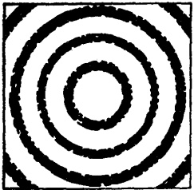

图 1 X 射线衍射图样

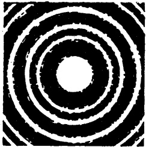

图 2 电子衍射图样

德布罗意波的波长也恰好居于这一范围以内！这就意味着，如果这种波确实存在，则电子通过晶体后，也必然会象X射线一样，在照相底片上产生同样的衍射图样。

德布罗意提出他的新颖见解后几年，美国科学家戴维孙和革末以及苏联科学家塔尔塔科夫斯基用一种晶体作电子的衍射实验，证实了他的见解。

当然,只凭“电子射线”和X射线之间的相似是不足以完成这个实验的。它必须具有自己独到之处。

X射线通过晶体时几乎是畅通无阻的，但当电子通过几分之一毫米厚的晶体薄片时，则将全部地被吸收掉。因此需要的是极薄的晶片或金属箔。也可能须要用障碍物来代替缝隙。在这项实验中，让电子射线与晶体表面构成一个很小的角度，这样电子便能在这个表面上掠过，而不致深入到晶体内部或被弹回。其结果，电子只对晶体的最外层原子产生衍射。产生衍射的电子在照相底片上被记录下来*。

---

塔尔塔科夫斯基将电子射线送向一个由许多细小晶体构成的薄箔。暴露时间达几分钟之久。

底片冲洗后显现出真正的衍射环轮廓。这些底片——它们要比相同重量的金子还贵重——被送往世界上几所最大的物理学实验室，在那里这些底片受到了仔细的检验。没有任何怀疑的余地了。德布罗意有关物质波的大胆假设终于被实验出色地证实了。电子显示了微粒的特性以及波的特性。

## § 32 具有双重属性的粒子

甚至在进行这些具决定意义的实验之前，科学家就已经尝试寻索德布罗意波的真实意义。人们应该怎样去理解粒子(如电子)活动的这种双重性质呢?

在那些年代里，物理学家知道什么是电子，那就是一个很小、很轻、携带着一个微小电荷的物质粒子。在一个很长的时期内，并没有人去问，这个粒子究竟是什么形状的，或者在它的内部还发生着什么。直接观察一个电子是不可能的，更不用说弄清楚它的内部结构了。但如果电子是一个粒子，它显然还必须具有粒子的特性。这样，电子又怎能拥有与粒子绝然不同的波的特性呢？

最先尝试解释物质波的便是德布罗意本人。这清楚地表明：当物理学家刚刚进入微观世界时，他们由于习惯，总是继续沿用有形的模型。在玻尔-卢瑟福的理论中，原子就像一个行星系统，在这系统中电子行星环绕核太阳旋转，唯一不同的

---

是：行星总保持一定的轨道，而电子却经常在变换自己的轨道。

继此而来的便是光量子，即光子。正如爱因斯坦所示，光子也具有波粒二象性。显然，这样的二象性物质是不能用图象来表征的。

这样，物理学便面临着第一个不能表征的存在，而现在，由于德布罗意的发现，这种不可想象性又扩展到实物粒子，扩展到小至电子大至巨大星体的一切物体。这的确使人望而生畏。

人们怎能想象飞向一个障碍的电子，由于衍射的结果，会绕过它并达到它的背后？不能。波与微粒是两种势不两立的存在。一个东西要么是波，要么是微粒！

可是德布罗意波确实存在。它不再是“非此即彼”，而是“亦此亦彼”。这样就势必要把不相联系的联系起来。这不仅局限于产生衍射的电子这一特例。假如电子具有波特性，必然世界上所有物体，从最小的到最大的，也都具有波特性。

德布罗意建议从导波这个概念开始来进行这一不寻常的综合。

## § 33 导波

让我们重温一下骑浪这项运动。骑浪人占住了巨浪的浪

---

头，这巨浪把他带到岸边。这里巨浪充当一名向导。

德布罗意的想法是：物质波以类似的形式在引导运动着的实物粒子。一个粒子仿佛坐在一个波上，随波而驰。

德布罗意说：这种波的波长可能很长。当电子运动的速度甚低时，电子波的波长要较电子本身大好几千倍。随着速度的增加，粒子仿佛将波收进其自身之中，因而波就变得较短了。但电子即使在作高速运动，它的波长也仍然大于电子本身的线度。

1 究竟谁引导谁——是电子引导波，还是波引导电子——是无关紧要的。重要的是：波与电子是紧密地而且是永恒地联系着的。只有当电子停止运动时，电子波才消失。在这一瞬间，德布罗意关系中的分母变为零，因而波长变为无限大。换句话说，电子波的波峰与波谷相距如此之远，因而电子波也就不成其为波了。

德布罗意的图画是十分生动的：电子骑在自己的波上。但波又是从哪里来的呢？它与粒子俱存，即便后者是在绝对的真空中运动着。这就是说，波是粒子本身产生出来的。但这又是怎样发生的呢？

德布罗意的假说并未对这点作出任何解释。退一步说，也许这个假说能够解释粒子与其波之间的相互作用；波如何与粒子一齐在运动；当粒子与其他粒子和场相互作用时，例如，当粒子遇到障碍或照相底片时，波将如何分担粒子的命运。否。在这些问题上，德布罗意的假说也未提供任何有说服力的解释。

---

为了寻找一条出路，德布罗意甚至想把粒子完全丢掉。难道不能设想波本身就是粒子吗？换句话说，可以将粒子想象成波的紧凑结构——波包，就像物理学家称呼它的那样。一个波包是由几个相当短的波构成的。当两个或两个以上的波包相碰撞时，它们应当象粒子一样地活动，正象短波光子将电子从金属中轰出时那样。但不管这个波包是多么紧凑，也不管它多么象一个粒子，它毕竟是由波构成的。这当然意味着：必然存在着某些现象，在其中波包能将自己的基本波性质显示出来。

可是自然界也同样地拒绝了这种说法。事实上不论波包是多么紧凑，它也不能形成一个粒子。这是根本不可能的。关键是：即使在绝对真空中，这些波包也将随着时间迅速解体。转瞬间，波包在空间中将变得模糊不清，换句话说，将错就错的解释反而使原来紧凑的粒子丧失了形状。可是我们知道粒子是十分稳定的，没有任何迹象表明它会随着时间而弥漫开来。

这个模型也必须被抛弃。将波与粒子这两个实质互不相容的机械地结合在单一的形象中没有获得成功，也不可能获得成功。但这是后话。德布罗意仍然不想放弃他那个头是粒子身体是波的“半人半马的怪物”*。

两年的时间过去了。1927年夏，全世界的物理学家来到布鲁塞尔，参加索耳威大会。在大会上，德布罗意关于波及粒

---

子之间的关系的表述遭到了全体一致的否定。往后许多年内，对此关系的一种截然不同的表述在前带路。这表述是由两位年青的德国物理学家——海森堡和薛定谔——在大会上提出的。

## § 34 衍射——是群体还是个体的现象

海森堡和薛定谔埋葬了德布罗意的想法。他们谈得那样头头是道，从而决定了往后量子力学的全部发展。

德布罗意关于波与物体的运动相关联的基本思想很快就被许多国家的科学家采纳。德布罗意的第一篇论文发表后不到一年，德国物理学家玻恩便提出了自己的有关德布罗意波的观点。

玻恩的学生海森堡这时刚开始自己的科学生涯。他对这个问题也产生了兴趣。与此同时还有另外一组物理学家，其中包括薛定谔，也对德布罗意的研究工作展开了热烈的讨论。

下面我们将不按照历史事件的先后来谈一下主要事实。衍射相片一出现便使人意识到它的重大意义。这相片是最后的插曲，但它却大大提高了戏剧效果。

回顾一下证实电子衍射的实验。电子射线冲击一片晶体（或一片很薄的金属箔）。由于晶体中原子的障碍而产生衍射的电子束，射击在照相底片上，使其形成雾鬃，并留下衍射环。

这里补充说明一下，由炽热的金属丝产生的电子射线是

---

用特殊的方法形成的。在电子源和晶体之间安插了一个开有小圆孔的隔板*。这样，电子射线穿过隔板上的小圆孔后，应该具有固定的横截面积。

设想实验刚一开始便停止下来，此时，比如说，只有几十个电子射出，我们将获得什么样的结果？照相底片冲洗后，我们将看到，它很象一个满是弹痕的靶子，而弹痕的布局说明射手是个初出茅庐的新手。黑色斑点对应着单独的电子击中的部位，而这些部位十分漫无目标地分布在整个底片上。

如果实验继续进行下去，我们就会发现，电子射在靶上的部位将逐渐展示出规律性。在几千发射击之后，底片将呈现出轮廓清晰的明暗环，这就是科学家实际观察到的衍射环。

这是件有趣的事实。显然，当参加衍射的电子数目很少时，波特性显示不出来。只有当电子的数目很大时，这种特性才会呈现。换句话说，粒子的波特性似乎只能由群体表现出来。

为了找出答案，我们再次进行实验。同样还是电子衍射实验，但做法却不相同。我们先采用一个强电子源，并给底片以很短的曝光时间。这样衍射环将很快地形成。与此相反，我们再采用一个弱电子源，同时却延长曝光时间。假设在两种情况下射击在底片上的电子数目相同，则所获得的两个衍射图样也将绝对相同。

这是非常重要的。在第一种情况下，电子对晶体的衍射

---

是同时产生的，也就是说它是某种群体性质的东西。在第二种情况下，电子是一个个地射向晶体的，因而群体的概念很难运用。设想有这样一小队铁路工人，今天这个工人来焊接，明天那个工人来动一动某个螺栓，过了一个月以后，第三个工人再将这个螺栓旋紧，那还算个小队吗？

不管是成千个电子同时完成衍射，还是一个电子接着一个电子去完成它，得到的图样是一样的。结论是明确的：每个电子不依赖于其他电子而独自显示其不寻常的特性，就好象其他电子并不存在似的。

## § 35 访问靶场

让我们先来看看布满弹痕的靶子。这些痕迹是为数很少的电子留下的。乍一看，电子好像是漫无目的地射向底片的。

但有一件事引起了我们的注意。我们量度一下允许电子通过的隔板小孔的尺寸，并照着它将小孔的轮廓描绘到靶上。看起来，所有的电子都好象应该落在这个轮廓线以内，而事实上电子在底片上留下的痕迹是十分杂乱的，许多痕迹甚至远远地超出了界线。

另一件事也很有趣。仔细观察一下这个靶子，就会发现，电子向底片的射击完全不是漫无目标的。即使射向靶子的电子为数很少，也存在着全然没有击痕的空白区域，而在另一些区域内则密集着击痕。如果通过击痕密集的区域划一条线，则一个个小环将会出现。

---

当然,这些密集的击痕所形成的图象开始并不明显,但随着射向底片的电子数目的增加,图象便越来越清楚。

让我们耍个小花招吧！取一个步枪靶子，按照相底片上的电子击痕在靶上打出孔眼。将这个靶子拿给老练的射手去瞧瞧，看看他的意见如何。

“这个射法真奇怪。你看，第10环里有那么多的弹痕，而第8环或第9环却一个没有。是有意这样射的吗？所有的弹痕都集中在第10、7、4、1这几环之中。”

我们一言不发。过了片刻，这位老射手说道：“胡闹！任何人也不可能在靶上射出这个样子，不管他多么想这样射。道理是这样的：如果他是个新手，他射出的弹痕将是杂乱无章的，这些弹痕将均匀地分布在整个靶子上。一个有经验的射手的靶子则完全两样：大量的弹痕集中在靶心周围，只有少量的弹痕分布在外环。让我们数一下每一靶环里的弹痕总数，并作出一个图。

“在横轴上我们标出环的序数(让横轴代表离开靶心的距离,也是一样);在纵轴上标出两环之间的弹痕数目。我们将获得一个随着到靶心距离的增加而衰减的平滑曲线,再看看你那个靶子。从中心到两侧,这个曲线在一起一伏地振荡着。这个曲线的衰减,与我们那个曲线相比较,形式完全不同。

“对老射手的靶子来说，机遇法则是有效的。我们所获得的曲线就叫作无规则失误曲线，或高斯曲线。你那个曲线也有某种不规则的地方，但它遵循的是另一种不同的、对靶场来说是颇为新奇的法则！”

---

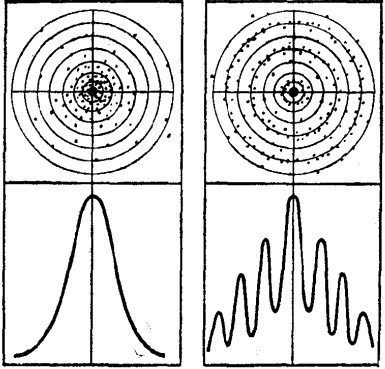

图 3

现在让我们再来看看自己的靶子吧！

## § 36 几率波

真的，波形曲线从来没有在射击中遇到过。电子不是子弹。子弹的质量太大，从而不能显现其波动特性。

被晶体反射的电子在照相底片上留下痕迹。这些痕迹形成的分布曲线，玻恩建议称为德布罗意波。

且慢！纸上的波和真实的波，二者之间有什么关系呢？真正的波与电子一齐运动，而我们的波却停留在纸上。

当然，它们之间还是有关系的，照相底片上电子击痕所形成的图象并不是幻想的产物。它反映的是与运动着的电子相

---

联系的真实波的存在。但这种波的意义与德布罗意所申明的意义是迥然不同的。

牛顿的经典物理学非常肯定地认为，从隔板开口处逸出的电子在遇到晶体以前应作直线运动。然后电子将被晶体的原子反射，正象弹子从弹子台的凸沿弹出一样。最后，电子远离晶体，射向照相底片，并在它上面留下痕迹。

这里并没有射手的颤动的手或疲劳的眼睛，也没有风或从地面升起的热气流，来影响瞄准过程。条件是理想的，因而准确度也应当是理想的——全部子弹都应当命中靶心。换句话说，电子应当在照相底片上准确地复制出隔板孔眼的原来形状。如果隔板孔眼是一个小圆洞，则照相底片上除了复制出一个小圆斑而外，不应该留下其他任何痕迹。

但电子拒绝服从经典定律。除了一个小圆斑而外，还出现了一系列的明暗环。这并不是射击的不准确造成的。即便我们认为确实是这样的，电子的分布也应当服从高斯定律。但事实上它们却按照与高斯定律截然不同的波定律来分布的。

电子在照相底片上的分布曲线在形状上是波样的。光以及X射线的衍射图样的强度曲线也具有相同的波形状，而光与X射线肯定无疑是波。

因此，电子的波特性的表现方式较德布罗意想象的更加难以捉摸。电子波不是一架飞机，里面乘坐着电子旅客。电子波决定电子射中照相底片上的某点的几率。因此玻恩建议给它取个更恰当的名称——几率波。

---

## § 37 几率进入物理学

在经典物理学中，我们从未遇到过几率这个名称。每一质点或物体运动都被认为是由作用其上的诸力严格地决定了的。只要我们知道作用于一个物体的诸力，该物体的位置以及开始进行计算的参考时间，我们便可以准确地预言在任何一瞬时——下一秒钟或一百万年以后——该物体的位置和速度。

上世纪中期，物理学对气体的内在运动进行了研究。人们几乎立刻明白：牛顿的公式不能直接应用于气体分子的运动。

你不妨设想一下，即使在极小的体积内，气体的分子也是数以亿亿计的。如果要准确地描绘气体分子的运动，应该写下并解出每个分子的运动方程。分子从来不会静止下来：它们与其他分子经常相互碰撞，把有些分子弹射出去，又撞上另一些分子。每秒钟这样的事件要发生几百万次。

即使幻想写出所有这些分子的牛顿方程也是荒谬绝伦的。仅仅写下这些方程也要花几百万年的时间。再解出这些方程还要几万万万年的时间。可是到那时候，这些运动早已被其他运动所代替了。

在探索一条合理的道路的过程中，物理学家认识到：他们不应当对以极高速度碰撞其他分子的各个气体分子的运动感到兴趣。相反地，他们的兴趣应当寓于气体的总体状态：

---

它的温度、密度、压强以及其他特性。

没有必要算出各个分子的速度。气体的状态的全部特征都应当归属于作为一个集团的整个分子系统。因此这些特征便主要地由气体分子的平均速度来决定。平均速度越高，温度也就越高。在这一过程中，如果气体不改变其容积，则压力将随温度的增高而上升。

为了准确地掌握这些关系式，必须设法求出分子的平均速度。这里便须引用几率理论。

几率理论声明：不可能设想每一瞬时所有的气体分子都具有相同的速度。与此相反，它们具有不同的速度。不仅如此，这些速度由于碰撞在经常地改变着。可是，尽管这些速度变化具有不规则的性质，在给定的条件下，每一瞬间都存在着分子的某种平均的、稳定的速度。对于一个分子而言的不规则性，当应用于大数量分子时，则转化为规则性。这就是大数量的几率法则。一般容积内的气体分子数目的确是非常大的。实际上这个数目是如此地大，以致我们可以毫不迟疑地应用这一法则。

这样物理学家便开始根据几率理论的法则，用统计方法计算巨大的分子集团的活动状况。但在某一方面，他们不想与几率原理取得一致。他们坚信，分子运动中不存在不规则性；每一次碰撞，每一个分子的个别运动都可以用牛顿定律表述出来；如果有人愿意去求几亿亿个方程的解，他便能够绝对精确地表述出这些运动，而无须求助于任何平均值。我们当然不会这样做，但原则上这是行得通的。因此，当人们用几率

---

法则、统计法则来描述气体运动时，确信深藏在上述法则后面的是牛顿力学的精确定律。

可是经典物理学却有点过于自信了。将牛顿定律推广到各个分子的运动是没有任何根据的。物理学往后的发展证明了这点。分子不是弹子。它们在运动着，并在相互碰撞着，可是却遵从一些全然不同的法则。

## § 38 谨慎的预言

电子、原子和分子遵从的是些新的定律。这里首先造反的是电子。它们不想迁就经典物理学的框框。它们不朝向照相底片上应当射击的地方射击。电子的这种叛逆性震动了某些科学家，他们喊道：“电子竟然使用自己的自由意志，它们竟然为所欲为！”

哲学上软弱的物理学家很容易被引入歧途。如果电子真有什么“自己的意志”，那就不会有任何能为它遵循的定律，这样它便是一个真正的无政府主义者了。如果事情真是这样，我们又何必需要科学？因为科学寻求的是法则，而法则并不存在！他们这样地推理：上帝允许电子（因而也就允许世上所有的东西）自由活动，为所欲为，除了下面这一条法则而外可以不受任何法则的约束，这就是上帝自身存在的神圣法则；可是科学并不去审查这条法则，科学以绝对的信念把握着它。你看，问题是多么简单：从电子的自由意志出发坠入了彻头彻尾的唯心主义。

---

唯物主义反驳道：在经典物理定律失效的地方，新的定律在起作用。

这一点曾为列宁所预见。在量子力学出现前20年 $ ^{*} $他就说过，不管电子的多么不寻常的特性会被发现出来，它们只意味着一件事：我们对周围世界的理解更加正确、更加深刻 $ ^{**} $。

电子不遵从经典物理学的规律，但却遵从新的量子力学的规律。

这些规律是些什么呢？首先就是几率法则。电子衍射实验中获得的照相底片(负片)上的亮环说明什么呢？它说明电子没有击中这些地方。显然，电子并没有按照自己的自由意志行动，它们的活动是受制约的。

我们见到的暗环则是多数电子击中的地方。但并不是所有的电子都射向这里。在最亮和最暗区域之间还有一些发灰的地方，这些正是“平均”数目的电子射中的地方，我们在射击游戏中绘制的击痕分布曲线很清楚地说明了这一点。

下面我们将要谈到问题的关键。

电子离开电子源，飞过隔板开口，受到晶体的反射，然后飞向照相底片。但这个电子将击中底片的那个地方？

经典物理学非常精确地计算了角度、距离和速度，然后说：这里。可是电子击中的地方往往并不在这里。

量子力学说：“我也说不准，但它击中暗环的可能性最大，

---

击中灰区的可能性次之，击中亮环简直没有什么可能性”。

这话好象过于谨慎了吧。科学一向要求被认为是准确的，现在竟说出这样的话，听起来真叫奇怪。这样的话甚至不象是科学。与此相较，经典物理学的绝对准确的预见该有多么好啊！可是，只要认真想一想就会发现，那样的预言实际上是吹牛皮；它只暴露了自己的傲慢与无知。

当然，科学才刚刚开始探索一个无限复杂的世界，对其中发生的事件几乎一无所知，与此同时还要做出如此明确的判断，我们怎能苛求于它呢？

可是，对于经典物理学，我们可能过于苛刻了。在日常事物范围内，经典物理学还是有成效的。只是在此以前，它从未接触过什么量子、粒子的波特性以及其他许许多多的惊人的事物罢了。

是的，每门科学都力求获得有关自己的研究对象的精确而完备的知识。这显然是基本鹄的和座右铭。但也绝对不会有这么一天，那时每件事情都被认识了，科学再没有什么事情可做了。

所有这些谨慎的科学预言，所有这些可能和或然的意义就在于此。谈论或然正意味着我们对于某一现象的知识还并非绝对地完备而准确*。

---

人们可以容易地想象，如果气象员作出下面这样的预报，他将显得多么愚蠢：“明天天气热，无雨，上午9点温度23.8℃；12点，29.6℃；下午4点，27.4℃。下午1点乌云将在面积为多少平方米的某某区域的上空出现，停留多少分钟。下午5时乌云将以每小时12.3公里的速度向东北方向移动”。

有几十个因素参与气候的形成。气象学在目前状况下不可能考虑到并精确地描述构成完善的天气预报的这许多因素。远远做不到这点！

对量子力学来说，事情还要困难得多，因为它研究的对象是一个无比复杂的微观世界。

## § 39 粒子波和波粒子

让我们再回到德布罗意波上来。这种波决定着电子运动。但它是以几率形式，而不是完全准确地，决定着电子的运动的。在电子衍射实验中，电子波指明照相底片上哪些区域电子将以最大的几率射击。

但玻恩把德布罗意波看成是几率波。他是否搞错了呢？德布罗意波会不会是一种全然不同的东西？如果真是这样，那也是很容易检验出来的。

回顾一下德布罗意关系。从该关系式中可以看出，随着电子速度的增加，它的波长应当缩短。物理学家已经知道：X射线越硬，它的波长越短，衍射图样也就越紧凑。对不同速

---

度电子的衍射也进行了研究。实验也同样肯定地证实：随着电子速度的增加，衍射环相应地变得更为紧密。

这样物理学家便能根据波长求出衍射环之间的距离，反之亦然。计算表明：如果根据环间距离计算出电子波长，结果与从德布罗意关系中得出的数值准确地符合。

没有任何怀疑的余地了。几率波即德布罗意曾经预言的物质波。这种波不仅仅当电子受到晶体的衍射时才出现，它是普遍存在着的。在任何时候这种波都是与电子或其他实物粒子的运动联系在一起的。

但发现这种波并不总是可能的。随着粒子质量和速度的增加，德布罗意波的波长将要很快地减小，以致超出了我们仪器的灵敏度。在这种情况下，粒子只能呈现其微粒特性。

回顾一下我们对波动特性的讨论。波（例如电磁波），在其波长没有小到一定限度以前，不显示任何微粒特性，而只显示波动特性，如干涉、衍射等等。但当波长变得足够短时，它们便开始象粒子一样地运动，如能将金属中的电子轰击出来。

最好的例子是 γ 射线——一种在所有已知电磁波中最短的波。这种波能够很容易地敲击出实物粒子，显示出真正的微粒特性。

德布罗意的发现将世界上所有的物理现象结合于一个统一的整体中，这样就在两个对立的、看起来甚至好像是互相排斥的存在——微粒与波——之间架起了一座桥梁。统一性被发现了，可是没有根据认为对立面已经消失。）

---

对立似乎深深地隐藏在事物之中，决定着微观世界的奇妙特征。下面我们将要详细地讨论这个世界。我们将要知道许多奇迹般的事情，这些事情在微观世界中是可能的，并且是可以用“几率波”阐明清楚的。

## § 40 探讨波定律

几率波描述微观世界中电子和其他粒子的运动。现在不妨问一下，应当怎样理解描述一语？对一件事物或一个现象，既可作定性的，又可作定量的描述。日常生活中我们经常只作前者。当我们听说今天要下雨，我们就会拿雨伞，一般不去问，云在什么高度出现。

可是科学,尤其象物理学那样的精密科学,是很难满足于一个定性的描述的。需要的是数据,而且是准确的数据。

上面我们只以定性的方式描述了照相底片上的衍射图样，如明暗相间的环。我们也可以对它进行定量描述，如量度出底片不同地方的暗度，并绘制一条曲线，正象我们在靶场上绘制的那样。

不要以为我们能够对这个现象提出理论，便万事大吉了。这里还有其他问题须要解释。科学不能孤立地为每个现象建立理论。

事实上，现代科学的力量恰恰在于：它建立的理论能包括几百个相互联系的现象。最好的、最有力量的理论正是那些应用范围最广、包括的现象最多的理论。

---

在物理学中建立新的、内容广泛的理论，经常是以寻找一个重要的公式开始的。这个公式就叫作运动定律。人们熟悉的牛顿第二定律就是这样一个公式，它把物体的加速度与作用于物体的力的大小和方向联系起来了。但实际上我们看不见这个力和物体所获的加速度。我们能够观察到的只是在力的作用下物体在空间与时间中的移动。但正是牛顿的定律使我们认识了这个运动。加速度是运动的速度对时间的变化。而速度是物体的位置对时间的变化。归根结底，牛顿的定律将力与物体的实际移动联系在一起了。因此，解出牛顿方程我们便可得到物体运动的类型。这可以用物体的位置相对于时间的某种曲线来表示，这个曲线就叫作轨道。

物理学中还有一个很普遍、很广泛的定律，它描述的不是物体的运动而是波的传播。如果用数学形式来表达，那就是所谓波动方程或以发现它的十八世纪法国著名数学家命名的达兰贝尔方程。

无论牛顿方程或达兰贝尔方程都不是从更普遍的定律推导出来的。这些方程也并非凭空臆造出来的。牛顿和达兰贝尔的先辈已经作了大量的实验和观察，并作了理论上的概括。牛顿和达兰贝尔方程正是从这些理论概括中提炼出来的。

天才并不是一个只会搜索枯肠、凭空臆想的人。天才必须能够透过错综复杂的事物看到某种隐藏着的力量，某种定律，从而将它从一些累赘的形式中，从一些偶然的、无足轻重的、枝离破碎的现象中解放出来；然后还要切磋琢磨，使之精练而有条理，在精密科学中这就成了公式。这个新定律就像

---

是一颗知识明珠：棱角分明，面面光润。

但什么定律够得上是量子力学大厦的奠基石呢？当然，量子力学的新的定律既想取代经典物理学中的牛顿和达兰贝尔定律，就必须具有至少是相等的普遍性和概括性。不仅如此，这一新的定律还必须独自描述具有二象性的微观世界，从而代替早先的两个定律。也就是说，这个定律必须同时描述粒子的运动和波的传播。

不管怎样说，牛顿当时的事情好办得多。他拥有极其丰富的实验事实，而此时此刻却没有一项实验作依据。时间是1925年，大约在具有决定意义的电子衍射实验前三年。摆在面前的只有一个德布罗意关系，可是它只描述了粒子的波长，而没有涉及到粒子的运动。

虽然如此，理论物理学家坚信他们走的是正确的道路：不去等待任何实验来证实德布罗意的假设，就着手于建立新理论。

可能要从改变牛顿方程开始，以便让粒子的波特性也被包括进来？否。历史朝另一条道走去。继德布罗意之后，物理学家都在致力于改变波方程，使其同时也能反映波的微粒特性。这种作法证明是比较简单的。

在这方面，薛定谔和海森堡首先取得成就。两人的方法颇不相同。此外，这个人可能还不知道那个人在干些什么。只是过了一些时候，两人的论文都已发表，薛定谔才能证明：对问题的两种解答在物理意义上是完全相同的，尽管从外形看来二者毫无共同之处。

---

海森堡发明了所谓量子力学的矩阵表述。这种数学形式非常复杂，远远超出本书的范围。另一方面，薛定谔改变了波动方程，这样就使德布罗意波的微粒味道也被包括进来。这个新的方程就叫作薛定谔方程，它是量子力学的最常见的公式。

这样，波定律便成了量子力学的基本定律。

## § 41 轮到测量仪器了

现在让我们再回到德布罗意波上来。根据玻恩的解释以及薛定谔方程的最终形式，这种波是通过照相底片上电子击痕的波浪形分布显示出来的。但我们知道，必须有大量的电子才能产生一个清晰的图样。

对于单个的电子，德布罗意波又有什么意义呢？我们同样也知道：对于一个电子，这种波也要使之偏离经典的轨道。如果没有偏离，也就不会有任何衍射图样。

事情看来是很清楚的。但有些地方还不能令人十分满意。对奇异的微观世界谈论了那么多，自然会认为粒子的波特性总有某些不寻常的地方。

好，让我们看看微观世界自己有什么可说的。假如我们想作一个测量。至于测量仪器是什么特殊类型的，我们并不感到兴趣。但它必须能够监视着电子的行踪：它必须能测出电子在每一瞬时的速度和位置。

电子是个很小的粒子。它必须要用一个超放大率的显微

---

镜来观察。设想我们确实制成了一台具有足够的放大能力的显微镜。第一个问题是：我们如何进行这项测量？为了看见一个物体，必须用某种方法对它进行照明。问题是：用什么方法？照明依物体的体积而定。为了获得一个清晰的象，第一个条件是，光线的波长必须小于物体的线度。一般的光学显微镜在0.4至0.8微米波长范围内工作，因而物体至少有2至3微米的线度，才能产生轮廓分明的象。

但如果物体的线度只有半微米，所成的象将模糊不清。当物体的线度与光线的波长属于同一数量级时，光线就会发生强烈的衍射。我们获得的将不是一个清楚的物象，而是一个衍射图样——一组复现物体轮廓的明暗交替的带。

如果物体面积再小一些,则光线就会畅通无阻地过去,好象这个物体并不存在似的。

电子不是一粒灰尘,也不是一个细菌。它的体积(往后将看到,体积这个词是很难适用的)大约要较光的波长小十亿倍。因此,我们怎能对它进行照明呢?幸好还有r射线,它的波长也是极短的。

这样我们便用 r 射线对电子照明并进行观察。可是我们仍然什么也看不见。确实一无所见。原来显微镜下还有个电子，现在这个电子却不见了。甚至连衍射环也没有看到。

不论我们如何设法去制一个电子的物象，我们也永远不会成功。

关键在于电子不是一粒灰尘，而 r 量子也不是一个可见光的光子。极小的一粒灰尘也有重量，而一个光子携带着一

---

些能量，因此也具有一些动量。

光子的动量是从哪里获得的？我们知道光子具有粒子的特性。爱因斯坦在他的光电效应理论中已经证实了这一点。你不妨设想一下：真空中的光子总具有一样的速度，那就是光速，但它的波长却是不一样的。现在将光子代入德布罗意关系中：

$$
\lambda=\frac{h}{mv}
$$ 

令速度 v 等于光速,这样我们便获得光子的质量(这当然是光子的动质量,光子的静质量绝对等于零):

$$
m=\frac{h}{\lambda c}
$$ 

光子的动量等于其质量与速度的乘积：

$$
p=mc=\frac{h}{\lambda}
$$ 

现在只须作一点数学运算。从这个公式可以立即看出，随着光子波长的减小，它的动量迅速增大。

当光子射到一粒灰尘上时，它将自己的一部分动量传递给后者并反跳回来，射入显微镜的光学系统，最后进入观察者的眼睛。可是这粒灰尘本身却纹丝不动。如果这粒灰尘是静止的，它仍然会是这样的；如果它是运动着的，它的运动方向几乎毫无变化。

但电子却完全不一样了。它的质量无法和一粒灰尘相比较；即使是一个速度很高的电子，它的动量也很小。现在让我

---

们用一个 γ 光子向一个电子射击。由于 γ 光子的动量约较可见光的光子大十亿倍，因此当它与电子相碰撞时，电子顿时就被弹射出去，消失得无影无踪，哪里还谈得上什么物象或衍射环呢！

我们还没有谈得很深。使事情更加糟糕的是，我们还必须和电子的速度打交道。以一个飞行着的电子为例，我们知道它在朝某个方向飞行，但不知道它的速度究竟多大。我们刚用r光子向它照明，它的速度便开始变化。假设这个电子的速度等于零，也就是说它静止在某个地方。可是就是这个位置我们也无法确定。因为我们刚一向它照明，它立即就被弹出，朝着某个方向飞去。

和老显微镜打交道该有多么好啊！你只须用它来对付一粒灰尘或一个细菌。任何时候你都知道它在哪里以及它在多么快地运动着。但你试试确定一个电子的位置吧。我们不知道电子的速度，如果我们要想确定它的速度，我们便全然不知它的所在了。这个微观世界真够捉弄人！

## § 42 测不准原理

我们上面所作的描述与实际情况十分接近。对尘粒和电子少许进行一点计算，就可以证实这一点。

从某种物质中取出线度为 1 微米 ( $ 10^{-4} $ 厘米)，密度为 10 克/厘米 $ ^{3} $（比铁的密度稍大）的尘粒，使其以每秒 1 微米的低速在显微镜的视域内运动。计算的结果：它的重量为  $ 10^{-11} $

克，动量为10~15克·厘米/秒。现在将波长等于0.5微米的光线（即可见光谱内的绿光）照射其上。这种光的光子的动量10~22克·厘米/秒，也就是说要较该尘粒的动量小几千万倍。十分明显，光子射在尘粒上是不会产生任何效应的。

再以电子为例。即使它的速度接近光速，也就是它达到了 $ 10^{10} $厘米/秒的速度，它的动量也仅约 $ 10^{-17} $克·厘米/秒。用来照明的γ光子具有极短的波长 $ (6\times10^{-13} $厘米)，它的动量 $ 10^{-14} $克·厘米/秒，要比电子的大几千倍。因此当γ光子射到电子上时，就象列车撞上了婴儿车一样。

这点现在应该很清楚了：获得对微观世界进行观测的仪器的可能性，至少可以说是非常小的。这些仪器不能以任何准确度来测量粒子的运动。

这种不精确性,或者说得更妥当些,测量的不准确性,又达到什么程度呢?这个问题要由海森堡1927年从量子力学的普遍定律推导出来的测不准关系来回答。下面就是这个测不准关系

$$
\Delta x\times\Delta\nu_{x}\geqslant\frac{h}{m}
$$ 

(实际上 h 应当由  $ h/2\pi $ 来表示, 但这点无关紧要, 因为二者只相差六倍)。这里  $ \Delta x $ 是对粒子的位置(坐标) x 的测不准量;  $ \Delta v_x $ 是对其在 x 方向上的速度  $ v_x $ 的测不准量; m 为粒子的质量; 符号  $ \geqslant $ 表示两个不准量的乘积不得小于关系式右边的量。

这里怪事来了。如果我们将粒子的位置测量得绝对准

---

确，其坐标的不准量  $ \Delta x $ 当然必须变为零。这样根据严格的数学规律，速度的不准量变为：

$$
\Delta v_{x}=\frac{h/m}{\Delta x}=\frac{h/m}{0}=\infty
$$ 

——即无限大。这就意味着，在粒子位置正被测定的那一瞬，它的速度变成绝对地不确定的。相反地，如果在某一瞬时我们以绝对的准确度测得了粒子的速度，则我们无法判断这个粒子在此瞬时的位置。

怎么办？做点折衷——如以某种总地说来并不太大的误差同时测量电子的位置和速度——或许是可以的吧？

让我们看看测量上述尘粒和电子的误差究竟有多大。对前者来说，海森堡测不准关系的右侧的数量约为  $ 10^{-15} $。现在让两个不准量都取折衷数值： $ \Delta x = 10^{-8} $ 厘米， $ \Delta v_{x} = 10^{-7} $ 厘米/秒（二者相乘得右边数量—— $ 10^{-15} $）。

 $ \Delta v_{x} $ 对  $ v_{x} $ 之比为  $ 10^{-7}:10^{-4}=10^{-3} $，即千分之一。对速度的测量来说，这点误差应该使我们满意了。绝少的速度计能有更高的精确度。

再看看尘粒位置的不准量  $ v_{x0} $ 它对粒子线度之比为  $ 10^{-8}:10^{-4}=10^{-4} $，即万分之一。这一误差相当于尘粒中一个原子的线度。

这就说明，当我们测量一粒灰尘或一些更重的物体的速度和位置时，我们甚至从未想到还存在着一个测不准关系。

可是电子的情形都不一样了。它的体积（这里我们再次指出，以经典物理学的观点谈电子的体积是不很正确的，因为

---

这样电子就被看成一个带电的球体了)大约为  $ 10^{-13} $ 厘米 $ ^{*} $，质量  $ 10^{-27} $ 克，1伏特电位差将使电子获得数量级为  $ 10^{7} $ 厘米/秒的中等速度。测不准关系右侧约为 10。

也有其他方法算出  $ \Delta x $ 和  $ \Delta v_{x} $ 的数值。设我们要求以测量尘粒的准确度—— $ 10^{-3} $ 测量电子速度，则在此情况下， $ \Delta v_{x}:10^{7}=10^{-3} $，即电子速度的不准量  $ \Delta v_{x}=10^{4} $ 厘米/秒，以此值代入测不准关系，得出  $ \Delta x\geqslant10^{-3} $ 厘米。这就是说电子位置的不准量为其线度的几百亿倍！

设测电子速度的不准确程度为 100% —— 物理学家认为实际测量情况就是这样——则  $ \Delta v_{x}=10^{7} $ 厘米/秒，而  $ \Delta x=0^{-5} $ 厘米。这一数值仍然较电子的线度大几百万倍。

这样看来折衷的办法是行不通的。微观世界不接受这样的办法。

## § 43 过错在仪器还在电子

经典物理学从未经历过这种进退维谷的处境。它认为在任何瞬时都能以绝对的准确度(至少在理论上)测出任何粒子的位置和速度。这种观念是根深蒂固的：经典物理学对质点运动的计算总是建立在某开始时刻质点的位置和速度这样的基础之上的。

现在我们发现：甚至在理论上也根本谈不上什么测量的

---

绝对精确。毛病出在哪里呢？可能在仪器吧？

当然，任何仪器也不可能以绝对的精确度来测量一个量。我们可以说，测量技术的发展史，就是仪器精确度不断提高的历史。在许多科学技术领域内，精密仪器达到了难以想象的高水平，而且它们还在不断地改进。

这样看来，测不准关系似乎已经为仪器的精确度定了个极限——一个上限。

在这个难题面前，海森堡(以及追随他的其他物理学家*)认为：困难出自仪器。观测微观世界的仪器异于用来探索宇宙的望远镜。当然，两种仪器都是需要的。我们用来观察周围世界的感觉器官具有局限性。事实上仪器的用处就在于：它把在它的范围内的现象翻译成“人类的”感觉的语言。

望远镜观察天体时，它一点也不影响天体的运动。可是对微观世界来说，情况则完全两样。我们的仪器(即使是理想的超显微镜)也会直接干扰被观察的现象，并改变它的本来过程。不仅如此，这种干扰是如此地严重，以致我们没有办法以纯粹的形式将这一现象分析出来。这就是测不准关系的意义所在：它为观察的“纯粹”程度定了个上限。

另外一些物理学家持有相反的见解：毛病在电子本身。他们的论点是相当有说服力的。微观世界具有它自己的规

---

律；一般说来，微观世界并没有要求对其存在进行测量。当我们说电子具有波特性时，这句话又意味着什么呢？

就拿一个摆的振动频率作例子吧。如果说在某一瞬时它的频率是如何如何，则这简直是在说废话。为了确定频率，必须对摆的振动观察一段时间。同理，我们也不能说在某给定点上波长如何如何。波长的意义恰恰在于，它是一长(严格说来它是无限长)系列的波的一个特征。不管波的特性如何，波的长度不以波中某一点的位置而定。

让我们再以德布罗意关系为例，但以另一形式写出，使关系式的左侧为粒子的速度：

$$
v=\frac{\hbar}{m\lambda}
$$ 

我们立即得出结论：由于波长  $ \lambda $ 不依赖于波中任何一点（例如，我们相信粒子所在的那一点）的位置，因而粒子的速度也就不能依赖于粒子的位置。仪器的失误恰恰是电子的这种波特性造成的。

倒底是谁对呢？是指责仪器不能适应微观世界的这一派对呢？还是怪罪微观世界根本就不能测量的那一派对呢？

看来似乎二者都应该受到指责，并各受五十板。问题的实质是：海森堡关系揭示了仪器和电子两方面的过失。但问题还不止于此。

---

## § 44 旧观念被引进新世界中

我们对仪器有什么要求？首先，它应当提供我们需要的信息。当然，仪器没有任何自主性，它只能服从于人的意志。

我们用来观测微观世界的仪器具有两个方面，或两端：输入端和输出端。在输入端，仪器对付那些遵从量子规律的现象；在输出端，它提供用经典语言记录下来的信息，因为我们的感觉器官不懂得任何其他语言。

我们要求仪器告诉我们在每一瞬时电子的位置和速度。仪器很老实地回答说它办不到。它说：在测量速度时，如果不须指明位置，它便能提供关于速度的信息；反过来，如果在该瞬时可以不去过问速度，它也可以提供有关位置的信息。

只须稍稍思考一下就会明白：最该受到责备的还是物理学家自己。他们要求仪器提出电子的速度对位置的信息，事实上这两个量并无任何关系。

这就是微观世界的许多奇迹中的一个奇迹，也就是粒子的波动本性的各种表现中的一种表现。一句话，物理学家几百年来运用自如的、老的经典概念和量，在处理微观世界时不复有效。

当然，也并非就是无效。在微观世界中，这些概念仍然保存着，但在某种意义上受到约束和限制。这些概念在使用上的限制是用测不准关系来表达的。

其结果,如果电子是静止着的,它的波将无限伸延,因此

---

在任何一个确定位置上找到它的企图都将失败。另一方面，电子运动越快，它便能越准确地被定位于其波中。但即使以最高速度运动，它在空间的“弥漫”也较其自身的“体积”大很多倍。

 $ \underline{\text{在微观世界中，不仅电子的位置和速度的经典概念已经不适用，甚至时间、粒子的能量以及其他许多观念都起了变化。}} $

当然，你也可能问，为什么物理学家不抛弃那些不能正常地应用于微观世界的旧经典概念和数量，而代之以更加符合于这个世界的不寻常特性的新概念和数量？

很难一下子就看出这个问题是多么地复杂，因为它牵涉到人类认识过程的根本性质。在本书的末尾，我们还要再次讨论这个问题。目前必须说明：在物理学或其他任何一门科学中，概念或观念的任何改变都是一个十分漫长的、复杂的、艰苦的过程。人类关于宇宙、生命和无生物的本质以及原子构造的最初的幼稚的想法，经过好几千年的时间才发生一次变革。可以容易地想象，几百年以后，我们自己的种种概念对后人来说也将显得多么幼稚。

在我们这个时代，人类的知识在以神奇的速度发展着。尽管如此，揭示新世界、新现象的过程已经落在后面了：它面临着越来越多的困难和矛盾。爱因斯坦讲得很恰当：这是一场观念的戏剧。

## 场观念的戏剧。

当经典概念被引进微观世界中时，我们看到的正是这么一场戏。

---

## § 45 另一个奇迹

儿童翻越围墙溜进樱桃园。园主筑起一道更高的围墙。小约翰怎么办？他采用了跑跳，或者取来一个梯子，或者爬上一棵树然后再翻越过去，……当然办法是很多的。今天孩子们已经不再相信什么神话了，但如果他们真的要和微观世界打交道的话，他们必须想象粒子能从一堵坚实的围墙钻过去！

让我们更仔细地研究一下爬墙或跳墙这件事。我们从学校里学得：身体越低，位能越小。站在地面上时，你的位能要比坐在墙上时小。而且我们知道小多少：这个数量就是我们的体重与在两个不同位置上身体重心高度之差的乘积；这重心高度差粗略地等于墙的高度减去1米。

如果你从什么地方获得这个位能，你便能翻过这堵墙。比如，你可以使用自己的肌肉，或你伙伴的肌肉，把你抛起来。但两种办法中不论用的是哪一种，所作的功都用来增加位能，以便使你越过围墙。

余下的就好办了。跳下来不须作任何努力。相反地，倒须设法缓和一下引力对降落造成的冲击。当你在墙的另外一侧着陆后，你的位能将降低到跳跃前的水平。

如果我们将跳墙前后的位能绘成一张图，我们将获得一个凸起。在物理学中，这就叫作位垒。

原子世界中也有一些这种性质的围墙。比如，一块金属包含大量的几乎是自由的电子，人们从未听说电子能凭借自

---

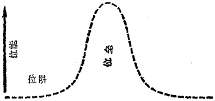

图 4

己的自由意志脱离金属。关键是，它们并不是完全自由的。虽然离子对电子的束缚是弱的，但电子仍然被这样形成的离子吸引着（这点将在下章较详细地讨论）。一块金属中，所有离子对所有电子的总效应可以描绘成一个借高墙与外界隔绝的庭院，在庭院里驰骋着电子。

一块金属内的电子与洞里的球相似，这个球在讲玻尔理论时曾讨论过。在金属内部，电子无规律地运动着，但它们逃跑的可能，并不比球从洞里出来的可能大一些。由于这个原因，电子在金属内的处境被取名为位阱。

可是这些电子并非永远地被金属真地拴住了。在某种条件下，电子可以说能够越墙而逃。例如，当金属受到波长足够短的光线的照射时，这样的事情就会发生。一个高能光子能够敲击电子，使它翻越位垒，获得真正的自由。这是用传统的、经典的方法翻越位垒，与小孩翻越围墙没有两样。

但你可能已经看出，对于金属中的电子来说，位垒并不真象一堵墙，因为它有前壁而无后壁。与其说它象堵墙，不如说它象一级台阶(图5)。对于阱中的球来说，也可以沿着阱的

---

边缘挖掘泥土，以形成一个围墙形式的垒壁(图 6)。对于金属中的电子而言，围墙形式的位垒可以借施加于金属的强电场形成(图 7)。

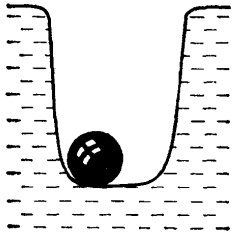

图 5

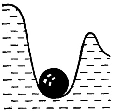

图 6

不论是对阱里的球而言，还是对金属中的电子而言，位垒都是十分相似的。当然，它们的相似就止于此。

如果我们为阱里的球解出牛顿方程，就会发现：如果没有足够的能量传递给该球，则该球将永远停留在阱中。即使不用任何方程，我们也都知道这个道理。球不会自己从阱里跳出来，小孩不跳跃也不能越过围墙。

经典力学断言：球永远不会从阱底跳出，这个奇迹的几率等于零，就是说绝无可能。

现在如果我们为置于电场中的金属的电子解出薛定谔方程，则结果完全出乎意料。这里，电子逃出金属的几率不等于零，严格说来，它从未真地变为零。这个几率很小，可能小到可以被忽略的程度，但它永远不会全然消失。

---

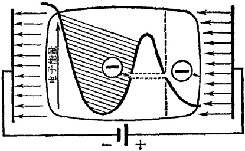

图 7

电子在无端地嘲弄着经典物理学的种种预言；它仿佛能渗透位垒，达到彼界。似乎某种神秘的力量打通了一个穿透位垒的隧道，让电子从中通过。为这个奇妙现象，物理学家取了一个名称——隧道效应。

## § 46 再看看测不准原理

在我们等待量子力学对这个新的奇迹作出解释的同时，我们的测量仪器一直在工作着，虽然成绩令人很失望。我们要求仪器察看电子是怎样渗透位垒的，因为这种现象违反了经典力学的最根本的法则。我们希望能够证实这无非是理论上的荒诞不经。

我们已经提到过阱里的球的总能量等于它的动能与位能之和，而且是负的。这是因为球的位能（从阱的顶部来计算，亦即从位垒的最高点来计算）是负的而且超过（在数值上）球

---

的动能。很清楚，在位垒的垒壁内，球的总能量也应该是负的，因为在渗出过程中总能量数值并不改变。但在另一方面，球的位能绝对值随着球趋近位垒的最高点而减小，达到最高点时变为零。

唯一的结论是：在位垒 $ ^{*} $内，球的动能成为负 $ ^{**} $的。但这是一种什么样的数量呢？让我们将动能 $ E_{K} $写下来：

$$
E_{K}=\frac{mv^{2}}{2}
$$ 

不管速度 v 的符号如何，它的平方总是正的，分母中的 2 也是正的。这就意味着粒子的质量 m 是负的。但不管在经典力学中也罢，在最革命的量子力学中也罢，负质量总是不可思议的。你设想一列火车从莫斯科开往列宁格勒，可是该列车的车厢却与火车头背道而驰，从列宁格勒开往莫斯科！

简直是奇谈怪论！为了证实这点，我们设置了仪器，对电子进行观察。仪器已经发现了这个电子，并已开始观察。观察的情况如下。电子接近位垒的边界。为了在电子正在穿越位垒时捕获它，甚至不需要确定其位置。只须查明这个电子的位置确实在位垒之内。

但事情不只如此。仪器必须测出电子在该瞬间的速度，以便决定它的动能是否真地变成了负的。但这里仪器又无能

---

为了了。只有海森堡测不准关系能挽救这个困局。

现在为了确定电子在位垒中的位置，必须用短波光子对它照明，这是因为测定电子位置的准确度不得小于位垒本身的宽度，而在原子世界中这个宽度是很小的。但当光子碰撞电子时，会将一个相当可观的不准量引进其速度中，这个不准量将造成电子动能的不准量，后者将恰好足够使电子越过位垒的最高点。

换言之，没有任何方法能观测到正在穿过位垒内的非经典通道的电子。因为就在对它进行观测的过程中，一定的能量又已经传递给电子，而这能量足够使后者以完全合法而经典的方式跃过位垒。这有点象是警察在帮助犯人掩盖罪证。

以上的讨论典型地代表着微观世界中发生的许多事情。从经典物理学的观点来看，量子力学自以为是地坚持一些最最离奇的事情。使用经典仪器来证明这些主张的虚妄是根本不可能的。不要在位垒之中去寻找粒子吧，你不会找到它的。粒子在位垒内这一概念在量子力学中，正如在经典力学中一样，是荒诞的。

但粒子能透过位垒！这个神秘的线索最终还应追溯到微观世界中电子和其他粒子的波特性。

## § 47 再谈谈物质波

正如我们已经看到的那样，波动特性的结果是：粒子速度不再依赖于粒子位置。微观世界里根本不存在什么运动

---

轨道。但粒子的位置影响着它的位能，粒子的速度影响着它的动能。

因此严格地说来，在同一瞬时既准确地测得粒子的动能又准确地测得其位能是不可能的。在任何给定的一瞬间，二者是彼此独立的。在这些可以应用经典概念的范围以内，原子世界中的不同能量是用测不准关系来表达的。

这就意味着，位阱里的粒子具有全靠自身逸出阱外的某种几率。这也还意味着，粒子仍然留在阱内的几率也存在着。假如说在1000个电子中，有10个逸出位垒，则隧道效应的几率为1%，而无隧道效应的几率为99%。

这两种几率分别叫作位垒的可渗透性和反射能力。

可渗透性(或透明度)和反射能力是熟悉的名词。这些词描述不同物质对于光波通过时所呈现的性能。在两种不同物质的界面上，光总是能够部分地进入第二种媒质，部分地被反射。难道位垒不就是两种媒质之间的分界吗？只是位垒不是对电磁波(包括光波)，而是对德布罗意波来说的。

这是一个非常深刻的类比。隧道效应很好地符合于在两种不同物质界面上光线的反射和折射定律。

我们之所以选择一道围墙，即某种具有确切的、有限的厚度的东西，来表征我们的位垒，并不是偶然的。如果这个位垒只有前壁，象一级台阶那样，隧道效应便将全然消失。在无限厚的即使很低的位垒中，粒子不可能打通隧道。这里经典物理学的禁令是完全有效的。

假使在无限厚的位垒中隧道真地打通了，仪器将能庆贺

---

某种胜利：它将有绝对的把握确定粒子确实已经进入位垒（如果真是这样的话），不管对其位置的测量的不准量有多么大。这就是说，测不准关系将能报告粒子的准确速度，也就是粒子的动能。这个能量将肯定是负的。

但自然界不会自相矛盾。负动能是不可能的。因此，无限长的隧道效应也就不能发生。

当然，上述解释也可能说服不了某些读者。我们所说的每件事难道只是抽象的理论思维吗？这点只好由你自己去作出判断了。大量电子会离开一块加热了的金属薄片——热能将足以使它们越过金属表面上的位垒，但对于一块冷的金属，这种现象决不会发生。

将这块金属置于强电场中，大量电子又将从金属中涌出。这就叫冷发射。它奇迹般地证实：隧道效应并非物理学家的臆造。

## § 48 波 函 数

方程的建立并不是为了好玩，而是为了求解。薛定谔方程也不例外。方程有时很简单，有时很复杂。而薛定谔方程则确实是很复杂的。它被称为二阶偏微分方程。解释这个方程的意义远远超出本书范围。这里只提一下：这类方程被用来描述在空间与时间中变化着的诸量。

这类方程中的未知量可能用种种形式乔装打扮起来：可以是容器内的液体的表面形状，可以是太空中某卫星的座标，

---

可以是从发射器向接受器运动着的无线电信号的强度，也可以是机床切削速度，等等。 $ \underline{\text{这样的方程的解直接地给出所求量对科学家感兴趣的其他诸量的依赖关系}} $。数学家用函数一词表述所有这些关系。

薛定谔方程中的未知量就叫作波函数。尽管从波函数中做出了数以千计的精确计算，它的确切意义对科学家来说仍然不清楚。我们已经说过，科学家至今还在对这个函数议论纷纷。

但在一件事上，他们似乎意见一致：波函数的平方具有几率的意义。它对座标和时间的依赖关系提供了在指定时间和指定地方发现一个粒子的几率。更确切地说，它提供了这样的几率，即在某一瞬时粒子在指定位置根据它在该处的行为而被发现的几率。例如，这种行为可以是粒子与我们的测量仪器之间的相互作用。这个几率就是我们在电子衍射实验中所描述的几率波。

解一般形式的薛定谔方程是个极其艰难的课题，即使我们用的是最巧妙的现代数学方法。但存在着许多场合 $ ^{*} $，它们能使这个解变得容易。这就是所谓的定态问题，在这些问题中，所求的波函数只相对于某确定的平均形式而振动，而此形式本身并不随时间变化。

可以很容易地看出，这类问题不涉及过程(当然是非周期性的)。在过程中事情是被控制着的，并在时间中变化。因此

---

定态问题指的是系统的结构，在该系统中过程能够发生。了解系统的结构是十分重要的，因为如果不知道过程是在什么条件下发生的，便不能对这个过程作出任何描述。

在微观世界内，构成这些条件的要素包括原子核、原子、分子、晶体以及其他许多东西。我们知道它们都具有特别稳定的结构。定态薛定谔方程首先应用于上述诸要素中，得出的结果是极为有趣的。这些，我们将在下章中讨论。

## § 49 波和量子结合起来了

量子力学中的定态问题还有另一个显著特点。为要了解这一点，我们须回顾一下：测不准关系不仅包含粒子的位置和速度，而且也包含它的总能量和时间。

在后一种情况中，海森堡关系表明：测量的时间越长，粒子的总能量就测得越准确。这个关系式的形式与早先所给的那个非常相似：

$$
\Delta E\times\Delta t\geqslant h
$$ 

(同样，式中 $h$ 如写成 $h/2\pi$ 则更正确些。) 这里 $\Delta E$ 是粒子能量 $E$ 的不准量，$\Delta t$ 是对粒子具有准确能量 $E$ 这一瞬时 $t$ 而言的不准量。符号 $\geqslant$ 表明两个不准量的乘积不得小于普朗克常数 $h$。

所谓定态就是说粒子的能量不随时间而变化。因此在原则上我们可以无尽期地对它测量。这里量度时间的不确定不起任何作用。

---

因此我们能够冷静地写出  $ \Delta t = \infty $。根据数学法则，得出

$$
\Delta E=\frac{\hbar}{\Delta t}=\frac{\hbar}{\infty}=0
$$ 

这意味着对能量测量的不准量等于零。换句话说，在定态条件下，粒子的能量是能以绝对的准确度来决定的。这就是本节开始时所说的定态问题的显著特点。

在薛定谔方程中，这个能量的数值是一个非常活跃的成员。只要 E 是正的(前面说过，这是与一个粒子的自由运动相对应的)，薛定谔方程对 E 的任何数值都有非零值解。

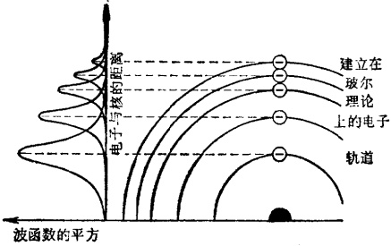

图 8

这就意味着，对 E 的任何值，方程的解的平方值(几率)都同样不等于零。翻译成日常的语言就是：一个自由粒子有权具有任何能量和任何运动速度（当然不能超过光速），并有权位于空间中的任何地方。

---

当 E 变为负值时(这在前面已经说过,是与粒子的被束缚状态相对应的;例如,位于阱中的球和原子内的电子),方程的解发生了根本性质的变化。在这种情况下,它只对能量 E 的某些特殊值来说不等于零。

E的这些数值就叫作粒子的容许能级。看一看图8的左边。除了一些容许能量状态而外，粒子存在的几率几乎处处接近于零。在容许能量状态中，粒子存在的几率显著地异于零。物理学家给这种情况取名为能级的分立性。

现在更仔细地观察一下这个图。难道它不有些象玻尔的原子模型中的容许能级吗？当然有些象。不仅如此，二者实际上是一回事。玻尔的电子轨道正是这些能量状态，在这些状态中电子存在的几率显著地异于零。

不同的地方是：玻尔只设想出这一轨道，但他不能证明这些轨道为什么会存在。正是量子力学构成了这个假设的基础。

量子力学也证实了玻尔的第二个假设：原子中电子的跳跃具有量子性质。从薛定谔方程可以看出，原子中的电子只能在容许能量状态下存在。这就是说，当电子从一种状态过渡到另一种状态时，能量不能任意改变，而必须取一些特定数值。这个数值恰好等于电子跳跃或过渡前后的两种状态的能量差。

这个能量差就是为这一新物理学开辟道路的普朗克量子。量子力学将两个杰出的假设——普朗克关于能量子的假设和德布罗意关于物质波的假设——结合在一起，并揭示了

---

二者之间的紧密的相互关系。

要是没有德布罗意波 $ ^{*} $，就不会有普朗克量子。这样，两股小溪就汇成了一条巨大的知识河流。让我们沿着这条逐渐扩大的河流走下去吧，看看什么样的新奇景物将在眼前展现：

---

# 第四章 原子、分子、晶体

## § 50 云代替了轨道

物理学中任何其他一个部门都没有象量子力学发展得那样快。在德布罗意波概念诞生后五年左右的时间里，量子力学的方法和数学运算在每个重要环节上都已搞了出来；具有重大科学价值的成果已经取得；为了充分利用这些成果，研究在向纵深发展。

到了1928年底，量子力学已经成为一座巍然耸立的大厦，一门基础广泛、上层建筑协调、十分健全而成熟的科学。与经典力学相比，它在内容上也同样地丰富多采。经典力学用了两百年的时间才达到的完善境地，量子力学只花了五年的时间便已达到。这就是二十世纪的步伐！

好像决了堤的山洪逐渐平静地在原野上铺开一样，量子力学经历了五年的迅猛发展之后也安定下来了。发展变得更加平稳了：它将一组组的新现象纳入了自己的工作范围，掌握着这些现象，并用新的观点解释它们。

量子力学的第一个收获是原子。在普朗克和玻尔的引导下，这门新物理学便从原子着手。原子是量子力学首先感到兴趣的对象。

量子力学的第一件事就是用它的新观点重新考虑原子结

---

构。玻尔引进了电子轨道的概念。这点，我们知道，是个不坚定的步骤：它带着经典力学的味道。量子力学不在轨道概念里兜圈子，它断然地拒绝了这种概念。所谓轨道是电子在原子内运动的途径，但量子力学很正确地坚持：在微观世界中电子运动途径这一概念是无意义的。

代替轨道的又是什么呢？那就是原子内电子在不同位置上的几率的分布。我们知道，原子内电子的总能量是由它与核的距离来决定的。因而一组容许能量就对应着一组与核的容许距离。

但我们总有些不乐意完全放弃轨道概念：轨道概念使我们能够容易地想象出原子的样子。量子力学家说：“好吧，你既然喜欢轨道，那就保留着它吧。你不妨通过那些点，即具有指定容许能量的电子出现的几率最大的那些地方，划一条线。就把这条线当作你的轨道吧！但决不要忘记，你的电子并不是一个质点，它的波将它自身抹得模糊不清，因此你的轨道实际上也只是个臆想。”

“好吧！”我们对量子力学家说，并向他道了谢。我们照他的意见划出了轨道。这样我们就满意地得到了一系列精致的曲线。于是量子力学家又补充说：“你知道这些轨道为什么这样有趣？那就是因为：每一个轨道都容纳一个整数的德布罗意电子波。最靠近核的一个轨道容一个波，第二个轨道容纳两个波，第三个轨道，三个波，余此类推*”。

---

这的确是很有趣的，它是德布罗意波的普遍性的一个新的证明。

于是量子力学家说：“你的有形轨道固然不错，但不要过于高兴了，因为它们根本就不存在。你尽量想象出一幅几率云图画吧，用它来代替轨道中的电子。几率云正是原子中的电子。云较稠密的地方，就是电子存在的几率较大的地方；云较稀薄或较透明的地方，就是几率较小的地方。看一看这些云层的像片吧。”

像片？难道他们终于成功地捕获到这些行踪飘忽的电子了吗？并非真地如此。想要迴避那个测不准关系是绝无可能的。这些并不就是原子的像片，只不过是一些貌似原子中电子的几率云密度分布的特殊云雾模型而已。

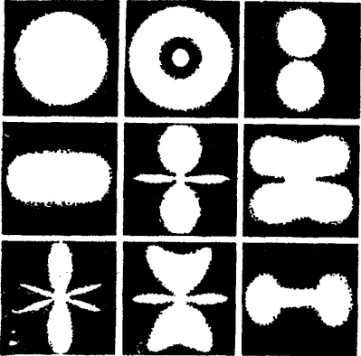

图 9

---

在这些图片中，我们看到了电子云具有不同的形状。其中有些是球形的，另一些是长椭圆形的，就像一支雪茄。这种多样性是由于：原子中电子能量不仅仅依赖于它与原子核之间的距离。

附带说一下，对于最简单的原子，如氢原子，确是如此。氢原子的核场中只有一个电子。它们之间的作用是两个粒子——它们带有符号相反、数值相等的电量——的相互作用。

这个相互作用是用库伦定律来描述的。而这一相互作用的能量仅依赖于电子与核之间的距离。这就很清楚，为什么氢原子的电子云是球形的：球表面各点与中心，即氢核，是等距离的。因此，电子云的各点都对应着相同的电子能量。

当原子中有更多的电子时，存在于它们之间的以及它们与核之间的电相互作用图画便不再象氢原子中的那样单纯。电子现在不仅受到核的吸引，它们彼此之间也在互相排斥着。

自然，在复杂原子的多电子家庭中，所有的电子都被家庭的中心——核——特别地吸引着，虽然他们之间也在闹着纠纷。自然界非常聪明地利用着这些紧张关系，并且将秩序带进原子家庭中。

从像片中可以看出这种秩序是什么样子的。这些电子云具有十分错综复杂的形状，它们以十分繁复的形式彼此贯穿着。如果我们能将这幅图画制成立体模型，并给各个部分染上不同颜色，我们会面对着这奇妙的彩色惊叹不已，是的，这是与呆板的电子轨道图画迥然不同的。

---

## § 51 单调寓于多样性之中

这幅图画可能很悦目，但若要在这茫然一片的电子云雾中找出各云层的来龙去脉，却是一件不容易的事。

让我们访问一下大自然这个原子建筑师的创作室吧，看看他是怎样建造那些微型珍宝，那些被称为原子的绚丽多彩的坚实建筑物的。

大自然手中的建筑材料包括电子和原子核。使它们结合在一起的混凝土也已知道：这就是具有正电荷的核对电子的引力。

在建筑师的创作室里，第一件引起我们注意的东西是一张巨大的图表——门捷列夫元素周期表。到今天，104个方格已被填满，也就是说已有104种化学元素被发现*。

这些就是大自然用来生产宇宙间无穷无尽的原子建筑物的蓝图。一百多个蓝图！

乍看起来，一个图一个样子。但大自然比最懂得合理化的建筑师还更节约。

首先，让我们探讨一下原子建筑师是根据什么基本原理为原子大厦添砖加瓦的。这个原理是奥地利科学家沃尔夫

---

## 岗·泡利在量子力学创始年代里发现的,因而便以他命名。

这个原理不论对原子还是对微观世界的许多其他粒子集团都同样地适用。泡利原理指出：在微观粒子的任何集团中，容许能量的每一状态所能容纳的粒子不超过一个。

当然，往后发现，这个原理并非绝对地普遍。对于某几种类型的微观粒子来说，这个原理不适用*。我们将不去讨论例外情况，因而可以声明，对于电子来说，不管它们形成何种类型的集团，这一法则绝对有效。

这里，电子集团即原子。另一个原子形成另一个集团。但对于同一种元素的所有原子来说，它们的电子家庭都是一模一样的。

## § 52 另一个奇迹——但尚未得到解释

这里我们不得不离题片刻，来谈谈电子的自旋。自旋的意义将在以后讨论，但有一件事必须说明：用经典物理学的观点来解释自旋是行不通的。自旋的发现者天真地认为：所谓自旋就是电子自身的旋转。

地球绕着太阳转动，但它还绕着自己的轴旋转。电子围绕着核转动，但它也绕着自己的轴旋转。

这难道不是再清楚不过的吗？但现在姑且把它置之脑后。

---

电子是在绕着核转动吗？肯定不是。原子内电子的运动要远远复杂得多。将这运动想象成经典意义下的转动是对真实事物的彻底歪曲。

电子真地在绕自轴旋转吗？这种说法是再荒谬不过的了。不妨想象一下，电子的轴能是个什么东西呢？量子力学不将电子视作一个球体，而将它视作一个点*。一个点的轴是没有意义的，更不用说点围绕自身或在自身之上转动了。这种描述我们是断然无法接受的。

我们似乎陷入了这样的困境：这种自旋实在无法想象出来。当然，我们也从未得到一个粒子波（电子）和波粒子（光子）的令人满意的图象。

原子中电子自旋的存在是凭借下述事实显示出来的：对于原子中电子围绕原子核运动而具有的角动量（动量矩），我们还必须增加某一个量，而这个量是属于电子的固有运动的。换句话说，这个量与电子所处的状态无关：不管电子是靠近核的，或者象在一块金属中那样处于远离核的半自由状态，或者象它在星际虚空中那样处于百分之百的自由状态中，这个量也不受任何影响。电子的自旋永远保持不变，并永远与其自身联系在一起。

看来电子的自旋既可以加在其角动量（对应电子围绕核的运动）之上，也可以从后者减去。这一概念可以表述如下：电子总角动量的两个数值似乎与电子的两个相反的自身运动

---

相对应。而这两个相反的自身运动实际上是没有任何区别的。这里实际二字具有十分确切的含义：这两种运动在原子内部具有相同的、不受任何外力影响的能量。

结果是，原子内每一容许能级可以容纳两个（而不是一个）在相反意义上自旋的电子*。

## § 53 原子建筑师在工作

现在让我们更仔细地看看陈列在原子建筑师创作室里的蓝图吧(图 10)。

第一号蓝图：氢原子。我们不去细看它了，因为这个图太简单。可是说来也有点奇怪，科学竟用了几个世纪的时间来认识这个简单的氢原子。

第二号蓝图：氦原子。这张图看来也没有什么趣味。我们刚刚说过，每个电子云可以由两个电子构成。这暗示着，氦原子与氢原子并无很大区别。模型就揭示了这点。但氦的电子云的密度要大一倍，并且更接近于核，如此而已。云里有两个电子，而不是一个。

在锂原子（第三号蓝图）中，我们看到了第二个球形电子云包住了第一个云层——氦云层。这是很自然的，因为泡利原理不允许原子的一个能层容纳两个以上的电子。

---

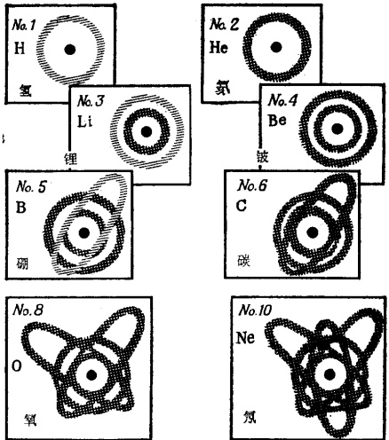

图 10 原子建筑师的蓝图展览

二层楼的另一名房客在锂下面的原子——铍中出现了。截至目前为止，原子楼的居住情况是井井有条的。

下面轮到第五号蓝图——硼。对我们的原子建筑师来说，这是个难题。首先，他必须节省原子楼的空间，同时在安插新的电子房客时，还要让他不与其他房客频繁接触。你可回想一下，原子房客彼此并不友好：他们互相排斥着。他们都尽量朝着相反的方向运动。

原子建筑师对上面的问题采取了真正的现代化措施：他又建筑了纵贯原子大厦各层楼的另一楼层，并将第五名房客

---

安置其中。显然，建筑师对这种设计是感到满意的，因为在下一张图（碳原子）中，他又在这垂直式楼层中安插了另一名房客。

往下的四张设计图并没有什么新鲜玩意儿了。除了第一个纵贯楼层外，又添了两个互成  $ 120^{\circ} $ 角的纵贯楼层。

大自然就是这样地将爱吵架的房客安置在他的小小的原子楼之中。关键是：这些房客并不打架，这点，如果想让房子稳得住的话，是完全必要的。而房子必须稳住。

上面的叙述意义在于说明自然界在原子建筑中所遵循的一个总原理。这就是最佳能量分布原理。

电子的相互排斥将大大增加原子的位能。但在自然界中，位能愈低，建筑愈稳。从椅子上摔下来不是一件有趣的事，可是摔在地上后，你却非常稳定了，因为你不再有位能了。

原子世界中也有这种力争稳定的倾向。最稳定的原子正是具有最小位能的原子。自然界在制作原子蓝图时，煞费若心去克服电子相互间的敌意，办法就是巧妙地让它们被核吸引着。

直到现在所说的原子的能量原理也只关系到原子建筑物的复杂的内部布局。但事情不仅如此。在原子大厦中，住房分配还有更加奇妙的地方。

## § 54 发了疯的原子

上面我们谈到了有关原子大厦的结构以及房屋分配的两

---

个基本原理：泡利原理以及最佳能量分布原理。

这里,电子的波性质是怎样呈现出来的?首先,我们用带电的几率云代替了电子轨道。不仅如此。原子中德布罗意波还有另一特性:这种波决定着原子建筑物的容量。

回顾一下，电子云的特征是：它容纳具有整数值的德布罗意波。事实上，这个波数不仅决定着早先的轨道数，而且决定着全体电子所形成的电子云团的密度。而这个云团所包含的各个云层，容纳同一数目的德布罗意波。

物理学家给这个云层或联合电子云层（我们知道它是由一定数量的云偶构成的）取了一个颇不恰当的名称——壳层。量子力学也为壳层的容量（即壳层所能容纳的电子的最大可能数目 N）与壳的序数 n（这数与该壳层所容纳的电子波数一致）建立了一个关系式，这个关系式具有很简单的形式

$$
N=2n^{2}
$$ 

这样，第一壳层（叫 K）能容纳  $ 2 \times 1^{2} = 2 $ 个电子；第二壳层  $ (L)2 \times 2^{2} = 8 $ 个电子；第三壳层  $ (M), 2 \times 3^{2} = 18 $ 个电子；第四壳层  $ (N), 2 \times 4^{2} = 32 $ 个电子；第五壳层  $ (O), 2 \times 5^{2} = 50 $ 个电子；依此类推。

请记忆一下这些数目。现在让我们回到原子建筑物上来。我们知道第一个须要装填的壳层是具有最低能量的最小壳层——K壳层。这个壳层在氦原子中已被填满。实际上这个壳层是一座只能容纳两名房客的平房。

第二壳层则复杂得多。它不仅包括第二层楼，而且还包括三个纵贯楼层，其中每个纵贯楼层又由两部分构成。这个

---

壳层到元素周期表第十格中的氖原子(第 10 号蓝图)，便已安置满员。

第三壳层最多可能容纳18个房客。这个壳层安置成员的方式也如第二壳层一样，到氩（第18号）住满8个便暂告截止。首先须将第三层楼住满，然后再装填三个纵贯楼层。但在氩后面的元素钾中，这一严格的秩序开始被破坏。

这里有五个纵贯楼层须要装填，但设计方案两样。与前三个壳层不同，这些纵贯楼层变得更加狭长。新房客拒绝住进这种不方便的楼层，要求更好的居住条件。

最后建筑师将它安置在第四层楼的新居内。为了不使它感到寂寞，在下面一个原子钙中又增加了另一个电子。

这无疑是最佳能量分配原理。关键是，如果一个电子居住在较高的一层楼内，而较低的一层并未完全住满，则这个原子会更加稳定。在这样的原子中，电子相互排斥造成的位能比较小。

但自然界又恢复其老制度了。从钪(第21号)到铜(第29号)，新房客又被安插在那些狭长而不舒适的纵贯楼层中。

那些楼上住着电子而楼下空着的原子具有许多不寻常的特性，因此被叫作“异常”原子。在周期表中它们不时地出现。

严格地说来，第三壳层应在镍原子(第28号)中填满。但大自然在填满这一壳层之前便已着手填下一个壳层，因此，第三壳层在锌原子(第30号)中才填满。

往后的情况也没有什么改善。一个壳层还没有填满，下

---

一个壳层便开始装填了。从钪到铜的装填方式又重复出现在从钇(第39号)到钯(第46号)和从镧(第57号)到镱(第70号)的原子系列中。从此以后直到最后一个原子(104)，所有原子的装填规律都是有缺陷的，例如，甚至有两个或三个壳层是空着的。下章就要讲到，为什么这些原子的壳层从未填满电子。

这里看起来好像有些不对称,但从能量角度来看,这种办法是再好不过的了。

这样看来，决定原子结构中的电子分布的波定律也不是全能的。波定律经常须要由另一个具有同等重要性和权威性的定律来补充，这就是原子结构稳定性定律。

## § 55 原子及化学

在离开原子建筑师的创作室之前，让我们仔细地瞧瞧元素周期表。

左侧是七个周期：第一周期2个，第二周期8个，第三周期还是8个，第四、五周期18个，第六周期32个（包括列于表的下方的稀土族或镧族），第七周期17个（前面曾说过，装填不满的理由将见下章）。

让我们再回来看看那些描述电子壳层容量的数值：2，8，18，32等等。这些数字恰好与上面所说的各周期中的元素数目相同。但为什么周期表中有些数字得到重复：2，8，8，18，18，32（目前暂不讨论第七周期）。这些重复着的数字恰好说

---

明：原子中电子装填次序在这些地方被打乱。因而第三周期以氩(第18号)而不是以镍(第28号)结束。自此往后，这种移动(以及由于违反装填次序而造成的其他移动)一直继续到周期表的末尾。

其结果，各壳层容量与各周期容量并不能准确而简单地吻合。但各周期容量不超过其相对应的壳层容量。这样，元素周期表的一个重要特征便由于量子描述而得到圆满的解释。

现在看看表的上方：这里从Ⅰ属*到Ⅷ属然后到0属。从学校的化学课里我们就学得：属代表原子价。

严格说来，这也不确切。首先，这些并不单是价，而是对氟（或者，根据某些人的意见，对氢）而言的价。其次，什么是价？

在学校里我们学得：某元素几价就是说它能和几个氢原子化合。今天，这种早期的理解属于描述式化学。这种化学只会将溶液倾注于试管中，并在本生灯上加热。理论化学早已奠定在物理学基础之上。

价——更正确点说，即对氟而言的价——表征的是原子的最外(也就是离核最远)壳层的电子数。根据这个定义，价与属的序数相符合，但周期表中的最末两行例外。这里更正确的做法是：将最末一行改写成VIII属，而将0,1,2分别标记在倒数第二行的上方。这样做是有充分的根据的。

另一问题是：为什么原子的最外壳层电子不超过8个？

---

只须回顾一下住房分配规则，就可以立即明白这点。第一壳层只容纳2个；第二壳层8个；第三壳层应有18个，但到氩已装填8个后，第三壳层的建造便暂告一段落。这以后最外壳层是第四壳层，而第三壳层(现在成了内层)也同时开始装填。第四以及其余壳层的建造也是这样进行的。

最外壳层一旦填满 8 个电子，再继续装填便有弊无利。此时一个新的壳层便会出现，而未填满的壳层则退居于原子的较深处。这个壳层是否最终能填满电子，是无关紧要的，因为只有原子的最外壳层才能决定它的化学特性。

因此，原子的化学品性只可能划分为与最外壳层电子数相一致的八种类型。在进一步探讨这问题之前，有必要指出：这个壳层填满8个电子后，要较它有全空着或半空着的楼层时位能小得多。这就意味着，具有这种最外壳层的原子是极稳定的，因而它的化学特性也是稳定的。

最外壳层填满 8 个电子的原子竟然高贵到如此程度，以致它们迥避与普通原子群众的接触。因此它们被取名为贵族，或惰族。它们占据了周期表的最末一行。

原子世界中的贵族在平民中间踱来踱去，平民尽量在模仿贵族的举止。也就是说，原子平民尽最大努力将最外壳层配备成8电子组。

由于它们不能独立做到这点，因而经常如饥似渴地寻找伴侣。结果便造成了化学家所说的反应。真的，那是一种自我牺牲：一个原子把自己的衣裳全都献给了另一个原子，而自己却赤裸裸地一丝不挂。当然这话也说得有点过头，并且

---

指的也只是氖以后的原子。

为了说明问题，让我们以钠与氯之间的反应为例。这个反应形成氯化钠分子。钠原子在它的第三壳层里有一个额外的电子。而氯原子在自己的最外壳层有一个由7个电子构成的漂亮的小组。钠原子慷慨地献出了那独一的电子，这样氯便获得了一个高贵的8电子外壳层。

但钠也同样地得到了好处。它现在也能炫示一下高贵的气态氛所具有的8电子外观。两个平民转眼间变成了两个贵族，唯一的要求是：他们两个必须作为一个分子走在一起。

这样看来，原子可以被划分为施者和受者两类。那些外壳电子在 4 个以下的为施者，4 个以上的为受者。当然，获得两个电子要比割舍 6 个电子容易得多(顺便说一下，氧原子的情况就是这样)。

在第 IV 属中我们找到了好几个懒汉。它们的最外壳电子正好是 4 个，因此它们在取舍上犹豫不决。它们获得了两性元素这样的名称，也就是说它们半阴半阳。这些元素几乎能起任何性质的化学变化。

现在看看第 VIII 属。那里我们遇到了一些发了疯的原子。它们本不该呆在那里，因为它们的最外壳层最多也只有一个或两个电子。关键是：与最外壳层紧接着的那个内壳层对最外壳层电子的行为起着显著而极为复杂的影响。其结果，这些原子能做出最难预料的事情。例如，它们的价可以变动：在这一反应中是这个价，在另一反应中则是另一个价。它们之所以被划归第 VIII 属，只是因为它们对氧而言的最高

---

价可能达到 8，也就是说，每一个这样的原子能把 4 个氧原子拴在自己的身边。

但不要以为躲在周期表其他方格里的其他的发了疯的原子会表现得稍好一些。决不是这样。这些原子耍的花招与第VIII 属伙伴的惯技如出一辙。

门捷列夫元素周期表并没有反映出这点，而我们也不能这样要求它，因为在设计该表的时候，还没有人了解原子的构造。今天科学家也不急于改变这个表，因为对异常元素的行为，我们仍有许多东西搞不清楚。如果每一件事都弄明白了，这个表也许还会有所改进。

## § 56 光谱的诞生

既然我们已经能够用量子力学的新眼光来看一个原子，因此我们也就可以懂得它是怎样辐射的。我们记得，玻尔理论对原子光谱的起源作了解释，但不能为光谱规律作出正确的描述。只有量子力学才能对光谱规律描绘得淋漓尽致。

在解释光谱起源上，量子力学与玻尔理论基本相符。原子中的电子从一个能级跃至另一个能级时，两个能级的能量差便体现在一个电磁能量子，即光子之中。当然，事情还没有完。

电子从何方跃至何方？只要保留电子轨道概念，这种跳跃是能够容易地想象出来的：仿佛电子从一个轨道或一组跑道跃至另一个轨道或一组跑道。如果能量减小了，一个光子

---

就会诞生。如果能量增加了，则临跳跃前，一个光子或任何其他场的一个能量子已被吸收。

但量子力学却用电子云代替了轨道。这样便不容易想象出电子的过渡。我们不得不将它想象成原子中电子云在形状和姿态上的瞬时变化。一个光子的发射或吸收将搅动这个原子浆糊，使其整个形状发生变化。

至于电子的跳跃，量子力学拒绝使用形象的描述；但量子力学的描述却获得了一个新的性质——几率的性质。在玻尔理论中，电子从一个轨道跃至另一个轨道总是可能的，而且这种跳跃的几率丝毫不依赖于轨道的类型。玻尔理论之所以失败就在于此。

量子力学证明上述结论是错误的。电子跳跃几率十分明显地依赖于电子跳跃前后的电子云形状。在这种形势下，粗略地说，云层重叠愈广，相互渗透愈深，跳跃的几率也就愈大。

形象地说，电子能从一种状态跳到另一种状态中去，正象旅客一样，能从一列火车跳到另一列火车上去，只要当时两列火车在并排地行驶着。把这个比拟引深一步：这位旅客必须有足够的、用来跳跃的能量，两列火车必须并排地行驶着，列车愈长（这样，彼此并排的范围愈大），两列火车愈贴近，这位旅客实现这一过渡也就愈容易。

原子中出现的事情也十分相似。这里，列车就是电子云的形状，而我们知道，这种形状可以是各式各样的：有的是球形的，有的是雪茄形的等等。

对电子云形状的研究导致颇为简单的情况。具有一个共

---

同中心(原子核)的两个球状云只有极少的相互渗透。我们甚至能有把握地说：两个云层彼此根本不接触。这就意味着：在对应的两种状态之间，电子不可能跳跃。现在将雪茄放在球体内。雪茄愈粗愈短，它们相互渗透得愈多。两个雪茄也能彼此横截，但计算将更为复杂。有一点是清楚的：一个短而粗的雪茄与一个长而细的雪茄，要较球与短雪茄能更深地相互渗透。

这样我们就能求出电子从一个球状云到一个细长云的跳跃几率，以及电子在两个细长云之间的跳跃几率。在量子力学中，规定原子内电子过渡几率大小的定律就叫作 $ \underset{\cdot}{选}\underset{\cdot}{择}\underset{\cdot}{定}\underset{\cdot}{则} $。

量子力学家非常严格地制定了这些定则：某些跳跃是容许的，另一些跳跃是被禁止的，因为它们的几率较小。但大自然并不遵守这个禁令。

轻原子中，选择定则遵守得较好，因为这些原子中的电子数量很少，云层彼此交截并不频繁，但在重的、多电子原子中，云层交织成一团，量子力学的限制或禁令大体上是不生效的。

正是在电子云的这种奇妙的、瞬息万变的颤抖中，电子的跳跃导至光子的产生。光子进入分光镜，再出来时则被整理成各种类型，并产生出具有虹的全部色彩的光谱线。原子每秒钟发射的光子愈多，光谱线就愈亮。

如果原子的数目保持恒定，则光谱线的亮度只依赖于一件事：原子中电子跳跃的频率。而我们知道，这个频率是被跳跃几率决定的。不同的云层间存在着不同的几率，有些较大，有些简直等于零。

---

每一光子能量与一定的几率相对应，前者决定光谱线，后者决定亮度。这就使原子光谱包含一系列不同亮度的谱线。

文字描述是容易的，但计算电子云的相互渗透，以及在这基础上计算电子跳跃的几率，则是十分困难的。可是量子力学出色地解决了这个问题：它获得的结果与被观察到的光谱极好地吻合。现在，光谱学大厦已奠定在花岗石般牢固的基础之上了。

## § 57 宽线和双线

看来光谱学家现在总应该满意了。但事实并不是这样。光谱分析技术发展迅速，仪器越来越灵敏，效率越来越高。可是这时光谱学家又遇到了两个新问题，等待理论家来解答。

一个光子是否和某一个频率的一条光谱线，或者和某一个波长相对应？是这样。但为什么分光镜投射在照相底片上的光谱线不是一条细线，而是一条相当宽的线？

在量子力学未出现以前，物理学家为这个天真的问题可能白白地绞了好几年的脑汁，现在只要稍稍地思索一下就行了。造成上述现象的原因是电子的波特性，而后者又是以测不准关系为其永恒的特征的。

我们说过，原子内的电子具有十分确定的能量。那么测不准又从何说起呢？开始能量是确定的，最终能量也是确定的，二者之差——这个数量与光子的能量相对应——也必定是一个绝对准确的数量。

---

可是，毫厘之失就出在这里。我们记得，准确的能级只是对电子的定态而言的，而定态是绝对不变化的(否则就叫作稳定状态)。现在电子的跳跃是对某种稳定状态的破坏。这一旦发生，海森堡关系立即起作用。

电子在两次跳跃之间寿命究竟有多长？它是可以变化的，因此命其为  $ \Delta t $。根据 § 49 中的公式，我们立即得出光子能量的不准量：

$$
\Delta E\sim\frac{h}{\Delta t}
$$ 

这里使用关于能量子的普朗克关系，我们能够很容易地进一步得出光子频率的不准量。这一不准量与原子中电子的定居生活时间存在着这样一个简单的关系 $ ^{*} $：

$$
\Delta\omega\sim\frac{1}{\Delta t}
$$ 

换句话说，原子中电子的生活愈稳定，愈安祥，光谱线就愈狭窄（因为光谱线对应的是电子向另一状态的过渡），反之亦然。这就是为什么在高温高压下，当原子中许多电子都活跃起来的时候，光谱线变宽并变得模糊不清。

第二个问题是与下面这个事实相联系的：有许多这样的光谱线，其中每一条都好象是与某单一的波长相对应着的，但实际上却是一束非常紧密地贴在一起的光谱线。由于光谱技术获得了新的进展，光谱线的这种精细结构才被揭示出来。

---

这样看来,电子在相同状态之间的跳跃能产生不同的一尽管差异十分微小的——光子。因此,如果说物理学家能准确地决定原子中电子的能量,那只不过是一句空话。

物理学家曾经愤慨地拒绝过有关测不准的猜想，但为此他们不得不提出有关自旋的假说。自旋的发现恰好是光谱的精细性质引起的。

事实证明，在产生光谱过程中，具有相反自旋的两个电子所处的共同状态并不真是共同的。如果我们在这里去描述电子的角动量与自旋之间的复杂关系，我们将扯得太远；有关这个问题以后还要谈一些。但我们能够说：这种复杂关系决定了自旋不同的电子具有稍微不同的能量。这就是为什么会出现双光谱线：代替一条光谱线的是一对具有相同亮度的孪生光谱线。

实际上，只是当最外壳层仅有一个电子时，这种孪生光谱线才会照例地出现。如果这一壳层有更多的电子，则原来的一条光谱线将包含三重线、四重线以及更大的线族。原子世界与人类家庭不同，在原子世界中这种现象是很平常的。

以上就是量子力学对光谱学家的两个难题所作的回答。

关于原子的故事就讲到这里。下面我们将要谈谈原子的家庭生活——分子和以晶体形式出现的整个原子军团。

## § 58 原子结婚了

回忆一下平民原子是如何在模仿惰性元素的贵族原子

---

的。一对对的平民原子共享着华丽的外衣。有时候，三个、四个、甚至更多的伙伴加入进来。

从远处看去，这个花招还是耍得不错的。整个分子有时也象一个惰性元素的原子那样，在原子群中泰然自若地穿过。但近处一瞧，骗局便被戳穿。

在分子里，这些成员已经不再是原子了。它们之中有的衣着过奢，有的衣不蔽体——前者叫负离子，后者叫正离子。电子衣裳重新分配以后，失去衣裳的原子不让得到衣裳的女友溜掉。这个衣裳褴褛的伙计是不喜欢孤独的。这样结合起来的分子，用科学术语来说，就叫作离子分子。这种分子中的结合力，主要就是具有不同电荷的离子间的一般电吸引力。至此，量子力学还没有什么事可做。

离子分子是多种多样的。这里，周期表左边的原子和右边的原子相结合。原子愈是靠近表的两端，结合成的家庭愈是牢固。如果原子出身于表中互相靠近的属，则这种婚姻是不牢靠的。

但还有同样多的分子，它们中的原子出于一种全然不同的理由结合在一起。这样形成的家庭最简单的就是氢分子。这类分子包括所有的单元素分子(例如氧、氮、氯分子)以及那些分子，它们的原子要么都属于门捷列夫表的左面，要么都属于它的右面。这些分子就叫作共价分子。

这里便须请量子力学来解释它们的存在了。设想一个氢原子遇到了另一个氢原子。他们就像两个单身汉，嫉妒那些有家的人。一个说：“把你的衣裳给我吧，这样我们就能形成

---

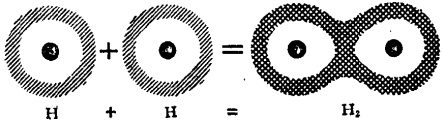

图 11

一个分子啦。”

另一个骄傲地反驳说：“我也同样有权向你提出这样的要求哩！”

“把衣裳交换一下，怎么样？”

“这哪里能行？我们俩的衣裳是一式一样的呀。”

就在这时候，一直在旁听着的原子建筑师——他现在不建造原子而建造分子了——走上前来，建议道：“你们还是合伙吧！你们的家底都不厚，谁也别想制一套贵族式的8电子衣裳。让一个电子一会儿在这个原子中住住，一会儿在那个原子中住住，另一个电子也可以照着干。”

“这怎么行呢？”他们齐声喊道：“交换电子的主意我们早就考虑过了。”

“你们怎么糊涂了呢？你忘记了这样办一个原子将不时地拥有两个电子，与此同时另一个原子却一个电子也没有。这样你们看起来就像两个带有不同电荷的离子。在离子分子中，一个原子献出了电子，另一个原子获得了电子，因此分子中的原子几乎任何时候都是离子化了的。可是对你们来说，只须交换一下电子就行了。一会儿让电子绕着你转，让他光着身子；另一会儿再反过来。”

---

“我们将要多快地交换着电子呢？”他们问道，这时有些跃跃欲试了。

“相当快！”建筑师说。“如果使用玻尔的‘半经典’语言，我会说，电子大约在一个原子中旋转一周后就会跑到另一个原子中去。它好象溜了个8字花样。”

“好吧！让我们试试吧。”原子说。

结果是，一个很好的、很牢固的家庭建成了。只有量子力学才能揣摩出大自然的这种巧妙安排。至于这种导致分子形成的相同原子间的相互作用，量子力学家很正确地把它叫作“交换相互作用。”经典物理学绝不可能想出这样的点子。

量子力学是这样来描述电子的交换的：只要原子之间保持一定的距离，它们的电子云就不会重叠；但当这些原子彼此足够靠近时，电子云就有相当大的一部分互相交织，这就使一个原子的电子接近另一个原子的核的几率，即交换几率，明显地增大。

这个几率究竟有多大呢？对氢分子来说，约为15%。换句话说，在每一小时内，有10分钟的时间两个电子全都在氢分子的某一原子中，而另一原子此时则一个电子也没有。

但这个几率足够使两个原子牢固地结合在一个分子之中吗？英国科学家海特勒和伦敦运用量子力学进行计算，结果是肯定的。真的，这里理论与实验极好地吻合。

在分子世界里，通过电子交换来组织富有原子和贫穷原子的协作是司空见惯的。

例如，氮原子（第7号）只有7个电子。在内层的两个不

---

参与交换。但在外层的5个电子则嫁给了其他的原子。

氮下面的一个原子是氧。每一个氧原子中有6个电子是用来进行交换的。这样便形成了一般的双原子氧的分子(图12)。在三原子氧(臭氧)中，18个电子组成了联盟。为了使交换简便易行，三个原子构成了一个三角形，这样就可以缩短电子的行程。这三个原子将电子抛来抛去，就像排球运动员站成一圈进行排球练习似的(图13)。

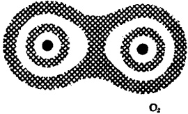

图 12

图 13

这种分子结构不再象它的成员——原子的构造了。楼层以及房客的安置也不一样了。所有这些使分子的特性与构成分子的原子特性迥然相异。

## § 59 固体真坚固

道路一拐，新的景物，同时也是我们最熟悉的景物，展现在眼前：这就是我们四周俯拾皆是的固体。都是旧相识，可是这里蕴藏着的奥秘却仍然使科学目瞪口呆。

---

二十世纪初，物理学在固体特性方面已经积累了可观的资料。我们知道，固体分晶体和非晶体，它们以各种不同方式导热导电，光与声在不同的固体中的传播也不同。但这门名叫固态物理学的学科，解释其中任何一个特性都有巨大的困难。

但这又是非常重要的,因为迅速发展着的技术,正在利用各种新的天然材料。需要量是如此巨大,以致不得不求助于人造材料。

我们需要具有高硬度、高导电性、高耐热性以及其他许多特性的各种材料。但从哪里取得这些材料呢？一种办法是对所有已知材料使用通常方法进行某种结合——这实际上是一种炼金术。这里还有另外一个办法，但它须要利用量子力学。

这方面，仅仅在几年的时间里，就有一个突破。这方面的尝试是从理解晶体——主要是金属晶体——的结构开始的。

从晶体下手是最好不过的了。晶体是原子在空间中的有秩序、有节奏的分布，它的形状就象格子*。但一般的格子是平面的，而这种格子是立体的。在格子中，晶体的原子彼此保持着固定的距离：这就叫格距**。在一般情况下，晶体有三个格距，对应着格子的三度：长、宽、高。

自然界里，纯粹的元素是不寻常的，更常见的是它们的化合物。这种晶体格子是由几种类型的原子构成的。一个简单的例子就是冰结晶：它具有氢原子和氧原子。这里，与水的

---

分子式相一致，氢原子的数目是氧原子的两倍。

另一个例子是氯化钠(NaCl)晶格。在格子交接处，即节点上，交替地安置着钠离子和氯离子。注意，它们是离子而非原子。这是很重要的，因为当食盐分子凝聚成固体时，原子键的离子性质仍然保留着。

这样，食盐便不再作为分子存在了，因为那样的分子不能被分离出来。真的，每个钠离子都被氯离子围绕着，而每个氯离子又被钠离子围绕着。因此，你哪里还能找到那个食盐分子呢！

在这样的晶体里，作用在离子间的力就是一般的电力。一个钠离子吸引着最靠近的氯离子。这些氯离子反过来又吸引着其他的钠离子，但却排斥着附近的氯离子。引力和斥力的相互作用导致了离子构型的某种平衡。这个构型就是晶格。

这种排列的确平衡而且稳定。如果某个离子被轰击而偏离原来的位置，这个离子对不同离子的引力便会减弱，可是同类离子对它的斥力却大大增加。这两种力量的联合行动迫使离子返回原来的位置。

严格说来，由于热运动的不规则撞击，每个离子都时刻在相对其平衡位置振动，就象一个被几根弹簧拉着的小球那样。离子在晶格内的热振动决定固体的许多重要特性。

就像在离子分子中一样，量子力学在离子晶体中也没有很大的用武之地。但这时物理学又转攻金属晶体，因为后者在现代技术中是最重要的。

---

这里情况却十分不同了。假设整个的格子是由单一金属，即同一种原子构成的。很自然，离子的电荷没有差别。那么当一个原子轻率地抛弃一个电子时，其他原子为什么也统统效尤呢？

情况果真是这样的吗？量子力学回顾了它在氢分子上所获得的新胜利。如果金属晶体真的是由多少亿亿个原子组成的一个巨大的共价分子，情况难道不正是这样的吗？

这个聪明的想法证明是正确的。大自然也并没有什么更多的新花招，也不能从容地应付各种局面。大自然在两个原子间所施展的电子交换技俩效果不错，因而便把这一诀窍扩大到更庞大的电子集团中去。

更何况这样的安排也不是很容易、很简单的。以后还会有很多机会证明：甚至对量子力学而言，固体也是难以攻破的碉堡。

## § 60 晶体的骨架和多层结构

当金属原子结合成晶体时，它们确实将最外层（价）电子化为公有。这就导致晶体的某种骨架结构的形成。位于格子节点上的是缓慢地移动着的离子，它们的周围环绕着共同的一层薄薄的、易动的电子云。这云层起着将带有相同电荷的敌对离子结合在一起的胶接剂的作用。反过来，离子也是胶接剂，它们使电子不致飞向四方。

我们曾经说过：金属中的电子几乎是自由的。由于每个

---

原子都对公共福利作出了贡献，因而一个电子不再是某一个原子所私有的了，而却是众原子的亿万公仆中的一员。这样的电子可以在晶体内自由地游荡着——一个微观的费加罗 $ ^{*} $。

当然，不是所有的电子都这般地自由。每个原子只献出一个或两个电子，而将其余的电子紧紧地束缚在原子中原来的地方。尽管如此，自由电子大军也是极为庞大的：每立方厘米的金属内有 $ 10^{22} $到 $ 10^{23} $个。

如果允许打个比方的话，可以说金属晶体的社会组织比离子晶体的要好；因为后者有些象奴隶制，在那里所有的电子都被用锁链系在原子上。金属则更接近于封建制度：农奴主给他的农奴少许自由以榨取地租。这一进步立刻给金属以一些新的特征，并使它能够传导电流。

如果将一个普通的电场施加于一个离子晶体上，后者的电子云布局只会稍稍改变：它们将变得细长一些。这样就造成了所谓晶体的极化。没有一个电子能摆脱它的离子，而离子本身也如从前一样，被死死地拴在节点上。由于没有电荷的自由携带者，因而也就不能产生电流。离子晶体是绝缘体。

在金属中，大量的电子正准备用自己携带的电荷造成一个很好的电流。

但半导体又应安排在哪里呢？稍后一些它们就要出现。

现在我们先研究一下量子力学为金属确立的一个重要事实。这个问题是：金属中好似集体化了的电子具有什么样的

---

能量？答案是简单的：不再束缚于原子之上的电子似乎能够具有任何能量。我们记得，对于自由电子而言，它们的能量水平失去量子性质。

但不要过早作出这样的结论。当然，电子已经离开了自己的原子，可是它们并没有离开这块金属。它们不再遵守原子的规律；但对于作为一个整体的这块金属而言，还有一些总的规律在制约着整个电子集体(虽然不是某一电子个体)的活动。

现在看看这些规律。你记得原子的规律是从解薛定谔方程得出的。因此，在探索金属（金属晶体）中的电子活动规律时，物理学家也依样画葫芦。他们为周期性电场内的电子活动解出薛定谔方程，而这个周期性电场，就是以固定间距分布在金属晶格节点上的正离子造成的。

这里先扯一点题外的话。截至目前，当我们谈到一个原子对邻近原子的作用时，我们似乎总想到某些外部的表现。例如，原子彼此吸引而形成分子。

可是，与此同时，在原子自身的内部又发生着什么呢？事实证明：原子内部电子云在改变着自己的形状。在量子力学得到充分发展之前，德国物理学家斯塔克就发现了这个现象。斯塔克发现：当强电场施加于一块材料上时，它发射的光谱线就会分裂。

这种分裂与前面讨论的孪生光谱线毫不相干。但它们之间却有某些共同的地方，这点已被量子力学证实。这种光谱线的分裂是与原子中电子能级的分裂相对应的。

---

概括地说，施加于原子的电场将使电子的能级破裂。而当一个原子足够接近另一个原子时，这个原子的电场(在此情况下已相当强)的作用，与上面所描述的电场的作用，并无任何本质上的差别。

当然，在分子形成的过程中，与构成分子的原子相对应的能级便消失。各能级自身破裂，互相掺合，能量水平起伏变化，这样便产生了对应着整个分子的所谓分子能级。

关于分子的上述情况，在晶体中表现得更为明显。在晶体内，巨大数目的原子紧密地结合在一起，而这种结合方式在整个晶体内都是一样的。真的，一个晶体无非是一个庞大的冻结了的分子。

这个分子的全部原子所形成的共同电场将每个原子的能级分裂成巨大数量的、层层紧挨的支能级。这里，外电子容许能级划分的分立性和明确性几乎全然消失。因此看起来晶体中的电子能够具有任意的能量。

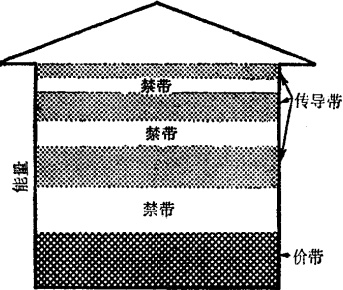

图 14

---

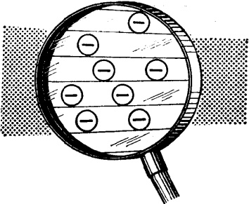

图 15

于是便出现了一个奇观。看一看图 15。我们刚才作的关于电子可以取任意能值的结论虽然能够成立，但还有一个非常重要的例外。空白带表明金属内的电子不能具有的能量。对应这些能量，波函数取零值；也就是说，电子在这种状态下出现的几率等于零。能量的这种空白带叫作禁区或禁带。

即使在阴影区，即所谓的容许带，电子也不许可取任意能值。如果我们将容许带抽出并放大于纸上(图15)，我们就会发现：这一阴影区又划分为不同的能级，但后者的层次是如此之多（回顾一下每立方厘米的金属所包含的电子数是多么巨大），以致可以认为它们已经融和成一个连续的序列。

再看看电子是怎样定居在不同的能级之中的。许多鸟儿能停留在同一根架空电线上，但电子却绝不能这样做。泡利原理不允许它们这样做。这位严格的检查官在金属里，正如

---

在原子中一样，毫不疏忽他的职守。泡利原理声明：金属的容许带中的每一支能级只许容纳两个电子。地方是很宽裕的，支能级的数量也绰绰有余。金属内永远存在着很多额外的生存空间。在正常条件下，一块金属中所有的电子能定居在最低的容许区，即一楼里。

再往下就是一个地下室，在那里麇集着所有的未集体化的电子：它们属于各个原子而不属于作为一个整体的金属的众原子。地下室与一楼并非隔绝得水泄不通，那里有个梯子将它们联系起来。但这个梯子只有一个梯级，它的高度等于第一禁带。如果电子受到足够有力的轰击，它便会从地下室跳到一楼。因为，正如上面所说电子不允许逗留在禁带中，因为这个带没有能量*。

物理学家给这个能量地下室取名为价区或价带。所有的容许带取了一个总称：传导带。这些名称的来历是一目了然的：地下室居住着决定价的那部分外围电子(虽然这些电子还没有得到自由)，而一楼和楼上则居住着参加电传导的电子。

## § 61 绝缘体也能导电

当然，绝缘体将所有的电子都囚禁在地下室内。在正常条件下，它们的传导带是空着的，而第一禁带又那样宽，以致任何电子也找不到足够的能量跃过它。但当绝缘体适当加热

---

后，晶格节点上的离子振动能量将变得非常大。这个能量能被传递给电子，因而它们有时就能获得足够的能量腾跃到传导带。于是绝缘体开始导电。这就叫热致击穿。

当然，解释这种击穿现象并不须要量子力学，因为这种现象只意味着电子已经冲破原子的狭隘天地，进入了传导带，成了几乎自由的电子。解放这个电子所须的能量，正好与隔开地下室与一楼的禁带的宽度相等。

这种情况可以描述如下：热撞击将电子从它的原子中抛出，使后者电离；而被释放的这个电子现在虽然可以自由地运动，但仍然不能脱离这块绝缘体。

但当一个十分强大的电场施加于绝缘体时，它也同样变成一个导电体。且慢。这是否与上章所讲的金属电子冷发射相同呢？但绝缘体又不是一块金属，而是一个离子晶体！在金属的电子冷发射过程中，电子完全脱离了金属，而这里，电子只从价带跃至传导带。

虽然存在着上述差异，它们毕竟是同一现象。两个例子

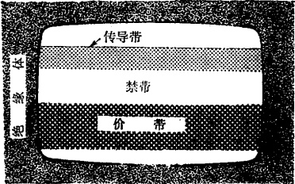

图 16

---

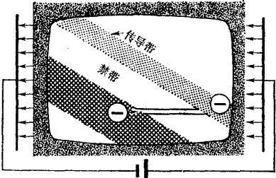

图 17

都揭示一个奇迹：隧道效应。当然，如果禁区不是一个位垒的话，它还能是个什么呢？是的，它就是一个具有实际上是无限宽度(当然对电子来说)的位垒。它就是一个只有前壁的台阶。电场，如前所述，将禁带(位垒)偏转，使其出现了一个后壁。结果是，位垒获得了一个有限宽度(图17)。

其余的则与金属完全相同。电子开始从价带渗过位垒而进入传导带。起初电流很小：穿越的几率是很低的，只有少数电子进入传导带。但当这个电流出现在晶体内时，就会使它发热，就象电流使电炉丝发热一样。这个加热过程反转过来又为传导带增添了新的电子大军，因而绝缘体内的电流自动上升。在极短的时间内绝缘体将被电击穿。而这一现象又伴随着热击穿-绝缘体融化。它已不再有用，因此必须扔掉。

但也可以用比较缓和的方式使绝缘体内产生电流。这种电流极为微弱并且绝对无害。这种电流是用照射离子晶体的方法产生出来的。光子轰击晶体，把电子从价带中抛至传导

---

带。这是一种真正的光电效应，但却没有电子的发射。可以说这种发射完全是在绝缘体的内部进行的。晶体不会被损坏，因此它能够得到各种实际应用。

## § 62 电是怎样在金属内流动的

在二十世纪里，谁都不好意思提出上面这个问题。

电子离开电源，在电场的驱动下沿着导线运动，然后再进入电源——这一切不正象水被泵入水管中那样吗？

但是我们不必为提出这个问题而感到害臊。电的阻力是那里来的？导体不是水管，它的壁也并不粗糙。既然金属充满了那么多的电流运载者，它为什么又对电流产生阻力呢？

正如其他许多天真的问题一样，它的答案很不简单。电流已被发现一百五十年之久，大约在三十年前，问题才被弄清楚。

下面是经典物理学对电阻的解释。电子的定向运动——即我们所说的电流——在任何时候，都被金属骨架内离子的热振动所困扰。这些振动妨碍着电子的运动。在发生地震的时候，建筑物的墙壁、地板上下颠簸，左右摇晃，同时在剧烈振动，建筑物里的人群开始瞎跑：金属中产生电流的时候，电子的运动也是这样的。

显然，墙壁和地板的振动愈小，在建筑物里走动就愈容易。在绝对温度零度下，离子的热运动完全停止，电阻也应当下降到零。对于几乎不含杂质的非常纯的金属来说，上面讲

---

的很接近事实。但问题完全出在这些杂质上面。温度下降时，这些不洁净的金属的电阻并不趋近于零，却趋近于某个依赖于金属中杂质的含量和类型的非零值。杂质愈多，这个剩余电阻也就愈高。

对这一问题经典物理学有什么可说的？无话可说。经典物理学不把金属原子和杂质原子区别开来。在同一温度下二者以相同的方式振动，因而也就以完全一样的方式阻碍着电子的运动。

这里量子力学的见解确实略胜一筹。晶格中的不同原子彼此显然有区别，就好象它们真的具有不同的颜色。那么我们又如何去解释电阻呢？

首先，必须回顾一下那个精采的电子对晶体的衍射实验，我们有关量子力学的讲话就是从它开始的。在那个实验里，电子撞击晶体原子的外层，部分地被反射并在照相底片上形成衍射环。

难道我们不可以把金属里的电子流看成一束电子射线吗？当然可以。这里，电子朝着一个总方向流动，若作射线来看，它无非比较粗壮，占据了金属的整个截面而已。这就必然导致下述情况：电子在金属内通过，应该产生对晶格离子的所谓内衍射。如果我们能将照相底片放置在这块金属之内，我们也应该能够得到一个衍射图样。

衍射具有一个有趣的特征：对波产生散射的物体只要形状稍稍有点不规则，轮廓分明的图样便消失，照相底片上将均匀地形成雾翳。照物理学家的说法，在这种情况下，这些波的

---

散射已变成均匀的。

金属晶体的整齐结构，也会由于离子的振动和杂质原子的存在而产生不规则的变形。其结果，形成电流的电子的波向各个不同方向散射。

一般说来，杂质原子的体积和电子壳层与金属原子的大不相同。杂质原子使晶格变形。如果将比喻引深一步的话，可以说，杂质原子将大厦的走廊弄曲，墙壁弄弯，并使地板走形。很明显，即使地板和墙壁都已停止振动，这些缺陷也将依然存在。同时也很明显，杂质原子造成金属晶格的畸变是与温度无关的；即使在绝对零度下，这种畸变也依然存在。电子波在这些晶格缺陷处的散射，就是金属剩余电阻的原因，而对经典物理学来说，这简直是不可思议的。

由此可见，作为电流的导体来说，金属是远非完善的。当然，不是说所有的金属都是这样，也不是说它们在任何情况下都是这样。自然界感到有必要提供一些传导性能更好的东西，因而创造了超导体。

一些金属和合金——目前为数仍很少——在极低温度下表现很异常。在绝对温度约10度的条件下，这些材料几乎丧失全部的电阻。这个早在半个世纪以前就被发现了的现象，现在叫作超导性。

经典物理学不能解释这个现象。有趣的是，甚至卓越的量子力学也惨淡经营了三十来年，才对此提出了一个合理的解释。

超导性之谜直到几年以前才被揭开。为此作出重大贡献

---

的是苏联物理学家波格留波夫和他的学生。进一步谈论超导性将扯得太远。这里我们只尝试作些粗枝大叶但又生动形象的比拟。

奇妙的超导性是由下面这一事实引起的：在接近绝对零度的极低温度下，好几种金属的电子云和离子骨架之间的相互作用，由于金属结构的某种不寻常的特性而产生急剧变化。在这以前，电子大军的每一士兵都在单独作战，而在超导性的低温状态下，电子结成了对子。

在电子与离子的战斗中，上述变化立即产生效果。在此以前，单独与离子作战的电子很容易被迫退出现役，而现在电子小组可以满不在乎地抵挡住这些单个离子的进击。看来电子好象对来势汹汹的离子的包围不再介意了。电子大军的困难大大减少了。最后，金属对电子的阻力便土崩瓦解。

用物理学的语言来说，这种新型战斗的特点是：对应金属内电子运动的波长的数量级现在要比离子的间距大几千或几万倍。如果你细心地阅读了本章的话，这些新战术的秘密便会了若指掌：电子对的波长要远远超过道路上的离子障碍物的线度，因而在正常条件下伴随金属中电子流动的那些单个电子的散射便消失，这样电阻也就跟着一起消失。

电子大军的这种理想组织只有在温度足够低的条件下才能保持。当温度上升到某一极限以上时，离子与电子的冲突便会打散这些电子对，使电子又复成为散兵游勇。力量的对比发生了变化，金属的电阻又恢复。

这样看来电是怎样在金属内流动的这个问题还是值得一

---

## § 63 奇妙的半导体

在自然界里,大量的东西既不属于电流的导体,也不属于绝缘体,而却属于半导体。

它们的“半”或中间特性已经证明是非常有用的。半导体问世才几十年，可是它已促成了一个真正的技术革命。它们所具备的特性是人们所熟悉的：与绝缘体不同，半导体能在室温下导电；与导体又不同，随着温度的上升，它们的电阻不仅不增加，反而降低。

自然界曾在绝缘体、半导体和导体之间划了一条鲜明的界线。事实上我们已经知道它们之间的鸿沟究竟是什么。那就是位于充满电子的价带和包含许多未被电子占据的支能级的导带之间的第一禁区。

对于绝缘体来说，这一禁区很高，因此电子从地下室爬出，越过禁区而跃入一楼所须的能量也就很大。这个能量只有在高温下才能获得(回忆一下热击穿)。

在半导体内这一禁区低得多，电子跃入一楼所须的能量可以在室温条件下获得。这就是半导体能在常温下导电的原因。

换句话说，即使对半导体施加一个很弱的电场，它的传导带里也会产生一个定向的电子流。现在让我们看看地下室里发生些什么。

---

在地下室里，事物也在发展着。关键是：当电子从地下室出来并进入一楼时，它留下一个空房。拥挤不堪的地下室开始调整住房。可是现在只允许一个电子迁入这个空房，因而近水楼台先得月。最邻近的一个电子立即迁入。但它照样也留下一个空房，后者又被另一个电子占据。

这些地下室的电子向一楼里的自由运动电子学步，可是它们只会从一个房间跳至另一个房间。真有点象只袋鼠在学人跑步哩！跑步的人作短而快的跳跃，从远处看去，就好象他在以匀速行进。袋鼠却不然，它的步子大而少。

我们不妨作这样一个比喻：城中心有一个电子刚刚搬了家，其他电子争占空房，结果空房一步步移向城边。

电子的这种行宫被取了一个相当不体面的名称——空穴。空穴的作用与离开空穴的电子的作用恰恰相对立：在电场中，空穴就像一个带正电的粒子，向相反的方向运动。另一个不同点是：它的跳跃间距大而节奏慢。

在低温状态下，所有的电子都被严密地囚禁在地下室里。当然，随着温度的升高，越来越多的电子被释放。其结果，电流增大，半导体的电阻降低。而对金属导体来说，情况恰好相反。

以上只讲了纯粹的半导体。这种电流的作用过程叫作内导性 $ ^{*} $。当然，对技术专家来说，纯粹的半导体是没有什么趣味的。半导体所显示的全部奇迹都是与所谓杂质同来的。

---

## § 64 有用的“灰尘”

灰尘、杂质——在不受控制的情况下是坏东西，但如果以准确的比例出现，则真是很好的东西。半导体与一般的物体并没有什么两样，它们也会弄脏的。各种杂质都可以进入它们的晶体内，这些都是偶然的，不受欢迎的。但有些杂质，如果使用的剂量受到严格控制的话，则会是非常有用的。它们也就是那些创造奇迹的灰尘。

对烹制雌鹅来说是美味的调料，对烹制雄鹅来说则未必如此*。如果你想得到一个具有高导电性的金属，任何杂质都是有害的。理由是：杂质混进晶格以后将会使它变形。这些变形或缺陷，将要使携带电流的电子的波产生散射。其结果，金属的导电率下降，电阻上升。

但这些晶格上的缺陷正是半导体成功的关键。事情是这样的：晶体的能带结构对晶格类型反应极为灵敏。每一种晶体都有自己的能带系统。

当然，杂质原子也并不改变晶格的形状，而只改变最邻近处的形状。在这些区域内，整个晶体所共有的能带型式将有显著的改变。情况是这样的：在隔开价带与传导带的禁带中又出现了一些额外的容许电子能级。这些能级只是当晶体内含有杂质原子时才会产生。为了与半导体的整个晶体内的能

---

级区别开来，它们被叫作本地能级 $ ^{*} $。

金属中杂质的含量也影响着导电性能，但这种影响总是单调的——杂质愈多，导电率愈低，虽然后者的变化范围是相当小的。可是对半导体来说，导电率不仅随着杂质原子的数目而变化，而且随着杂质原子的类型而变化，而这种变化可能是千百万倍！

## § 65 又慷慨又贪婪的原子

目前最普通的杂质半导体是以锗和硅化学元素为基础的。看一看元素周期表：硅是第14号；锗，第32号。它们都居于第Ⅳ属。你还记得我们是怎样称呼这一属的吗？我们把它叫作中间派。确实如此。锗和硅既非导体，又非绝缘体，它们是典型的半导体。

这两种原子的最外壳层，都同样容纳着4个电子。当原子构成晶体时，所有这些电子就形成了这些原子和其他一些原子之间的键。它们是地下室里的奴隶。因此在低温下，硅和锗不导电。

但让我们在储里加进一点邻近的某种原子，例如第 V 属里的砷（第 33 号）。这些砷原子往往喧宾夺主，撵走锗原子，并取代其在晶格中的位置。每个砷原子这样做之后，必须行使那些被逐的锗原子的职能。

---

砷原子的最外壳层有 5 个电子。其中 4 个将用于形成化学键——这个键本是晶格中被撵走了的锗原子的键。而第五个电子呢，却失业了。

计算表明：这个电子的能量恰恰与禁带里的本地能级相对应，但靠近上限。只须很小一点能量——它要比禁带本身的高度小10至15倍——就足以将这个电子推进传导带中。

砷原子在处理这个额外电子上是十分慷慨的。它将这个电子捐献给晶体的电子群，因此它就叫施主。相应的这些电子能级就叫作诸施主能级(图 19)。

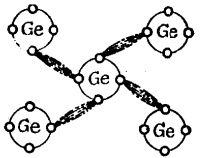

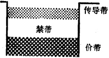

图 18

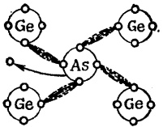

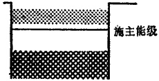

图 19

现在让我们用锗左侧某属中的元素，例如硼（第5号），来代替砷。硼在第Ⅲ属中，这就是说它的最外层电子只有3个。当硼取代晶格的锗原子后，它只能接管4个化学键中的3个。

情况发生如下：硼原子从邻近的锗原子中偷了一个电

---

子。这一偷窃行为就像是个传染病。错原子又从它的近邻那里偷了一个电子，后者又照此办理。这个空着的电子室便离开第一个被盗的错原子越来越远，

(图 20)。

这是我们很熟悉的一个图，

它与空穴的迁徙十分相似。唯一的区别在于：将电子从价带抛掷出去的不是温度，而是硼原子的存在。

在这一过程中我们同样发现：靠近禁带底部也形成了一些本地能级。不同的地方是：占据本地能级的不是电子而是空穴。

因而本地能级中的这些原子，就像绷这个小偷一样，被叫作受主。相应的那些空穴能级就叫作诸受主能级(见图20)。

这样，与锗或硅晶格内不同类型的杂质原子相对应就有两种

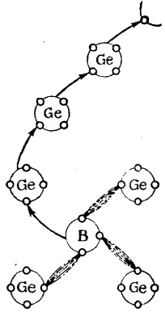

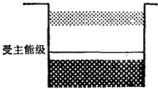

图 20

不同类型的电传导——电子传导或空穴传导。

这里再次要求读者记住：空穴只是用来描述电子运动的一个权宜之计。如果你愿意的话，也可以把空穴的运动设想成电子的运动 $ ^{*} $：电子在拥挤的价带内就象袋鼠似地从一个

---

原子跃至另一个原子。与此相较，传导带里的电子则更象一个长跑运动员，举着短促而轻快的脚步平稳前进。我们说过，传导带里的电子能级也是彼此隔开的，但能级间的距离是如此地狭小，以致可以认为这些能级实际上已经融合成一体。

现在回到本题上来。让我们试将硼与硅同时掺进锗中。这样锗将获得什么类型的传导？这显然要看两种杂质原子数量的比例。如果硅较多的话，传导将是电子性的；如果硼较多的话，传导将是空穴性的。

由于混合比例不同，半导体便获得了不同的重要用途。具有上述两类杂质的半导体，能够使一个方向的电流停止，而让反方向的电流通过。这意味着，这样的半导体就是整流器。

半导体的另一功用是将小电压转变成大电压（这还是由于它们具有调节电阻的能力）。这就是说，它们可以用作放大器。

这些体积小、紧凑、坚固而经济的半导体元件对大而笨重的电子管来说，早已显示了无可比拟的优越性。

光子射在半导体上时，会将电子从价带轰至传导带。因此当半导体受到照射时，它所在的电路内就将出现电流。这说明半导体能将光能直接转化为电能。半导体制成的光电元件已经得到应用，其效率比金属的还要高。

这一领域内的工作是由苏联物理学家约非和他的同事开创的。

硅蓄电池在沙漠地区能将灼热的太阳光流转化为电，后

---

者将驱动灌溉系统里的电动机，把水引向大地的干旱角落。半导体蓄电池在宇宙航行中也已得到应用。

半导体也能将热能直接转化为电能。庞大而笨拙的热电站系统不再需要了，在那里，热首先要把水转化为蒸汽，蒸汽驱动着与发电机转子相联的涡轮。这种设备已经过时，总有一天它会彻底绝迹。与此相较，半导体已经作为温差发电机而得到应用。这种发电机能将煤油灯的热转化为电。用半导体制成的电冰箱没有运动部件。

但这些只是个开始。一个灿烂的未来正在招唤着这些奇妙的小晶体。

---

# 第五章 原子核的内部

## § 66 开场白

原子、分子、晶体……现在又该讲什么呢？

量子力学将领着我们去游历原子核的深处。那里还有许多奇迹将被揭示出来呢。

在二十年代，谁也想象不出，对原子核的探索能搞出些什么名堂。但物理学家的好奇心总是很重的，而原子核又蕴藏着许多奥秘。在那些年代里，量子力学正在庆贺自己在原子战斗中的最初的胜利，可是原子的核心却仍然深深地隐藏在五里雾中。

这里我们先谈谈，当时有关原子核的点滴知识究竟包括些什么。在十九世纪的最末年代里 $ ^{*} $，法国人贝克勒耳十分偶然地发现某些物质能使照相底片感光。接着居里夫妇发现：周期表末端的三种化学元素——镭、钋、铀都具有这种特性。

这种现象就叫作放射性。在那些日子里，理论家因为经典物理学不能对此作出解释而感到很尴尬。与此同时，有关神秘的放射现象的新事实却逐渐积累起来。这些事实表明，

---

放射线有三种类型： $ \alpha $、 $ \beta $、和 $ \gamma $射线。

进一步的研究证实： $ \alpha $ 射线是由带正电的粒子构成的。一个  $ \alpha $ 粒子的电荷是电子的两倍，其质量约为氢原子的四倍。 $ \beta $ 射线与电子束没有区别。 $ \gamma $ 射线，物理家学说，是一种极硬的电磁辐射，它的穿透能力比记录的保持者——X 射线还要大许多倍。

又过几年以后，英国物理学家卢瑟福与他的学生玻尔合作，详尽地描述了原子的行星模型：在原子中，电子就象行星一样围绕着它们的太阳——原子核旋转。这样越来越清楚：放射现象起源于核。

对于  $ \alpha $ 粒子来说，这一点从开始起就是显而易见的：在原子中，除了包含几乎原子的全部质量的核以外， $ \alpha $ 粒子再找不到其他任何容身之地了。另一方面，电子却存在于核外的原子壳层之中。同时光子（电磁能量子）也经常地从这些壳层中飞出。可能  $ \beta $ 和  $ \gamma $ 射线就产生于原子的电磁结构。

否。这分明是不可能的。当原子放射  $ \beta $ 射线时，它并未离子化，它并未获得电荷。这就是说它的电子结构保持不变。电子在壳层间跳跃产生可见光和 X 射线光子；进一步计算这些光子对应着的能量表明：这样的能量只占  $ \gamma $ 光子能量的一小部分。这进一步支持了如下的理论： $ \beta $ 和  $ \gamma $ 射线的放射起源于原子核内部。

几年以后，卢瑟福又给理论物理学家一些新的供人思考的食粮。在镭的  $ \alpha $ 射线经过的路径里，卢瑟福放置一些氮原子核。记录  $ \alpha $ 粒子与氮核撞击的照相底片呈现了氧核的痕迹！

---

炼金术士的梦想实现了：化学元素的转化已经发生，尽管采用的不是化学方法。

就在这一年，卢瑟福观察第一个核转变的同时，发现一种化学元素的原子核能够具有不同的质量。计算表明：这些不同质量间的差数与一个氢原子的质量十分接近或为它的倍数。这些核就叫作同位素。

### § 67 第一. 步

放射性——核转变——同位素。在建立原子核理论方面，现在该是采取第一个步骤的时候了。作为出发点的事实俱在，而且我们还有已经显露头角的量子力学。

但理论家并不着急。他们依旧佇立在原始森林的边缘，倾听着它的喃喃私语，贪婪地嗅着它的芬芳，可是却害怕深入林间。把自己的新生婴儿——量子力学托付给这粗犷而陌生的环境。他们还没有这样的精神准备。

他们要求实验家先打开一条伸进林间的道路。而这个，

实验家不久就做到了：1932年英国人查特威克发现了中子。

现在理论家就可以着手干了。

一个基本事实还不清楚：原子的核倒底包括些什么粒子？事实很清楚，原子的核是一个复合的核。对此放射现象作出很好的说明：粒子从核飞出，但核依然存在。顺便提一下，一种粒子——质子的存在，已确证无疑。

现在我们可以这样推测：核是由放射性衰变过程中出现

---

的那些粒子构成的。但这一设想还是太简单了。α粒子似乎具有与氦核一样的特性。还有比它更轻的核——氢核。因此，氢核应该是核大厦中的最小建筑石块。由于它是最基本的粒子，它获得了一个希腊名称 proton*，即质子。

现在我们可以开始建造核模型了。我们必须考虑到这个基本原则：核的电荷必须与外部结构中电子的总负荷相等，但具有反相的符号——正号。假如不是这样，原子就不会像现在那样是中性的。我们还知道核的质量：它粗略地等于原子的质量减去电子壳层的质量。

根据原子是中性的原则，曾假设：原子核由质子和电子构成；氢核有一个质子，但却没有电子；氦核有四个质子和两个电子，它的电荷是 +4-2=+2，它的质量稍许大于氢核的四倍。（我们知道，与质子相较，电子几乎没有重量的，——大约轻 2,000 倍！）按此假设继续下去：锂质量为 7，电荷 +3，则认为锂核由 7 个质子和 4 个电子构成；硼核质量为 11，电荷 +5，则认为硼核由 11 个质子和 6 个电子构成；氮核（分别为 14，+7）是 14 个质子和 7 个电子；氧（16，+8）是 16 个质子和 8 个电子。余此类推。

一切都好象在正常地进行着。但这仅仅是好象如此。如果我们的建筑活动只局限于轻核，一切都还顺利。可是我们一旦进入中型或大型结构领域中，这种一致性就会失效。你自己去看看吧。铁核的质量是56（更确切些它应被叫作核

---

的质量数，因为它表明这个核的质量比质子的质量大多少倍)，电荷 +26。这就要求有 56 个质子和 30 个电子；而铀核质量数是 238，电荷 +92，就应当有 238 个质子和 146 个电子。

这样看来，正如预料的那样，大自然给每个新核增添几个而不是一个质子。如果我们拒绝这个观点，说明核质量及电荷将遇到困难，而核建造的规则性也将因此而失效，同时还很难设想同位素是从哪里来的。可是从一开始，上述假设在有关核自旋的问题上就不能自圆其说。核的全部自旋必须等于构成核的各个粒子自旋的总和。例如，如果重氢(氘)的核确实是根据上述假设由两个质子和一个电子构成的，整个的自旋至少等于三个质子的自旋(质子和电子的自旋相等)。可是事实上它只等于两个质子的自旋！这个分歧不是氘核独有的。总地来说，核自旋的计算值（根据上述假设得出的）与测量值是极少符合的。看来我们建造核的假设有毛病。

确实如此。核电子的职能是减少核的正电荷，使其符合于实验中观测到的数值。但它们还有一个更重要的职能。质子由于携带相同的电荷彼此排斥，正如原子的壳层中的电子一样。这里须要电子将质子拴在一起。

简单的计算表明：核实际需要的电子粘合剂，要比用我们的建造方法所得到的多得多。另一方面，还有否认核电子存在的种种更有说服力的理由。这些我们将留在以后讲。

就在这时理论家对核是否由质子和电子构成一事产生严重怀疑。跟着中子就出现了。就在中子被发现的同一年——

---

1932 年，海森堡和苏联物理学家伊凡宁科和塔姆提出了有力的、建立在数学基础上的假设：核完全是由质子和中子构成的。第一步就这样完成了。

## § 68 第 二 步

自然界在建造原子核的过程中，正如在建造电子壳层时那样，是很懂得节约的。唯一的区别在于在建造核时，它使用了两种石块——质子和中子。

每次增添一个新质子时，自然界都力求原子核不致因质子间积累起来的相互排斥而土崩瓦解。在轻元素中——差不多一直到钙，第20号——核内的质子数和中子数大约各占一半。钙以后，中子数增加得比质子快。这种情况一直延续下去，而且越往后差别越大。铀核的质量数为238，质子92，中子竟达146个。

鉴于核结构已经巩固，自然界便开始变换其建筑手法：这里添几个中子，那里拿走几个。结果就产生了同位素，即同一元素的若干变种。例如锡的核就有十种稳定的同位素。

这样便一望而知，海森堡-伊凡宁科-塔姆假设是与核的质量及电荷数值绝好地吻合的。根据这个原理，氢核是由一个质子构成，质量数为4的氦核（氦4）由两个质子和两个中子构成，锂-7核有3个质子和4个中子，硼-11核有5个质子和6个中子，氮-14核由7个质子和7个中子构成，氧-16核

---

由8个质子和8个中子构成,如此等等。

这样一直进行下去，直到周期表的末端。

但我们对于中子又知道些什么呢？这个粒子的质量几乎准确地与质子相等，而且名符其实地是中性的，也就是说它不带电。

可是它又有什么权力占据着核里电子的位置呢？电子至少能将质子拴在一起。一个不带电的中子又如何能做到这点呢？

此刻我们发现：电吸引力不足以说明核的稳定性。核真是个死硬分子。企图用化学方法，用高压或高温，或者用极强的电场来分裂核都从来没有获得成功。虽然用这样的武器来对付核外的电子结构却是卓有成效的。

因此，物理学家作出这样的结论：中子存在于核内是有一定的道理的。因此，也正是中子起着将核的质子结合在一起的胶接剂的作用。但我们不禁又问：中子凭借的是什么力量？不可能是电力，因为中子是中性的。

理论家不得不着手研究这个问题。在中子发现两年以后，塔姆和日本物理学家汤川秀树提出了一个杰出的理论：存在着一种非常强大的特殊的核力，也就是交换引力；这种力在极短的距离内作用于质子与中子之间。

交换力?这是个熟悉的名词。正是这种交换力将氢原子、氮原子、氧原子以及其他许多原子结合成相当稳定的分子。在这些分子中，原子之间不断地交换着它们的电子，从而使原子与原子紧密地结合在一起。

---

但原子核内又是一种什么性质的交换呢？质子和中子是两种不同的粒子。核不具有任何电子。质子和中子之间能交换什么呢？塔姆所作的计算表明：对核粒子来说，电子交换所产生的内聚力是太小了。

但我们面前摆着两种选择：要么后退，并且把交换力作为错误的概念而摒弃；要么勇往直前，并且声明：尽管质子与中子表面上不相似，它们实际上相差无几，并且具有许多共同之处，因此它们之间能彼此转变：质子转变为中子，中子转变为质子。

这一思想是十分大胆的。1934年当这个假说被提出时，物质的基本要素之间的相互转变还没有被观察到。当然，在此两年以前，一个电子和一个正电子转变成一对r光子的事实已被肯定，但这一现象具有截然不同的性质。

物理学家进一步推理，认为如果两种粒子能彼此转变，它们应该在转变过程中交换某种东西。质子获得了这一某种东西转变成中子；中子失去这个东西转变成质子。与此相反，也还可能存在着另一种类型的交换：中子获得某种东西，而质子却失去了它。

核结构是极稳定的，质子与中子间的交换力，必须在粒子间极短的距离内起作用。从这一事实出发，汤川秀树为这个物质粒子——这个某种东西——勾绘出一个肖象。它既可带正电，亦可带负电，带电量与一个质子的电荷(或电子的电荷)数值相等，它的质量比电子质量大200到300倍。

质子和中子的质量大约比电子大 1800 倍, 而这个神秘的

---

粒子所具的质量介乎二者之间,因此获得了介子 $ ^{*} $这个名称。

这样我们便获得了下面这个核交换图画。质子发射一个正介子，因而失去了电荷而转变成一个中子；中子获得这个正介子而变成一个质子。但也还存在着另一种转变方式：一个中子借发射一个负介子而转变成一个质子；质子俘获这个负介子后转变成一个中子。

## § 69 寻找这个神秘的介子

可是这些介子究竟在哪儿呢？对放射性核又反覆进行实验。答案是个毫不含糊的否字！即使介子真的存在于核内，它们也绝不会离开故乡。看来介子宁愿坚持自己平凡而重要的工作也不肯抛头露面。

于是物理学家又转而求助于那个有关核粒子的重要情报来源——宇宙射线。在一年的时间里，介子被发现了。与汤川秀树的计算相符，介子的质量大约为电子的200倍。

理论家可以庆贺一番了。关于质子和中子是相互联系着的粒子，这一令人惊异的大胆设想以及介子的发现都产生于笔端。这是物理学最最卓越的成就之一！

但胜利的喜悦转瞬即逝。介子拒绝与原子核发生任何接触，对中子也极为冷淡，只是在正常的电相互作用范围内屈从于质子而已。物理学家被弄得晕头转向了：它会是那个周旋

---

于质子和中子之间并与它们发生最强的相互作用的粒子吗？显然，他们想，它肯定不会是自然界的那个奇迹。必须继续寻找。

这次自然界和科学家玩了很久的捉迷藏。有关构造的杰出发现已经取得，释放核能的秘密已被揭露，最早的原子反应堆和原子弹已经制成，可是这个狡滑的粒子仍然在躲避着人们的探测。直到1947年，著名的宇宙射线研究者鲍威尔才将它捕获。

这个粒子也是一个介子，但与前者不同：它不是207电子质量，而是273。这次不会错了。新的介子——叫π介子，以区别于上面那个冷淡的μ介子——与核粒子起着强相互作用。如果它在飞行中具有可观的能量，它甚至能够分裂它所撞上的核。

概括地说，有关核力产生于质子与中子间的介子交换这一量子力学的假设已被出色地证实。顺便提一下，物理学家在这问题上一直是如此地自信，以致他们坚持向核森林的最深处推进，即使当时连有关所觅介子的存在也无丝毫证据。

## § 70 最强大的力

物理学家立即着手研究这个新发现的核力。首先他们注意到:核力作用距离是极短的。这点我们已经说过。分子中的交换力是在原子之间的距离内起作用，它的数量级与原子的线度相同——一亿分之一厘米。而核交换力的距离比这个数

---

值还要小几万倍。只是当粒子间的距离接近粒子本身的线度时，核力才开始起作用。这就清楚地说明：核力只可能存在于核的内部，而绝不能在核外起作用。

核力是迄今发现的最强的力。核力不仅完全压倒质子间的相互排斥——这个力在那样近的距离内是非常巨大的——而且还能将质子紧紧地箍在一个稳定的结构中。

物理学家对核力或核稳定性，正如他们对所有物体——分子、原子、核一样，是用结合能来描述的。所谓结合能就是这样的能量，它必须被赋与一个粒子集团以便将这个集团分解成它的粒子成员。

很自然，这个集团里的粒子愈多，这一能量也就愈大。因此我们常取每一粒子的结合能来描述该集团的稳定性。这个能量是用电子伏特这个特殊单位来量度的。一个电子伏特就是在电场中电子通过一伏特电位差所获得的能量。在我们的宏观世界里，这个单位是很小的，但对于原子世界来说，它已是十分可观的了。

对许多物质来说，分子之间的纽带甚至在室温下就破裂，这样在正常条件下，这些物质就以气体形式存在。这种分子之间的结合能的数量级为每一分子百分之几电子伏特。

将这些分子再分解成单个的原子，所需能量则大得多，大约每一原子10电子伏特。如果变换成温度的升高，这数值是惊人的：它相当于几千甚至几万度。

将原子的外围电子和核分隔开来则更加困难。我们知道，原子中的电子根据它们与核的不同联系而具有不同的能量。

---

这个能量范围是几十到几千电子伏特。

核粒子的结合能是以兆电子伏特来计算的！这就很清楚，为什么最强大的非核力量对核也是毫无影响的。甚至当两个核以一千度时的热运动速度相碰撞，其效果也不过象个皮球撞上花岗石壁一样。

物理学家研究了核建筑师的作品，认为不同的核的稳定性和它们在自然界存在的相对数量，可以作为核质量数的函数而被绘制下来。看一看图 21。首先我们看到山岗般的小起伏。乍看起来山峰的出现是无规则的，这一点就使它们更加象真的山岗。

我们不妨在这里逗留片刻，看看下面这条曲线。它代表化学元素在自然界中的蕴藏量——丰度。为了绘制这张图，物

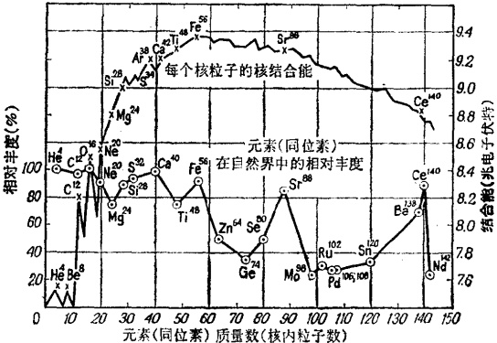

图 21

---

理学家不得不向地质学家、天文学家、甚至生物学家请教。显然，某元素的丰度对应着它的原子核在自然界中出现的频繁程度。这里自然界不光指地球，它指的是整个宇宙，即天文学家可用分光镜观测到的可见宇宙。

让我们比较一下这两条曲线（图 21）。它们之间有什么共同之处？首先，在左侧的角落我们看到上曲线的最高峰对应着氦 4，碳 12，氧 16 以及其他若干元素的核。所有这些数字都是 4 的倍数，似乎这些核包含的并不是单个的质子和中子，而直接就是  $ \alpha $ 粒子。下曲线与之相对应的部分，标示出这些元素在自然界中的相对丰度接近 100%。让我们沿着山脊继续走下去。我们发现上曲线中最显著的破折点与下曲线的高峰相对应。一般说来，核愈稳定，它在自然界中的丰度愈大。

这便引导我们作出如下的结论：在原子核世界中，自然界建立了自己的自然选择规律。在生存竞争中，只有最强者能够生存。丰度最大的正是那些核，它们的中子和质子数为2、8、20，等等。其原因，下面讲到核壳层时，再来讨论。

这里,我们可以指出：把核说成是由α粒子构成的,也不完全正确。但有一件事是肯定的：在原子核世界中,由两个质子和两个中子构成的集团确实是非常稳定的。物理学家说,作用在这个数目的粒子之间的核力已达饱和。给这样的集团再增添一个额外的质子或中子是不可能的。例如氦核就拒绝接纳任何粒子进入其家庭。当然,在所有的核中,氦核是最不好客的：甚至连质量数为5的核(两个质子和三个中子,

---

或三个质子和两个中子)都不存在。

氨家庭由于拒绝宾客而巩固了自身。如果把氢核（它只有一个质子，因此核内没有任何核力在起作用）除外，自然界中氢核就是最稳定的核。

饱和是核力所独有的一个新特性。核力的另一个新的不寻常的特性是它对电荷的独立性。核力对电荷根本不予理睬。无论是在一个质子和一个中子之间，还是在一对质子或一对中子之间，核力都同样好地起着作用。为什么会如此呢？直到今天物理学家也不很明白。

## § 71 再谈核的稳定性

形成牢固的核结构的交换力，就是将质子与中子结合在一起的引力。但质子与中子能协作到什么地步？这里必定有个极限，不然这些粒子早就该融合成一体了。

当然，自然界是不会允许它们融合成一体的。核粒子在极近距离内相遇，除了强大的核引力而外，还有用以抵消前者的同样强大的不允许粒子彼此渗透的斥力。

这就是所谓核力作用距离的下限。我们已经谈到了上限，那显然就是核粒子因彼此后退而可能拉开的最大距离，在此距离以内核粒子仍然受到核力的约束。这个距离与核粒子自身的线度属于同一个数量级。

这是个有趣的事实,因为它能说明结合能曲线的总趋势:结合能随着核质量数的增高而下降。真的,在具有很少的质

---

子与中子的轻核中，每个粒子都能凭借核力与其余粒子相联系。

饱和——它表明核力最喜欢结合四粒子组——究竟是怎么一回事呢？答案很简单。核粒子是彼此不可分割的，因此没有办法将那样的“四粒子”分离出来。例如在钠和氯离子的晶体中，你试把对应原来的分子的原子对分离出来吧！氯化钠晶格中的这些钠离子和氯离子也能构成不同于晶体的 NaCl 分子，即原来意义上的分子，这点我们已经讲过了。

核具有的粒子愈多，它的体积自然就愈大。可是每个粒子只能借核力与最邻近的粒子相联结。因此在多粒子核中，象一条锁链的结合便代替了所谓总体的结合。这样的核将会失去稳定性，而结合愈象一条锁链，稳定性也就愈低，因为随着质子数目的增加，与核力起相反作用的质子间的斥力也会普遍增加。

位于周期表末端的一些最大最重的核是颇不稳定的。自然界让它们自动地变得更为稳定。如果核能够甩掉一些多余的核粒子，正象船只抛掉一些压舱物以保持浮性一样，这样的事便能够发生。核抛掷出去的多余的粒子就是放射线。

顺便说一下，你可能已经知道在周期表的始端和中部都有很多放射性核。当然，它们之中大多数不是自然界的产物而是人为的。物理学家用核粒子(主要是中子)来轰击本来是稳定的核，便能使核由于容纳粒子过多而失去平衡。

这些核要返回它们的稳定状态，但却不走回头路。此外，核的终极状态经常与初始状态不一样。当核增添了一个中子

---

后，它便安定不下来，其反应是抛射电子和r光子，直到它转化成一种截然不同的核。

这就叫人为放射现象。隐藏在它背后的实质就是：所有的核都不惜任何代价趋向稳定。不稳定的事物不能长久存在下去。回顾一下核在自然界中的丰度图。它清楚地表明：核愈是稳定，它存在得愈长久，因而这种元素的丰度也就愈大。

## § 72 核内的隧道

一些非常复杂的定律支配着核的稳定性。科学家研究这些定律已三十多年，但直到现在还没有充分认识它们。当然，其中有些定律的秘密正被揭露。

首先就是  $ \alpha $ 放射性，或核的  $ \alpha $ 衰变，它的发现甚至早于中子，尽管科学在当时对  $ \alpha $ 粒子稳定性的内在原因还一无所知。

因此我们面前摆着两个问题：为什么  $ \alpha $ 粒子会从核内飞出？为什么质子和中子不单独地飞出？

让我们从第二个，也就是较难的一个问题开始吧。我们仔细考察结合能曲线后发现：拥有四粒子，即两个质子中子对的核（例如氦4，碳12，氧16）要较它们邻近的核更为稳定。可是我们又发现，重放射性核正是借抛出这些四粒子而衰变的。我们应如何解释α粒子的这种爱憎兼有的品性呢？

当我们想起四粒子中的核力已达饱和因而不允许任何第五个粒子进入其组织时，我们就感到更加困惑。我们不禁要问：那些比氦核更重的核怎么还能生存呢？

---

为了回答这些问题，让我们更仔细地看看  $ \alpha $ 粒子是怎样生存的，四粒子之间是怎样交换介子的。我们知道，可能的交换形式之中的一种就是：中子抛出一个负  $ \pi $ 介子而在这过程中转变为一个质子，与此同时，原来的质子吸收了这个介子，并在此一瞬间转变成一个中子。

因此，平均起来，一个四粒子在任何时刻都有两个质子和两个中子。但设想一下：某个四粒子抛出的介子被邻近的一个四粒子中的质子俘获。这便一下子犯了两个罪：第一个四粒子将要有三个质子和一个中子，而邻近的四粒子将要有三个中子和一个质子。为什么说是罪呢？泡利原理解释道：质子和中子具有与电子相同的自旋，因此加诸电子的种种戒律，质子和中子也必须遵循。泡利原理不允许一个以上的粒子在同一给定状态下具有同一意义的自旋。

α粒子是极其稳定的，这是因为它的两个质子和两个中子分别占有两个不同的能级——尽可能低的能级。两个质子处于一个能级，而两个中子又处于另外一个能级。这所以可能是由于：在任何一瞬间，核内的质子和中子以不同的乔装出现，也就是说，它们实际上是不同的粒子。现在如果一个四粒子具有三个质子，则其中一个必须违反严格的泡利不相容原理，不然就必须去占领一个较高的能量状态，也就是较低的结合能状态。

核粒子并不愿意犯罪；它们也不喜欢不稳定的状态。因此邻近的四粒子刚一接到这个介子，它便立即将它释放出来。其结果，这两个比邻的四粒子又恢复了它们的常态。但两个

---

四粒子之间进行的这种瞬时的交换却在它们之间建立了相互联结的纽带。这些四粒子不再象先前那样彼此隔绝了。

离开轻核愈远，四粒子产生的这种稳定作用愈弱。但重核又显示了四粒子的另一个明确的效应。由于核已变得如此庞大，因此，正如我们已经指出的那样，这些核的外围粒子只能与它们的直接近邻发生相互作用。显然，靠近核的表面，粒子又重新结合成四粒子，因为这是最稳定的形式。

这很可能就是重核只抛射四粒子( $ \alpha $粒子)而不抛射质子或中子的原因。它们是怎样从核里逃出来的？核是粒子的有联系的整体，换句话说，是一个用高位垒与自由粒子隔绝的位阱。我们知道阱的深度(或垒的高度)：它等于结合能。

我们立刻就会明白，核垒与我们过去所说的位垒不同：跳过核垒不须作任何努力。核垒不是一个只有前墙而无后壁的台阶：核垒就像一堵围墙。这堵围墙虽然不厚，但很高。说得粗糙一点，围墙的厚度是由核力的作用距离来决定的，它的高度却表征核力的大小。

这里，量子力学又来管事了。量子力学说：放射性核抛射α粒子是一个隧道效应，这个效应与金属中电子经由隧道逸出，或半导体与绝缘体中的电子经由隧道渗入传导带没有任何区别。任何时候波特性都在起作用：在一种场合下，是对电子而言的；在另一种情况下，是对α粒子而言的。

现在我们懂得四粒子的这种两面派行径了。事实上，也根本谈不到什么两面派：这一切都根源于量子几率。理论上，一个α粒子甚至能从一个氧核里飞出，但这个几率却小到可

---

以被忽略。在轻核中，对  $ \alpha $ 粒子的飞逸而言，核垒的高度是非常大的（结合能非常大），在重核中，核垒却很低（结合能小得多）。而隧道效应的几率在很大程度上是依赖于位垒的高度的：随着高度的增加，几率将迅速下降。全部的秘密就在这里。

另一方面,重核对抛射  $ \alpha $ 粒子的位垒,要较单个地释放质子和中子低得多。这就是为什么只有四粒子而没有单个的粒子飞出的原因。

## § 73 核是否有壳层

与原子不同，核似乎没有一个中心体，在它的四周环绕着象电子那样的云层。在核的质子-中子结构发现后的若干年内，物理学家将核描绘成以质子和中子云的形式，大致均匀地弥漫于这微小空间里的核物质。

当然，核力饱和以及  $ \alpha $ 粒子蜕变现象的发现似乎表明：核物质不是毫无定形的，我们可以观察到  $ \alpha $ 粒子的微小细胞的轮廓。当量子力学和实验继续深入核森林的时候，越来越明显地看出，这里还有一丛丛的树木，而且棵棵树都有自己的形状，不像从远处望去那样苍茫一片了。

我们知道，由四粒子组成的粒子在核内居于最低能量位置，同时在所有的核粒子集团中它是最稳定的。对应这个位置的是一个单一的总能级，在这个总能级中，两个质子具有相反方向的自旋，两个中子也是如此。

在这个指定的核内,第二个四粒子占据另一个能级,第三

---

个四粒子占据第三个能级，余此类推。随着四粒子数目的增加，核内越来越高的能级被占满，很象原子中的电子那样。

但有人会说：并非所有的核都包括四粒子！确实如此。这就意味着：在粒子数非四的倍数的核里，对应的能级不会全被占据。

这样的核非常象原子的某种外部结构，在这种结构中电子的最外壳层已经填满，因而处于封闭而稳定的状态(回顾一下惰性气体)。这里也同样存在着被四粒子和大量其他核粒子填满了的极为稳定的核壳层。

当然，外表的相似是不够的。我们需要关于核壳层确实存在的更确凿的证据。让我们再来看看核稳定性和核丰度的曲线图。取几个最高峰为例，计算一下与之相对应的核所包含的质子及中子数。

第一个是氦 4，它的核是一个由两个质子和两个中子构成的  $ \alpha $ 粒子。下面是氧 16，它包括 8 个质子和 8 个中子。接着是钙 40，它包括 20 个质子和 20 个中子。如此进行下去。最后的高峰位于曲线的右端，它属于铅 208，这个核具有 82 个质子和 126 个中子（除这些而外，我们还须添上具有 50 个质子的锡核。这个核是如此地稳定，因此自然界为它设计了 10 种稳定的同位素，与此相较，具有其他质子数的核只有 2 到 5 个稳定的同位素）。

这样看来，最稳定的核具有这样的质子-中子数：2, 8, 20, 50, 82, 126。请注意，这些核就像是惰性元素原子的翻版，这些原子的电子数为 2, 10, 18, 36, 54, 86。二者——各

---

在自己的世界内——都是稳定性的记录保持者。

这些质子和中子数被称为幻数。说来也真名不虚传，因为这些数字确实有某种神奇的力量，不然为什么原子的核和它的电子壳层——按照截然不同的规律生存着的两个世界——都显示了结构上的稳定性？

当然，将幻数与最稳定的原子的电子数进行对比，便可看出二者之间存在着明显的分歧。这两组数字只是对氦——在两个世界中都是稳定性的记录保持者——才是吻合的。这两组数字出现分歧也并不是偶然的。相反地，如果两组数字完全吻合，那才过于奇怪了，因为核与外围电子云的生存条件是完全不同的。

但核里仍然存在着某些好像壳层的东西。实验也证明了这点。让我们看一看钾原子(第19)。它是单价的，也就是说它在惰性原子氩填满了的密封壳层外面还有一个电子。钾原子电子结构的全部自旋与这个价电子的自旋相等。这是很自然的，因为其他所有的电子的自旋都是成对的，同时由于每对电子的自旋方向相反，因而互相抵消，使整个自旋之和等于零。

现在将钾的电子结构与氧17同位素的核来进行比较：这个核除了四个四粒子而外，还有一个中子。于是我们应该预料到：氧核的自旋应与这一额外的中子的自旋相等。事实正是这样。

上面所谈到的吻合并非独一无二的。核自旋通过实验测出的数值，与建立在核壳层模型基础上的预见数值，是极好地符合的。

---

## § 74 γ 射线从何而来

当我们对第三种类型的放射线——γ射线的来源进行考查时，电子壳层与核壳层的共同特征越来越多地被揭示出来。物理学家从对γ射线的研究中建立了许多有关核家族寿命的重要事实。

第一件引起我们注意的事便是核  $ \gamma $ 射线的光谱。这种光谱是由几条独立的线构成的。这意味着：核粒子只能具有非常严格地确定了的能量，也就是说，核粒子必须存在于特定的状态中。粒子在这些状态间过渡便会产生  $ \gamma $ 射线。

这些核的能级又是怎样的呢？这些能级又是怎样用核粒子装填起来的呢？这里核图几乎是一片空白。核具有确定的能级这一事实不应当引起任何惊讶。薛定谔方程所预见的这些能级，对任何有联系的粒子集团都适用，因而对核系统也自然适用。

在原子内部，描述粒子相互作用的公式是大家所熟知的库仑定律:电子间的相互排斥以及电子与核之间的相互吸引。因此，在原子范围内，我们可以将这个定律代入薛定谔方程。可是，核力的规律人们仍然弄不明白。

物理学家不得不掉过头来去解决一个相反的问题：观察r射线的光谱，并根据它来计算核内的能级以及粒子在其中的装填顺序。你还记得，物理学家在建立原子内的能级的时候，也曾忙于解决上述问题。现在科学家迫切需要有关r射

---

线的各个光谱线的亮度及特征的情报，并希望能从中推导出一个支配核内粒子相互作用的定律。

可是事实证明核是一个不易摧垮的堡垒。甚至直到现在问题也没有完全解决。显然，在我们对核粒子的性质有所认识以前，这个问题是不会得到彻底解决的。目前为探讨这个问题而采用的某些技术将在下章讨论。

尽管如此，有关核内存在能级，以及质子和中子几率云构成壳层的概念已经结出丰硕果实。这个概念使我们能够解释γ射线的起源以及它所显示的许多有趣特征。

首先，为了发射一个 r 光子，核显然要从一个稳定的最低容许能态过渡到一个较高的能态。拿它与原子作个类比，核的后一状态也应叫作激发状态。r 光子一经发射，核就返回其初始状态或其他某个状态。

核力要较电力大几百万倍。由于这个缘故，核内能级之间的距离一般要比电子结构内的能级距离大得多。因此，可以很自然地预料：γ光子的能量也相应地比可见光光子的能量大得多。这意味着γ光子的波长相应地短得多。这正是我们观察到的现象。在所有已知辐射中，γ射线具有最短的波长。

这就是为什么 r 射线总是毫无例外地伴随着几乎所有的核放射性转变，因为这些转变无非是核向更稳定状态的过渡。靠抛射几个额外粒子来对核结构进行一次调整，有时还不足以导致完全的稳定。新核虽然比原来的核稳定，但仍处于激发状态。核结构重新组合的最后阶段，就是发射一个 r 光子，

---

## 这样核便停止放射。

核也能通过一种电子壳层意想不到的途径，抛掉剩余能量：核并不抛射γ光子，而偷偷地将其激发能量直接传递给电子云。但这个能量对原子大厦来说是太大了，这个礼品简直就像地震。当然，大厦仍然屹立着，但有些电子却被以极大的速度驱逐出境。这种现象非常成功地与γ射线的直接发射相颉颃，这就叫内转换。

## § 75 核象液滴吗

核壳层，奇妙的核……真是标致得很啊！这幅图画虽然动人，但很多实验事实不能塞进壳层模型的框框。这并不足为怪。首先，如果核壳层真的存在，它也必然与电子壳层迥然不同。这个核内的壳层概念本是挖空心思想出来的。核并没有一个被核粒子包围着的核心。此外，核这个满员了的集体，所容纳的粒子数也与原子外围的电子数十分不同。最后，核壳层应有两种类型：质子壳层和中子壳层。

当壳层这个术语从原子以外的世界挪用于核内世界时，它仅意味着核粒子中的某些特定集团的某种孤立、稳定性与饱和状态。此外，这种状态也不是在任何时候、任何场合下都会出现的。

认为壳层只能指包括很少的核粒子的轻核，是有些道理的。随着核的增大，各个能态失去了它的独立性，核在结构上越来越混成一团。核粒子是那样多，核粒子云是那样地互相重

---

叠,以致再也没有任何确定的粒子运动,就好像它们都已停止遵从量子规律似的。

结果是，核失去了与原子相似的全部特征。壳层模型必须被放弃。但我们又能为核设计出一个什么样的新模型呢？

第二次世界大战爆发前不久，科学家曾暗示过核的液滴模型，至于根据什么理由，以后再谈。核被描绘成一个外表均匀的实体，在实体里面并不存在任何有规则的结构（例如，α粒子或壳层）。单个的核粒子（核液的分子）被认为在液滴内处在经常的不规则运动状态之中。

结果是，核液获得了某种流动性。就像液滴一样，核具有边界，但这些边界是易动的，流畅的，并且能够由于各种外在和内在原因而改变形状。所有这些都不能使核的表面破裂：核液在液滴边界上的表面张力，能使核的表面保持原样。这种核表面张力与普通液体的表面张力完全是异曲同工的：核粒子由引力结合在一起，这个引力是不会被液滴外的任何其他力量抵销的。核力将核液保持在这个液滴内。

它们的相似到此而止。让我们比较一下两种液体的密度。简单的计算表明：核粒子要比一般液体的分子紧凑几十亿倍。象从水龙头滴下的一滴水那样大小的核液滴足足重一千万吨！

真是大得惊人！我们知道物体的性质在很大程度上取决于它的密度。将气体的密度改变一千倍，它就会变成一个遵循截然不同规律的晶体。因此，一般溶液和核液之间显然没有任何内在的相似。二者的密度悬殊太远（相差几十亿倍），

---

而作用在核粒子之间的力根本不同于作用在分子之间的力。

但让我们观看一下外表吧，这里我们能够找到二者之间的类似。将一小珠水银放在一块玻璃板上并轻轻地敲击这个水银珠。它将会颤抖起来，细微的波浪将在它的表面散开。如果敲击得再重一些，这个水银珠将会分裂成若干更小小的小珠。

这可能使人联想起当代物理学最重大的发现之一。1939年，科学界为一种耸人听闻的事件所震撼，在战前的那些日子里，这件事的凶险含意只有物理学家才能充分领会。那就是铀核裂变的发现。

不同国家的理论家，赶紧为原子核世界的这一惊人现象寻找解释。玻尔和苏联物理学家夫伦克耳迎头赶上。他们分别地提出了一个共同的理论。他们成功地用自己新发展起来的核液滴模型来解释铀核裂变。

## § 76 液滴状的核分裂了

玻尔和夫伦克耳大致上是这样推理的：这里有一个处于正常状态下的核，核粒子的运动甚至有某些规律；如果核结构是稳定的，它的居民就应一直过着一个平静的、与世隔绝的生活。

于是，突然间，闯进了一个不速之客——一个不知从哪里来的粒子。它一头栽了进来，闹得大家坐立不安。在一片混乱的问好声中，这个核住宅竟成了个群魔殿。

---

顿时这个新粒子和其他粒子便宾主难分了。新粒子带进来的能量立刻分给所有的核粒子，因此现在不管是新粒子，还是核的其他粒子，都不能离开这个核。这样，一个新核便形成了。玻尔称之为复合核。

这一状态持续不久。当其中一个粒子获得一个足够有力的碰撞时，它便翻越核边界的位垒而离开核。如果逸出的粒子不同于闯进的粒子，则事件的整个过程就叫作核反应。这个名称是恰当的，因为开始的核已不同于最终的核。正象在化学里一样，开始的物质不同于化学反应中产生的物质。

复合核内粒子的一片骚乱，酷似分子在一滴液体内的无规则的热运动。单个的分子不时地从液滴里蒸发出去。这与下面的情况非常相似：当核受到外部粒子撞击而加热时，核里的粒子也能蒸发出来。

在这种情况下核内真地发生些什么，谁也不很清楚。但我们能够说，从它的表面来看，它真就象是一个热的液滴。让我们看一看液滴的表面吧。它始终处于激动状态之中：它颤抖着，当一个分子跑掉了，另一个分子立刻会占据它的位置。

人们早就观察到：液体表面振动幅度十分密切地依赖于液滴内液体的表面张力。我们已经说过，核液滴的表面张力产生于核引力。核愈大愈重，核引力就愈弱，因而也就愈难将核粒子结合在一起。对于重核而言，甚至相对轻微的颠簸也能在它的表面上产生危险的振动。

这样的颠簸可以借一个中子撞击一个重而颇不稳定的铀核而产生(回忆一下：由于不稳定，这些核是放射性的)。有

---

时候，仅仅一点最轻微的颠簸，例如热中子与之碰撞而产生的颠簸，也可以击碎一个铀235核，这里所说的热中子的能量，要较原子核所特有的能量小几亿倍。

一滴水是怎样分裂的呢？高速电影拍摄术回答了这个问题。如果撞击得法的话，小水珠就会开始振动，巨浪就会出现在它的表面。接着小水珠便伸延成细长形，最后终于在腰部断开。

对水珠分裂的更复杂情状也作了观察：这些水珠分裂成许多较小的水珠，它们的体积经常是参差不齐的。

玻尔和夫伦克耳的假设是：当中子撞击重而不稳定的核时，核表面的类似变形引起核裂变。

## § 77 核裂变的秘密

但为什么中子的撞击能引起核裂变？重核为什么宁肯瓦解成几大块，也不肯蒸发出单个的粒子，正象在轻核和中质量核的人为放射中所见到的那样？

对第一个问题的回答是：将核与外部世界隔开的那堵围墙，正象我们曾经描述的那样，具有两个壁，这两个壁又是不对称的。

从墙内来看，核围墙的坡度对质子比对中子更为缓和。围墙的高度是核力造成的。但对质子来说，由于它们之间的相互排斥，这高度降低了。由于位垒的存在，在正常情况下粒子不离开核。这个核是相对地稳定的。

---

从墙外来看，围墙就有些两样了。对质子来说，位垒依然存在，这是因为核的质子共同排斥所有的与它们同类的不速之客。对中子来说，外位垒不复存在了，因为中子在电上是中性的。另一方面，核内却存在着一个中子可以坠入其中的位阱——当中子坠入核内时，它往往就呆在那里。

因此，如果质子要想进入核内，尤其是进入重的多质子核内，它就不得不拥有高达几百兆电子伏特的巨大能量。中子却不须任何能量。这便说明：为什么能量很低的中子(甚至能量只达百分之几电子伏特的热中子)也能进入核内。

现在我们能够回答第二个问题了。有人可能以为中子进入铀235核内会使它的负载增大到这样的程度，以致它会崩裂成碎片。事实上这个中子并不是能够定局的一着棋。这个核在不危及其稳定性的情况下，能够容纳三个额外的中子，以形成铀238的核。

结果怎样呢？新的中子既不能使核的负载过重，又不能明显地增加它的能量，也不能给核液滴带来某种刺激。那么铀235的裂变是怎样产生的呢？

情况是真够复杂的。这里我们又一次遇见了那些量子。关键是：只有当中子具有一个非常确定的能量时，铀235的核才能裂变。这个确定的能量对应着铀235核的稳定状态能级与紧挨着的激发状态能级之间的距离。也就是说，如果中子的能量对应着上述两种状态的能量差，它便能最有效地激发铀核。

铀 235 核的激发状态和稳定状态之间的能量差是非常小

---

的。看起来这个核一旦进入激发状态，就会象轻核似地动作起来：发射一个 $ \gamma $光子和某一粒子，然后返回原来的或某种其他的稳定状态。事实却不然。

原因是这样的。我们说过，重核宁愿抛射  $ \alpha $ 粒子(四粒子组)，不愿抛射单个粒子。这是由于：对  $ \alpha $ 粒子的发射，位垒远较发射单个核粒子为低。事实上，在铀 235 核裂变过程中，抛射象核碎片那样的大块所须克服的位垒是非常低的。

这个核一旦进入激发状态，就能蹒跚地爬过这道矮矮的裂变位垒而瓦解或若干碎片。

这种情况在分子中也能见到。从分子里即使抛射出一个孤零零的电子也须要相当可观的能量。但将这个分子分裂成单个的原子，所须能量则小得多。这就是为什么在化学反应中，分子并不分解成电子，而分解成原子或原子集团(根)。

轴238核由于中子而产生的裂变与铀235裂变非常相似。对铀238来说，激发状态与稳定的起始状态之间隔着一个相当宽的，足足有一兆电子伏特的能量距离。为使这样的核上升到激发状态，需要速度极高，能量极大的中子。

## § 78 原子核究竟能有多少个

你可能已经猜出原子核的数目确实是有限的。核愈重，它就愈不稳定。即使是一个铀核，在它自发地抛掉α粒子而过渡到一个更为稳定的状态以前，就已平均存在了几十亿年之久。根据并不困难的计算，比铀更重的核在发射一个α粒

---

子以前也能生存颇长的时间。

当然，还有另一件事情也限制了重量范围。我们刚刚讲过，对于重核分裂成几大块而言，核周围形成的位垒是很低的。可是——对，你已经猜到了——一个核碎片从位垒下面渗过的几率也是不容忽视的。

不需要中子或任何形式的激发，核也会自动地分裂并以隧道方式穿过位垒。事实果真如此吗？1940年，自然界点头说：是。重核的天然分裂是苏联物理学家福辽洛夫和彼得夏克发现的。它不是量子力学的猜想，而是一个被验证了的事实。

核愈重，包含的粒子愈多，则这种裂变的几率也就愈大。但铀核的天然裂变是绝少的，这个几率几乎等于零。至于镉（第98号），它的核对自发裂变而言的平均寿命只有几年，而不是几十亿年。

最后我们还有这样的核，它的裂变位垒全然消失。这种类型的核对裂变并无抗拒。实际上，这种核永远不会形成，因为它一旦形成便立即瓦解为碎片。建造原子的标准化工程表*中的最后一个序数是120。这意味着在任何情况下，核(当然也就是原子)不能具有120个以上的质子。

正是质子的数目断然决定核对裂变而言的稳定性。在重核内质子之间的斥力急剧增加，而相距甚远的表面粒子之间的核引力则迅速降低。

---

其结果，核的表面上出现翻腾着的质子，中子却在一旁歇凉。质子之间的斥力将核表面撕成碎片：核分裂成几大块。

## § 79 核是壳层和液滴的结合

我们刚刚讨论了原子核的两个模型。一个模型提供了与原子有些相似的壳层结构。另一个模型则使人联想起液滴。两个模型之中，究竟那一个更接近于真理呢？

最合理的回答是：两个模型都好，但各有其特殊的应用范围。对于描绘一个未受外界因素影响的恬静的核来说，壳层结构更为适用。若核处于紧张状态之中，如果整个的核沸腾起来，因而粒子在相互有力地碰撞着并从核中蒸发出来，要是情况变得这样糟糕以致核分裂成碎片……如果事情是这样的，则液滴模型能够应付裕如。

那又何不将两种模型结合成一个，以便同时很好地描述两种不同类型的现象？然而从普朗克量子理论中我们就已看出：理论的结合不能象裁缝活那样拼拼凑凑。

核的联合模型，即所谓普遍化模型，在十年前由玻尔的儿子，著名的丹麦物理学家欧基·玻尔提出的。当然，这个理论继承了老模型的某些特征，但仍然与它们很不相同。

这个普遍化理论的要点是：当核内的质子与中子数等于或接近于幻数时，壳的行为是壳层类型的。不然，核就要象液滴一样地活动。不仅如此，当已填满的封密壳层之外的粒子数目达到下一壳层粒子总数的2/3左右时，核的液滴特性表## 现得特别突出。

这就是说，核的已填满的壳层以外的粒子引起核的全部诡谲行径：从单个粒子的发射到整个核的破裂。与此同时，已填满壳层的粒子表现得谦虚得多：它们不直接参与核的这些活动。

这里，我们有必要重温一下原子外部结构中的电子壳层。你还记得，惰性原子密封壳层中的电子象隐士般地与世隔绝。与此同时，未填满的壳层中的电子则积极地结识邻近的原子，以便形成分子和晶体，或参与化学反应。

普遍化模型认为：核粒子之间并没有很多的直接相互作用，壳层特征也不是最重要的方面。除了成对的粒子的相互作用而外，这里也很可能有一种集体形式的粒子相互作用，而这种作用能更好地反映在液滴模型中。这些事实体现在核表面的变形之中，结果是：核不能保有质子电荷的球状分布。当然，这些事实还体现在其他许多核特征之中。

普遍化模型所预期的原子核的电力、磁力以及其他特征与实验很好地吻合。

关于模型以及物理学家怎样利用模型来描述原子核特征，已经谈得够多了。这些并不是全部，还有很多模型也曾被想象出来。

模型这么多是利呢还是弊？看来还是个弊。因为尽管核具有多方面的性格，它事实上只有一个面孔。这许许多多模型之中，每一个都不错，但不是在这，就是在那方面不能令人满意。这说明：虽然核是个统一体，但这个统一体又是非常

---

难以把握并理解的。

就像在不同的照明条件下，从不同的角度拍摄的十来张相片，每张相片都只是整个景物的微小的、局部的映象。很自然，将这些片断凑成一个完整的形象是很困难的。

就原子核来说，主要困难在于：我们对核力知道得还不够。

这些力量对粒子的电荷根本置之不理，它们只在短距离内起作用，并且是很强的。我们还可以补充说：这些力正如所有的交换力一样，依赖于相互作用着的粒子的自旋在方向上的相互关系。

当物理学家能够窥测并了解核粒子本身的内部结构时，核力便会被更好地认识。研究核粒子就是探索一个崭新的世界——比原子核可能更为广阔的新世界，物理学现在只是刚刚开始接近它。

## § 80 核内飞出它所没有的粒子

我们已经知道  $ \alpha $ 粒子和  $ \gamma $ 光子是怎样从核内逸出的。但  $ \beta $ 粒子，即平常的电子，是怎样被发射出来的呢？

大约在三十年前物理学家就着手研究这个问题，那时候他们是满怀信心的。当时看来  $ \beta $ 放射不会长久得不到说明。自然界并不急于供出自己的谜底。不久以前量子力学对核的  $ \alpha $ 和  $ \gamma $ 射线作出解释，至于  $ \beta $ 射线，直到今天物理学也未能将它完全征服。

---

 $ \beta $ 放射可能是原子核衰变最常见的形式，可是量子力学竟然不能对它作出解释，这种困境实在恼人。自从1934年小居里夫妇(弗雷德里克·约里奥和其妻艾琳·居里)发现用中子轰击核产生人为放射以来，尤其是核反应堆诞生，从而使大规模轰击成为可能以后，地球上未曾听说过的新放射性核便源源不断地流入物理学家的掌中。

在过去的四分之一世纪里，一千余种新的放射性同位素已被人为地制造出来，其中大多数放射  $ \beta $，而非  $ \alpha $ 粒子。

解释  $ \beta $ 衰变的第一个，也是最主要的一个困难就是电子不能存在于核内。早先，当我们讨论核的质子-中子模型时，我们就提到过为什么会如此。现在我们就来谈谈电子不应存在于原子核内的主要理由。

关键问题是不能将电子塞进核内！如果我们能够想办法将整个几率云驱入核内，则电子可能被认为就存在于核内。但即使电子速度特别高，其能量已经达到核能的数量级，德布罗意电子波的波长也仍较核的线度大几百倍。而电子云的线度，正如我们在氢原子中所看到的那样，是与电子的波长属于同一个数量级的。

核内无电子容身之地的另一理由是：电子的自旋与核粒子的自旋合在一起，将会引出不正确的核自旋数值。

物理学家一旦接受了上述推理后，便毫不含糊地剥夺了电子在核内的安息之地。既然电子从来不曾存在于核内，它们从核内逸出又是怎么一回事呢？核是一个非常重的粒子，可是它却生出这一极轻的电子，真好像一颗小小的子弹从贝

---

莎巨炮 $ ^{*} $口里飞出一样。

这个核真是个奇迹。不仅如此，电子从核内飞出违反了物理学的两条基本定律：能量守恒定律和角动量定恒定律。

## § 81 电子有个同伙

物理学中有这样一些基本定律，整个的科学大厦都建立在它们之上。这些定律对不同等级的世界和不同的现象都生效。

一个就是运动既不能被产生也不能被消灭**。一种形式的运动可以转化成另一种形式的运动。运动能改变形式，甚至能变得不可察觉，但运动永远不会消灭。

在经典物理学诞生初期，科学觉得运动的某种量度是必需的。这不仅是为了描述运动，而且要衡量它、计算它。两个新数量便被引进物理学：能量和动量。

运动既不能创造也不能消灭这一命题反映在：诸物体参加某共同活动时，它们的总能量和总动量保持不变。大炮的后坐，运转着的发动机的温升，打桩，还有其他无数例子，都丝毫不爽地遵守着两大定律：能量守衡和动量守衡。对于旋转运动来说，一个具有同样根本性质的定律就是角动量守恒定律。甚至花样溜冰运动员都要利用这个定律。当他将手臂收

---

拢来时，旋转就会加快。

我们可以想象，当  $ \beta $ 粒子被发现能具有从零到某个最大值之间的任何能量数值时，物理学家是多么地惊慌失措啊！因为在当时人们都认为：核是一个量子系统，并且具有一些确定的能级。

换句话说，核内的任何过程（如  $ \beta $ 粒子的发射）只能按下述方式进行：核从一个确定的能级过渡到另一个确定的能级。这当然意味着：这个能量差，也就是被  $ \beta $ 粒子带走的能量，也必须是同样地确定的。

在  $ \beta $ 蜕变中，电子能量光谱并没有显示出对应着切确能量的光谱线的任何细微痕迹。这些表明：要么核归根到底并不遵守量子定律，尽管在其他过程中遵守得很好；要么核的  $ \beta $ 衰变违反了能量守恒定律。

还不只是能量守恒定律。电子从核里带走它的能量，同时也带走了它的自旋——这个与电子的本质密切地结合在一起的自旋。但是我们发现，在  $ \beta $ 粒子发射以后，核自旋仍然保持原样。可能电子将其自旋留在核里了吧？不，那是绝对不可能的，正象一个电子没有电荷，一台钢琴没有琴键，一个科学家没有头脑一样不可能。

对此现象的想法是五花八门的。有些科学家深深地信仰核生活的量子定律，以致他们建议牺牲能量守恒定律。他们企图把这个定律作为仅仅是经典的而扔掉。

其他物理学家认为那是不行的。这个想法很快就被放弃，但要走出这个困境仍然无路可寻。于是泡利声明：电子

---

这个罪犯有个同谋。这个同谋又长得象什么样子呢？

 $ \beta $ 蜕变中，核获得了一个额外的正电荷，其电量在数值上恰好等于被释放的电子的电荷。这就好像核被离子化了。这暗示着这个同谋是不带电的，在电上是中性的。

这个同谋应当有这样一个自旋，它在数值上与电子的自旋相等，在方向上与后者相反。两个数值相抵消，给出的数值仍然是零。这样，当电子和它的同伙被抛出以后，核自旋正如所要求的那样，仍保持原来的数值。最后，这个电子和它的伙伴带走的能量，等于核  $ \beta $ 衰变中电子可能带走的最大能量。

这个最大能量是量子化了的,也就是说,它恰好等于核在 $ \beta $衰变前后的两个能级之差。但这个能量可以任意方式在电子及其同伙之间进行分配。这个分摊过程是不受量子力学制约的,因而也就不受任何强加于它的限制。

这样，核内能量的量子化被保留着，能量和自旋守恒定律也未被违反。泡利发现的这个摆脱困境的办法是真够聪明的。

这里还有一个暗礁。这个电子小偷立即被捉住了，可是它的同伙却狡滑得令人气愤。哼，我说的吧！怀疑派发言了。于是物理学又推出了他们的最后一张牌：他们间接地计算了这个伙伴的最后一个特征——它的质量。确切的计算是不可能的，但可以肯定地说，这个质量小得可以忽略，至少比电子的质量小一千倍。

这个幽灵般的伙伴终于被找到了。它没有电荷，其质量也几乎等于零；它所有的全部家当就是能量和自旋。没有电

---

荷这一点使它象不久前发现的中子，只是它比后者要轻一百万倍。这样人们就给它取了个爱称：中微子，或小中子。

可是这两种粒子并无共同之处。中子积极地与质子相互作用，与它们相碰撞并形成坚实的原子核。中微子呢？却是一个不具肉身的幽灵。计算表明，中微子能穿越整个的可见宇宙——几百万光年——而不显示其存在。看来它是从来不与任何东西相互作用的。

如果允许扯得稍远一点的话，我们可以补充说：只是在前几年中微子才最终地、明确地被间接的事实所证实。 $ \beta $ 衰变理论的处境与核力理论的处境基本一样。后者悬而未决达十年之久，直到它的存在终于以  $ \pi $ 介子的发现而被证实。而泡利与意大利物理学家费密共同提出的  $ \beta $ 衰变理论作为悬案竟达四分之一世纪！

让我们言归正传吧。我们还是要找出：从  $ \beta $ 衰变的核里飞出来的电子到底是从哪里来的。

## § 82 电子诞生于核内

在微观世界里，我们每迈出一步就会遇见一些奇迹，这些，我们已经习以为常了。在下章里，我们将涉及一个绝对普遍的现象——粒子间的相互转化。我们知道，在微观世界里，这种相互转化是这样自然而且寻常，正象在我们的宏观世界里，事物是相对地有常并且稳定一样。

我们已经和一种粒子间的相互转化打过交道，那就是居

---

于核力最深处的质子与中子之间的相互转化。在这一过程中，质子发射一个正  $ \pi $ 介子而转化成一个中子，中子俘获这个介子而转化成质子。但是，我们记得，中子也可能发射一个负  $ \pi $ 介子而转化成一个质子。

可能从  $ \beta $ 蜕变的核里逸出的就是这个介子。不是的。对质量的精确测量指出，这是不会发生的。核抛射的不是  $ \pi $ 介子，而是较它轻二百多倍的电子。在  $ \beta $ 蜕变条件下，介子从不离开核。

我们又要稍稍谈点题外的话了。中子出现后不几年，物理学家确证：原子核的这块砖石是个不稳定的粒子。一个核外的自由中子出生后平均约12分钟就转化成一个质子。就在这转化中，一个电子和一个中微子被发射出来！

 $ \beta $ 衰变的谜底现在似乎近在眼前了。难道离开核的不正是这两个粒子吗？正是它们。但核内的中子并不是一个自由中子。核中子应当以一种十分不同的方式转变成一个质子。

当然，从  $ \beta $ 衰变的迷宫中找出这样一线踪迹不知已花了多少精力和时间，现在又要把它放弃，真使人感到遗憾。可能核内的中子能在一眨眼间变为自由的。

不能。一瞬间的自由也不会有，更不用说十二分钟了。但我们记得：发射  $ \beta $ 粒子的核要么本身仍然不稳定（例如位于周期表末端的重元素的核），要么由于中子的轰击而被投入不稳定的状态之中。现在  $ \beta $ 粒子的发射无非是核为了从不稳定状态过渡到稳定状态所作的一个尝试。

倾斜的墙可以从外边用支撑物将它扶正。对原子核来

---

说，每件事都得从内部来做，也只有这样才能做得好。我们曾经将质子比作核大厦的建筑石块，将中子比作水泥：水泥把石块粘结成坚固的建筑物。但如果大厦的建造并不牢固，或者大厦遭到来自外部的猛裂冲击——例如一个中子的冲击，则又将出现什么呢？

自然界恢复平衡的办法是：将水泥转化为石块，如果后者太多的话；或者将石块转化为水泥，如果石块过剩并危及核大厦的话。

当这些转化发生时，电荷的剩余或亏损 $ ^{*} $就会被从核内抛出。质子砖石变成中子水泥须要甩掉其电荷，并以正电子——电子的带有正电的镜中映象——的形式将它抛射出去。当中子转化为质子时，它射出一个电子，从而增加了核的总电荷。

这些转化历时多久呢？不是12分钟。我们已经说过：中子在核里的地位根本异于它的自由兄弟的生涯。有时候核内的条件是那样的，以致它对这种不稳定状态难以忍耐那怕千分之几秒。

有时候核内的这些条件抑制了中子或质子的衰变。这样核就能生存一个很长的时期——往往平均几百年或几千年——然后才开始  $ \beta $ 衰变。总的来说，这也没有什么很特殊的地方。核粒子的生存条件，正象不同的标准核结构的数目一样，是十分繁多的。

---

目前量子力学还不能准确地估计  $ \beta $ 放射性核的平均寿命。这不仅由于人们对核建筑只具有近似的知识(归根到底，只够得上是有关核力的知识)。关键问题是：量子力学还不够合理地说明自由中子蜕变这个事实。

隐藏在这蜕变之后的是某些奇异的力量。这些力量的发现，近年来已使许多物理概念革命化。在下一章里我们就要谈到这些力量。

### § 83. 饕餮的核

让我们再来看看  $ \beta $ 衰变的某些非常有趣的特征。其中之一就是核并不总是仅仅抛射电子。

有时出现这样的事：从核内飞出的是电子的镜中映象。它们与电子的唯一区别就在于电荷：它们带有正电。解释这种类型的  $ \beta $ 衰变(附带地说，它没有一般的电子放射衰变那样常见)就更加困难。中子不能抛射正电子。质子却能抛射正电子然后变成中子。但与中子不同，质子就  $ \beta $ 衰变而言是绝对地稳定的。

于是我们又碰到了这个老问题：从来不曾存在于核内的粒子怎么能从核里跑出来呢？情况看来更加复杂了。我们能够懂得电子是从何而来的——那就是从核中子。但正电子又是从哪里来的呢？

答案已经找到，这点我们必须留待下一章来讨论。可别着急啊。如果你真能沉住气的话，我们就会告诉你，最后这幕

---

是真够动人心弦的。现在要求你的只是一小点耐心。

为了让读者不至于太着急，我们大略地谈谈核是如何鲸吞原子云中的电子的。物理学家把这种凶残行为叫作电子俘获。

这又如何可能呢？本书开宗明义：玻尔发现的原子生活的量子规律，间接地反映了原子自杀的不可能性。为此引入了轨道概念。这样电子就不至于因为辐射而损失能量，也不至于坠落在核上。

在核电量很小，而且电子也寥寥无几的轻原子中，量子力学的戒律是被严格地遵守着的：电子几率云不会进入核占据的区域。在重核中，最深层的电子（它们的壳层最靠近核）所处的环境就十分不同。

在它们的外侧，众多的电子在排斥它们；而在它们的内侧，这个重的带有正电的核又同样有力地吸引着它们。电子再也不能长久忍耐这种腹背受力的局面了。电子云开始向禁区推进。原子电子进入核内似乎有点可能性(几率)了。如果有个几率，则自然界或迟或早总要在某些原子中实现这个几率。这就是电子被核俘获。

现在核里多了一个电子又怎么样？核的电量减少一个单位，就像在正电子  $ \beta $ 衰变中那样。自旋呢？核自旋仍然不变，虽然它从电子那里得到了这个额外部分。

如果情况确实如此，唯一可能的结论是：电子带进来的自旋，又被另一粒子——电子的老伙伴中微子——带了出去。不同的地方是：这个中微子不是与电子同一批释放出来的，

---

而是当电子在核内消失时出现的。

因此在原子内部，这一谋杀案的唯一见证者就是中微子，那个飘忽的、不具肉身的幽灵。我们知道，要审讯这个家伙是特别困难的，几乎是不可能的。

可是，在最近几年里，这个审讯终于完成了。审讯情况如下。我们的见证者——中微子——能和另一个核碰撞并将质子转化为一个正电子和一个中子，也就是下章所要讨论的一个过程的反过程。这个反过程就叫作逆β衰变*。

要想对单个的中微子进行实验是绝无希望的。唯一的途径是结集许多中微子兵团，这样就可能有少数几个落网。

事实上也正是这样做的。核反应堆开始产生出强大的中子流。当中子被反应堆的壁吸收时，它们便诱导出人为放射现象。当然，被激发的核——蜕变着的核的碎片——也为这种放射现象作出不小的贡献。

这就是  $ \beta $ 放射。一个核反应堆每秒钟内能产生巨大数量的中微子；这些中微子非常容易地穿越核反应堆防护层，后者却将中子和  $ \gamma $ 射线禁锢在其中。

反应堆旁安置着一个非常大的闪烁计数器。

计数器盛有一种液体(甲苯)。液体内含有大量氢核，当γ光子出现时，即发生闪烁。俘获中微子时发生的正电子立即与液体原子内的电子相结合而湮没，就在它们湮没的地方，高能γ光子出现(关于这一动人事件的细节，可见下章)。计

---

数器发生最初闪烁时的情况就是这样的。

为了便于俘获中子，液体内添加了化学纯镉，这是因为镉的核贪婪地吸收着自由中子。这个中子的俘获同样伴随着γ光子的发射，因而也同样产生闪烁。

这样，相隔时间约为百万分之一秒的两次闪烁就应为我们预期的现象提供某种线索。

这些双闪烁(那是非常稀罕的,反应堆工作许多小时才会出现几次)确实被记录下来了。原因只有一个：一个中微子与一个质子碰撞产生出一个正电子和一个中子。这里，泡利提出的关于微观世界的一个新粒子的假设，一个诞生于笔端的假设，终于在四分之一世纪以后被证实了。

往后的研究表明：在所有微观粒子中，中微子确实是最不平凡的一个。但此是后话。

我们跟着量子力学在核世界里的游历就到此结束。当然，这里还有许多荆棘、暗礁和陷阱；说真的，它们是无穷无尽的。

现在我们就要走进一个更加晦暗的世界——物质的基本粒子的世界。这个世界更加明确地显示了这样的规律性：实物粒子具有波特性，波也具有实物特性。

---

# 第六章 从原子核到基本粒子

## § 84 一个新世界的发现

这样看来，什么东西又能比原子核更坚固而稳定呢？高压、极低或极高的温度、强大的电场和磁场都对它毫无影响。自然界最坚固的建筑物就是核结构。这就是物理学家过去的看法。

科学的发展已经在相当大的程度上改变了这种观点。大多数重核证明是很不稳定的。甚至在轻的和中等质量的核里也颇有几个结构是脆弱的。当自然界在核建筑中垒砖的时候，核内的质子和中子的比例稍稍失调就将助长不平衡——这点是越来越清楚了。

与此同时，为了说明在蜕变过程中，从来不曾存在于核内的粒子能从核内飞出，科学不得不假设核内的中子能转变成一个质子，或与此相反。这便引向中微子的概念。

核稳定性看来归功于一个叫作  $ \pi $ 介子的新粒子。在寻找这个新粒子的过程中，物理学家却发现了  $ \mu $ 介子。

逐渐地，科学家开始明白：那个用来建造原子及原子核的种种砖石，并不象人们想象的那样稳定，那样一成不变。在原子的深处，在原子核的更为幽深的世界里，察观人员遇到的

---

事件远比量子力学所能预期的都奇妙得多。

但量子力学也能对付这个新局面。它的独特的预见性在基本粒子的新世界中也已盛开花朵。每当一个新的预见被实验杰出地证实了的时候，怀疑派总要大吃一惊。在超微观世界里，每前进一步都是对常识的一个否定，这就更使怀疑派惶惶不安。

常识?!真的,如果科学家只知道让一般常识牵着鼻子走,科学到今天还会以蜗牛的步子爬行着呢!

当常识被弄得神魂颠倒的时候，最重大的发现往往就会做出。许多事物的真正本质并不浮在表面，却隐藏在它们的深处。那些平庸的和显而易见的，往往是具有欺骗性的。当科学深入到奇妙的微观世界之中时，上面所说的“往往”就成了“经常”。

让我们返回到 1928 年。此时这个新世界才刚刚开始展示它的底蕴。我们只知道两个粒子：质子和电子。量子力学刚刚三岁。可是它却非常成功地解答了一连串的谜。我们终于正确地掌握了氢原子和氢分子的形成，而隧道效应也开始帮助我们了解放射性核的  $ \alpha $ 射线。可是对于核及其他粒子，我们实际上仍然一无所知。

这时有个年轻的英国科学家保罗·狄拉克（他们真的都非常年轻：薛定谔38岁，海森堡28岁，狄拉克25岁）抛头露面了。他说：量子力学的成就将象昙花一现，因为它脱胎于经典物理学，而后者描述的只是物体的相对缓慢的运动。

可是，在玻尔理论中电子每秒钟绕核旋转几万亿次。我

---

们难道能认为原子中的电子，即使在这个旧理论中，运动得缓慢吗？在轻核中，电子速度的数量级是每秒几千公里，在重核中则高达每秒几十万公里。

肯定是不慢了！这意味着我们必须将量子力学应用到原子粒子的这些快速运动上去。怎样才能做到这点呢？

在此以前二十年，一个正好是描述寻常物体的快速运动的理论出现了。它就叫狭义相对论。作者是阿耳伯特·爱因斯坦。

狄拉克断言：将量子力学扩展到微观粒子的快速运动上去的途径，是把它和狭义相对论结合起来。

## § 85 看不见的分界线

在这本小书里，我们当然不能详尽地描述狭义相对论。详尽的描述需要另外一整本书。因此，我们只大略谈谈和我们的故事直接有关的地方。

首先让我们弄清楚,什么样的运动将被称为快速运动,什么样的运动将被称为缓慢运动。在日常生活中这是一目了然的:蜗牛的步子慢,喷气飞机快。

主观的吗？是的。这里，快与慢是以人的运动——走或跑——来量度的。

可是你如果从很远的地方来观看一列快速火车，你又觉得它走得多么慢啊。远在天际的喷气飞机也慢起来了。甚至一颗人造卫星看起来也飞得不快。快与慢是相对的概念。事

---

实上它们也确是这样。

因此物理学家不满足于习惯上的快慢概念。他们需要某种不依赖人类为转移的恒定的量度，以便用它来计算其他所有的运动速度。

那么也许能拿地球环绕太阳的轨道速度来作标准吧？总地来说，倒也不坏。既然人类已经使用望远镜来窥测宇宙的深处，找出一个不与地球、太阳或任何特定的天体相联系的量度可能更好一些。这样，它将适用于宇宙间的任何事物：它将是普遍的量度。

大自然恩赐了这个作为量度标准的速度——真空中电磁波的传播速度，也就是真空中光子的飞行速度。这个速度大约为每秒300,000公里。在所有已知速度中，它是最快的。

再没有比它更快的速度了。相对光速而言的所有运动都是比较慢的。物理学家使用快速一词来描述接近于光速的那些运动。这是一个颇为武断的划分，实际上也是传统的作法，可是此中却有深奥的道理。

当速度接近光速时,物体的特性开始发生显著的、出乎意料的变化,包含着大量粒子的物体尤其是这样。这里,说明这些变化是容易的。

一个显著的变化是：当物体接近光速时，它的质量随着增加。与光速愈接近，质量增加得愈大。从外部来看，物体开始抵抗这个增加其速度的力。结果是，为了增加物体的速度，施加给它的力也必须越来越大。

但没有一个力量大得足以使它以光速运动。相对论声

---

明：不可能使任何一个实物以光速运动。这里，所谓实物指的是任何能够静止的物体(或粒子集团)。光子是不能静止的——这点以后还要谈到——因此相对论不能应用于它们。

这个观念如果用数学语言来表达的话，就是下面这个著名的方程式：

$$
m_{v}=\frac{m_{0}}{\sqrt{1-\nu^{2}/c^{2}}}
$$ 

这里  $ m_{v} $ 是物体以速度 v 运动时所具有的质量； $ m_{0} $ 叫作静质量，即物体不在运动时所具有的质量；c 为光速。

从这个关系式可以清楚地看到：随着 v 接近于 c，分母减小，开始减得很慢，然后越来越快。由于  $ m_{0} $ 是一不依赖于速度的恒量，因此  $ m_{v} $ 也就相应地增大。最后，当 v 等于 c，该物体的质量  $ m_{c} $ 就变为无限大。换句话说，这个物体应有一个无限大的质量。

显然只有无限大的力量才能做到这件事。可是在自然界里，无限大的质量或无限大的力量都不存在。宇宙本身是无限的，除此不存在任何其他无限的东西。

我们已经说过，这个公式不能用于光子。说得更恰当些，如果将光子代入这个公式，它不能给出任何东西。光子不可能静止。换句话说，光子的静质量是零。将这个值代入关系式中的  $ m_{0} $，我们发现，对于速度等于 c 的光子来说，它的质量  $ m_{c} $ 将会是%。数学说这个值是不确定的，这意味着：它可以取任何一个数值。

事情确实是这样的。光子的质量可以是任一数值，可以

---

大，也可以小，这一点以后还要谈到。但这个质量只有当 v = c 时才存在。所有这些意味着：光子只能以光的速度运动着。

你瞧，这就是光速！任何实物粒子不能具有光速；与此同时，任何光子也不能具有任何其他速度。因此光速就是介乎实物粒子和光子之间的不可越逾的鸿沟。

为什么我们在日常生活中观察不到相对论所预期的质量增加呢？让我们考察一下以每秒11公里的逃逸速度运动着的火箭的质量增加对它在地面上的静质量的比率究竟有多大。如果它在地面上是100公斤，则11公里/秒的速度只能将其质量增加0.35毫克！

可是如果我们将速度升高到 250,000 公里/秒，则它的质量将增大到静质量的两倍以上。这就是带电粒子被加速到高速时所发生的现象。这种设备就叫作粒子加速器。因此，质量增加正是设计师建造这种设备时必须牢记的事情。

## § 86 再谈一点相对论

物体速度接近光时，还会出现许多其他不寻常的现象。质量在变化，时间过程的本身也在变化。物理学家称之为物体的固有时间。看来好像我们的身体也各有自己的“钟”。这些钟的摆动与我们身体的生理过程的节奏是一致的。

---

另一方面，我们起床、工作和睡觉根据的是一般时钟的时间。这些时钟的运转是与昼夜的交替，即地球绕自轴的旋转相吻合的。

“时间过得真快啊！”“时间怎么过得这么慢呢！”——这里说的是我们自己的时间，也就是与我们身体的功能相吻合的主观的时间。但这种时间也有其客观的一面。那就是身体功能的节奏愈快，我们感到时间过得愈快。

相守论中也存在着与上述情况十分类似的东西。相对论声明：物体运动得愈快，它的固有时间流逝得愈慢，因而从该物体的角度来观察的普遍时间流逝得愈快。

时钟谜已成为今日茶余饭后的谈话资料，这是因为它关系到远距离的宇宙飞行。在科学幻想小说里，乘坐接近光速的光子火箭的几个宇宙航行员，完成了历时十年之久的空间旅行之后返回地面，他们将发现大地上的朋友已经老态龙钟了。“天上方十载，人间几沧桑”，他们会这样说。这是真的，因为在宇宙飞船上，固有时间比大地时间要慢。

我们关于时间所作的描述可以用数学形式表示如下：

$$
t_{v}=t_{0}\sqrt{1-v^{2}/c^{2}}
$$ 

式中  $ t_{v} $ 是宇宙航行员手表的固有时间， $ t_{0} $ 是大地时钟的时间。方程式中其他的量具有一般的意义。从这公式可以导出：对以光速飞行的光子来讲，时间并不流逝！如果我们能将时钟安置在一个光子上，时间将会从此停滞：时钟不再走动。

相对论还有许多似非而是的地方，我们就不在这里一一讨论。但还有一个方程往后将起着非常重要的作用。这就是

---

著名的爱因斯坦方程。

$$
E_{0}=m_{j}c^{2}
$$ 

这里， $ E_{0} $ 是具有静质量 $ m_{0} $ 的静态物体的能量。为了将它和动能或位能区别开来，我们称之为物体的静能量，固有能量或原能。

我们将要看到，静能量是不依赖于物体的速度或位置的。经典物理学只知道两种类型的能量。这一新型能量在经典物理学中是没有地位的。它是一种非常特殊的东西，这点往后还要讲一些。目前让我们回到相对论上来，看看它是怎样被引入量子力学的。

## § 87 最早的困难

这样狄拉克便尝试把二十世纪的两大理论结合起来。在来自微观世界的新事实猛烈冲击着量子力学的情况下，这一新合金应对后者起到加强的作用。

薛定谔方程曾是打开自然界各种保险箱的量子力学万能钥匙。但它对某些事实却感到棘手，因此人们便去寻找改进它的办法。

很快就发现：将这个方程和相对论熔冶在一起绝非易事。狄拉克所想的第一件事就是：这改进了的方程会给出相对论性不变的解。但往后的事实证明，他也不完全正确。天知道，若不是出了个幸运的错误的话，狄拉克还可能会放过一个重大的发现哩！

---

相对论性不变，——这些字眼真够吓人。说真的，对所有物理理论来说，这都是一份可怕的宣判书。贴上这个标签的理论就该扔进字纸篓：它不可能是个好理论。

可是事情的奥秘就在这里。你曾经在船上玩过球吗？设想一下在飞机上玩球和在地面上玩球有什么两样？是的，没有什么两样。当然，这里有个先决条件：船或飞机必须在作匀速运动。

没有任何方法能将静止和匀速运动区分开来，不管这速度有多大。若没有昼夜的交替，我们就不可能察觉出地球的自转。若没有四时的变化，我们就不会知道地球在绕太阳运动。严格地说来，这两个例子并不十分正确，因为旋转总是加速运动。但在我们这两个例子中，加速度是那样地微小，因而我们能够把这两种运动都看成是匀速的。

在接近光速的飞船里，物体的各种运动将与地面上的那些运动没有两样(当然须要假定引力是相同的,也就是假定在飞船内也用某种办法人为地产生出同样的引力)。既然物体的运动不依赖于用以计算其在空间与时间中的位置的参照系的速度——不管这参照系是地球还是飞船，这些物体的运动定律也同样不依赖于参照系。

在所有的参照系中，不管这些系统彼此在以什么速度作相对匀速运动，运动的方程必须是一样的。换句话说，相对于不同的速度，这些方程必须不变。

上面的句型“相对于……不变”用物理学的语言来表达就是“相对论性不变”。它的晦涩的含义就是：如果一个方程声

---

明，在接近光速的飞船上一个球描绘出一个双曲线，而在地球上则描绘出一个抛物线，则此方程是错误的，因而必须被抛弃。

当人们为改进薛定谔方程而作出种种尝试时，就遇到了上面所说的问题。

## § 88 一个意料之外的发现

狄拉克在寻找出路的过程中，曾做了一件不寻常的事：他把四个波函数引入薛定谔方程，以代替原先的一个波函数，结果得出了一个大不相同的方程。这个新的方程给出了极佳的相对论性不变的解。

与方程中波函数的数目相对应，方程有四个解。但我们如何理解电子的四种几率，以代替原来的一种呢？

如果电子的自旋没有在三年前被发现的话，前面两个解的意义在许多年内可能还是模糊不清的。

因此狄拉克方程的前两个解对应着两种可能意义下的相对于电子运动方向的电子自旋。这个自旋就是从解中计算出来的，而计算数值被证明与实验结果极佳地吻合。

这里有必要谈一点自旋。首先，自旋对应着接近光速的电子的某种运动。当然，如果我们暂且把自旋解释为电子绕自轴旋转的结果(我们说过，这样的概念是完全错误的)，我们将发现，电子在这种转动中的速度比光速也只小千分之几。

显然，当我们谈到自旋时，我们所论及的运动与电子在一

---

般空间中的一般运动毫不相干。电子的自旋完全不依赖于一般运动。不管电子在作快速运动、缓慢运动或是静止的，这个自旋一样存在，自旋的数值也永远不变。

自旋是粒子的一个内在的、本质的特性，正象其静能一样。改变其自旋，就是改变粒子的类型。这点，我们很快还要谈到。

自旋是怎样体现出来的？我们讨论原子光谱时，曾稍稍涉及到这个问题。远在上个世纪末，人们就发现：如果一个材料被置于磁场中，它的光谱线便会分裂成许许多多微弱的线。往后证实：所有元素的原子的光谱线在磁场中都会产生类似的分裂。

但这一现象（即塞曼效应）的本质，尤其是一条光谱线分裂成不同数量的伴线的原因，直到1925年两个年青的物理学家乌兰贝克和古兹米特引进了自旋概念之后，才得到说明。

往后的推论是这样进行的：电子具有自旋，归根到底，也就是具有角动量。它的起源尚未使我们感到兴趣，重要的是，它对应着电子的某种运动。但电子的运动就是电流——由单个粒子产生的电流。当然，“真正的”电流是大数量的电子的运动造成的。

人们知道电流的磁作用已有一百余年。换句话说，一个电子可以被描绘成一个微小的永久磁体。如果把这样一个基本磁体放进磁场中，它会在这个磁场中取向。最简单的取向有两种：一种与磁场一致(绝对稳定)，另一种与磁场相反(绝对不稳定)。

---

什么又是稳定性呢？当磁体方向与磁场一致时，它在磁场中的位能是一个极小值；在逆磁场情况下，位能是一个极大值。

这两个能量相差多大呢？这可以很容易地计算出来，并换算成具有顺磁场自旋的电子和逆磁场自旋的电子，在原子中发射不同光子的波长之差。

就这样，在磁场内每条双谱线都分裂成若干条谱线，分裂的倍数恰好与具有相反自旋的电子对数目一致。

下面谈谈那些分裂成三条、四条以及许多条件线的宽谱线究竟是怎样一回事。自旋的两个取向只能产生一对伴线！而且不能多于一对，因为电磁体会直接跳到最稳定的位置上去。

这里我们应当记得：电子不仅具有自旋运动，而且还有围绕原子核的轨道运动。实际上这一轨道运动也是一个复杂的准运动。几率云概念不允许我们为原子内电子的运动，想出一个比几率云本身更为生动的形象。

但它仍然是运动，是一种单粒子引起的电流，因此它起的作用也与一个小磁体相似。看来事情是相当复杂的：原子中的电子就像是一个双重磁体。

这样一个磁体在磁场内将起着什么样的作用呢？很奇怪，磁体的取向不是两个，而是三个、四个，甚至很多个。当电子的基本磁体从较不稳定的取向过渡到比较稳定的取向时，它可能在一系列中间位置上停留下来。这些中间位置的能量，是磁体的两个极端位置能量差数的一个简单分数。这就

---

意味着：它们是一些十分确定的能量，能量间距是量子化了的特定数值。原子中的电子磁体在磁场内的确定取向现象，物理学家叫作空间量子化。

其余的就好理解了。一条光谱线分裂成一定数目的伴线，这数目恰好就是电子磁体可能具有的取向的数目。伴线波长差别的计算值也同样极好地与实验结果相吻合。

关于突然出现在狄拉克方程中的自旋，暂且说到这里。这个方程还有两个解。

## § 89 一个更惊人的发现

正象前两个解对应着电子自旋的相反方向那样，后两个解也彼此十分相似。

这里也有两个对立面：一个对应着正的电子总能量，另一个对应着负的电子总能量。你也许会说，这没有什么好大惊小怪的；我们知道，总能量既可取正号，也可取负号，究竟取什么号，那就要看电子是在自由飞行中，还是与其他粒子有着联系，象在原子中那样。

但狄拉克方程只是为自由电子建立的！

哼！这样说来，狄拉克电子是自由的，同时又是被束缚着的。真是胡言乱语！

狄拉克自己也认为这是胡说。当然，最简单的事情就是把你不需要的东西扔掉，正如在计算中得出  $ \pm 20 $ 平方米的房屋面积时所做的那样。这里负值是与常识相抵触的。我们同

---

样也可以拒绝接受自由电子的负能量，因为它毫无物理意义。

狄拉克并不急于这样做。作为一个英国人，他是很通情达理的。但作为一个科学家，他决心探求这个乖谬的根源。在他看来，甚至谬论也可能具有某种意义。

狄拉克终于获得了一个激动人心的概念。可能那个疯狂的解不是属于电子的，而是属于带有与电子相反的电荷的某个其他粒子的。既然电子的电荷是负的，因此这个粒子就应当带有正电荷。当然，这两种电荷在绝对值上应当相等。狄拉克原以为它可能就是质子，但也很快就发现，这个负能量必须属于一个质量恰好等于电子的粒子。质子是肯定不行的，因为它的质量大约要比电子大两千倍。唯一的可能就是：它是电子的镜中映象。

当然，上面这个描述还没有解释这种粒子的总负能。如果这个能量是负的，那就意味着粒子是束缚于某种东西之中的。电子是绝对地自由的，而其他粒子，根据该方程的解，又与电子相距如此遥远，因而它们之间的电相互作用可以忽略不计。电子孤零零地在无边无际的绝对虚空中运动着。我们又从何而得出这第二个带正电的粒子——电子在镜中的映象呢？

这时狄拉克获得了一个最最疯狂的概念。除了上面那个孤零零的电子而外便什么也没有的真空根本就不是空的！与此相反，这个真空充溢着电子！在这并不真的真空里，电子带正电的镜象是一个空穴。

疯狂，彻底的疯狂，但此中毕竟包含着某种不容等闲视之

---

的胆略与见识。

我们怎样去称呼这样一个空间？在其中不管多么灵敏的仪器也测不出一个粒子！

不要着急。让我们先假设这空间包含着不能与仪器相互作用的粒子。这样，即使空间充满了粒子，你仍然会继续把它叫作虚空。

的确是这样。但粒子怎样会被剥夺掉它们的相互作用的能力呢？它们的这种能力被剥夺了，可是它们的本质依然存在着，这不是自相矛盾吗？

下这样的结论还为时过早。让我们先用一个较弱的电场来探测一下金属的结构。我们发现了电流，因而说金属充满了自由电子。当然，如果我们只局限于这一个实验，我们将会得到一个关于金属的错误概念。因为金属内还有许多原子，它们的电子不能与仪器，例如电流计，相互作用。这些电子深居于原子的低能级中，即阱中。由于它们没有足够的能量，因此不能从阱中跳出并与仪器相互作用。

当然你也可以说, 只要仪器不同, 实验方法不同, 也有可能发现金属内的原子, 甚至原子核, 可是真空却是任何仪器也探测不出来的。因此, 真空里没有任何东西, 也不可能有任何东西。

以上就是常识的意见。可是狄拉克的意见则不一样。

真空充满了电子。整个的宇宙都参与了这种统一的、茫茫无际的真空的构成。无穷无尽的电子充斥着真空的无限数量的能级，从而形成了一个统一的相互联系着的粒子集体。

---

根据泡利原理,每个能级只能容纳两个具有相反自旋的电子,多了不行。

这个囚禁电子的共同宇宙阱是既广且深的。它的最高能级位于总能量的零级往下  $ m_{j}c^{2} $ 能量距离处。因此真空中所有的电子都必须具有负能量。

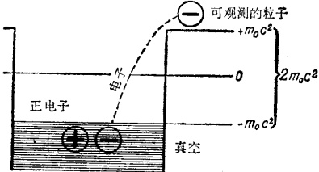

图 22

任何仪器也不能探测出真空电子，如果它们不从阱内跳出的话。显然，第一件要做的事就是将能量  $ m_{0}c^{2} $ 赋与它们。这还不够。我们知道，每一个粒子，不管是静止着的还是在运动中，都有一个原能  $ m_{0}c^{2} $。

为了从阱内出来，电子不仅必须克服高度为  $ m_{0}c^{2} $ 的位垒，它还必须获得它所固有的静能  $ m_{0}c^{2} $。因此我们得出：将真空电子与仪器隔开，使二者不发生相互作用的位垒高度为  $ 2m_{0}c^{2} $。

这是一个十分可观的能量，为了说明这点，只须提一下这个事实：仅在最近三十年内物理学家才能够将这样巨大的能量赋与电子。当狄拉克提出满载电子的真空时，这种能量仍

---

然是个梦想。

但是当电子在真空里的时候，它为什么就不能象在金属里那样，和仪器相互作用？又是泡利原理给出答案。

物体间的每一相互作用都是它们能量的改变。正是通过这种能量的改变，我们才能发现这一相互作用。如果真空电子与仪器相互作用，则该电子将改变其能量而过渡到其他能级。但困难在于：真空中所有能级都充满着电子！这里简直没有空着的地方。

这就是为什么真空电子不能被察觉的原因。它们生存于真空中，但不能彼此相互作用，也不能与任何仪器相互作用。在无限漫长的岁月里，这些电子与我们共处着，我们从未猜想到它们的存在，因为它们也从未以任何形式留下自己的踪迹。

## § 90 “空穴”的诞生

让我们假设由于某种原因某一个电子获得了足够的能量，并从真空中跳了出来。电子自由了，因而它的总能量变为正的。但真空里会发生什么呢？

一个空穴形成了。电子在真空里的旧址仿佛是离子化了。这个旧址获得了一个数值等于电子电荷的正电荷。

我们记得讨论半导体时就曾谈到过空穴。在半导体里电子跃进传导带，因而在填满了电子的价带内留下一个空穴。这个空穴在价带内具有负能量。这确实是个醒人耳目的类

---

比，但类比也就到此而止。在半导体内，空穴确实是个“空址”，引用它的目的纯粹是为了便利于描绘价带和传导带内不同类型的电子运动。

但真空里的空穴则是十分不同的东西。这里，它与电子没有什么不同。它是个真实的粒子，它的真实性一如电子。和电子一样，空穴具有静能量  $ m_{0}c^{2} $，这个能量等于真空位阱的最高能级的深度。

换句话说，电子和空穴只能成对地产生于它们的真空的乌有之中。用于产生每一个质量相等、能量为  $ m_{0}c^{2} $ 的粒子，因而产生一对粒子的能量为  $ 2m_{0}c^{2} $，这点，前面已经说过了。

电子能遨游于自由世界，然后返回真空。要做到这点，它必须遇到一个空穴，并与之融合。这样，电子就再次成为无法观察的，而空穴也一齐消失。

但事情还不止如此。在返回真空以前，电子必须交出用来将它从真空中抛射出来的能量，换句话说，即用来产生电子和空穴的能量—— $ 2m_{0}c^{2} $。

交出的能量将以什么形式表现出来？以  $ \gamma $ 光子的形式。

 $ \gamma $ 光子将在电子与空穴融合的地方飞出并将此能量带走。

最后的问题是：为什么要由 r 光子来接管这一能量呢？这是因为：电子-空穴偶在坠入乌何有之乡的时候，交出的能量足够与硬 r 射线相对应。产生出来的光子数目绝不少于二（但也极少大于二），这是因为进行融合的电子和空穴具有相反的自旋。

这一切都是很自然的：由于真空中电子和空穴的整个动

---

量等于零，融合时动量相抵消。因此一个r光子也需要一个具有相反动量的配偶，这样它们的总动量也将等于零。这就是前面讲过的守恒定律的要求。

如果一个电子和一个正电子在第三个物体(例如核)附近发生碰撞，则这个物体能够吸收碰撞粒子的能量和动量的一部分。这样就会有一个而不是两个光子出现。

## § 91 漫谈真空

物理学家听完狄拉克的讲话后，摇了摇头。甚至量子力学的最忠实的信徒也只把狄拉克的理论当作物理学的大笑话。要坚持这种疯狂的假说是需要意志力量的。

可是怀疑派和讽嘲派含羞退却的日子不久就到来了：一个发现为狄拉克理论高奏凯歌。

1932 年英国人布拉克特和意大利人欧卡里尼将照相底片向宇宙射线暴光，结果发现对应着一个电子和另一个具有相同质量但带正电的未知粒子的两个轨迹。轨迹在一个点上朝不同方向分叉。由于照片是在置于磁场中的一个特殊的室 $ ^{*} $中制成的，轨迹的不同方向肯定地表征不同的电荷。

这样空穴就被承认，并被取名为正电子。在一系列微观粒子中，它是第一个被称为反粒子的。过一会儿我们还要回头来谈这些反粒子。

---

狄拉克的理论即使在作出正电子这一项预见后便停步不前，它也会在物理学中赢得一个光荣的位置。事实并不是这样。狄拉克打开了物理学家的眼睛，使他们看到了微观世界的全新景物。

首先就是关于真空。根据狄拉克理论:真空充满了电子,这些电子不与真空之上的粒子相互作用。当电子离开真空时,正电子立即产生出来。电子和正电子只能一对对地诞生、死亡。

那么我们或许也可以说真空充满了正电子，只是当正电子离开真空时，电子才出现。狄拉克原理在其最初形式中认为二者是同样地可能的。当然，我们宁可认为真空中充满了粒子而非反粒子。理由是我们的周围到处都是电子，而正电子倒真地是我们这个世界里的稀客。从这点就应该得出结论：在这个世界里，正电子要远远少于电子。但狄拉克原理声明：一个粒子只能与另一个粒子——它的反粒子——同时产生。这就意味着：在这个世界里电子的数目应当与正电子的数相等。

奇怪！更奇怪的是我们这个世界存在着，而我们自己也存在着，因为没有任何东西能阻止电子与正电子相碰撞而坠入真空并化为摆脱了驱壳的幽灵——光子。

可是，电子并不经常遇着正电子，事实上这种遭遇是非常罕见的。因此没有理由担心我们这个世界会变成真空。这样看来，电子确实多于正电子了！可是正电子又往哪儿去了呢？

---

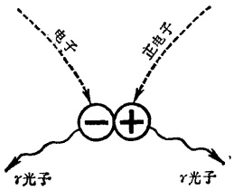

图 23

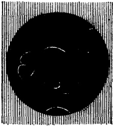

图 24

人们认为自然界已作了最大的努力将正电子与电子尽量远地隔开。在科学幻想小说家和某些科学家中，这是一个普遍的想法。他们坚信：在宇宙的某个地方，存在着由反粒子构成的诸世界，即所谓的镜世界。在那些世界中，正电子是主人而电子却是稀客。

下一个问题是：如果电子有它的反粒子，难道质子就不该也有它的反粒子吗？这样，我们就该有个质子真空啰！而且，普遍地说，每个粒子都应该有其反粒子，也就是有自己的真空。这样，真空就应该充斥着(满满地充斥着)中子，中微子和介子。哪里有什么虚空呢！真像个无底洞，洞里全是些未出生的和死去了的粒子。

真是个动人的景象，可是有些太难捉摸了。过不多时，物理学家抛弃了狄拉克的真空而代之以某些更加完美的概念。这些我们留在后面讨论*。

---

粒子在获得足够的能量后只能一对对地从阱里出来。当然，最先逸出的是最轻的粒子：中微子和电子。对一个质子和反质子来说，这个能量至少要比给与电子-正电子对的能量大两千倍。粒子愈大、愈笨重，使它从真空中出来也就愈困难。

## § 92 再谈真空

当电子-正电子偶消失时，我们知道一对高能γ光子便告诞生。但为什么诞生的恰恰是光子而非其他东西？这点我们现在仍然不清楚。

当弹子彼此碰撞时，我们看到的相互作用是：一个球朝着某个方向飞去，另一个球则继续向前运动。你试用下述办法使一个静止的球运动：让另外一个球几乎擦边而过但又没有接触到它。这简直就像马拉着车又没有套在车上一样。

在这两种情况中，物体的相互作用都由于接触：一个球击中另一个球，马拉着车。

还有另一种类型的相互作用。苹果坠落于地。磁石吸引着铁。带电球相互吸引或排斥。吸引这个词本身就表明：物体已经开始隔着一定的距离相互作用。

可能这个相互作用是通过空气传递的。对此实验早就作出了否定的回答。地球吸引着月亮，太阳吸引着月亮和地球，虽然介乎它们之间的几乎就是真空。原子核吸引电子，虽然它们之间是绝对的真空。所有这些表明：物体不通过任何接触也能相互作用。

---

一个世纪以前，物理学家给超距作用发生的空间场所取名为“场”。但他们并不准备接受这个事实：介乎它们之间的空间是空的。

作用不可能没有中间媒质而产生。必须要有媒质。这样，他们就想出了一种充满整个虚空的、极为稀薄的东西——以太。

许多年里，物理学家尝试弄清以太的特性，而这些特性，本书一开头就说过，是真叫异想天开的，甚至是自相矛盾的。最后，在上个世纪末，对光进行的实验埋葬了以太概念。又过了几年，爱因斯坦的相对论表明：以任何方式或形态来挽救以太都是毫无希望的。

以太寿终正寝了，可是又没有东西能代替它。物理学家最后让了步，接受了虚空中的超距作用。但是虚空又怎么能成为超距作用的传递者呢？甚至最伟大的思想家也不能理解。虚空是一无所有的，是个0。

这就是你的想当然。可是我们愈依赖于常识，我们就愈难摆脱它的桎梏。毫无疑问，空间是万物的贮藏所，这难道不是明摆着的吗？为物质占据着的一部分空间叫作物体、粒子，等等。但也有不被任何物质占据的空间。我们把它叫作虚空，空的空间，真空。这两部分是没有任何联系的。真空对物体不起作用，物体也不与真空相互作用。当然，物体之间能通过空的空间相互作用，但虚空这里是无足轻重的：相互作用仅仅起因于物体本身。

---

## § 93 空间依赖于物体

后来出了这么一个人，他不仅对上述说法怀疑，而且对每件事物都从头到脚重新审查。他就是爱因斯坦，他的理论就叫广义相对论。他的第一个理论，即狭义相对论，讨论的是快速运动的物体，这点我们已经说过了。广义相对论包括远较前者更为广泛的问题。一句话，它讨论的是物体与空间的相互关系。

广义相对论的主要观点在于声明：物质影响着它周围的空间。没有物体的空间是绝对地均匀的（这当然是想象的空间），但只要物体被带进其中，它便会失去这均匀性。

这是怎样发生的？我们又怎样量度这种不均匀性？这件事就让几何来做吧。一无所有的空间的几何就是我们在学校里学的一般的几何——欧几里德几何。在这种几何中，两点之间的最短距离是一直线，平行线永不相交，还有其它的显而易见的陈述叫作公理，而公理就是一目了然的、不须任何证明（顺便提一下，也不可能证明）的定理。

但在上个世纪初，俄国几何学家罗巴契夫斯基发现其中一个公理(平行线公理)有个瑕疵。他声明：如果抛弃这个公理，则有可能建立起另一种几何，它也如欧几里德几何一样，毫无内在矛盾，但却与常识格格不入。罗巴契夫斯基几何是那样地不寻常，那样地难以捉摸，以致当时没有人懂得它。年复一年地过去，罗巴契夫斯基的著作在大学图书馆的书架上

---

沾满了灰尘。

罗巴契夫斯基同时代的人被他的观点吓倒：根本就没有什么一般的、能应用于所有的世界的几何；每一种几何都是由它所讨论的具体物体的特性来决定的；空间的几何依赖于存在其中的物体或其他什么东西，并且依赖于它们的形状。简直是亵渎上帝！凡人竟敢改变上帝赐给的放之宇宙而皆准的几何！

但在爱因斯坦著作中，这些观念又获得了可尊敬的地位。正如没有物体的空间不存在一样，统一的、均匀的空间也不存在。在物体四周的虚空中，两点之间最短的线，在一般情况下，不再是一条直线，而是一条名叫短程线的曲线。这段曲线的两个端点和物体愈靠近，物体的质量愈大，则这段曲线也就愈弯曲。

我们怎么能断定这些观念是正确的呢？就让光线来帮助我们吧。由于物体的存在而产生的空间弯曲是非常微小的，在一般情况下是察觉不到的，我们必须将实验在星际空间中进行，并且选择某个大质量星体，如我们的太阳，作为使空间弯曲的物体。如果我们观察一条被认为是直线的线的弯曲，那自然是最方便的。如果我们相信经典物理学的话，这条直线就应当是光线产生的一条线。这也正是爱因斯坦准备给予驳斥的。

让我们将望远镜指向某个星体，并给它拍照。当它的光线经过太阳近旁时，我们再次给它拍照。第一张相片是在夜间拍摄的，第二张是在全日蚀时拍摄的。

---

根据经典物理学，这个星体应当呈现在两张照相底片的同一位置上。不管光线是从太阳近旁经过，还是在远离它的地方经过都不应当产生丝毫差别。可是根据广义相对论，光线经过太阳近旁时，它的途径应当弯曲。第二张照相底片应当把该星相对于第一张照片的位移作为这一弯曲而展示出来。

1919年8月，一个特别的探测队开往阿拉伯沙漠，准备对一个全日蚀进行观察。激动人心的消息！照相底片展示了空间的弯曲。不仅如此，弯曲的程度几乎与爱因斯坦预期的数值完全一样。

从那时起，物理学家关于虚空的概念发生了根本性质的变化。空间不仅容纳着物体，并且还容纳着场。

## § 94 实物和场

什么是场？物理学家用这个词来描述这样的空间，在此空间中诸物体呈现相互作用。当然，不发生相互作用的物体是没有的；所有物体最终是由粒子构成的，而其中没有一个粒子对其他粒子是漠不关心的。

由于这个原因，场处处存在，时时存在。不仅物体之间有场，物体之内也有场，因为物体之内也存在着没有实物的虚空。这就是场的第一个，也是最根本的一个特性。从这里立即引出另一个结论：场和实物一样，是真实的，普遍的。

场在下述这一重要方面区别于实物：实物是有实体的，

---

而场是没有实体的(如电、核、引力场)。但我们不能说场是不可察觉的。举苹果坠地为例：从物体的运动就可以明显地看出场的作用。

场还显示了另一现象,那就是光——一种独自的、自动的作用。早在上个世纪,光就被确证是一种特殊的电磁场。

爱因斯坦在他的光电效应理论中引入了光子。这是个重要的概念。电磁场被量子化了，也就是说，它以单个粒子——场量子的形式存在着。光子就是这些场量子。

场的历史继续在发展着。1872年斯托列托夫发现光能够起着实物的作用：它能够将金属中的电子轰击出来。1900年列别杰夫发现了光对物体的压力，就好象光是由具有质量的真实粒子组成的。

这两个重要实验和光子概念不可避免地导致如下结论：电磁场具有实物特性，而场量子能具有实物粒子的特性。

这就是在实物与场之间的鸿沟上架起的第一道桥梁。与此同时，德布罗意的假说从鸿沟的另一侧建筑着这座桥。电子能够具有波动特性。这就是说，实物能以场的形式活动。

无边无际的、不可秤的场，也能具有体积和质量。占据有限空间并且可秤的实物，也能被剥夺掉体积和质量。

我们现在是否应当作出这样的结论：实物和场应当融合成一个不可分辨的整体，以代替原来的尖锐差异？否！场的实物特性只是当它的量子的能量很高时才是明显的。而实物的场特性也只是当粒子能量很高时才呈现出来。

在低能量的情况下呢？场还是场，实物还是实物。

---

## § 95 没有真空

在照相底片上发现的电子和正电子的连带诞生不仅仅揭露了真空之谜，它是场转变为实物的第一个实例。不久以后狄拉克原理的逆预期又得到证实：电子和正电子相遇而连带湮没时，两个γ光子(在同一瞬间)诞生。

且慢！电子和正电子并未转变成任何东西：它们消失于真空之中，可是自身并未变化。它们释放的能量获得了γ光子的形式。这正象在原子中一个电子从较高的能级跳到较低的能级时那样，将自己的能量以一个光子的形式释放出来；但这里，电子至少还是个电子！

说实在的，上述的比拟也不十分妥当。在电子-正电子湮没的例子中，真空、虚空以场的形式——它的基本形式——出现。在原子中，电子虽能放弃能量，但只能放弃其中的一部分。它能够失去全部自由运动中的动能而静止下来，但它的主要能量(原能)在任何情况下也没有交出来。也就是说，如果电子仍要作为一个电子存在着的话，它就不能交出原能。因为如果电子放弃了能量  $ E_{0}=m_{0}c^{2} $ ——这个能量是与它的静质量  $ m_{0} $ 密切地结合在一起的——那就等于失去其静质量，从而也就等于失去粒子的本质。我们说过，粒子与电磁场量子的区别在于：前者能以静止状态存在着，并且具有一个不等于零的质量。

这就是说，电子一旦跳进真空并交出正电子-电子的联合

---

原能，它便不再是个电子，正如正电子也不再是个正电子一样。自然，它们的质量不能消失得无影无踪，正如它们的能量也不能化为乌有一样。但这个质量已经转变了性质，转变成非实物的、似场的质量，同时这个原能也转变成场量子——r光子的能量。这样，真空中毕竟没有什么真的电子了。不妨说，它们只是概念上地、潜在地存在于那儿。

作这种描绘的理由是：真空或虚空或乌何有一般是不存在的。充满整个空间的是实物和场。狄拉克头脑里的真空仅仅是一个生动的形象，以便利于描述实物粒子和场量子之间的相互转变过程。

本书的作者并不打算牵着读者的鼻子走。他觉得最好先有一个一般的真空概念，然后再采纳一个非习惯的真空概念，最后再把二者都扬弃掉。不管怎样，这就是科学发展的自然途径。

电子碰到了正电子，二者转化成一对  $ \gamma $ 光子。这既然可能，其反过程显然也应该可能： $ \gamma $ 光子转化成粒子偶。这确实能够发生，只要光子具有足够的、至少是  $ 2m_{0}c^{2} $ 的能量。

光子可以被观察到，可以被记录下来，而且是颇有实质的。另一方面，除了电子和正电子从真空中跃出的情况而外，真空却是颇无实质的。我们怎样将二者调和起来呢？

实际上也没有什么须要调和起来的。只要能量不大，光子仍然作为光子而被记录下来。一旦能量变得足够使一个光子转化成一对粒子时，我们就开始察觉到光子的真空特性：光子能够消失，而取代其位置的是电子-正电子偶。

---

这里真空一词表示实物粒子和场量子相互转化的可能性。这是我们的基本观点。而从本章开始到现在，我们就一直在讨论这个基本观点。

事情显然比较清楚了。我们既然在实物和场之间的鸿沟上架起了一座桥，交通便可以往来进行了：实物粒子转化成场量子，场量子转化成实物粒子。重要的事情是必须上桥，但这个桥很高——它的能量高度是  $ 2m_{0}c^{2} $。对电子来说，这个高度表征几兆电子伏特，对质子来说，则表征几千兆电子伏特。

一句话，真空向场作了让步。我们将继续使用真空一词，这是因为它的形象生动。这样，我们就能方便地将真空想象成一个无边无际的海洋，那里海豚般的粒子正在跳进跳出。

## § 96 鲸鱼歇在什么上

精妙的量子力学栖息在几条鲸鱼之上，其中一条我们直到现在才能解释清楚。正象往昔一样，鲸鱼共分三类 $ ^{*} $：普朗克量子假说，爱因斯坦相对论，德布罗意关于粒子的波特性的假说。这里我们将对后一种假说进行讨论。

在前几节里，我们正谈着为宇观世界而建立的广义相对论，忽然又跳到微观物体的量子世界上来，这似乎有点不合情理吧。问题是我们一再强调：在某个规模的世界中生效的定律，在另外一些规模的世界中至少也是不精确的。因此，我们

---

有什么根据将爱因斯坦的物质与空间概念扩展到微观世界中去呢？根据就是德布罗意的假说，那些已被可靠地核对、证实的假说：微观粒子具有波特性；它们的二象性处处存在，时时存在。但波是什么呢？根据它不确定的广延性和永恒的变动性等特征来判断，波的实质明显地是一个场。因此，德布罗意假说实际上就是声明：实物粒子具有场的特性。在这个意义上，它补充了爱因斯坦的假说：场量子（光子）具有实物特性。

微观粒子的场特性是怎样体现出来的呢？我们已经遇见了很多的实例，其中最典型的就是电子和其他粒子在空间的弥漫。正象物理学家说的那样，它们是不可定位的。电子在此一瞬间既在这里又不在这里*。如果企图准确地测量它的运动速度，我们便不再能够说出它的位置。这正是场的特征。由于场是无往而不在的，因此确定场的位置是不可能的。

如果我们增加电子的速度，则当它接近光速时会变得更重。它从哪儿得来这一额外的质量？电子照例是由电场来加速的。在加速过程中，电场仿佛进入了电子，并将一部分能量赋与了它。由于电子的能量增加了，因而根据爱因斯坦关系（§ 85），电子的速度和质量也应该增加。

但场将质量泵入粒子这一过程不能无止境地进行下去。质量将极迅速地积累起来，最后粒子的动能将与其原能相等

---

（当粒子速度大约达到光速的80%时，这种情况便会出现）。此刻一个新的过程介入。在这个新过程中，粒子的波或场样的特性居主导地位。处于这种状态下的粒子将一股脑地摆脱其积累起来的能量和固有能量(原能)，转变成场量子。

粒子质量随速度而增长的原因是大自然赋与它们的一种自我保存本能*。粒子不愿丧失其个性，并愤怒地抗拒任何能量的积累，而当它们愈是接近向场的转化，这种抵抗愈是剧烈。

粒子永远不能以场的传播速度运动，而场也永远不能以别的速度传播。

## § 97 粒子更换装束

直到现在，关于粒子的转化我们只谈了电子(当然还有正电子)。中子被发现后，人们认识到中子也能转化，但与电子不同，它不能转化为场量子，只能转化为其他粒子。

首先，中子能转化为一个质子，一个电子和一个中微子（在  $ \beta $ 衰变中）；但只有自由中子才能发生这样的转化。在核内，中子转化成一个质子和一个  $ \pi $ 介子。往后发现：中子的第二种转化与第一种转化并没有很大的区别。一个自由  $ \pi $ 介子衰变成一个  $ \mu $ 介子（其质量相当于前者的 3/4）及一个中微子。这个  $ \mu $ 介子又衰变成一个电子，一个中微子和一个反中微子。

---

子。这样我们就有：

自由中子的衰变：

中子→质子+电子+中微子

“核’中子的衰变：

中子→质子+ $ \pi $介子

 $ \pi $ 介子  $ \rightarrow \mu $ 介子 + 中微子

 $ \mu $ 介子→电子+中微子+反中微子

结果：中子→质子+电子+2中微子+反中微子

当然，用这样一个账单来说明两种转化的相似总的来说是行不通的，理由是： $ \pi $ 介子在核内并不衰变。我们知道，作用于核内粒子的是电力以及强大得多的、保证核的稳定性的核力。

既然有新型的力，就意味着有一种新型的场。既然有新型的场，就表明有新型的量子。电磁相互作用的传递者是光子。以此类推，核相互作用的传递者就必然是 $ \pi $介子(我们说过， $ \mu $介子与核的相互作用是微弱的，因此它不能是核场的量子)。

那么，总起来说， $ \pi $ 介子是核场的量子。但不同于光子，这些量子具有静质量，而这个质量在微观世界中是相当可观的，它几乎要比电子的质量大三百倍。由于这个原因， $ \pi $ 介子不能以光速运动。嘿，这也叫量子！与其说象量子，不如说象粒子。但它们是量子。物理学家刚刚为场与实物的相互关系描绘的协调的图画忽然又被搅乱了。

看来  $ \pi $ 介子是二象性的极端情况：它们是实物，这在于

---

它们具有非零值静质量；它们又代表着一个场，这在于它们的自旋是零。

让我们沉思片刻吧！问题的关键是：自从量子力学兴盛以来，物理学家在实物粒子和场量子之间又划了另一条新的、明确的分界线。这个分界线就是二者在自旋上的差别。人们发现：真正的实物粒子只能有一个相当于1/2普朗克常数*（或 $ h/4\pi $）的自旋，而场量子必须有等于零或一个普朗克常数（或 $ h/2\pi $）的自旋。

自旋之所以体现出粒子和场本质上的深刻区别是有充分理由的。人们发现：自旋对微观物质的品性起着本质的影响。

回忆一下泡利原理：一个集团中不能有两个电子存在于绝对相同的能量状态中，不仅对电子来说是如此，对质子、中子以及所有的具有1/2自旋的粒子都是如此。

可是对于自旋为 0 或 1 的粒子，这个原理便失效。例如对光子世界(实际上是整个宇宙！)来说，可以有任何数目的光子处于同样的能量状态下，即具有同样的频率和自旋方向(光子的自旋等于 1)。

附带提一下，根据自旋的这种划分可以推论出：曾使物理学家一度感到棘手的  $ \mu $ 介子不可能是核场量子。它具有 1/2 自旋。但所有的  $ \pi $ 介子都具有零自旋，因而能充当场量子。可是它们的非零值静质量！……

---

## § 98 两面派的  $ \pi $ 介子

对物理学家来说， $ \pi $介子的非零值静质量简直是件奇闻。让我们把它弄个水落石出吧。

可能中子就是一个质子和一个  $ \pi $ 介子紧密结合而成的吧。否。简单的算术会使我们相信这一否定的答案。中子和质子的静质量分别近似地等于 1839 和 1836 电子质量，而带电  $ \pi $ 介子的静质量为 273。这就是说，一个中子发射出一个  $ \pi $ 介子后应当减少 273 电子质量，可是实际上它只减少 3。

当一个自由中子蜕变时，这个矛盾并不出现。中子失去一个电子，这样它就减少一个电子质量。此外，它还赋与电子和中微子双倍电子原能，其结果，蜕变后的质量便与质子相等。可是当中子发射出一个 $ \pi $介子时，它的质量损失约为自由中子衰变的质量损失的100倍。可是由于某种原因，这样大的质量损失又不会被察觉。中子生下一个 $ \pi $介子后，并未见消瘦下来，体重也未减轻。这究竟是怎么一回事呢？

看看下面这幕电影吧。中子割舍一个负介子，并将它向质子射去。质子接过介子并立刻转化成中子。射出介子的中子变成了一个轻量级的质子，而捉到介子的那个质子却成了超重中子。说时迟，那时快，超重中子又射出了这个介子，这样它就又变成了一个正常的质子；而轻量级质子接过这个介子并变成一个正常的中子。这场球赛包括不对等的两局，第一局是全部已知物理学定律所绝对禁止的，而第二局倒是可

---

以允许的。

禁令出于下述理由：任何粒子的质量不能小于它的静质量，可是这里却出现了不够重量的质子。这也可以用另外的语言来表述：中子这个前锋不能踢一个比3个电子质量还要重的球。为了发射一个介子，它必须从核内某处找到一个相当于270个电子的质量——一个真够大的质量。这并非对能量守恒定律的直接违反。从整个球赛来说，它并没有开守恒定律的玩笑，但第一局却似乎难避此嫌。

当物理学家发现这种情况时，他们倾向于这样一种想法——真是个很坏的想法，那就是：在微观世界中，能量守恒定律只能作为平均值生效，而对单个事件则会失效。当然，往后的科学发展证明：这个定律继续有效。对经典物理学来说，这场球赛仍然是个不解之谜。

当然，只要我们记住，我们是在和粒子的量子特性打交道，这团迷雾就会被驱散。物理学家给那些被经典教条所禁止的过程取了个名称：等效过程或虚过程。

一个粒子系统或一个单个的粒子，能以不同方式转变成另一粒子系统或另一单个粒子。我们可能不知道这些转变途径（实际的情况也往往是这样），但我们可以对这些转变过程进行随心所欲的描述，只要我们使用的那些中间过程符合当今的计算。在目前，虚过程是一些方便的、形象的概念。

另一问题是：介子能否在质子与中子间交换，就象电子在氢分子内交换一样？如果确是这样，事情就简单得多了，因为电子不会发生任何转化，而原子的结合却因电子交换得到

---

实现。也可能有一个负 $ \pi $介子循环在两个质子的外围。

不，这是行不通的。理由如下：最近科学家成功地将  $ \mu $ 介子引进原子云中，以代替电子，结果这项交换工作  $ \mu $ 介子也干得同样出色。首先，正象电子所做的那样， $ \mu $ 介子将两个氢原子结合成一个氢分子，即所谓氢的介子分子。由于  $ \mu $ 介子的质量大约为电子的 200 倍，因此介子的几率云也相应地更加贴近核，也就是说，两个原子靠  $ \mu $ 介子结合成的分子在体积上要小 200 倍。

当然，存在于氢介子分子中的不是一个  $ \pi $ 介子，而是一个  $ \mu $ 介子，而且起作用的力不是核力，而是电力。后者要远远弱于核力。

 $ \pi $ 介子不能象电子那样逗留在原子中，因为它与核起着既强烈而又非常特殊的相互作用。这里，特殊的意义在于： $ \pi $ 介子能将一个中子转化成一个质子，也能将一个质子转化成一个中子。

## § 99 揭露介子交换之谜

我们姑且认为  $ \pi $ 介子在核粒子之间循环。当然，这种循环不是在粒子外围而是在粒子内部进行的，方法是：一个粒子发射一个介子，而另一粒子将它俘获。但这种发射和俘获过程是与上面所说的守恒定律相抵触的。可是这些过程又存在着。这些过程在等效地进行着。

一般说来，等效过程或虚过程并不是新东西。回忆一下

---

微观粒子是怎样渗过位垒的。用经典理论的观点来看，一个粒子在位垒外的出现表明它跳过了位垒。但薛定谔方程指出：阱内粒子在未获得任何能量下，也具有脱离位垒的几率。这似乎是和能量守恒定律相冲突的。实际上，如果一个粒子自发地越过位垒，它必须从自身吸取能量，随后这个能量又必须消失。

前面我们曾借助微观粒子的波特性来解释这个谜。让我们扼要地温习一下。

根据海森堡关系，每个粒子都有能量（包括动能和位能）的测不准量。如果企图俘获一个正在穿越位垒的粒子，也就是说在垒壁内发现这个粒子，那就会使其能量成为不确定的。其结果，这个能量将变化到这样程度，以致允许粒子以经典的合法方式跳过位垒。

严格地说，能量守恒定律在经典意义下遭到了破坏。但量子力学证实：这个定律根本就没有被违犯。

我们也能用同样的方式来解释核粒子是怎样发射并吸收 $ \pi $介子的。关键是：海森堡关系(能量与时间的关系式)也可以应用于粒子的原能。这样，中子发射一个负 $ \pi $介子而消瘦，或质子发射一个正 $ \pi $介子而丧失体重，以及粒子因吸收介子而肥胖起来，——这些都可以被认为是粒子原能的某种测不准，而后者又是与它们的质量的某种测不准相联系着的。

很清楚，这些粒子原能的测不准量在数值上不能小于  $ \pi $ 介子的原能  $ \Delta E = m_{\pi} c^{2} $，这里  $ m_{\pi} $ 为  $ \pi $ 介子的静质量。让我们根据这个关系式求出能量的这个测不准将持续多久。换句

---

话说，质子和中子之间进行球赛的一个周期需多长时间。

根据海森堡关系：

$$
\Delta E\times\Delta t\sim h
$$ 

我们得出

$$
\Delta t\sim\frac{h}{m_{\pi}c^{2}}
$$ 

把  $ \pi $ 介子的质量  $ m_{\pi} $，普朗克常数 h 以及光速 c 代入上式，我们得出  $ \Delta t \sim 10^{-23} $ 秒。

时间真够短促啊！在这样一段时间里， $ \pi $ 介子又能走多远呢？显然有个极限。 $ \pi $ 介子能够具有仅仅小于光速的速度，因此， $ \pi $ 介子被核粒子抛出后所能走的最大距离为  $ R = c \times \Delta t $。这个数值大约为  $ 10^{-13} $ 厘米。但这一数值在数量级上与核力的作用距离相符合！太出奇了！它证实了我们的推理。

这样，俘获一个被核粒子违法地发射出来，然后又被其他粒子违法地吸收的  $ \pi $ 介子，是不可能的，其理由正如我们不能侦察出正在穿越位垒的电子一样。我们刚一开动头脑里的测量仪器，它立即就使参与  $ \pi $ 介子交换的质子及中子的能量增加到如此的程度，以致这种交换在经典方式下成为可能。

这样看来，隐藏在虚过程背后的实质还是微观粒子的波特性！核力的作用距离是有限的，理由正是：核场量子( $ \pi $ 介子)具有一个非零值的静质量。

 $ \pi $ 介子只是在核内执行任务时才表现出稳定的品性。在自由状态下，这个粒子的行为则十分两样。一旦居于核外， $ \pi $ 介子就在很短的时间内衰变，这个时间的数量级为一亿分之

---

一秒。一个正  $ \pi $ 介子转化成一个正  $ \mu $ 介子，一个负  $ \pi $ 介子转化成一个负  $ \mu $ 介子。衰变过程中，一个中微子被抛射出来。

不久以后，第三种  $ \pi $ 介子被发现——一个不带电的粒子。这个中性介子的衰变要比它的带电兄弟快十亿倍。临死的时候，它生下两个  $ \gamma $ 光子，但这种光子的能量要远远大于电子—正电子遭遇时产生的光子的能量。

正是π介子的这种不稳定性使得它们这样地异于光子。光子能够改变它的能量，甚至能把能量全部交出并作为粒子而消失净尽，但光子永不衰变。从来没有人观察到一个母亲光子分裂成若干带有较小能量的女儿光子。

π 介子把物理学家惨淡经营的场-实物相互关系的美丽图画弄得一塌糊涂了。π 介子的确是迄今所知的粒子和量子的最大的二象性混血儿!

## § 100 相互作用的秘密

在科学已知的全部场中，电磁场被研究得最多。关于电场和磁场，我们已经很熟悉了。电场既可以是静止着的电荷产生出来的，也可以是由运动着的电荷产生出来的。但磁场却只能由运动着的电荷产生出来。由于带电粒子的每一相互作用都与运动相联系着，并且体现于运动中，因此可以作这样一个一般的陈述：每一相互作用都包含着复合的电磁场。

为使问题简化，让我们暂且对磁场置之不理，而对电(更确切些说，静电)场进行一次更细致的观察。从上学的日子

---

起，我们就记得同性电荷相斥，异性电荷相吸。教科书是这样来解释这个秘密的：电荷在它的周围产生一个场，这个场排斥进入其中的任何同性电荷，而吸引进入其中的任何异性电荷。

这个解释并不比说“一个人死了，因为生命力离开了他”更高明一些。

在学校里，“力”字被换成“场”字。这个新字眼被引进来了，但并没有得到解释。场的特征也被给出（场强，电力线等），但更多的便没有说。

是的，经典物理学确实引进了场的概念，可是它并不能够赋与场任何特定的、确切的意义。场被证明是那样的复杂，以致直到今天它大体说来还在物理学家的认识范围之外。

但量子力学在这方面却获得了若干十分重要的进展。让我们看看它作出了哪些成绩。

物理学知道两种电荷——正的和负的。质子具有正电荷，电子具有负电荷。这些(以及它们的反粒子)是仅有的、绝对稳定的电荷携带者。现在我们将讨论电子。质子看来却复杂得多，因此留在以后讲。

这样，所有的负电荷都是属于电子的。让我们取两个电子，看看它们是怎样打架的。首先，它们必须摸清彼此的位置。

首先须要考虑的是：每一个电子都使自己周围的空间变得弯曲，正象爱因斯坦对一切物体——不管它们是多么大，或多么小——所要求的那样。于是，每个电子将沿着一条环绕

---

另一电子的曲线运动着。这就好像一个球在一张纸上运动，而这张纸却被静止其上的另一个球压得弯曲了。

当然,这个弯曲是质量而非电荷引起的。因此,这里又出现了另外一个场——引力场。

第二件须要考虑的事是：电子打乱了自己周围的真空的均匀性。因为如果真空被认为充满尚未诞生的电子的话，那么我们的真空之上的电子就势必要排斥那些真空电子。如果这个电子又遇到一个对手，后者也将以同样的方式作用于真空。

但真实电子和真空电子间的排斥是相互的排斥。对于第二个电子来说，这个真空电子也将一视同仁。这样真空电子对两个真实电子的排斥就体现为两个真实电子间的相互排斥。

当然，如果我们想得再深入一些，这个推理看来还是有点毛病的。我们想要说明排斥，因而引入真实电子与真空电子间的排斥而又未对此加以任何解释。

尽管如此，粒子通过真空相互作用的概念还是有用的。我们唯一须要假定的事情就是：一个电子能自发地发射光子。

一个电子能发射光子。原子云中电子的跳跃能产生光子，这点我们已经知道。但在这一过程中，电子改变了它的能量状态。确实是这样。如果一个自由的、居于定态的电子在发射一个光子后，立刻将它收回来，则情况又将如何呢？这样，电子的能量仍然保持不变。但这一过程本身是经典力学所

---

禁止的。可是我们知道量子力学是允许这一过程的，唯一的条件是：电子必须被纳入测不准关系的框框里去。

电子发射并收回光子的频率应当仅仅依赖于光子的能量。光子的能量愈大，电子完成这一动作也愈快。

当然，在光子居于电子之外的这段时间里，它将从容地环绕母亲的身旁游弋一番。这里所说的身旁，范围究竟多大呢？无限大。必须记住：电子能发射任何能量的光子，甚至能量最小的光子。而这些能量最小的光子，能够离开母亲游向任何可以想象的远方。当然，对于那些具有十分确定的频率的光子来说，它们的作用距离属于光子波长的数量级。对于可见光线的光子来说，这个距离的数量级是一微米的十分之一。

光子自然不肯仅仅作为观察者而活动着。如果一个电子发射的光子与另外一个电子相遇，它们将彼此猛烈地碰撞。其结果，可能其中某些光子将永远不会返回母亲的怀抱。它们可能，譬如说，被母亲的对手吞食进去。

这里看来好象能量守恒定律遭到了确实的而非等效的破坏。事实并非如此。电子能量的变化量恰恰等于那些回不来的光子所带走的能量。这样，两个电子将彼此远离：它们彼此离开得愈远，它们相互作用的能量也就愈小。

尽管如此，这个解释也不能令人十分满意。这个场不知何故被拴在它的创造者身旁了，但我们知道光子是能够完全独立行动的物质。

为了更好地自圆其说，人们又引入了另外一个虚过程，而

---

这个过程也是实际上遇到过的。一个被电子发射出来的能量足够大的光子能够在非常短暂的许可寿命中，转化成电子-正电子偶。

这样，在一瞬间一个电子将被两个电子和一个正电子所代替。在另一瞬间，这个电子将还原成自身。但两个电子中究竟是那一个将与正电子融合而湮没？那是确定不了的，因为两个电子完全一样。

多么有趣啊！遗憾的是我们不能观察到单个电子是怎样开放出一束粒子之花的。这一切都是在那样短暂的一瞬间渡过的。

但无论如何也得让我们检验一下。根据海森堡关系而作的简单计算表明：这个短暂的时间持续大约  $ 10^{-21} $ 秒。在这段时间里，光子能够生出第二代电子和一个正电子，——它们构成对偶；而对偶的出生地距离第一个电子约  $ 10^{-11} $ 厘米。

这个数量恰好代表着电子在空间的最小弥漫。 $ 10^{-11} $ 厘米正是接近光速运动的电子的德布罗意波的波长。

这幅情景是多么奇妙啊！它说明电子(当然也是其他所有粒子)波特性的实质是相互作用，是它的场。电子的弥漫是因为它跳进了真空又在近旁从真空中跳了出来，而这样的跳进跳出在一秒钟内要进行数不清的次数。

物理学家把具有这种奇妙品性的电子称为颤抖着的电子。这个形象是非常逼真的。在这个过程中，电子能够振动，而它的位置可以是许给它的区域内的任何一处。这个区域将由电子抛射的光子——后者能产生电子-正电子偶——的能

---

量，以及由此而导出的光子的波长来确定。

## § 101 虚效应王国

这样，一个电子虚发一些光子。这些光子又虚化为一些电子-正电子偶。这些偶又融合成一些光子。这些光子又被电子吸收。整个万花筒般的转换在以神奇的速度进行着——每秒几百亿亿次。

某个电子发射的光子可以被别的电子俘获。但电子都是一模一样的，因此也无法分辨出究竟是那个电子俘获了这个光子。

这个交换的结果不是虚的了，而却是十分真实的：诸电子彼此尽量远地分开。即使它们间的距离超过了真空弥漫几倍，光子也能追上它们，并将双方推开得更远。但电子间的距离愈大，高能光子追上它们就愈困难，这就意味着，在光子交换中，光子赋与电子的能量也就愈小，因而电子的电排斥也就愈微弱。这正符合库伦定律的陈述。

电子的相互作用是无往而不在的。为了简单起见，我们假设只有两个电子参与这个相互作用，实际上宇宙间的全部电子都已参加进来了。我们可以说，这两个电子所形成的无边无际的电磁场，达到了无限宇宙的每一角落。

电子和正电子的相互作用，电子和质子以及一般说来所有异性电荷的相互作用，都具有相同的等效(虚)性质。只是在这种情况下，光子交换的结果不是粒子双方向后退缩，而是

---

相互靠拢。

自然界是二重性的。它既要经管对立的统一，又要经管统一的对立，或统一的对比*。具有相反电荷、相同质量的两个粒子，即互为镜中映象的两个粒子，一旦从镜中跳出相互遭遇，就会将双方的电荷勾销而转化为起着相互作用的场量子。

## § 102 虚的变成真的

物理学家在给事物命名的时候，并不总能想出最妥当的词。虚，意味着实质上，而非事实上，是真实的，或不十分真实的。可是虚真空能够突然地变得非常真实。

回想一下原子中电子的过渡 $ ^{**} $产生出光谱。我们说过，电子从一个状态过渡到另一个状态，只有当电子在这些状态下的几率云，在空间的某处彼此重叠时，才是可能的。

氢原子也有这样的两个状态，它们的电子几率云完全融合在一起。这两个状态都属于第二壳层(此壳层从锂原子开始装填)。但氢原子中还存在着属于第一壳层的另一个状态，也就是最低的、最稳定的能态，氢的电子在正常条件下就居于这一状态中。

---

对应第一壳层的状态和第二壳层的状态——也就是原子大厦的一楼和二楼——是彼此从来不重叠的球形云。还有我们记忆犹新的第三状态：它是联接一楼和二楼的一个不方便的纵贯楼层。

第三状态只是在锂原子中才以纵贯楼层的形式出现，而在氢原子中它必须与二楼住宅相吻合。因此，在锂原子中所能观察到的电子过渡在氢原子中则观察不到。在一般情况下，原子的房客并不直接在两层楼之间跳上跳下，它们宁愿先进入纵贯楼层再说。

实际上也正是这样。从来没有人在氢原子中观察到两层楼间的直接过渡。如果一名房客由于某种原因被从一楼抛到二楼去了，它将会十分孤独地呆在那儿直到某个不合法的机会将它带回一楼（这样一种过渡几率小到可以完全被忽略）。

在十五年前左右，物理学家发现电子成功地回避了这一清规戒律，轻而易举地从二楼溜回一楼。真有点象是乘电梯下来的。

这一违法事件很快就得到解释。这里需要的只是丰富的想象力，物理学家确实是富于想象力的。回忆一下真实电子排斥那些未出生的真空电子的虚过程。在那个描述里，电子仿佛在和自己的影子博斗着。

事实上也正是这样。电子和真空的相互作用，即电子的“颤抖”，赋与电子自身非常真实的——虽然是很小的——一点额外能量。可是这点微不足道的能量（比原子内的电子能

---

量小得多)也足够使氢原子中的两个交织着的状态分开，从而使电子能够从这一个状态过渡到另一个状态，即从二楼过渡到目前已经变成现实的纵贯楼层，然后经过这个楼层过渡到一层。

当然,实际可能观察到的只是从二楼向纵贯楼层的过渡。这已经足够使人满意了,因为其余的将自动进行。

但真空给氢电子增添了多少能量呢？如果我们使用普朗克关系并将其转化为频率，我们将会看到，增加的能量子不属于r射线，甚至也不属于可见光线，却属于高频无线电波波段。

这就是为什么这一重要现象不能被常规的光谱方法发现的原因。第二次世界大战后高频无线电振荡器制造成功，因此氢原子可以用高频电磁波来照射。其结果，氢原子立即对符合于真空给它增添的能量的频率作出反应。一个很深的衰减出现在氢无线电光谱中的这一频率的位置上：氢原子积极地吸收着这一频率的量子。

不久以后，第二个真空效应被发现。我们已经讲过了两种电子磁体。一种是电子绕原子核运动而形成的，另一种则是电子的自旋运动造成的。在磁场中，这两种磁体结合成一个具有确定数值的统一磁体。

物理学家以极高的准确度测量了这一基本磁体的力。结果发现，这个力比两个磁体的合力略大一小点。问题就在于这一小点。物理学家最后不得不承认：统一磁体磁力的这一小点增量，是由于电子与真空的相互作用引起的。

---

这个解释与我们曾经作过的解释相似。原子中运动着的电子沿途排斥着真空电子，仿佛一只静止的船只能排水，而一个航行着的船却迫使水跟着运动。将运动从电子转移给真空，结果就在真空中产生出一个真空电子流。这个虚电流的磁效应，便增添在真实电子运动引起的磁体上。

浸透着各种虚效应的量子力学不仅能解释这些重要现象,而且还能将它们计算出来,同时计算结果还十分漂亮地与实验相吻合!

这样看来，物理学家就是要有想象力。虚(等效)过程毕竟应该赢得人们的尊重。

## § 103 寻找新的粒子

物理学家一旦承认了微观粒子世界不寻常的性质——它们之间的相互关系以及它们和场之间的相互关系，一个猎取新粒子的活动便真地开始了。每一新粒子都是微观世界的一个新的方面，对其特性的每一新的发现都是知识道路上的一个进步。

一批批带着复杂的装置、设备和仪器的探险队在紧张地工作着。在很长的一段时间里，宇宙射线——那些从宇宙深处向地球飞来的粒子流——是新粒子的唯一供应者。新仪器发明出来了，老仪器得到了改进。一批批探险队开往高山之颠，深入那更加贴近苍穹的洁净的气层中，另外一些探险队驶入海洋，还有一些将火箭送进更高的太空。结果，捷报象雪片

---

似地飞来，每年发现的新粒子达数十种之多。

对此首先作出反应的是理论家。他们实在感到困惑不安，因为，他们说，根本不可能有那许多不同的粒子。实验人员用一种极为苛刻的目光检验自己的成果。这样，新粒子一个接着一个地消失了。它们的下台比早先的登场还要快。

但胜利果实是显著的。首先是 $ \pi $介子。五十年代初，质量大于质子和中子的粒子被发现；他们叫作超子。宇宙射线给物理学家赠送了一项非常贵重的礼品：一群 $ K $介子（很快我们就会看到为什么它们是这般贵重）。

当一系列巨型加速器开动以后，质子被加速到接近光速。两个新粒子被发现了，这就是反质子和反中子。这样，狄拉克理论的预期便得到了证实。

今天，微观粒子表册真叫人惊叹不已。这里，大约有三十种不同类型的粒子，二十五年前还只有四种。

让我们看看这个表册。第一件引人注目的是粒子的质量范围很广：从一个电子质量到☎超子的2500个电子质量。粒子的质量分布是颇不均匀的。两个或三个质量近似的粒子形成小组。

可是电荷和自旋却没有呈现任何五花八门的迹象。粒子的电荷只能具有三个数值：+1, 0 和 -1。这里 -1 就是电子的电荷。自旋也具有三个数值：1, 1/2 和 0 普朗克单位  $ (h/2\pi) $。最后，表中大部分粒子是不稳定的：平均起来，它们的寿命从  $ \mu $ 介子的百万分之几秒，到  $ \pi^{\circ} $ 介子的亿亿分之几秒。这两种寿命属极端情况。介乎二者之间的粒子也是不稳

---

粒 子 表

<table border=1 style='margin: auto; word-wrap: break-word;'><tr><td style='text-align: center; word-wrap: break-word;'>粒子种类</td><td style='text-align: center; word-wrap: break-word;'>名称</td><td style='text-align: center; word-wrap: break-word;'>符号</td><td style='text-align: center; word-wrap: break-word;'>质量（电子质量）</td><td style='text-align: center; word-wrap: break-word;'>电荷</td><td style='text-align: center; word-wrap: break-word;'>自旋（普朗克单位 $ h/2\pi $）</td><td style='text-align: center; word-wrap: break-word;'>寿命（秒）</td><td style='text-align: center; word-wrap: break-word;'>衰变方式</td></tr><tr><td rowspan="11">轻子</td><td style='text-align: center; word-wrap: break-word;'>光子</td><td style='text-align: center; word-wrap: break-word;'>$ \tau $</td><td style='text-align: center; word-wrap: break-word;'>0</td><td style='text-align: center; word-wrap: break-word;'>0</td><td style='text-align: center; word-wrap: break-word;'>1</td><td style='text-align: center; word-wrap: break-word;'>稳定</td><td style='text-align: center; word-wrap: break-word;'></td></tr><tr><td style='text-align: center; word-wrap: break-word;'>电子</td><td style='text-align: center; word-wrap: break-word;'>$ e^{-} $</td><td style='text-align: center; word-wrap: break-word;'>1</td><td style='text-align: center; word-wrap: break-word;'>-1</td><td style='text-align: center; word-wrap: break-word;'>$ 1/2 $</td><td style='text-align: center; word-wrap: break-word;'>同上</td><td style='text-align: center; word-wrap: break-word;'></td></tr><tr><td style='text-align: center; word-wrap: break-word;'>正电子</td><td style='text-align: center; word-wrap: break-word;'>$ e^{+} $</td><td style='text-align: center; word-wrap: break-word;'>1</td><td style='text-align: center; word-wrap: break-word;'>+1</td><td style='text-align: center; word-wrap: break-word;'>$ 1/2 $</td><td style='text-align: center; word-wrap: break-word;'>同上</td><td style='text-align: center; word-wrap: break-word;'></td></tr><tr><td style='text-align: center; word-wrap: break-word;'>中微子1和2</td><td style='text-align: center; word-wrap: break-word;'>$ \nu $</td><td style='text-align: center; word-wrap: break-word;'>0</td><td style='text-align: center; word-wrap: break-word;'>0</td><td style='text-align: center; word-wrap: break-word;'>$ 1/2 $</td><td style='text-align: center; word-wrap: break-word;'>同上</td><td style='text-align: center; word-wrap: break-word;'></td></tr><tr><td style='text-align: center; word-wrap: break-word;'>反中微子1和2</td><td style='text-align: center; word-wrap: break-word;'>$ \bar{\nu} $</td><td style='text-align: center; word-wrap: break-word;'>0</td><td style='text-align: center; word-wrap: break-word;'>0</td><td style='text-align: center; word-wrap: break-word;'>$ 1/2 $</td><td style='text-align: center; word-wrap: break-word;'>同上</td><td style='text-align: center; word-wrap: break-word;'></td></tr><tr><td style='text-align: center; word-wrap: break-word;'>$ \mu^{-} $介子</td><td style='text-align: center; word-wrap: break-word;'>$ \mu^{-} $</td><td style='text-align: center; word-wrap: break-word;'>206.7</td><td style='text-align: center; word-wrap: break-word;'>-1</td><td style='text-align: center; word-wrap: break-word;'>$ 1/2 $</td><td style='text-align: center; word-wrap: break-word;'>$ 2.2 \times 10^{-6} $</td><td style='text-align: center; word-wrap: break-word;'>$ \mu \rightarrow e^{-} + \nu + \nu $</td></tr><tr><td style='text-align: center; word-wrap: break-word;'>$ \mu^{+} $介子</td><td style='text-align: center; word-wrap: break-word;'>$ \mu^{+} $</td><td style='text-align: center; word-wrap: break-word;'>206.7</td><td style='text-align: center; word-wrap: break-word;'>+1</td><td style='text-align: center; word-wrap: break-word;'>$ 1/2 $</td><td style='text-align: center; word-wrap: break-word;'>$ 2.2 \times 10^{-6} $</td><td style='text-align: center; word-wrap: break-word;'>$ \mu^{+} \rightarrow e^{+} + \nu + \bar{\nu} $</td></tr><tr><td style='text-align: center; word-wrap: break-word;'>$ \pi^{-} $介子</td><td style='text-align: center; word-wrap: break-word;'>$ \pi^{-} $</td><td style='text-align: center; word-wrap: break-word;'>273.2</td><td style='text-align: center; word-wrap: break-word;'>-1</td><td style='text-align: center; word-wrap: break-word;'>0</td><td style='text-align: center; word-wrap: break-word;'>$ 2.6 \times 10^{-8} $</td><td style='text-align: center; word-wrap: break-word;'>$ \pi^{-} \rightarrow \mu^{-} + \bar{\nu} $</td></tr><tr><td style='text-align: center; word-wrap: break-word;'>$ \pi^{+} $介子</td><td style='text-align: center; word-wrap: break-word;'>$ \pi^{+} $</td><td style='text-align: center; word-wrap: break-word;'>273.2</td><td style='text-align: center; word-wrap: break-word;'>+1</td><td style='text-align: center; word-wrap: break-word;'>0</td><td style='text-align: center; word-wrap: break-word;'>$ 2.6 \times 10^{-8} $</td><td style='text-align: center; word-wrap: break-word;'>$ \pi^{+} \rightarrow \mu^{+} + \nu $</td></tr><tr><td style='text-align: center; word-wrap: break-word;'>$ \pi^{-} $介子</td><td style='text-align: center; word-wrap: break-word;'>$ \pi^{-} $</td><td style='text-align: center; word-wrap: break-word;'>264.2</td><td style='text-align: center; word-wrap: break-word;'>0</td><td style='text-align: center; word-wrap: break-word;'>0</td><td style='text-align: center; word-wrap: break-word;'>$ 2.2 \times 10^{-16} $</td><td style='text-align: center; word-wrap: break-word;'>$ \pi^{-} \rightarrow 2\pi $</td></tr><tr><td style='text-align: center; word-wrap: break-word;'>$ K^{-} $介子</td><td style='text-align: center; word-wrap: break-word;'>$ K^{-} $</td><td style='text-align: center; word-wrap: break-word;'>966.5</td><td style='text-align: center; word-wrap: break-word;'>-1</td><td style='text-align: center; word-wrap: break-word;'>0</td><td style='text-align: center; word-wrap: break-word;'>$ 1.2 \times 10^{-8} $</td><td style='text-align: center; word-wrap: break-word;'>$ K^{-} \rightarrow 2\pi^{-} + \pi^{+} $; 或  $ 2\pi^{-} + \pi^{-} $</td></tr><tr><td rowspan="3">介子</td><td style='text-align: center; word-wrap: break-word;'>$ K^{+} $介子</td><td style='text-align: center; word-wrap: break-word;'>$ K^{+} $</td><td style='text-align: center; word-wrap: break-word;'>966.5</td><td style='text-align: center; word-wrap: break-word;'>+1</td><td style='text-align: center; word-wrap: break-word;'>0</td><td style='text-align: center; word-wrap: break-word;'>$ 1.2 \times 10^{-8} $</td><td style='text-align: center; word-wrap: break-word;'>$ K^{+} \rightarrow 2\pi^{+} + \pi^{-} $; 或  $ 2\pi^{+} + \pi^{+} $</td></tr><tr><td style='text-align: center; word-wrap: break-word;'>$ K^{-} $介子</td><td style='text-align: center; word-wrap: break-word;'>$ K^{-} $</td><td style='text-align: center; word-wrap: break-word;'>974.2</td><td style='text-align: center; word-wrap: break-word;'>0</td><td style='text-align: center; word-wrap: break-word;'>$ 0 \times 10^{-9} $</td><td style='text-align: center; word-wrap: break-word;'>$ 1.0 \times 10^{-10} $</td><td style='text-align: center; word-wrap: break-word;'>$ K_{0}^{1} \rightarrow \pi^{+} + \pi^{-} $; 或  $ 2\pi^{0} $</td></tr><tr><td style='text-align: center; word-wrap: break-word;'>反  $ K^{+} $介子</td><td style='text-align: center; word-wrap: break-word;'>$ K^{+} $</td><td style='text-align: center; word-wrap: break-word;'>974.2</td><td style='text-align: center; word-wrap: break-word;'>0</td><td style='text-align: center; word-wrap: break-word;'>$ 0 \times 10^{-8} $</td><td style='text-align: center; word-wrap: break-word;'>$ 6.1 \times 10^{-8} $</td><td style='text-align: center; word-wrap: break-word;'>$ K_{0}^{2} \rightarrow 3\pi^{0} $</td></tr><tr><td rowspan="16">中微子</td><td style='text-align: center; word-wrap: break-word;'>质子</td><td style='text-align: center; word-wrap: break-word;'>$ P $</td><td style='text-align: center; word-wrap: break-word;'>1,836.12</td><td style='text-align: center; word-wrap: break-word;'>+1</td><td style='text-align: center; word-wrap: break-word;'>$ 1/2 $</td><td style='text-align: center; word-wrap: break-word;'>稳定</td><td style='text-align: center; word-wrap: break-word;'></td></tr><tr><td style='text-align: center; word-wrap: break-word;'>反质子</td><td style='text-align: center; word-wrap: break-word;'>$ \bar{P} $</td><td style='text-align: center; word-wrap: break-word;'>1,836.12</td><td style='text-align: center; word-wrap: break-word;'>-1</td><td style='text-align: center; word-wrap: break-word;'>$ 1/2 $</td><td style='text-align: center; word-wrap: break-word;'>同上</td><td style='text-align: center; word-wrap: break-word;'></td></tr><tr><td style='text-align: center; word-wrap: break-word;'>中子</td><td style='text-align: center; word-wrap: break-word;'>$ \bar{n} $</td><td style='text-align: center; word-wrap: break-word;'>1,838.5</td><td style='text-align: center; word-wrap: break-word;'>0</td><td style='text-align: center; word-wrap: break-word;'>$ 1/2 $</td><td style='text-align: center; word-wrap: break-word;'>$ 1.0 \times 10^{3} $</td><td style='text-align: center; word-wrap: break-word;'>$ n \rightarrow p + e^{-} + \bar{\nu} $</td></tr><tr><td style='text-align: center; word-wrap: break-word;'>反中子</td><td style='text-align: center; word-wrap: break-word;'>$ \bar{\pi} $</td><td style='text-align: center; word-wrap: break-word;'>1,838.5</td><td style='text-align: center; word-wrap: break-word;'>0</td><td style='text-align: center; word-wrap: break-word;'>$ 1/2 $</td><td style='text-align: center; word-wrap: break-word;'>$ 1.0 \times 10^{3} $</td><td style='text-align: center; word-wrap: break-word;'>$ \bar{\pi} \rightarrow \bar{\rho} + e^{+} + \nu $</td></tr><tr><td style='text-align: center; word-wrap: break-word;'>$ A^{\circ} $</td><td style='text-align: center; word-wrap: break-word;'>$ A^{\circ} $</td><td style='text-align: center; word-wrap: break-word;'>2,182.8</td><td style='text-align: center; word-wrap: break-word;'>0</td><td style='text-align: center; word-wrap: break-word;'>$ 1/2 $</td><td style='text-align: center; word-wrap: break-word;'>$ 2.5 \times 10^{-10} $</td><td style='text-align: center; word-wrap: break-word;'>$ A^{\circ} \rightarrow p + \pi^{-} \text{或 } n + \pi^{\circ} $</td></tr><tr><td style='text-align: center; word-wrap: break-word;'>反  $ A^{\circ} $</td><td style='text-align: center; word-wrap: break-word;'>$ \bar{A}^{\circ} $</td><td style='text-align: center; word-wrap: break-word;'>2,182.8</td><td style='text-align: center; word-wrap: break-word;'>0</td><td style='text-align: center; word-wrap: break-word;'>$ 1/2 $</td><td style='text-align: center; word-wrap: break-word;'>$ 2.5 \times 10^{-10} $</td><td style='text-align: center; word-wrap: break-word;'>$ \bar{A}^{\circ} \rightarrow \bar{\rho} + \bar{\nu} + \bar{\pi}^{\circ} $</td></tr><tr><td style='text-align: center; word-wrap: break-word;'>$ \Sigma^{+} $</td><td style='text-align: center; word-wrap: break-word;'>$ \Sigma^{+} $</td><td style='text-align: center; word-wrap: break-word;'>2,327.7</td><td style='text-align: center; word-wrap: break-word;'>+1</td><td style='text-align: center; word-wrap: break-word;'>$ 1/2 $</td><td style='text-align: center; word-wrap: break-word;'>$ 8.1 \times 10^{-11} $</td><td style='text-align: center; word-wrap: break-word;'>$ \Sigma^{+} \rightarrow n + \pi^{+} \text{或 } p + \pi^{\circ} $</td></tr><tr><td style='text-align: center; word-wrap: break-word;'>反  $ \Sigma^{+} $</td><td style='text-align: center; word-wrap: break-word;'>$ \Sigma^{+} $</td><td style='text-align: center; word-wrap: break-word;'>2,327.7</td><td style='text-align: center; word-wrap: break-word;'>-1</td><td style='text-align: center; word-wrap: break-word;'>$ 1/2 $</td><td style='text-align: center; word-wrap: break-word;'>$ 8.1 \times 10^{-11} $</td><td style='text-align: center; word-wrap: break-word;'>$ \Sigma^{+} \rightarrow \bar{n} + \pi^{-} \text{或 } \bar{\nu} + \pi^{\circ} $</td></tr><tr><td style='text-align: center; word-wrap: break-word;'>$ \Sigma^{\circ} $</td><td style='text-align: center; word-wrap: break-word;'>$ \Sigma^{\circ} $</td><td style='text-align: center; word-wrap: break-word;'>2,331.8</td><td style='text-align: center; word-wrap: break-word;'>0</td><td style='text-align: center; word-wrap: break-word;'>$ 1/2 $</td><td style='text-align: center; word-wrap: break-word;'>$ 10^{-11} $</td><td style='text-align: center; word-wrap: break-word;'>$ \Sigma^{\circ} \rightarrow A^{\circ} + \gamma $</td></tr><tr><td style='text-align: center; word-wrap: break-word;'>反  $ \Sigma^{\circ} $</td><td style='text-align: center; word-wrap: break-word;'>$ \Sigma^{\circ} $</td><td style='text-align: center; word-wrap: break-word;'>2,331.8</td><td style='text-align: center; word-wrap: break-word;'>0</td><td style='text-align: center; word-wrap: break-word;'>$ 1/2 $</td><td style='text-align: center; word-wrap: break-word;'>$ 10^{-11} $</td><td style='text-align: center; word-wrap: break-word;'>$ \Sigma^{\circ} \rightarrow \bar{\Lambda}^{0} + \gamma $</td></tr><tr><td style='text-align: center; word-wrap: break-word;'>$ \Sigma^{-} $</td><td style='text-align: center; word-wrap: break-word;'>$ \Sigma^{-} $</td><td style='text-align: center; word-wrap: break-word;'>2,340.6</td><td style='text-align: center; word-wrap: break-word;'>-1</td><td style='text-align: center; word-wrap: break-word;'>$ 1/2 $</td><td style='text-align: center; word-wrap: break-word;'>$ 1.6 \times 10^{-10} $</td><td style='text-align: center; word-wrap: break-word;'>$ \Sigma^{-} \rightarrow n + \pi^{-} $</td></tr><tr><td style='text-align: center; word-wrap: break-word;'>反  $ \Sigma^{-} $</td><td style='text-align: center; word-wrap: break-word;'>$ \Sigma^{-} $</td><td style='text-align: center; word-wrap: break-word;'>2,340.6</td><td style='text-align: center; word-wrap: break-word;'>+1</td><td style='text-align: center; word-wrap: break-word;'>$ 1/2 $</td><td style='text-align: center; word-wrap: break-word;'>$ 1.6 \times 10^{-10} $</td><td style='text-align: center; word-wrap: break-word;'>$ \Sigma^{-} \rightarrow \bar{\Lambda} + \pi^{+} $</td></tr><tr><td style='text-align: center; word-wrap: break-word;'>$ X^{\circ} $</td><td style='text-align: center; word-wrap: break-word;'>$ \Xi^{\circ} $</td><td style='text-align: center; word-wrap: break-word;'>2,565</td><td style='text-align: center; word-wrap: break-word;'>0</td><td style='text-align: center; word-wrap: break-word;'>$ 1/2 $</td><td style='text-align: center; word-wrap: break-word;'>$ 1.5 \times 10^{-10} $</td><td style='text-align: center; word-wrap: break-word;'>$ \Xi^{\circ} \rightarrow \Lambda^{\circ} + \pi^{\circ} $</td></tr><tr><td style='text-align: center; word-wrap: break-word;'>反  $ X^{\circ} $</td><td style='text-align: center; word-wrap: break-word;'>$ \Xi^{\circ} $</td><td style='text-align: center; word-wrap: break-word;'>2,565</td><td style='text-align: center; word-wrap: break-word;'>0</td><td style='text-align: center; word-wrap: break-word;'>$ 1/2 $</td><td style='text-align: center; word-wrap: break-word;'>$ 1.5 \times 10^{-10} $</td><td style='text-align: center; word-wrap: break-word;'>$ \Xi^{\circ} \rightarrow \bar{\Lambda}^{\circ} + \pi^{\circ} $</td></tr><tr><td style='text-align: center; word-wrap: break-word;'>$ X^{-} $</td><td style='text-align: center; word-wrap: break-word;'>$ \Xi^{-} $</td><td style='text-align: center; word-wrap: break-word;'>2,580.2</td><td style='text-align: center; word-wrap: break-word;'>-1</td><td style='text-align: center; word-wrap: break-word;'>$ 1/2 $</td><td style='text-align: center; word-wrap: break-word;'>$ 1.2 \times 10^{-10} $</td><td style='text-align: center; word-wrap: break-word;'>$ \Xi^{-} \rightarrow A^{\circ} + \pi^{-} $</td></tr><tr><td style='text-align: center; word-wrap: break-word;'>反  $ X^{-} $</td><td style='text-align: center; word-wrap: break-word;'>$ \Xi^{-} $</td><td style='text-align: center; word-wrap: break-word;'>2,580.2</td><td style='text-align: center; word-wrap: break-word;'>+1</td><td style='text-align: center; word-wrap: break-word;'>$ 1/2 $</td><td style='text-align: center; word-wrap: break-word;'>$ 1.2 \times 10^{-10} $</td><td style='text-align: center; word-wrap: break-word;'>$ \Xi^{-} \rightarrow \bar{\Lambda}^{0} + \pi^{+} $</td></tr></table>

---

定的,它们的寿命从一亿分之几秒到一百亿分之几秒。

不要错误地将一个粒子的寿命和它在我们这个世界里的生存时间混淆起来。为了说明问题，让我们举正电子为例。正电子不衰变成其它粒子，在这个意义上来说，它是稳定的。但它在我们这个世界里活得并不长久，它一旦与电子相遇，便照例消失。另一方面，自由状态中的  $ \pi $ 介子是不稳定的，可是在核内它却从不衰变。

再看看表的最后一行。在这些不稳定的粒子的衰变残骸中，最常见的是哪些粒子呢？各种介子和中子衰变后将出现电子和中微子。在超子衰变残骸中，我们总能找到核子和 $ \pi $介子。

## § 104 清点胜利果实

上面我们对微观世界的成员作了一个普查，并从中得出了一些初步的结论。现在的问题是搞清楚微观世界中粒子的生活条件究竟如何。

为什么粒子的质量是那样地参差不齐？质量的极限又是什么？重型  $ \varepsilon^{-} $ 超子的质量到头了吗？为什么具有近似质量的粒子总是两个、三个或四个结成一群？为什么粒子的电荷只有三个数值，而自旋只有两个（如果不把光子算在内的话）？为什么大多数粒子是不稳定的？同时为什么又有稳定的粒子？为什么粒子的衰变方式只有一种或两种，而可供选择的、可能的衰变方式却十分繁多？

---

在穷根究底之前，必须说明：量子力学对这些问题中的大多数并未给以回答。有些问题虽然给了回答，答案大抵也只是说明如何，未说明为何。而后者也是相当重要的。

可以清楚地看出这个表是按质量来分组的。同一组里粒子的质量彼此非常接近。与此相较，两个邻组在质量上却存在很大差异。对这样分组的解释是很有趣的：一组中的各种粒子，实际上只是以不同的乔装打扮起来的同一种粒子。

让我们以  $ \pi $ 介子为例来说明这件事。 $ \pi^{-} $介子和  $ \pi^{+} $介子的质量是相等的，但不同于不带电的  $ \pi^{0} $ 介子。带电  $ \pi $ 介子之所以具有较高的质量，可能是由于它们具有电荷。

我们说过：场是与粒子的一部分质量相关连的。由于  $ \pi $ 介子是核场的量子，而核场要远比电磁场强大，因此有理由假设： $ \pi $ 介子质量的主体起因于核场，电磁场（与电荷相联系着的）给它增添的质量只占一小部分。由于这个原因，带电  $ \pi $ 介子要较中性  $ \pi $ 介子略重，后者的质量当然完全是由核场引起的。

看来这也能解释为什么轻粒子不能形成三粒子组。核场与电磁场的区别在于：核场量子具有非零值静质量，而电磁场量子是具有零值静质量的光子。电子、正电子以及两种  $ \mu $ 介子都有一个明显的非核电磁本原。这就说明为什么它们没有中性粒子。对它们来说只存在两种可能：要么是正粒子，要么是负粒子。它们构成双粒子组。

但上面所说的对K介子不适用。中性K介子的质量要大于带电的K介子。看来这里的电磁场好象是从带电K介子的

---

核场中分割出来的。

这就是为什么物理学家倾向于把这种说明当成一种纯粹的假想。具有核本原的、不形成三粒子组的超子似乎证实了这种说明是假想。恰当的解释仍待人们去作。

## § 105 反粒子开始活动了

直到 1955 年,核子组也还只包括质子和中子。这个组也真希奇：它是由一个带电粒子和一个中性粒子组成的二粒子组！这个秘密看来终于得到解决：带有负电的反质子被发现。这样核子也形成了一个正常的三粒子组，正象  $ \pi $ 介子组一样。

可是这里又出现一件头疼的事：中性的中子比质子及反质子更重一些，而不是更轻一些。看来电磁场又是从核场中分割出来的。当然，最重要的是：质子和中子本来就是以两种不同形式出现的同一种粒子。顺便说一下，物理学家早就猜到了这一点，根据是：这两种粒子能同样顺利地在核内相互转变这件事已经弄清楚。

反质子被发现后一年，反中子也被发现。这就是核子组的第四个粒子。反中子不愿被纳入这个小组的框框之中。但这里还有另一条出路——核子组可以被认为是由这样的两对构成的：质子和中子构成一对，它们的反粒子构成另外一对。可是质子和中子又是两个不同的粒子。核子组包括四个粒子的秘密真是一个硬壳果，直到今天人们也未能把它敲碎。

---

与核子组类似的是四个K介子。这点以后还要专门来谈。最后，我们看到，超子是成对地出现的。

粒子的分组有没有规律可寻呢？很可能有，但我们尚不知道。对微观世界的普查已经作过；哪些粒子该归属哪一组，都已安排妥当。尽管如此，最后的结论还是作不出来。

现在让我们尽量把粒子和反粒子之间的差别搞清楚。我们知道，最早形式的狄拉克理论声明：区别在于电荷的符号。对于电子和正电子，质子和反质子，两个  $ \mu $ 介子以及一般说来对所有带电粒子，这确实是正确的。

对中子和反中子，狄拉克理论又将说些什么呢？这两个粒子都不具电荷，它们的质量也相等，正如所有的粒子-反粒子偶一样。看来区别在于磁矩上。

这样说来磁矩是否也可能具有两种相反的性质？当然，我们知道在原子里电子总是成双地居于同一能态中，这意味着它们具有相反的自旋。尽管这样，它们还都是电子，二者之中并没有一个变成了正电子。同理，核中子也能成对地占据着同一能级——这点，我们在讲核的壳层模型时曾经说过——可是也不曾有反中子诞生出来。

原子中每对电子具有相反方向的自旋，但这只意味着：这两个电子在朝相反的方向运动着。当然，如果电子被描绘成几率云的话，则它们不同的运动方向就很难想象得出。对于一个自由原子来说，两个电子在能量上没有差别。但电子的自旋方向肯定是与电子的运动方向相联系着的。假设电子在向右运动，我们可以说它的自旋，譬如，向上成某一角度。

---

那么电子如果在向左运动，这个角度就应向下了。可以证明：当电子速度逐渐接近光速时，它的自旋方向与它的运动方向逐渐一致。如果是正电子，则情况恰好相反。对于非常快的正电子来说，自旋方向几乎与运动方向相反。中子和反中子在磁矩方向上的差别道理也是一样的。

这样的差别可能会使读者失望。但就是这点差别便足以使粒子和反粒子在相互遭遇的一瞬间消失并转化为场量子。

## § 106 粒子的蜕变

粒子是怎样产生并消失的？照相底片是这些事件——它们对科学家来说是如此重要——最早的见证者。

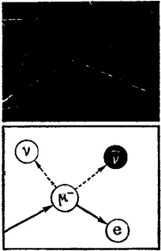

图 25

照相底片左下角的粗线是  $ \mu^{-} $介子的径迹。在快要到达底片的中央时，径迹折断并以虚线向右下方继续。这一部分径迹是属于电子的。在断折点上，两个粒子诞生并带走  $ \mu $ 介子未曾交给电子的那部分能量和动量。这两个粒子一个是中微子，另一个是反中微子。

π介子照例是不会直接衰变成电子的。它们首先产生μ介子。这里我们同样也看到，核场和电磁场并没有截然分家。具有核本原的粒子也能转化成一个电磁性质的粒子。

---

为什么  $ \pi $ 介子蜕变为两个粒子，而  $ \mu $ 介子衰变为三个粒子？回答是简单的：完全由于自旋。几个女儿粒子的自旋之和必须等于母亲粒子的自旋。

 $ \mu $ 介子具有 1/2 自旋，电子也是如此。由于电子不能带走  $ \mu $ 介子的全部质量，因此需要一个中微子以运动形式即能量形式把剩余质量拾起来。但中微子的自旋也是 1/2，这样新生粒子的自旋之和将大于母亲粒子的自旋。中微子的这一多余的自旋必须要由另一粒子的相反自旋抵消掉。这个粒子就是反中微子。结果是：三个粒子。

在  $ \pi $ 介子的衰变过程中，一个中微子（或反中微子）即足以抵消新生  $ \mu $ 介子的相反自旋。这两个自旋相抵消，结果自旋为零，这也正是原来的  $ \pi $ 介子的自旋数值。

对超子来说，衰变的最终稳定产物往往是质子。此外，超子还发射  $ \pi $ 介子。这样就有两个粒子世界，和两种限制性转化型式：在轻粒子世界中，最后转化成电子；在重粒子世界中，最后转化成质子。两个世界各有自己必然的衰变副产品：轻粒子世界中出现中微子，重粒子世界中出现  $ \pi $ 介子。

现在要问：有没有这样一个定律，它将指出在许多衰变方式中哪一种(至多两种)方式将被选用？

我们已经知道这种选择的某些特点。为了和经典物理学一致，让我们把这些特点叫作守恒定律。观察表明：粒子衰变前后的总电荷和总自旋是守恒的。但这些守恒定律也还给衰变方式的选择留下了一点自由迥旋的余地。

应该还有另外一些衰变定律，它们将衰变途径限制到这

---

样狭窄的程度，以致沿此途径不稳定的粒子只能转变成物质的最稳定的建筑砖石——质子和电子。

## § 107 物理学家将相互作用分类

让我们从一个比喻开始。这里有许多不同方法摧毁一座山。可以是某种爆炸，如火山爆发。但也可以是一个较弱的、较慢的过程，如地震。最后，也可以是一个最慢的过程，如风化——在这一过程中水、风、寒、暑都对这座山起着剥蚀作用。爆炸只须几秒钟即可完成这项破坏工作，地震须几小时，可是风雨的侵蚀却须要几千年之久。

对微观粒子破坏过程的研究表明：这种过程可以按不同的强度和速度分为三种类型。

第一种、也就是最强的一种破坏来自核粒子的撞击，即核内的相互作用。物理学家把这些事件称为强相互作用。强相互作用的特征是能量大——属于或大于 $ \pi $介子的原能的数量级，以及与此相应的(根据测不准关系)极短寿命。我们知道，这里的时间因子属于 $ 10^{-23} $秒这个数量。

其次就是电磁相互作用，它的强度和进行时间仅次于前者。在电磁相互作用过程中，电子-正电子相遇并产生两个γ光子。上面所描述的中性π介子衰变为两个γ光子也属于这一类。这一过程进行时间的数量级为 $ 10^{-17} $秒。

第三种破坏过程最弱，延续的时间最长。物理学家把它叫作弱相互作用。微观粒子表中的衰变绝大多数属于这一过

---

程。弱相互作用能说明  $ \mu $、 $ \pi $、K 介子、中子以及超子的衰变。

从该表中可以看出：影响着各组粒子的这种普遍的、具有破坏性的相互作用延续时间在  $ 10^{-10} $ 秒以上。

在研究粒子组的过程中，有件事引起了人们的兴趣。各种 K 介于属于一组，各种超子属于一组，而这两类粒子的分组方法不同于其他粒子。

这两种粒子不愿迁就于其他粒子的分类方法。“奇怪”，物理学家说，懊恼地把这些调皮的家伙叫作“奇异粒子”。他们甚至引进了一个特殊的量来定量地描述它们与正常特性的歧离程度。这个量就叫作“奇异性”。

人们发现，奇异粒子只能通过缓慢的弱相互作用衰变成一般粒子。在一般粒子的碰撞过程中，奇异粒子只能成对地诞生，因为只有在成对诞生的条件下，它们奇异性的总合才等于零，正象碰撞前原来的一般粒子那样。

换句话说，在强相互作用和电磁相互作用中，奇异性不变。这个规律就叫作奇异守恒定律。但在弱相互作用中这个定律不生效。

定律太多了吧？那样一个统一的、普遍的定律又在哪儿呢？我们又怎样能够解释这许许多多的定律呢？

可惜的是，我们一直在谈论着的种种规则，至今还没有得到一个有说服力的解释。物理学家通过这种或那种途径把这些规则结合起来，但隐藏在事物深处的本质却仍然把握不住。当然，根据这些守恒定律的演算，我们能够得出粒子的实际衰变方式。所有这些守恒定律综合起来，允许粒子实际上只有一

---

种，最多两种衰变方式。

对 K 介子衰变的研究使微观粒子物理学家在发现真空效应之后，又作出了另一项震动整个科学界的重大发现：“宇称不守恒”。

## § 108 K介子的秘密

大约在十年前，人们在宇宙射线里发现了K介子。宇宙射线在照相底片上留下了一堆光怪陆离的径迹。在这些径迹中，物理学家以机警的目光分辨出了某些质量大约为电子一千倍的新粒子的径迹。

K 介子看来有三种类型：正的、负的和中性的。自旋也被计算出来：等于零。K 介子家族最初看来与  $ \pi $ 介子这个较轻的家族（除质量外）并没有很大区别：自旋都是零，都是三粒子组，只是中性的 K 介子比它的兄弟稍重而已。

物理学家审查了 K 介子在照相底片上留下的径迹。带电粒子留下的一般径迹经常会中断，接踵而来的是较细的径迹。这意味着 K 介子已衰变成较轻的粒子。对派生径迹的研究表明：它们是属于  $ \pi $ 介子的。

中性 K 介子的衰变就更困难了。物理学家惊异地发现：K 介子飞行路线的终点时或出现两条，时或出现三条径迹。这些径迹，和上面所说的一样，是属于  $ \pi $ 介子的。

这样，中性 K 介子有时衰变为三个，有时又衰变为两个  $ \pi $ 介子，而其他所有的粒子总以一种方式蜕变为固定的女儿

---

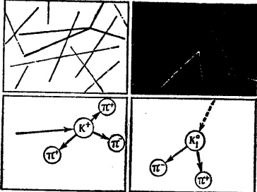

图 26

粒子。

实验人员确信事情就是这样，因此他们决定引进两种不同的中性K介子。一种取名为 $ \tau $介子，另一种叫 $ \theta $介子。两种不同的介子具有两种不同的衰变方式。这一切看来都是够清楚的了。

可是物理学家并不满意。最仔细的测量丝毫不爽地指出： $ \tau $介子和 $ \theta $介子具有相等的质量。遍观整个粒子表只能得出一个结论：它们是绝对一样的粒子。可是同一个粒子显然不能一会儿变成两个，一会儿又变成三个完全相同的女儿粒子！

这就是五十年代初出现在物理学中的神秘的粒子，它的衰变也就是著名的“ $ \tau-\theta $”谜。

这又有什么可大惊小怪的呢？为什么K介子不能象上面所说的那样衰变呢？它并没有违犯能量守恒定律之禁，而动量守恒及自旋守恒对这种衰变也无可非议。

---

但它却触犯了一个我们尚未说过的禁令。这个禁令是量子力学建立的，它的名字就叫宇称守恒定律。

## § 109 左和右有什么两样吗

让我们回顾一下激发状态下的原子是怎样发射光子的。电子先居于一种状态，然后跃至另一种能量较低的状态。当时我们感到兴趣的只是电子的能量，以及电子前后两种状态的几率云是否重叠。

这种重叠似乎和宇称（或奇偶性）有着十分本质的联系。如果重数一下原子内的电子楼层，我们将发现：电子这个房客只能从偶数楼层迁移到奇数楼层，或者从奇数楼层迁移到偶数楼层。从第十层通过一次跳跃而迁至其他偶数楼层，例如第八层，是没有可能的。

这个定则早在 1924 年就已由实验所确立，以后又获得了量子力学的解释。为此物理学家引入了波函数的宇称概念。从这点出发，宇称概念又扩展到波函数所描述的状态本身。

我们知道波函数就是薛定谔方程的解。至于宇称这个概念，这里还须进一步作点解释。

多少人看到自己的相片时都要说：“哦，这张相片一点也不象我”。他们认为这都怪照相师。但实际上往往不怪照相师。

你不妨照照镜子吧！你看到的并不是一个准确的摹写。如果你的鼻子有点向右边歪，那么镜里的鼻子就会偏向左侧。镜子里，右与左已经调换位置。

---

在摄影的那一瞬间，从胶片的前方来看，你的映象与镜子里的一致。到此事情还没有完。胶卷要冲洗，底片要印成相片。这时相片实际上已经是你在镜中的另一种映象。有的摄影机使底片上的图象上下颠倒，这样我们前后将获得三种不同的映象。另一种摄影机能使底片上的图象保持原来的位置，在这种情况下，前后只能出现两种不同的映象。

一个人总是和自己在镜中的模样相似。只有相片才能和你本人一样，正如人们看到你的那样。

只有当人的面孔具备绝对对称的理想条件时，相片中的映象才能与镜中的映象吻合。这种情况是绝少的。自然界喜欢严格的对称，但也从来不反对搞点变化。

关键是：两次映象必然恢复物体的本来面貌，不管这物体原来是否对称。这正象两个负号相乘得一正号，两个正号相乘也得一正号一样。两次镜反映能保证你面孔中的负号（不对称性）不致使你的本象受到歪曲。

波函数具有相同的特点。这些函数是一般的数学函数，在它们之中我们经常遇到正弦和余弦。将正弦曲线和余弦曲线

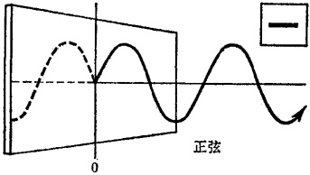

图 27

---

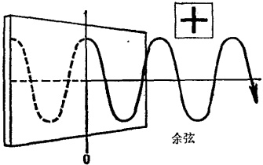

图 28

线绘制在纸片上，然后将纸片放置在镜子前面。在镜子里，正弦曲线将上下倒置。这并不是一件新鲜事。我们在学校里学习三角的时候便知道：正角与负角的正弦数值相等，符号相反。看来我们的镜子好象将角轴向负值的方向转动了。但余弦曲线在镜中却无变化。三角学已经证实了这一点。

数学家把余弦叫作偶函数，把正弦叫作奇函数。镜反映也得到了一个名称：空间反演。为了将偶函数与奇函数区别开来，只须让这两种函数取不同的符号：偶函数取正号，奇函数取负号。

如果让一正弦曲线的镜象在另一镜中反映出来，正弦曲线将恢复原来的形状，因为负乘负还是得正。余弦曲线的镜象当然保持不变。

考查薛定谔方程的解便可得知：原子中的电子从一种状态跃入一新的状态时，宇称或奇偶性绝对不改变。如果电子的波函数开始是偶数的，但跃至另一状态后变为奇数的，这只能说明：电子在过渡中产生的光子的波函数是奇数的。

往后宇称的概念又从原子的各种状态扩展到各个粒子，

---

首先就是光子。以后其他粒子也都获得了符号。例如电子就被证明是奇数粒子。

我们曾经说过，电子的自旋肯定是与电子的运动方向密切相关的。如果电子向右运动时的自旋，譬如说，是向上的，那么电子向左运动时的自旋便应当是向下的了。现在让我们想象一下电子在镜中的映象。当电子向右运动时（在镜里便是向左运动），它的自旋在镜里的映象仍然是向上的，因为镜子只能使映象左右调换，不能使映象上下倒置。由此可见，镜中电子的自旋在正常电子中是不存在的。这就说明，电子肯定是个奇数粒子。如果电子是偶数粒子，它的镜象必然与实物一致。

 $ \pi $ 介子是奇数粒子。

物理学家从电子发射光子开始类推，将奇偶性的划分扩展到不稳定的粒子，确证：原来粒子的奇偶符号必须与衰变后各个粒子的奇偶符号的乘积相同。截至目前，没有任何粒子违反过这条规定。这条规定就叫作守称守恒定律。

可是现在偏偏出了个中性K介子！中性K介子可以衰变为两个 $ \pi $介子，从这点看来它是个偶数粒子(负乘负得正)。但中性K介子又可以衰变为三个 $ \pi $介子，从这点看来，它又是个奇数粒子(负乘负乘负仍然得负)。实际上它倒底是个什么粒子？是偶数的？还是奇数的？

显然我们这里涉及的是同一个粒子，而非两个粒子，因为 $ \tau $介子和 $ \theta $介子在质量上是完全等同的。这样看来K介子是一个具有双重奇偶性的粒子！这样的假设似乎也很难接

---

受。这个 K 介子确实使量子力学陷入了困境。

## § 110 道路终于被发现

怎样办呢？如果说中性 K 介子在衰变过程中不遵守宇称守恒定律，那就意味着自然界这面镜子有毛病，因而左异于右。这也就是说空间本身是不对称的！这真是个可怕的结论。

物理学在其存在的漫长岁月里，已经习惯于认为空间在各个方向上都是等同的。在相同条件下，向左的运动无异于向右的运动。真的，物理学的全部定律都暗示着所有方向的等价性。这就叫空间各向同性。

放弃这个观点就意味着拒绝承认全部最最基本的物理定律。这一点真是连想都不敢想。

年轻的物理学家李政道、杨振宁从这一困境中找到了一条引人注目的出路。他们大胆宣称：在K介子的衰变过程中，一般说来在一切弱相互作用(这种弱相互作用引起介子的衰变以及核中子的 $ \beta $衰变)中，宇称守恒定律能够失效！

李、杨还作了足以确证这一惊人事实的实验*。这实验是值得在这里描述一番的。

计算表明,如果宇称守恒定律失效,那么在核  $ \beta $ 衰变过程中,电子大多数要沿着与核自旋相反的方向飞去。在正常条

---

件下，从整体来看，核自旋是杂乱无章的，因而电子将同样地沿着所有不同的方向飞去。

因此第一件事就是要使原子核整齐地排列起来，从而使它们所有的自旋都具有相同的方向。其次便是在实验过程中，要始终保持原子核的这种整齐排列。为此，一块  $ \beta $ 放射性物质被放置在一个能够使核自旋磁体整齐地排列起来的强大磁场之中。然后使温度急剧下降（至绝对温度百分之五度），以消除由于核的热运动而引起的畸变效应。

在上述装置的周围安置了一系列的电子计数器，并使这些计数器与核自旋方向及核自旋的镜象方向成一微小角度。计数器接通后，很快就发现：沿着前向飞去的电子数目要少于沿着镜向飞去的电子数目。李、杨的预言得到了证实。

这是否意味着空间是自然界的一面哈哈镜呢？物理学的基本定律是否从此乱了套呢？这里，李、杨以及独立进行工作的苏联科学家朗道，作了一项重要声明：空间与上述现象无关，毛病出自粒子本身。

你还记得，当电子反映在镜里的时候，所得到的映象是一个具有相反自旋的、实际并不存在的电子。现在已经证实，这种粒子确实存在，不过我们必须“反映”（倒转）它的电荷符号才行。这样我们得到的将是电子的真正映象——我们所熟悉的正电子。

这样看来，自然界的这面镜子还是正常的。但它是某种二重镜：当一个粒子反映在其中的时候，得到的总是它的反粒子！电子得到的反映是正电子，中性K介子得到的反映仍

---

然是中性粒子，但却是中性的反K介子。

通过实验观察，中性 K 介子确实分为两类： $ K^{\circ} $ 介子及其反粒子。但  $ K^{\circ} $ 介子是奇数的，而其反粒子是偶数的。这样“ $ \tau-\theta $”秘密便被揭露了。

这种双重形式的反映，用科学术语来说，叫“联合反演”，它的发现应当归功于李、杨。但朗道也独立地作出了相同的发现。

这样便毫无疑义地确立了下述事实：粒子的自旋只能以

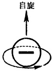

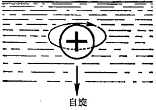

图 29

某种确定的方式与粒子的运动方向相联系而产生，而粒子的自旋又必然与其反粒子的自旋相反。我们姑且假设粒子的自旋真地就是它的自转，然后想象在电子的表面上附加一条带子。当电子在运动时，我们的眼睛紧盯着这条带子，这样在幻想的高速电影中，这条带子将画出一条螺线：对电子来说，螺线是左旋的；对正电子来说，螺线是右旋的。

实际上螺线的差别或螺旋性，只是用来区别粒子和反粒子的。我们必须记住：右和左的概念，恰如正与负的概念一样，是相对的。我们已经习惯于给粒子以左螺旋性，而给反粒子以右螺旋性。

---

## § 111 世界和反世界

我们已经叙述过这样一个事实：在我们的世界里正电子是一些稀客。这就意味着粒子世界并不是对称的：具有左螺旋性的粒子大大超过具有右螺旋性的粒子。

其实这也不足为怪。更仔细地瞧瞧宏观世界吧。蜗牛大多具有左螺旋性：蜗牛壳的螺纹大多是左旋的。化学里我们遇到立体异构分子，这些分子彼此互为镜中的映象。在它们的世界里，左向异构体要多于右向异构体。最后再看看人类本身。人类的心脏也位于左侧，虽然我们也会偶然遇到所谓镜中人，他们的内脏器官位置完全和正常人的相反。人们中间左撇子很多，大多数人倒是使用右手的。

因此，在更广阔的宇宙里，我们不要因为可能发现反世界而大惊小怪。在那里事事都来了个大拧个。在那里，反原子将具有这样的结构：构成原子核的是反质子和反中子，环绕着它们的是正电子。在那里，如果有任何生物的话，它们的器官将和地球上生物的器官在镜中的映象一样。

如果两个世界所处的条件完全等同，反世界所遵循的规律与我们这个世界所遵循的规律将毫无两样。不同的只是两个世界的符号完全相反而已。正因为如此，我们永远也不会察觉反世界的存在，即使它就在我们的身旁。

我们可能发现的，最多不过是我们的世界和反世界之间的分界线。在这条分界线上，两个世界将怀着最大的敌意相

---

遭遇。在遭遇的一瞬间，所有的粒子将灰飞烟灭，转化为以光的速度驰向四方的高能γ光子，或转化为π介子。光子和π介子将形成这两个世界的中间地带，以便警告任何粒子不要越过这个危险区域而进入对方的世界。可是截至目前，科学家还没有在太阳系范围内，或其他更广阔的星系范围内，观察到具有上述性质的分界线。

## § 112 粒子内部在发生着什么

我们从一个从来没有被回答过的问题开始：微观粒子的体积到底有多大？这些粒子究竟有没有确切的体积？

这个问题真问得怪！当然每件东西都有某种体积。当我们在微观世界里有了一些阅历之后，便知道事情并不尽然如此。

在漫长的岁月里，物理学家不能正确处理这个问题。部分的原因是：粒子一旦被赋与体积，量子力学的数学运算总要归于失败。另一方面，正如我们在 §41—44 中看到的那样，对于它们的体积根本就无法进行实际量度。造成这种状况的原因是：粒子的波特性将它的空间位置涂抹得模糊不清。

这些波特性是粒子和它的场之间的相互作用的外在表现。换句话说，一个电子的弥漫是由于它与其他粒子(包括电子)的相互作用引起的。

我们知道相互作用的现代描述是怎样一回事。一个电子以虚方式发射出一些光子，并与其他粒子发射的光子相互作

---

用。其结果不是粒子的相互排斥就是它们的相互吸引。看来好象这个电子被裹在它自己发射并吸收的虚光子云海之中。而这个云海是茫茫无际的：这里总有那样一些低能量光子，它们在海森堡关系的许可下，能达到距离发射它们的电子任何远的地方。正是光子云使电子在空间中的位置模糊不清，也正是光子云不允许我们说出电子的确切体积。

当然，电子云愈接近核心收缩得愈紧凑。在足够短的距离内，虚光子所具能量足够形成电子-正电子偶。在这样的距离（属于 $ 10^{-11} $厘米数量级）以内，我们将看到一个所谓“颤抖着的”电子。即使是这样一个电子，它也仍然被涂抹得模糊不清，只是这一涂抹在空间中占有较小的区域而已。即使是这样，电子也没有确切的体积。

也许准确地测量一个摆脱了它的光子以及电子—正电子云的赤裸裸的电子的体积是可能的吧？否。在自然界里，无相互作用的电子根本就不存在，也不可能存在。粒子和它的相互作用是统一体——不可分割的统一体——的两个方面。

留给我们设想的唯一一件事就是：在这重重云雾之中有某种象物理学家取名为核心那样的东西。这个核心究竟是什么样子的？核心内部在发生着什么？我们直到今天也弄不清楚。

物理学家也在尝试去作另一件类似的工作，那就是描绘另一个基本粒子——质子——的构造。质子(以虚方式)发射 $ \pi $介子，后者的能量自然不小于它的静能量。这就是为什么 $ \pi $介子的寿命是那样短促。这意味着 $ \pi $介子不能达到距离发射

---

它们的质子很远的地方。

当然，正象我们记得的那样，质子周围的π介子云的体积是很小的，它的数量级是 $ 10^{-13} $厘米。与电子不同，质子只被π介子稍微涂抹模糊一点。我们还知道，质子相当活跃地与K介子相互作用。这便说明：质子也能具有一个对应着这种相互作用的虚云——K介子云。由于K介子的静质量约为π介子的三倍，K介子云也应当比π介子云小三倍，前者应当位于后者的内部。而在K介子云内部的更深处就应当是那个虚衰变成质子-反质子偶的、紧缩的、颤抖着的质子。

就这样，物理学达到了一个令人惊异的必然结论：微观粒子的结构是它们与其它粒子的相互作用的反映。微观粒子的本质看来是很流动的、易变的。

如果我们把握着没有相互作用的粒子根本就不存在这样一个概念，上述结论也就不再显得特殊了。所有微观粒子彼此之间是靠相互作用联系着的。粒子的相互作用不是从外部引进来的某种东西，而是它们的一个不可分的、从来就有的组成部分。

是的，一个粒子的结构在任何时候都是被它的全部的相互作用决定了的。相反地，粒子的相互作用的性质和程度又是被这个粒子的结构决定了的。这就是实物和场、粒子固有的特性和它们的相互作用的辩证本质，也是微观粒子集团和整个宇宙不可须臾背离的一般原则。

---

## § 113 旧观念使人裹足不前

实物和场永恒的、普遍的关系使物理学家面临着这样一项工作：解释这种关系，并提出统一实物-场的新概念。这里，具有已被确认了的观点的量子力学已经有些保守了。

当量子力学诞生的时候，它从自己的前辈——经典物理学——那里继承了用于宏观世界的全部概念，并将这些概念带进微观世界里来。薛定谔方程就是沿着经典的波方程的思路建成的，唯一的区别在于：它描述的不是一般的波，而是体现微观粒子在时空中运动规律的几率波。最初的结果是令人完全满意的：微观粒子驯服地遵守着这些规律。

当然，在量子力学刚刚出世的时候，人们就发现：那些旧观念在新物理学中不会很好地发挥作用。测不准关系明确指出：关于粒子的准确的位置和速度、能量和时间的早先的观念，在微观世界中只能在一个受到很大限制的范围里得到应用。

微观粒子一旦获得了足够进行相互转化的能量后，量子力学给人带来的不很满意就让位于很不满意了：此时，用以确立粒子在时空中运动规律的量子力学方法便完全失效。

设想这样一幅情景吧：原来只有一个粒子，后来又出现了另外一个甚至几个粒子；或者一些粒子被一些光子代替。很自然，波函数对描述粒子转化是无能为力的。根据量子力学，转化应当在空间某一定点并在某一瞬时发生的。转化的结果，

---

我们获得了另一个粒子或光子，——对此早先的波函数已经不再生效。

面临这种局面，量子力学将怎么办呢？在粒子转化的现场上，量子力学将新、老运动规律结合起来，在这样做的过程中，它充分地利用着能量和动量守恒等人所熟知的定律。

可是这样做的结果，转化过程本身便被置之脑后。首先，由于转化是在时空的某一定点发生的，因而粒子在转化的一瞬间便不再处于寻常意义上的运动之中。其次是因为一种类型的粒子消失，而另一种类型的粒子出现，可是运动方程的描述对象还总是一个单一不变的粒子。

这意味着：在研究微观世界现象时，经典方法通过习惯的时空概念而被引入量子力学是有明显的缺点的。这样的理论不能反映微观世界的最根本的本质：粒子能相互转化，粒子能转化为场量子，反之场量子也能转化为实物粒子。目前的问题是如何决定转化的实际过程。但这须要在描述方法上来一个根本性质的变革。

量子力学靠引进我们说过的虚过程来实现这一变革。但虚过程也失败了，而且不能为这个问题提供最终的解答。现在需要的是一个更深刻的研究方法。在这种研究方法中，经典的时空概念可能会获得一个根本性质的变革。

## § 114 修改时空观念

这个新的研究方法将从何着手呢？有人说：放弃我们一

---

直沿用的时空观念吧。

那可不容易！那样物理学就会陷入困境，因为有关微观世界的现存概念，不管它们具有多么不寻常的性质，也仍然是建立在习惯的时空观念之上的。从出生之日起，我们就习惯于那样一些基本观念，因而抛弃它们也就十分困难了。在另一方面，描述那些与粒子转化无关的微观世界现象时，时空观念毕竟还是需要的，因为它们在这里是非常方便的。

这里还有另一个更现实的途径：修改我们的时空观念。半个世纪以前，爱因斯坦首先做了这件事。现在我们必须用微观世界的特点来补充爱因斯坦的观点，因为后者的应用范围是宏观宇宙。

时空的真正本质是什么？时空对我们已经那么熟悉，以致我们从来不去想它们。对习惯于日常生活的头脑来说，空间就是物体的贮藏室。仅仅如此吗？稍稍考虑一下空间概念是从何而来的。从一开始起，人们打交道的就不是纯粹的空间，而是充满物体的空间。物体、物质对象被目光所察觉。如果物体在眼睛里占据较大的视野的话，它便显得较近。这不外乎较大数量的光子被该物体发射出来并撞在我们的眼睛上。换句话说，这个物体在我们眼中产生的电磁场愈强，这个物体看起来也就愈近。相反，较少的光子进入眼中说明物体要么较小(只有少数原子发射光子)，要么较远(全体光子中只有少量的到达我们的眼睛)。

如果人生下来就只有眼睛这个器官，他将永远不会区分小而近的东西和大而远的东西。单靠眼睛，也就是说，如果没

---

有其他思维活动的话，我们绝不可能决定物体离开我们倒底有多远，以及这物体倒底有多大。这里触觉帮助了我们。我们接触了这个物体，从而知道了它的体积(自然是相对我们自身来说的)。

如果没有物体，我们也就不会有空间概念。在夜晚我们看不见物体，因而也就失去了空间的感觉。

帮助我们建立有关周围世界的各种概念的感觉器官实际上就是仪器。它们甚至灵敏到足以记录量子事件的程度。世界的构造是如此地复杂，以致在每一瞬间须要记录几十亿次那样的事件。结果是我们的感觉（以及概念）被平均化了（或者如物理学家所说的那样，成为经典的了）。当这些事件逐个地加以研究时，量子规律的特殊本性便会显示出来。

在我们的头脑中，空间不是具有物质本原的唯一东西。如果在我们所处的环境中，周围事物不发生任何变化——譬如在极深的地下，或在长年远离星体而运动的宇宙飞船内——我们将会失去全部时间知觉，因而也就会失去任何时间概念。

我们曾经说过这个事实：原则上时间有两种，一种是物体的固有时间，它是由该物体中的物理（和化学）过程来决定的；另一种则是由许多物体构成的许多巨大集团来决定的普遍时间。其结果，正如不存在摆脱了物体的空间一样，也不存在摆脱了事件的时间。

时间的过程是由事件,即因果连锁,来决定的。在物体的某系统中,事件愈活跃,它们就愈迅速地接踵而至(换句话说,该系统中的相互作用愈强烈),因而该系统中的时间也就流逝

---

得愈快。

我们说过，这个结论甚至被我们自己的经验所证实。充满事件的一天好象一眨眼就过去了，而清閒的日子却在拖着脚步走。隐藏在这个主观印象后面的是非常深刻的客观实际。

## § 115 时 空 量 子

爱因斯坦的新的时空概念到现在也没有被所有的物理学家接受。不仅如此，这些概念至今还没有在实验上被证实。

这种时空概念是四十多年前出现的，到现在也没有普遍地流行开来。当然，很多物理学家相信，它们包含着某些真理。

有关空间、时间与微观世界中物体的存在及其运动之间的相互关系的基本命题可以大致表述如下：既然微观粒子及其运动具有量子特性，空间和时间也应量子化。假如事情确实如此，则经典概念的最后堡垒就要崩溃。空间和时间将失去其连续性，并分裂成微小的、分立的部分。

这意味着：应当存在着某种所谓细胞——空间与时间量子。这些量子的大小可能是由微观粒子的质量、能量、动量（可能还有其他一些特性）来决定的。很自然，这些细胞势必成为所有数量中的最小数量。

可是直到目前，我们也不具备有关任何那样的长度元或时间元的知识。这可能意味着，这个长度元和时间元，已经超出测量微观世界长度和时间最精确的现代方法的灵敏程度。

---

这些现代技术的极限是核力距离—— $ 10^{-13} $厘米。在时间方面则属于核时间的数量级—— $ 10^{-23} $秒。某些物理学家相信，长度量子如果存在的话，比上述数值还要短几百甚至几千倍。

非常有趣的概念。这样看来，我们从未注意到时空量子的存在是可以理解的。它们简直太小了。任何计时器也不可能测量出那样短的时间，如一亿亿亿分之一秒。对长度来说也是如此，一厘米的一亿亿亿分之一也是测不出来的。

即使我们能够测出那种奇小的空间和时间量子，我们也永远不能将它付诸实际应用。仪器是很粗笨的东西，它一旦对微观世界进行探测，便立即改变这个微观世界。最后，请回顾一下：在微观世界中，我们的长度和时间的经典概念是受到限制的，也就是说它们只在一定范围内有效。这些限制造成微观粒子的二象性：实物-场。可是构成这些限制的又恰恰是我们一直在讨论的空间和时间量子。

引入时间细胞或量子又有什么意义呢？这样的细胞或量子还能继续反映我们关于空间和时间的日常概念吗？

这话问得很有道理。我们反复说过，知识的每一新层次不是从真空里冒出来的，而是建立在知识的原有层次的基础之上的。发展新概念极为艰苦的过程也不能在一夜之间完成。这个过程是缓慢的，而且新概念也总包含着前辈的痕迹。新概念总是在阵痛中诞生的。

量子力学的早年遭遇就是如此。现在，面临着重重困难的量子力学又在阵疼中挣扎着。它将胜利？或将失败，让一个新的、更强有力的理论来代替？

---

# 第七章 从量子力学到何处去

## § 116 难以定义的定义

质量、电荷、自旋、宇称……请你给粒子的这些特征分别下个确切的定义吧！同时要记住每个定义都必须能独立存在，也就是说，在描述某个量的时候不要引入另一个量。例如在描述质量的时候，不要使用重力的概念；在描述电荷的时候，不要使用引力或斥力的概念。

如果你使用其他的量来描述某一个量，你的收获将很微小。这些概念我们经常在使用着，但今天世界上没有一个物理学家能够说出这些概念的底蕴。

这就是量子力学今天的处境。量子力学广泛地使用从经典物理学借来的质量、电荷以及诸如此类的概念。当然量子力学也发现了某些新的、自己特有的、对粒子进行描述的概念，例如自旋和宇称。但它对这些特征的底蕴，正象对质量和电荷的底蕴一样，说不出什么东西来。

这样看来，质量究竟是什么呢？答案有两个。第一，质量是物体内物质的数量的量度。它也可以被理解为单位体积的某种物质的原子核的数量（因为原子核构成原子质量的主体）。而原子核的质量也可以被解释为核粒子——质子和中

---

子的数量。

一个质子的质量又是什么呢？质子的质量是否象过去的定义那样，是质子内物质数量的量度？但什么又是量度？什么又是物质？量度这一概念的本身就指出某种东西能被分成更小的部分。看来质子似乎不能再继续分割了。我们只能猜测质子内的物质是什么样的。

当我们说质子的质量近似等于  $ 10^{-24} $ 克，我们的意思只是：每一克的物质大约包括  $ 10^{24} $ 个质子。由此看来，将质量定义为质子或其他微观粒子的物质的量度，是没有什么意思的。

质量的第二个定义是：它是一个物体的惯性的量度，换句话说，它是物体对其状态的任何改变所产生的阻力的量度。在最基本的实例中，质量决定一个物体对改变其在空间位置所产生的阻力。

因此，我们或许应当把一个质子的质量理解为质子在其他粒子的力的作用下被推动时所表现出的某种抗拒。这个定义也是不能令人满意的。力代表相互作用，因而归根到底，代表一个场的作用。当质子的速度增加时，它从场那里得到额外的质量；当其速度减少时，质子又将这部分质量还给场。尽管所获得的和所失去的这部分质量很小，但这部分质量却存在着。由此可见，质量是一个可变的量，因而也就失去了作为一个确定量度的特性。

于是我们发现：在微观世界里，质量本身也必须用某种东西来量度。在我们讨论的例子中，质子的质量是根据相对

---

论公式，由质子的静质量以及它的运动速度与光速之比来决定的。

似乎有了一线希望。对于一种给定类型的粒子来说，静质量的确是一个不变的量。如果静质量改变了，粒子本身也就要改变。难道不能由此推论出，静质量也是惯性的一个量度吗？当然这里所说的惯性，不是就一般的机械运动——在空间里的移动——而言的，而是就最广义的运动——粒子的转变——而言的。

这看来颇有点接近于真理了。我们记得，当粒子的动能接近其原能——后者确实是由静质量来决定的——时，粒子便获得真正转化为它的场量子的可能性。

如果事情确实如此，则静质量就成了粒子性质稳定性的量度。对于某些粒子来说，这一质量是不很大的，因而在颇低的能量状态下就能转化为场量子。对其他粒子而言，静质量则大得多，因而粒子也就显然稳定得多。

从目前的观点来看，粒子既能产生真实的转变，也能产生所谓虚转变，后者就是构成它们相互作用的基础。因此质量便获得了另一个特征：它决定虚场量子的能量。

所有这些使质量成为一个十分复杂的概念。一方面，质量是粒子的某种如上所说的特征；另一方面，质量是粒子的所有相互作用的决定因素。

毫无疑问，粒子的其他特征也是同样地复杂的。今天，决定微观世界统一体的最深刻本质的全部问题，就是物理学所面临的尚未征服的山峰中的最高峰：物质的两种基本形式

---

——实物和场——之间的相互关系。

实物粒子具有场的特性。场量子也具有实物的特性……

二者之中,那一个是最根本的,或主要的呢?是实物呢?还是场呢?

一个世纪以前，当物理学刚刚获得场的概念的时候，答案是明确的：实物是主要的。实物粒子在其周围产生一个场。场只是处理粒子的相互作用的一个附属工具。没有实物就不会有场。

随着时间的推移，人们发现：场能产生粒子，粒子能湮没并转化为场。因此场也不象人们假想的那样，只是一个附属的工具了。

可是物理学家又走向另一个极端。紧跟着爱因斯坦的足迹，他们宣称：场是主要的——宇宙间所有事物都是统一的、普遍的场的形形色色的表现。实物粒子仅仅是场凝聚成的斑点。没有场也就根本没有实物。

爱因斯坦花了许多年的时间去建立一个能广包所有已知类型的场和粒子的统一场理论，但他所有的尝试都失败了。物理学家逐渐认识到：主要的既非场也非实物，场和实物正如所描述的那样，都同等地是物质的两个根本的、主要的方面。

这种观点看来是正确的，因而统一场和统一实物的信奉者之间的争论可以休矣。可是物理学家仍继续在争辩着：人们关于微观世界的知识究竟正确到什么程度？人们的观念能符合这些存在的真实本质吗？人们将头脑里想出的理论强加

---

于自然界，难道不会出错吗？代表大物体世界的人类难道真能认识发生在原子、核以及基本粒子的微观世界中的事物和事件吗？

人类能够认识自然界的规律，并且越来越接近于真理。但认识过程是永远不会终结的，关于世界的任何知识也永远不可能绝对地精确。物理学家以这些命题作为基础去接近这个问题：他应该怎样去理解物质的两种基本形式的相互关系。

首先，是否可能存在着一个统一的场或统一的实物？不可能。场和实物是物质的存在及其发展的两种对立着的形式。这两种形式中的任何一个形式也不能离开另一个形式而存在。它们是同一只奖章的两面。虽然是对立着的，但它们是统一的，不可分离地联结着的：场具有实物的属性，实物也具有场的属性*。

我们关于物质存在的两种形式和它们之间的相互联系的观念，是否具有某种程度的真理性呢？对这个问题的回答是肯定的：它们肯定地具有真理性，因为这些观念，虽然是不精确的，但整个说来却是正确的。总地说来，各种观察都符合这些观念的要求，而建立在这些观念之上的种种预见也都是有效的。

既然如此，为什么物理学家继续争论应该怎样解释已经

---

获得的成果呢？首先是由于并非所有的物理学家都谙熟辩证唯物主义。敌对的哲学，尤其是那个最有害的流派——它被称为主观唯心主义——硬说世界只存在于人的想象之中，因而自然规律充其量不过是人类头脑的产物。这样一种哲学甚至使某些著名科学家也倾向于认为物理学的发现没有很大的真实意义。这些科学家认为世界是不可知的。

由于微观世界不能直接地观察到，由于人们不能看见它，从而相信它的存在，因而上述错误观点也就更容易找到市场。更重要的是：微观世界的特性根本异于我们周围的习惯世界。这种差异是如此之大，以致我们的日常概念不能反映出微观世界的真正本质。

在科学发展过程中，新概念的产生是非常缓慢的。人类毕竟是生活在日常事物和一般观念的世界之中的，因此人们的心理也就固执着这些观念。从这种观念转变到另一种能够正确描述微观世界的，不可思议的观念是十分困难的。人们又不得不去实现这种转变。把一个微观粒子说成并想象成不仅仅是个粒子，把一个场说成是比场还多的什么东西，该是多么困难啊！而这里，困难还不仅存在于所用的词上，困难尤其存在于人们的形象、概念和观念之中。

量子力学能够将旧概念结合于新的粒子-波、正电子-空穴以及介子-量子等形象之中。但在物理学家的头脑里，这些双重的存在还没有完全融合成统一的、真实的存在。

这种融合正是不久的未来须要做的事。

---

## § 117 量子力学小传

量子力学在它存在的六十多年里已经历了三个发展阶段。

第一个阶段是从普朗克到德布罗意，即从光波的微粒属性的发现起到实物粒子的波属性的发现止，前后共25年。在这些年代里，爱因斯坦发展了光的微粒(光子)学说，玻尔发展了关于原子结构和原子现象早期的、很不完善的学说。

量子力学发展的第二个阶段是从德布罗意 1924 年的发现开始的。在短短的五年里，新理论的基本工具建立起来了。狄拉克将量子力学和爱因斯坦的相对论综合在一起。在这时期(一直到第二次世界大战)，原子核的理论也被建立起来。

最后，也就是第三个时期，是从第二次世界大战后开始的。量子力学已经扩展到基本粒子和物质的第二基本形式——场的研究上去了。

在第三阶段里，量子力学遇到了越来越大的困难。继其早年的辉煌胜利之后，一系列的挫折和失败接踵而来。

总地说来,尽管在原子和分子领域中量子力学是好的,但对付那些特硬坚果——基本粒子的构造和它们的相互作用,量子力学却表现得不够有力。

今天，实验已经远远地走在理论的前面。可是这个理论却仍然局限于解释原子核深处进行着的过程，而探讨基本粒子的本质已经是提到日程上的问题了。

---

量子力学还没有成功地解决这些问题。二十年前，量子力学的缺点还只隐约地出现在朦胧的远方，可是现在，它们却越来越显而易见了。量子力学返老还童的时机已经成熟。

这种情况难道不与本世纪初经典力学的处境相似吗？

一方面，似乎没有任何事实与量子力学的基本命题相抵触。只是象这样的量子力学对许多现象不能作出解释。也就是说，在解释这些现象上，理论本身——而不是支持这个理论的科学家——已经无能为力。或许须要扩大这个理论的体系，也或许须要增添新的、重要的、不自相矛盾的命题来加强这个理论。

也可能出现这种情况：这些新命题将与早先的命题格格不入。这样，在某段时间里，我们将会感到失望。全能的理论过去不曾存在过，今后也绝对不会存在。每个理论大体就象人的一生：它有自己柔弱的童年；强壮的青年——这时它能解决几十个特别艰难的问题；平静的壮年——这时它的前进步伐已经缓慢下来了，可是理论的领域却在扩大：它将越来越广泛的现象包括进来，它伸进技术和工业领域中，并与其他学科建立起联系。最后老年终于来到，这时理论在新事实——自己发现的那些事实——的冲击下显得软弱无力。

于是一个停滞的时期便会到来。至少看起来是这样，虽然实际情况不是这样。新思想一直在滋生着，它们发现旧理论的框框过分狭窄。迟早会有这么一天，新思想将从束缚它们的甲壳里脱颖而出，跟着科学也将出现一个巨大的跃进。

从上述的年龄尺度上看，量子力学今天已达到了壮年的

---

顶点，而老年的足迹已经悄悄地跟了上来。量子力学与许许多多重要技术成就有着联系，它所研究的问题包括从星系结构到原子核和基本粒子这样一个广阔的范围。今天，量子力学是最强大的微观世界物理学理论。

没有任何其他理论能与它相较量，但一个能与它较量的理论肯定又是需要的。在这一物理学领域内进行工作的科学家，有的正在尝试增加不与它的基本原理相矛盾的新内容，来使它恢复青春。有的在尝试改变量子力学的实质，并以更加先进的理论代替它。把它牺牲掉吧，他们说。可是还没有一个人能够夸耀已经取得任何成就。

越来越多的物理学家倾向于这样一种观点：需要的是某种更加不寻常的东西，某种更加疯狂的理论。没有一个人害怕这些字眼了，因为任何根本新的东西都要遇到来自旧东西的极大阻力。量子力学出生时的境遇也正是这样。许多人都说它是疯狂的。但是现在，可以说再也找不到一个拒不接受这一理论的科学家了。

不管怎样，有一件事是肯定的：物理学正处在一个新的巨大跃进的前夕。这个跃进不是跃入黑暗之中，因为科学家十分清楚地看到新物理学必由的道路，以及道路上的一些驿站。

这些驿站包括以下这些。对所有已知的和未知的粒子的严密的、统一的、系统的整理。实物粒子的结构和内在特征。作用于原子核内的力的性质。关于物质的两种基本形式——实物和场——之间的相互关系的确切定律。运动着的物质的各种属性——能量与时间，质量与空间——之间的相互关系和相互依存；以及由这种关系来决定的微观世界的特殊本质。

在这本书里我们已经叙述了量子力学是怎样诞生，怎样成长起来，又怎样变成今天这样强大的科学武器的。我们已经讲过量子力学是怎样处理物理学目前的问题的，以及它又是怎样寻找着伸进物质的更小的世界——超微观世界——的道路的。这个新的超微观世界就是今日的课题。

## § 118 量子力学正在重整旗鼓

每个科学都有两个生命。它的第一个生命必须与观念、概念、定律和公式打交道。而第二个生命则必须将上述这些观念的东西转化成技术上的坚实器皿——工具、仪器和机器。

不管科学的思维活动是多么的抽象，它终究要回到人类的现实世界中来，回到他们的需要上来。

马克思有句名言是：哲学家不仅要解释世界，更重要的是改造世界。这句话不仅是针对哲学而说的，它还包含着任何科学的存在和发展的真正意义。

每一项新的发现都增添了人类知识的宝库。不仅如此。人类在他们与自然界的斗争中变得更加坚强了。如果一个人追溯人类历史上的各个发现，他便会看到，随着历史的推进，介乎每项重大发现和它运用于人类需要之间的时间变得越来越短。

科学洞察未来的问题先于人类的实践接触到它们。这种

---

预见并非神或天才的恩赐，而是客观实际，在它的深处隐藏着社会发展的规律*。

科学不能等一个头等重要的问题自己去成熟。远在这些新问题获得头等重要性之前，科学家就在刻苦钻研这些问题，不管他们是否意识到这点。

科学是人类社会的最前哨，是未来的侦察兵，是现时最可信赖的保卫者。

量子力学的发现和发展很好地说明了上述情况。现在让我们看看量子力学的第二生命吧。

原子核的设想是 1912 年前后形成的。二十年以后，这种设想具有了鲜明的轮廓。构成核的粒子已经明确，作用于核粒子之间的力已被发现，并得到了解释。原子核的不可接近性——既是物质上的也是概念上的——没有使物理学家停步不前。十三年后便诞生了原子时代。当然这个时代是以美国人在广岛和长崎投下可怕的原子弹开始的：这两颗原子弹带来的不是富足，而是死亡和毁灭。短短几年的时间过去了，1954年苏联建成的世界上第一座原子能发电站开始工作。

量子力学最先在原子反应堆舱中获得了技术上的应用。在反应堆舱里，中子流将重核击碎，从而产生热及电。

科学家于是又转向轻核——氢的同位素，尝试从中取得

---

更多的能量。

这里,量子力学也将大有作为。它计算聚变反应过程,并估计产生的能量。

还有呢？那将是些新问题。一些比我们目前已经知道的还要困难得多的问题。但未来的科学家将要拥有比今天更好的装备。

直到最近研究人员才开始重视自己的发现所带来的成果。本世纪初杨 A. 约费开始对所谓废料感到兴趣。那时候他很难想象出半导体的发展前景的。

但是如果没有量子力学，半导体也就不可能获得生命。量子力学不仅仅解释了它们的重要特性，而且还提示了改进半导体的先进方法。今天，被称为固体能带理论的这部分量子力学，已成为千千万万电子学研究人员和工程师的引航星。

那些体积小而效率高的电子装置已经引起工业和技术的根本变化。没有一个工厂、车辆或通讯设备不采用电子装置。人类活动的各个领域几乎无不受惠于电子学。

科学家已经着手从事最大胆的工程之一：利用半导体将普照大地的太阳能转化为电能，以代替几乎枯竭了的石油资源。第一批半导体太阳能蓄电池正在工作，把太阳光线转化为电能。设计人员正在设计一种适合在月球上和太阳系的其他行星上工作的太阳能蓄电池，为这些星球上的第一批居民提供能源。

这方面的一个有趣的特征是: 在地球上, 半导体装备占据

---

很大的面积(以便从日光中获得足够的能量)，这样就影响了庄稼的生长和家畜的放牧。但在月球上却不会出这个问题。

可是我们将怎样把大量的电能输送到地球上来呢？地球上使用的输电线显然是用不上的。不仅如此，常规类型输电的耗损是非常巨大的。

大约十年以前，苏联物理学家法布里堪特提出关于电磁波量子放大器的主张。这样，量子力学首先转化为量子放大器这样有形的器皿，然后又转化为量子振荡器。量子力学使一系列的装置得以诞生，它们包括：脉泽(无线电波放大器和产生器)以及莱塞(光束放大器和产生器)。这就是人们常说的科学幻想变成了现实。

本书开始时，我们谈到了那些决定原子的电磁辐射的量子力学定律。这些定律在很早以前(到现在已三十多年，在量子力学史上这段时间就不算短了)就已稳固地建立起来了。这些定律的建立是那样稳固，因而在五十年代没有人再为这些定律花费心思了。

当那些喜欢刨根问底的研究人员从一个新的角度重新考虑问题时，这些定律又放射出意想不到的光彩，从而使一系列新的、效率非凡的仪器得以诞生。

与量子力学俱来的关于微观世界的观念和概念促成了许多不寻常的技术上的成就，而上面我们只稍稍提了一下其中少数几个。量子力学继续深入技术和工业领域之内。量子力学的第二生命是极为丰富多彩的。我们亲眼看到了它的开端。它的未来将是最大胆的科学幻想小说所不能估量的。

---

# 附 录

## Ⅰ 本书论及的若干重要公式

1. 牛顿第二定律(§ 3、6、40)

$$
f=m a
$$ 

2. 万有引力定律(§ 6)

$$
f=\mathrm{k}\frac{m_{1}m_{2}}{r^{2}}
$$ 

3. 库伦定律(§ 50、74)

$$
f=\mathrm{k}\frac{Q_{1}Q_{2}}{r^{2}}
$$ 

4. 斯蒂芬-波尔兹曼定律(热辐射第一定律):

$$
R=\sigma T^{4}
$$ 

黑体的辐射能力，即它每秒以光和热的形式发射的能量正比于绝对温度的四次方( $ \S $ 12)。 $ \sigma = 5.71 \cdot 10^{-5} $ 尔格/秒·厘米 $ ^{2} $·度 $ ^{4} $。

5.维恩位移定律(热辐射第二定律):

$$
\lambda_{m}=\frac{C^{\prime}}{T}
$$ 

随着黑体温度的上升，对应着它所发射的光线的最大亮度的波长  $ \lambda_{m} $ 将要变短并向光谱的紫色区移动(§ 12)。

$$
C^{\prime}=2886 微米 \cdot 度。
$$ 

6. 瑞利-金斯定律：

$$
U_{\nu}=\frac{8\pi\nu^{2}}{C^{3}}k T~d\nu
$$ 

热物体辐射强度正比于它的绝对温度，而反比于波长的平方( $ \S $ 13)。式中  $ \nu $ 为频率，其与波长的关系为  $ \lambda\nu = c $，c 为光速。

7. 普朗克公式：

$$
r_{v,T}=\frac{2\pi h}{c^{2}}\cdot\frac{v^{3}}{e^{h v/k T}-1}
$$ 

 $ r_{v,T} $ 代表单位频率间隔的面发光度。h 为普朗克常数，e 自然对数的底( $ \S 15 $)。

8. 普朗克关系：

$$
E=h\nu
$$ 

E 为量子的能量， $ h = 6.6 \times 10^{-27} $ 尔格·秒，v 频率  $ (§17) $。

9. 德布罗意关系(§ 69):

$$
\lambda=\frac{h}{mv}
$$ 

10. 经典力学的波方程( $ § 40 $):

$$
x=a\cos\omega\left(t-\frac{y}{\nu}\right)
$$ 

11. 薛定谔方程( $ \S $ 40):

$$
i\hbar\frac{\partial\Psi}{\partial t}=-\frac{\hbar^{2}}{2m}\nabla^{2}\Psi\quad( 自由粒子 )
$$ 

$$
i\hbar\frac{\partial\Psi}{\partial t}=-\frac{\hbar^{2}}{2m}\nabla^{2}\Psi+U\Psi\quad( 在以位能 U 表征的场中 )
$$ 

$$
\nabla^{2}\phi+\frac{2m}{\hbar^{2}}E_{\mathrm{k}}\phi=0\quad( 自由粒子 , 定态 )
$$ 

$$
\nabla^{2}\phi+\frac{2m}{\hbar^{2}}\left(E-U\right)\phi=0\left( 在以位能 U 表征的场中 , 定态 \right)
$$ 

12. 表征光子的几个数量( $ § 41 $):

$$
E=h v\quad( 能量 )\ p=\frac{h}{\lambda}\quad( 动量 )m=\frac{h}{\lambda c}\quad( 质量 )
$$ 

13. 海森堡测不准关系( $ §\ 42 $):

$$
\Delta x\cdot\Delta v_{x}\geqslant\frac{h}{m}
$$ 

14. 自由粒子波函数 $ ^{*} $（§ 48）：

$$
\Psi=\phi_{0}\times e^{-\frac{i}{\hbar}(E t-r\cdot P)}
$$ 

15. 壳层容量 N 与壳层序数 n 的关系 ( $ § $ 54):

$$
N=2n^{2}
$$ 

16. 测不准关系的另一种形式的表述(§ 49、57、99):

$$
\Delta E\sim\frac{h}{\Delta t}
$$ 

$$
\Delta\omega\sim\frac{1}{\Delta t}
$$ 

式中  $ \omega = 2\pi\nu $

17. 爱因斯坦相对论公式( $ § 85、86 $):

$$
m_{\nu}=\frac{m_{0}}{\sqrt{1-\upsilon^{2}/c^{2}}}
$$ 

$$
t_{v}=t_{0}\sqrt{1-v^{2}/c^{2}}
$$ 

18. 爱因斯坦方程( $ §86 $、 $ §89 $、 $ §95 $、 $ §99 $):

$$
E_{0}=m_{0}c^{2}
$$ 

## II 本书中出现的主要量子物理学家简介

(按英文字母顺序)

玻尔（Bohr，Niels）1885—1962，丹麦人。提出电子轨道概念，对应原理等，是旧量子力学主要创始人之一。第二次世界大战前与夫伦克尔提出核液滴模型。曾获1922年诺贝尔物理奖（§21、23—26、49、75）

德布罗意（De Broglie, Louis Victor）1892—，法国人，1924年提出对量子力学发展有决定意义的物质波。曾获1929年诺贝尔物理奖（§ 7、27—33、96）。

狄拉克（Dirac，Paul Adrien Maurice）1902—，英国人，1929年提出“相对论性不变”原理。与薛定谔合得1933年诺贝尔物理奖（§ 84、87、88）。

爱因斯坦（Einstein，Albert）1879—1955，德国犹太人，1905年创立狭义相对论，提出光子学说，1916年创立广义相对论。晚年建立“统一场”理论，但未达预期目的。伟大导师列宁称他为大革新家，敬爱的周总理对他作过高度的评价。曾获1921年诺贝尔物理奖

海森堡（Heisenberg, Werner）1901—，德国人，创立量子力学的矩阵形式，他的测不准关系在量子力学中有重要地位。曾获1932年诺贝尔物理奖（§34、40、42、49、57、99）。

李政道 1926—，美籍中国物理学家，与杨振宁提出在弱相互作用中宇称守恒能够失效。与杨振宁合得 1957 年诺贝尔物理奖（§ 110）。

普朗克（Planck, Max Karl Ernst Ludwig）1855—1947，德国人，1900年提出能量子假说，是量子力学的第一个创始人。获1918年诺贝尔物理奖（§15—17）。

泡利（Pauli，Wolfgang）1900—1958。奥地利物理学家。泡利不相容原理在量子力学中占有重要地位。1934年与费密提出中微子理论，25年后被证实。曾获1945年诺贝尔物理奖

薛定谔(亦译作施勒定格)（Schrödinger, Erwin）1887—1961 德国人，他的波方程是量子力学中最基本的公式。与狄拉克合得1933年诺贝尔物理奖(§34、40、45)。

杨振宁 1922—，美籍中国物理学家，与李政道合得 1957 年诺贝尔物理奖（§ 110）。

汤川秀树（Yukawa, Hideki）1907—，日本物理学家，提出核交换力和π介子理论。获1949年诺贝尔物理奖（§68）。

---

## III 量子力学发展大事记

1687 牛顿《自然哲学的数学原理》在伦敦问世（§ 13）。

1872 斯托列托夫进行光电效应实验(§ 18、94)。

1881 迈克耳孙进行光在以太中相对不同参照系的不同传播速度的试验，得出否定结果(§ 4、7、91)。

1896 法国贝克勒耳发现放射现象(§ 66)。

1898 居里夫妇发现镭、钋、铀的放射性( $ §66 $)。

汤姆生建立第一个“正电云”原子模型( $ §22 $)。

1900 普朗克提出热辐射公式,并假定能量以量子  $ E = h\nu $ 形式发射,量子力学诞生( $ §15—17、93 $)。

列别杰夫发现光压( $ §94 $)。

1905 爱因斯坦提出光子理论、狭义相对论（§ 14.18—20、85—87）。

1911 卢瑟福提出原子的行星模型(§ 7、22)。

1912. 玻尔用量子理论解释光的发射和光谱，提出电子轨道概念( $ §\ 23—26 $)。

劳厄进行X光衍射实验( $ §\ 31 $)。

1914 考塞耳奠定量子化学基础(§ 26)。

1916 爱因斯坦提出广义相对论($93、100)。

索末菲提出有关光谱起源的更确切的理论($26)。

1919 卢瑟福以  $ \alpha $ 粒子分裂氮核而获得氧核( $ \S $ 66)。

探测队在阿拉伯沙漠观测日蚀，所得结果符合广义相对论的预期( $ §93 $)。

1924 德布罗意提出物质波的假设(§ 27)。

1925 乌兰贝克、古兹米特提出自旋( $ §88 $)。

1927 在比利时首都布鲁塞尔的科学大会上，海森堡和薛定谔提出了新的量子力学理论，奠定了新的量子力学基础( $ §\ 33 $)。

1928 德拜·谢勒重复劳厄的X光衍射实验，获得一组衍射环( $ §\ 31 $)。

美国科学家戴维孙、革末，苏联科学家塔尔塔科夫斯基成功地进行了电子衍射实验( $ §31、34、38—40 $)。

1929 狄拉克提出“相对论性不变”原理( $ § 87 $)。

1932 布拉克特、欧卡尼里在宇宙射线中发现正电子( $ §91 $)。查特威克发现中子( $ §67 $)。海森堡、伊凡宁科、塔姆提出核由质子中子构成( $ §67 $)。

1934 塔姆和汤川秀树提出核交换力理论。汤川秀树预言  $ \pi $ 介子( $ \S $ 68)。

小居里夫妇用中子击核而产生人为放射现象( $ \S $ 80)。

泡利、费密提出中微子理论，二十五年后中微子被发现( $ \S $ 81)。

宇宙射线中发现  $ \mu $ 介子( $ \S $ 69)。

1939 发现铀核裂变。玻尔和夫伦克耳为此提出核液滴模型（§ 75、76）。

1940 福辽洛夫、彼得夏克发现重核天然裂变(§ 78)。

1945 美国在日本广岛、长崎投下原子弹(§ 118)。

1947 鲍威尔在宇宙射线中发现汤川秀树在十三年前预言的  $ \pi $ 介子( $ \S $ 69)。

1954 第一个原子能发电站在苏联建成(§ 118)。

1955 反质子被发现( $ § 105 $)。

1956 反中子被发现(§ 105)。

1957 李政道、杨振宁提出宇称守恒能在弱相互作用中失效、“联合反演”理论，获得诺贝尔物理奖（§ 110）。

1959 闪烁计数器的双闪烁证实了二十五年前泡利、费密预言的中微子的存在。